# CLI Architecture

This document describes the Happier CLI (`apps/cli`) and its daemon. The CLI is both an interactive tool and a background session manager that keeps machine state in sync with the server.

## System overview

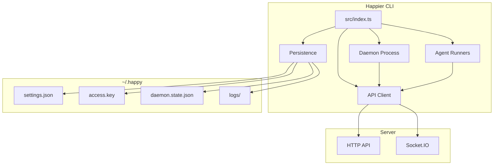

## High-level layout
- **Entry point:** `src/index.ts` parses subcommands and routes execution.
- **API client:** `src/api` handles HTTP + Socket.IO, encryption, and RPC.
- **Daemon:** `src/daemon` runs in the background, spawns sessions, and maintains machine state.
- **Persistence/config:** `src/persistence.ts` + `src/configuration.ts` manage local state in `~/.happy`.
- **Agents:** `src/agent/catalog` projects agent commands from bundled plugin contributions; agent-specific runtime code lives behind catalog entries instead of top-level `src/<agent>` trees.
- **Model Providers:** `src/providers` owns provider-neutral connection resolution, catalog assembly, probing, credential materialization, local discovery, and launch continuity. `src/cli/commands/providers` is the CLI adapter over those owners; it must not become a second settings or mutation implementation.

Executable Agents and model Providers are different domains. `happier agents ...` manages Agent runtimes; `happier providers ...` manages configured model-source connections. Provider contributions, connections, grants, settings, and structured model selections are protocol-owned. See [Providers](./providers.md) for the complete ownership and safety contract.

## CLI entry flow

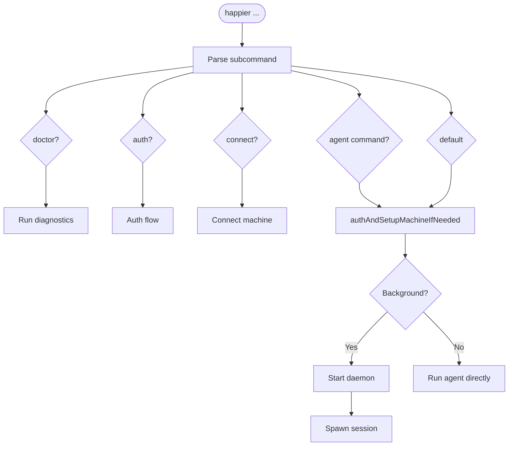

`src/index.ts` is the CLI router. It:
- Parses subcommands (`doctor`, `auth`, `connect`, plugin-projected agent commands, and default run flows).
- Ensures auth and machine setup when needed (`authAndSetupMachineIfNeeded`).
- Starts the daemon or runs an agent directly based on subcommand/context.

## Local state and configuration

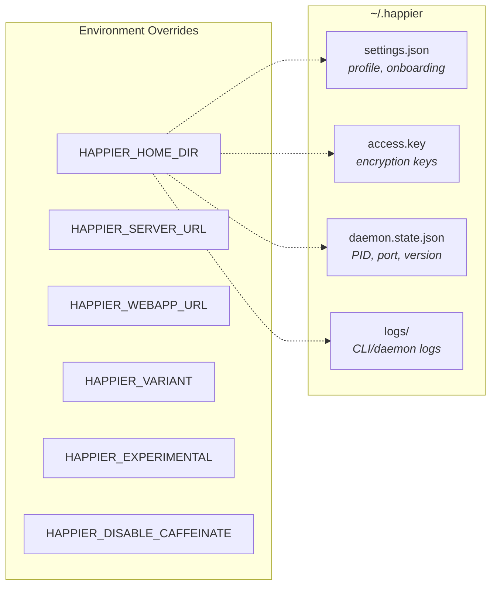

Local state lives under `~/.happier` (or `HAPPIER_HOME_DIR`):
- `settings.json`: onboarding and profile settings (validated/migrated).
- `access.key`: local key material for encryption/auth.
- `daemon.state.json`: daemon PID + control port + version.
- `logs/`: CLI/daemon logs.

Configuration lives in `src/configuration.ts`:
- `HAPPIER_SERVER_URL` and `HAPPIER_WEBAPP_URL` override defaults.
- `HAPPIER_VARIANT`, `HAPPIER_EXPERIMENTAL`, `HAPPIER_DISABLE_CAFFEINATE` control behavior.

## API client architecture

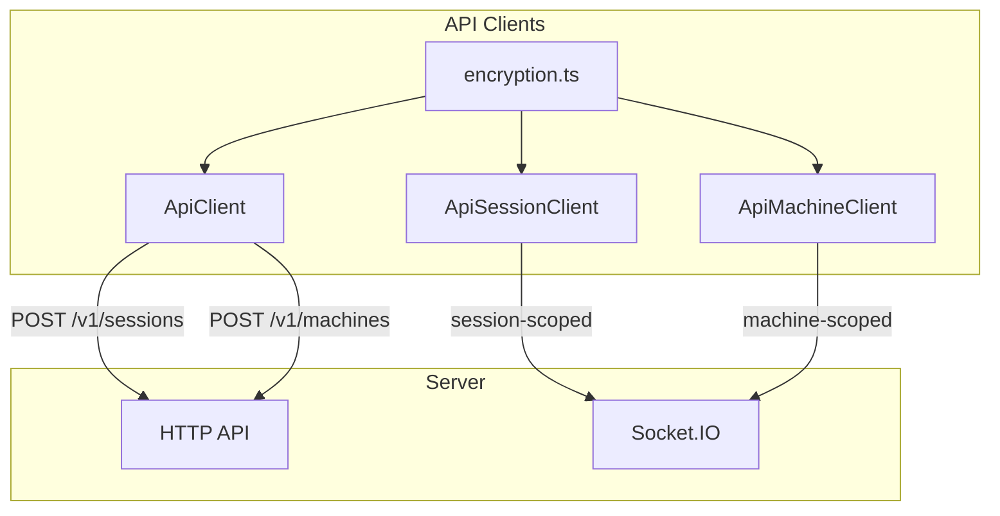

### HTTP
`ApiClient` (`src/api/api.ts`) handles:
- Session creation (`POST /v1/sessions`) with mode-compatible metadata/state.
- Machine registration (`POST /v1/machines`) with mode-compatible metadata/daemon
  state.
- Other CRUD actions through `ApiSessionClient` and `ApiMachineClient`.

### WebSocket

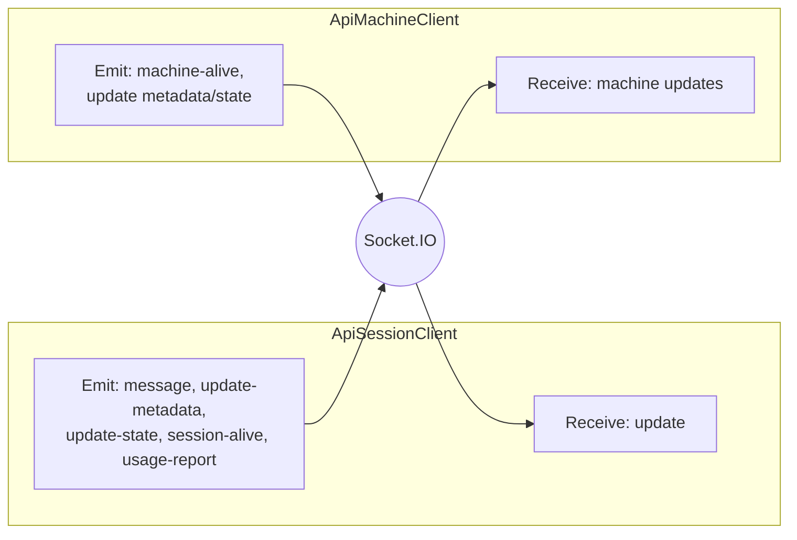

`ApiSessionClient` (`src/api/apiSession.ts`) connects to Socket.IO as a **session-scoped** client:
- Receives `update` events and parses the Session's explicit plain/encrypted message
  representation, decrypting only the E2EE branch.
- Emits `message`, `update-metadata`, `update-state`, `session-alive`, and `usage-report`.

`ApiMachineClient` (`src/api/apiMachine.ts`) connects as a **machine-scoped** client:
- Sends `machine-alive` heartbeats.
- Updates machine metadata/daemon state with optimistic concurrency.
- Receives machine updates and merges them locally.

### Encryption

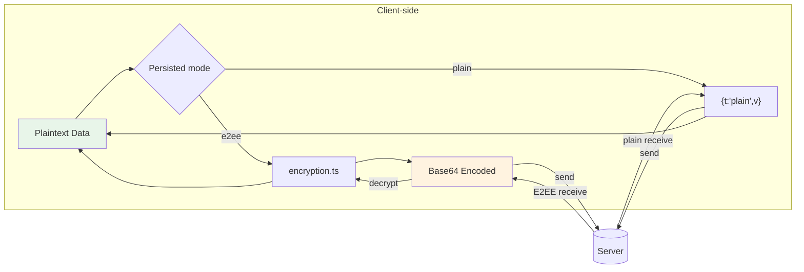

The CLI enters `src/api/encryption.ts` only for persisted E2EE content with real
matching material.
- Plain Session, Machine, Artifact, and domain-owned KV values use their strict plain
  representations and are intentionally server-readable.
- A token-only credential has zero Account E2EE material. Device-local keys may seal
  local secrets but are never uploaded or substituted for Account material.
- Some plain and encrypted values use base64 on byte-oriented routes; base64 is an
  encoding, not an encryption claim. See `encryption.md`.

## Daemon architecture

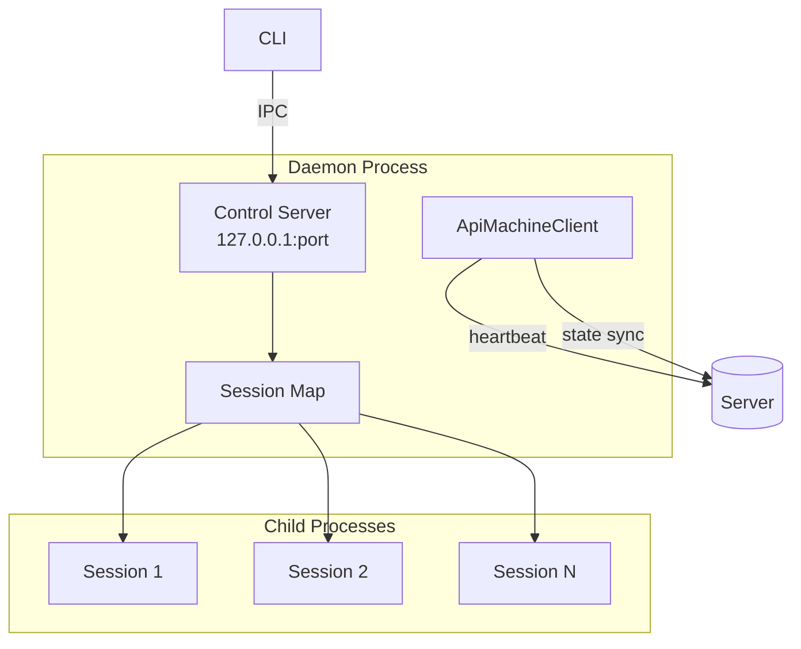

The daemon is a long-lived process responsible for running sessions in the background and maintaining machine presence.

### Lifecycle

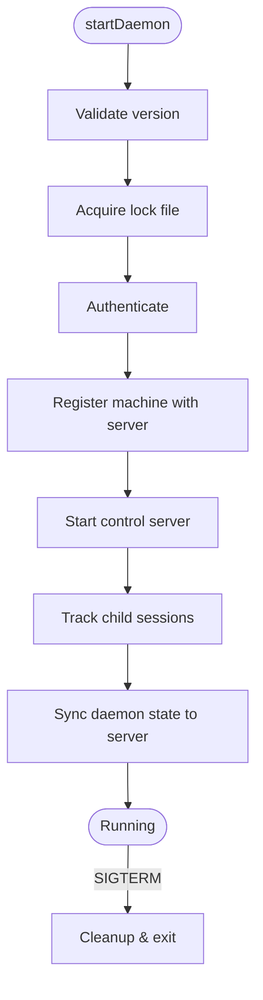

1. `startDaemon()` validates the running version and acquires a lock file.
2. It authenticates and registers the machine with the server.
3. It starts a local **control server** for IPC.
4. It keeps a map of tracked child sessions and updates daemon state on the server.

### Control server (local IPC)

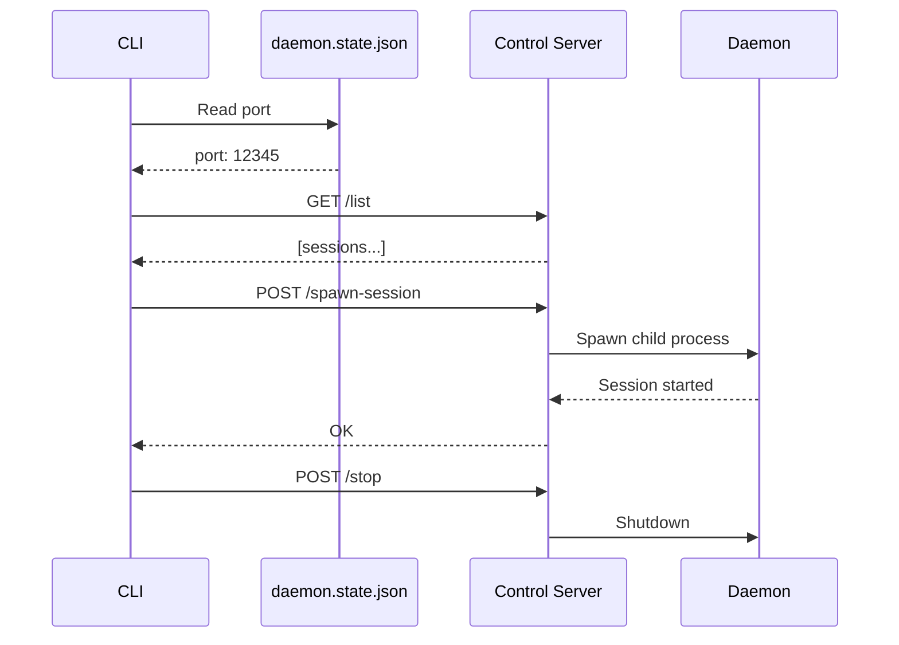

`startDaemonControlServer()` (`src/daemon/controlServer.ts`) runs an HTTP server on `127.0.0.1` and exposes:
- `/list` (list active sessions)
- `/stop-session`
- `/spawn-session`
- `/stop` (shutdown daemon)
- `/session-started` (session self-report)

The CLI talks to this server via `controlClient.ts`, using a port stored in `daemon.state.json`.

### Session spawning

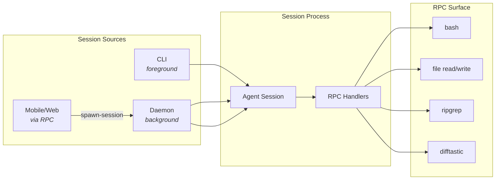

Sessions can be started by:
- The CLI directly (foreground).
- The daemon (background).
- Remote requests over RPC (from mobile/web via machine connection).

Daemon session spawning uses `registerCommonHandlers` to expose a controlled RPC surface (shell commands, file operations, search/diff helpers).

### Machine state

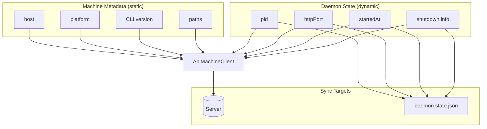

- **Machine metadata** is static info (host, platform, CLI version, paths).
- **Daemon state** is dynamic (pid, httpPort, startedAt, shutdown info).

The daemon updates these via `ApiMachineClient` and mirrors local state into `daemon.state.json` for control/diagnostics.

## RPC and tool bridge

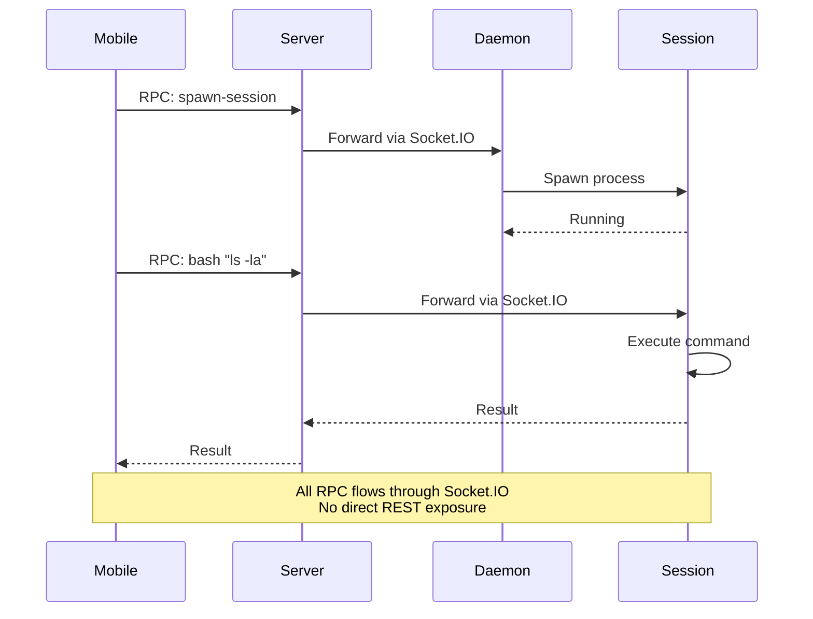

RPC is used to send commands over the Socket.IO connection:
- Sessions register RPC handlers (e.g., `bash`, file read/write, `ripgrep`, `difftastic`).
- The daemon registers a spawn-session handler so the server/mobile client can ask it to start a local session.

This mechanism allows the server and mobile clients to drive local actions without exposing a broad REST surface.

## Runtime-backed Stack and daemon artifacts

The CLI daemon is one component of the named-stack runtime format; it is not a second runtime owner. Source validation and source development use the checkout's workspace outputs; those workspace package outputs are distinct from managed runtime artifacts. A managed runtime build publishes daemon code and, when its inputs require it, an immutable daemon-support artifact for the CLI runtime dependencies, tools, and sidecars. The daemon manifest owns that optional support reference.

Managed server code follows the same boundary. Its generated Prisma/native runtime support is owned by the server component-artifact builder, while static web UI remains a separate selected runtime component. Stack launch supplies the selected UI path through `HAPPIER_SERVER_UI_DIR`; the server artifact does not decide which UI provider to use. Managed support references and snapshots are development/QA inputs only. Release/self-host packaging remains the existing per-target direct boundary that discovers and embeds each target's complete self-contained code/web/support payload; it does not consume or flatten a host-target managed snapshot.

Runtime snapshots are manifests plus managed references to canonical producer artifact payloads. A consumer selects the producer's current valid snapshot and retains only its own mutable state, process lifecycle, and selection pointer; it does not build or copy a payload. Snapshot validation checks component support references, and retention protects support artifacts transitively while a retained snapshot or external consumer selection needs them. Selecting a newer snapshot is non-disruptive: `selectedSnapshotId` can differ from `loadedSnapshotId` until an explicit restart, which is the proof boundary for newly loaded server or daemon bytes.

Generated bundled-plugin projections remain a source-tree publication concern. The projection publisher reads final serialized plugin artifacts and facts, prevalidates the complete small UI/Protocol projection set, stages changed leaves, and commits them through the existing mounted-tree transaction. Known-invalid input is rejected before replacement; a caught commit failure restores the touched tree to last green, and the next canonical preflight repairs an interrupted partial replacement. This is an observable-failure/next-preflight contract, not a generation pointer, journal, or power-loss atomicity guarantee across package-owned source trees.

The finite-task graph uses Turbo only as the outer dependency scheduler and read-only validation cache beneath `hstack-exec`. It is pinned through the current repository package manager; the later pnpm migration translates that ordinary development dependency rather than owning or delaying the task graph. Concurrency is set to 50% of the selected machine's logical processors, so a large development machine can use its capacity without imposing the same fixed process count on smaller CI or remote executors. Compiler-heavy inner schedulers remain separately bounded by their own memory profile.

Canonical build tasks do not pass through or restore from Turbo's cache. The root package-build command delegates its complete package set once to the existing workspace build owner, which already performs dependency-DAG scheduling, bounded concurrency, incremental/currentness checks, per-package locking, and atomic artifact publication. Package scripts remain directly runnable for focused diagnosis. Turbo is reserved for read-only source typechecks, API checks, tests, and projection checks whose exact-input results can be reused safely; CI restores job-scoped Turbo caches and Turbo revalidates the task hash before accepting them.

The repository typecheck reuses those canonical builds as the source-compilation evidence for buildable workspace packages. It then runs only the six remaining source-only graphs (Terminal Native, Plugin UI, App, CLI, Server, and the cross-package Tests workspace) with `--noEmit`. Their Turbo hashes include the exact emitted declaration roots they consume, rather than every workspace source tree. This avoids immediately compiling the same package a second time, avoids pulling all first-party Plugin builds into a typecheck, and still invalidates a cached source check when a consumed declaration changes. Plugin SDK and the external SDK retain separate test-project typechecks after their public declaration checks.

Generated-contract validation and mutable compiler-input preparation are separate finite facts. For example, the Plugin SDK Action-map and external SDK Action-wrapper checks are cacheable exact-input tasks, while synchronizing the physical declaration graph consumed by the Plugin SDK remains non-cacheable. This prevents an expensive semantic generator check from being repeated merely because declaration bytes must be refreshed through their canonical owner.

Incrementality is deliberately owned at the layer that can validate it. Canonical package builds retain compiler worktrees, build-info state, currentness fingerprints, and last-green `dist` outputs behind the workspace build owner. UI and Plugin UI source checks use their TypeScript build-info files; the remaining cold source/API programs use Turbo's exact-result cache rather than a long-lived compiler daemon. Plugin projection persists canonical serialized per-Plugin artifacts and reruns only affected Plugin checks before the aggregate comparison. A cache miss may therefore still construct a large TypeScript graph, but an unchanged candidate does not need to repeat it in the next local or CI invocation.

First-party plugin packages are discovered through the workspace glob and canonical bundled-plugin membership owner rather than an enumerated Turbo list. The canonical first-party template supplies the finite build/projection scripts, so a newly scaffolded package joins the same graph after the normal membership projection. First-party plugin build and projection remain separate tasks: the build always passes through the package owner, the read-only targeted projection check may be cached, and one non-cacheable aggregate check consumes the serialized artifacts. The workspace-derived Plugin test/typecheck runner uses a bounded two-package queue and still attempts every discovered package before reporting failures. The public `happier plugins dev` loop does not depend on Turbo and continues to own author-source watching, candidate preparation, reload, and diagnostics in standalone plugin repositories.

Live CLI dependency preparation also isolates Plugin build failures without serializing every healthy Plugin behind them: shared non-Plugin prerequisites build first, then up to two independent Plugin packages build concurrently through the same canonical workspace owner. Artifact publication keeps its fail-closed all-included-Plugins contract and delegates the complete Plugin set to that owner's own dependency-aware scheduler.

Broad unit, integration, database, and runtime suites are not automatically parallelized by the finite graph. Many launch their own Vitest workers or share databases, ports, Stack processes, simulators, or Docker resources. They stay with their existing owner until a focused pilot proves isolation and measures end-to-end benefit; adding another outer fan-out on top of their internal concurrency would otherwise trade a visible serial command for less predictable process and memory contention.

The source stack may start from a valid last-green runtime while changed source outputs refresh in the background. For the checkout-derived repository producer, `dev.mjs` schedules successful server/daemon reloads through the canonical runtime publisher, with one publication in flight plus one trailing identity recomputation; a full restart reconciles web, server, and daemon identities. Publication failure keeps the current snapshot selected and source services unchanged, and status is written through existing runtime state without restarting consumers. The detached Stack owner in `apps/stack/scripts/stack/run_script_with_stack_env.mjs` owns services and logs; the TUI attaches, displays the same state, and sends explicit controls. An unexpected TUI exit detaches from a healthy owner, while explicit quit/restart/stop retains the command's lifecycle semantics.

## Implementation references
- CLI entry: `apps/cli/src/index.ts`
- Daemon: `apps/cli/src/daemon`
- Control server/client: `apps/cli/src/daemon/controlServer.ts`, `apps/cli/src/daemon/controlClient.ts`
- API clients: `apps/cli/src/api`
- Persistence: `apps/cli/src/persistence.ts`
- Config: `apps/cli/src/configuration.ts`
