# CLI Architecture

This document describes the Happier CLI (`apps/cli`) and its daemon. The CLI is both an interactive tool and a background session manager that keeps machine state in sync with the server.

Standing Session/turn ownership is documented in [runtime core](runtime-core.md); declaration, activation and projection ownership is in [plugin platform and SDK](plugin-platform.md). Those pages describe the current 0.3 development source rather than release readiness.

## System overview

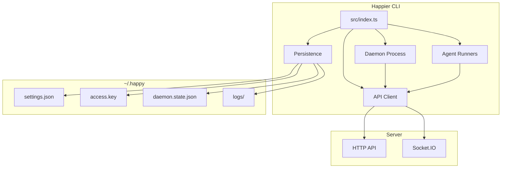
```mermaid
graph TB
    subgraph "Happier CLI"
        Entry[src/index.ts]
        API[API Client]
        Daemon[Daemon Process]
        Agents[Agent Runners]
        Persist[Persistence]
    end

    subgraph "~/.happy"
        Settings[settings.json]
        AccessKey[access.key]
        DaemonState[daemon.state.json]
        Logs[logs/]
    end

    subgraph Server
        HTTP[HTTP API]
        Socket[Socket.IO]
    end

    Entry --> API
    Entry --> Daemon
    Entry --> Agents
    Entry --> Persist

    Persist --> Settings & AccessKey & DaemonState & Logs

    API --> HTTP & Socket
    Daemon --> API
    Agents --> API
```

## High-level layout
- **Entry point:** `src/index.ts` parses subcommands and routes execution.
- **API client:** `src/api` handles HTTP + Socket.IO, encryption, and RPC.
- **Daemon:** `src/daemon` runs in the background, spawns sessions, and maintains machine state.
- **Persistence/config:** `src/persistence.ts` + `src/configuration.ts` manage local state in `~/.happy`.
- **Agents:** `src/agent/catalog` projects agent commands from bundled plugin contributions; agent-specific runtime code lives behind catalog entries instead of top-level `src/<agent>` trees.
- **Model Providers:** `src/providers` owns provider-neutral connection resolution, catalog assembly, probing, credential materialization, local discovery, and launch continuity. `src/cli/commands/providers` is the CLI adapter over those owners; it must not become a second settings or mutation implementation.

Executable Agents and model Providers are different domains. `happier agents ...` manages Agent runtimes; `happier providers ...` manages configured model-source connections. Provider contributions, connections, grants, settings, and structured model selections are protocol-owned. See [Providers](./providers.md) for the complete ownership and safety contract.

### Shared planet presentation (0.3 development)

`@happier-dev/brand/planet` owns the dependency-free planet model: palettes,
light/terminator shading, atmosphere, choreography and the 2×4 Braille-cell
projection. CLI setup and progress adapt its frames to terminal color; installer
generation projects the same model into standalone Bash/PowerShell, without a
JavaScript runtime requirement. Legacy Windows consoles retain readable text.
The animated step spinner uses Braille in capable terminals; redirected,
no-animation and dumb-terminal output stays linear.

Voice's dot microphone/planet projection consumes this same Brand owner through
the UI's native Skia and web canvas adapters. Its atmosphere follows actual microphone/output levels;
production silence does not synthesize a breathing level. Terminal choreography
keeps its existing recipe. Onboarding artwork and the website hero scrim remain
consumers of the Brand artwork tokens.

### Voice conversations and speech (0.3 development)

The UI's admitted Voice attempt owns its Account, Home, exact conversation/session
binding and microphone lifecycle. Top bar, Island, Orb, composer and Companion
consume the same attempt-control projection. Changing a container or navigating
does not change the authority for End, Retry or a submitted input. Dictation is a
separate input purpose: it returns editable draft text without sending a turn.

Local conversation Agent work uses the daemon-backed Agent/session owner on the
canonical execution machine. `voice/settings/executionMachine.ts` owns initial
Automatic selection, the Account's sticky machine and explicit fixed selection;
an unreachable selected machine produces recovery rather than silent failover.
Model Provider configuration remains in the ordinary Agent/Provider selection
seam, including migrated predecessor direct-chat settings. There is no second
Voice-owned HTTP chat runtime.

Speech capture and inference retain their existing application/attempt authority.
Binary speech grants authorize the speech application, not a TCP destination port;
see [peer mediation](peer-mediation.md).
Semantic output segmentation and character/UTF-8 budgets are owned by the shared
Protocol speech policy and the selected provider's declaration, described in
[plugin platform](plugin-platform.md#batch-speech-output-03-development).

Voice may describe a pending permission under the current sharing policy. Spoken
approval cannot decide it: the canonical permission UI owns the tap, and End leaves
pending requests reachable. Android's ongoing microphone notification opens the
app; it does not own conversation state. The existing iOS Focus activity is
session-attention delivery. A dedicated Voice Live Activity remains deferred.

### Local-service Machine summary (0.3 development)

The daemon pushes `daemonState.localServices` through the existing Machine-state
transport. `LocalServiceMachineSummaryV1` is a small strict presentation union:
`ready` carries a nonnegative `runningCount`; `unknown`, `error`, and `disabled`
carry no count. Missing or malformed projections remain unknown to readers.
Rail chrome can consume this Machine fact without opening a detailed service feed.

The local-service inventory runtime owns the projection and its stable reference.
It counts current listening user services with the shared listener grouping rule,
combining loopback/wildcard bindings and excluding proven Happier internal services.
Preview registration alone does not establish a listener. The Machine publisher
subscribes once to that runtime, demanding its existing scan loop rather than a
second scanner or timer. Identical summaries produce no change notification;
reconnect and Machine-client replacement republish the current projection. Deferred
transport/CAS handlers read the current runtime summary when they execute.

### Agent installation commands (0.3 development)

The dedicated `happier agents install <agentId>`, `happier agents update <agentId>`,
and `happier agents setup` commands submit software mutations to the local daemon's
single install-job owner. `src/cli/commands/agents/installJobClient.ts` consumes
cursor reads through the authenticated daemon control client; human output streams
steps, download bytes, and logs to stderr, while `--json` returns one result envelope.
These remain dedicated command adapters over the job owner. See
[Agent install and update jobs](./agents-catalog.md#agent-cli-install-and-update-jobs-03-development)
for ownership, outcomes, dependency steps, and reconnect/restart behavior.

`--dry-run` uses the canonical local install planner without submitting a job or
starting the daemon. Real installs require an already-running daemon; an absent
daemon returns `daemon_unavailable` with `happier daemon start` guidance. The
commands do not automatically start or restart it. Vendor recipes require
`--yes`, `--allow-vendor-recipe`, or an interactive confirmation whose default is
No. `--force` requests reinstall with install intent rather than substituting
update intent. SIGINT/SIGTERM request cancellation, then read the owner's terminal
outcome; a completed success that wins the race remains success.

### Review verdict ownership (0.3 development)

The start composer's “Report to this session” choice uses the existing optional boolean `notifyParentOnCompletion`. Review/Plan/Delegate Action starts and the rowless first-Send start preserve explicit `true` and `false`; malformed values are refused rather than silently dropped. When omitted, `resolveExecutionRunNotifyParentDefaultV1` defaults bounded work to On and long-lived conversations to the existing Account preference (Off unless enabled). The runtime uses that one resolved value for state and the daemon marker. `review.start` requests `retentionPolicy: 'resumable'`, but continuation still depends on the Agent's retained resume support.

`review.follow_up` admits a successful review only when the runtime lifecycle owner proves that its exact retained provider session can resume. It never substitutes a fresh reviewer. Running or retiring reviews return `execution_run_busy`; cancelled, failed or timed-out reviews return `review_follow_up_ended`; ephemeral reviews return `review_follow_up_not_resumable`; missing or mismatched resume handles return `review_follow_up_resume_unavailable`. The card's retention pre-check is advisory; runtime admission remains authoritative. `execution.run.cancel_turn` uses the existing `execution.run.cancelTurn.v1` RPC and cancellation owner, addressing an exact Run occurrence and turn without stopping the Run.

The execution-run host bridge materializes successful review findings through the existing signed ReviewComment transport before publishing terminal evidence. ReviewComment, not a transient review overlay or a Judge response, owns persisted dispositions. Findings retain the returned comment reference so triage can read and CAS-update the same comment after the execution run leaves memory. A finding decision (Implement fix · Ignore · Decide later) is one `reviews.comments.transition` built by `buildReviewTriageTransitionRequestV1`, whether the review card writes it (user principal) or `review.triage` does (agent principal); `review.triage` no longer rewrites or republishes the run's `review_findings` result, so the result carries no decision copy (0.3 development). Review scopes may use a Project or a machine/path workspace; semantic identity is separate from the reviewed worktree fingerprint and line range.

At review launch, the bridge reads the worktree fingerprint through the SCM owner and stores it in the run's intent input. Terminal outputs retain that launch value on success, failure, cancellation, timeout and invalid findings; they never replace it with model-supplied values or a later SCM read. An unavailable fingerprint is recorded as null and does not suppress review.

`review.start` stamps one `display.groupId` on every engine Run in its panel. Materialized comments retain panel membership in `metadata.reviewGroupIds`; a later panel that deduplicates to an existing semantic finding adds its membership through the same signed CAS transition, without changing the finding's verdict. Group membership grants no access. Dispute detection compares the actor of the latest state-changing dismissal with the reopening actor: the same principal, or another user on the user side, can change their mind without creating a dispute. Same-state triage annotations do not replace dismissal provenance.

The run pane shows a panel as one result. It lists the Runs that share the opened Run's `display.groupId` (through `execution.run.list`/`get`), merges their findings on `ReviewComment.findingIdentity`, and derives the headline ("2 reviewers · N findings · N high") from the merged rows. A merged row shows the most severe source's finding. Read-only viewers see the same merge. A finding several reviewers reported is one row: its decision is written once per distinct canonical comment, including a shared comment first created in an earlier round; a question goes to each reviewer as `review.follow_up` in that reviewer's own thread. Members that did not finish are listed, and members that never started are named when the start returns. Follow-up questions use the one composer (`AgentInput` behind `ReviewFollowUpComposer`), mounted either in the dock or the open finding thread, with the question draft retained under the opened Run. Comment reads, writes, reviewer RPCs and write announcements retain the exact Home and Account. A Home/Account switch withdraws the previous projection, and an older in-flight reload cannot overwrite a confirmed newer revision. `reviewRunComments.ts` announces confirmed writes to the SCM review panel and review results holding that comment (0.3 development).

Apply and delegated file comments use the Protocol-owned verification input builder. Its data is untrusted review evidence: dismissal uses `reviews.comments.transition` with a reason, and uphold uses `reviews.comments.setDisposition` with `blocking`. Writes carry scope, current revision, mutation identity and (for transitions) current state; a conflict requires a fresh read and reconsideration. No `review_publish_request.v1` marker authorizes a write. Agent/MCP callers require host-bound session identity; workflow moderation uses the server-owned origin session and cannot invent origin authority.

Agent reads and verdict writes may target their own Session or a currently readable led Session, as proved by the Session relation owner. Verdict writes also require existing `submitAgentInput` access; relation membership adds no grant. Default listing stays on the principal Session, with an explicit `sessionId` selecting an admitted led scope. Workflow verdict authority remains limited to its server-owned origin Session. ReviewComment storage remains Account-scoped.

This is the current development contract, not a released availability claim. Automatic E2EE materialization is not verified: the current mutation transport seals the event but does not seal raw finding body/snapshot request fields, which the server rejects only after receipt. The canonical encrypted create/read transport must be completed before this path is usable for E2EE Accounts. Package and loaded-runtime validation of the integrated review path is still pending.

### Execution result ownership (0.3 development)

SCM explanations have one saved machine result, separate from the disposable
analysis cache and personal Account-KV reviewed marks. Capture/generate Actions
resolve authenticated source evidence before admitting a retained analysis Run;
read/edit/refine/Undo and accepted commit progress use that result's revision
owner. Review narration publishes through the same store after findings, without
replacing ReviewComment's disposition authority. The Git plugin owns ordinary,
stacked and accepted-plan publication; CLI checkpoints share only temporary-index
mechanics. [SCM comparisons and walkthroughs](scm-diff-summary.md) owns the detailed
source, coverage, persistence, Git-version and truthful recovery contracts and
names the unfinished UI/live integration.

`workflow.run.wait` parks in the shared Account Run Action owner. The CLI uses
the existing user-scoped Account socket; the UI uses its captured Home Account
change feed. A change or reconnect wakes an exact durable snapshot read from
the server's Workflow Run owner. The server does not hold a database polling
loop. The optional caller deadline remains observational: it returns `timeout`
without cancelling or mutating the Run, and paused, attention and terminal facts
take precedence when the deadline's final read observes them.

In 0.3 development source, `conditions` selects a nonempty unique set from
`terminal`, `attention` and `paused`; omission retains first-of-any observation.
The server applies the existing Run/invocation attention predicate. A match
returns `matchedCondition`; a terminal Run with no selected match returns
`not_matched_terminal`, retaining the terminal summary and available result.
An attention-only wait therefore skips an ordinary pause and ends with a typed
non-match if the Run settles without attention.

The same admitted Action accepts the host-only `onWaitSnapshot` callback for
passive observation. It delivers `{run: WorkflowRunSummaryV1}` from the exact
summary/attention projection, awaits each callback to preserve output order,
suppresses unchanged snapshots, and catches up current state after reconnect.
Passive observation continues through matches and terminal state until its
deadline or cancellation. Cancellation releases its observer without changing
the Run. This is a current-state feed: coalesced invalidations do not promise
replay of every intermediate state. This seam is available to INT's generic
`watch`; the callback is never serialized as Action input or carried by a new
transport.

Blocking Artifact approvals use the shared `blockingApprovalCoordinator`.
Each host supplies durable Artifact reads and its existing Account change feed,
including reconnect catch-up. Local approval notifications remain supported by
that same coordinator; there is no periodic reread loop. Built-in approved
requests still wait for execution settlement, while target and Execution Run
host Action approvals retain their existing decision semantics. Abort, captured
Home retirement and settlement release the demand-scoped subscription. These
are 0.3 development contracts; loaded-runtime validation remains pending.

`packages/protocol/src/execution/runs/resultContract.ts` owns result normalization,
prompt instructions and raw-text/typed-value validation. Task and Agent profiles,
long-lived prompt sends and the Workflow coordinator consume that owner. The
coordinator keeps its `invalid_result_contract` failure classification; the codec
returns a typed failure reason and, for schema mismatches, RFC 6901 path issues
from the existing plugin JSON Schema compiler.

Raw text is preserved exactly for a text contract. JSON and decision text is
parsed once; an already-decoded value is validated directly, so a JSON string
value is not parsed a second time. The V1 contract schema remains separate from
the runtime compiler. Session custody and recovery observation belong to the
CLI; moving the codec changes no persisted or wire result shape.

Workflow Session observation treats the Session owner's successful
`terminal_no_result` / `missing_final_assistant_text` as exact empty text; failed,
cancelled or unavailable inputs keep their separate outcomes. Required JSON and
decision contracts still reject missing output. Custody recovery opens the
accepted definition and bound invocation ancestry, resolves the authored leaf
through `workflowScopeBinding.ts`, and runs the same codec before committing a
result. A row's optional display contract is not authority. Usage and exact input
correspondence are retained; an unavailable frozen contract stays unresolved,
and capturing a result never reopens a terminal parent. Integrated package and
loaded-runtime validation of this development path remains pending.

Workflow Action leaves validate bound input against the accepted snapshot before
admission and use the real executor's prepared one-shot invocation. The private
correspondence retains the Action request id and original input; an Action that
declares Execution Run completion additionally retains its immediate output and
every launched Run id before native observation. Live completion and recovery
consume Protocol's Action completion owner, not get/wait Actions. Lost invoke
responses remain uncertain and replay never invokes the Action again. Typed
terminal output is checked against the frozen schema. The exact-machine
materialization host reads host catalog contracts through its host adapter and
qualified contributed Action schemas through `daemon.plugins.actions.schemas.read`,
bound to the merged catalog's current `occurrenceId`. Missing, unavailable, stale
or output-schema-less contributions fail preparation. This schema path is
implemented; it is not proof that every qualified Action is executable as a
Workflow leaf or has an Execution Run completion declaration. The one-shot
executor and completion owner still decide invocation and terminal settlement.
Proven pre-invoke validation failures, prepared refusals and finished typed Action
failures are ordinary failed leaves that `collect_outcomes` can collect. For a
declaring Action, a typed terminal failure is collectable only after native
observation proves completion and the launch projection contains no failed
launches. An invocation failure with unproven launch custody remains
`outcome_uncertain` and fail-stop, including on replay. Fresh detached
conversations use the native start owner's resumable,
long-lived settings so subsequent generation can send a new input to that Run.
The coordinator persists an authored absolute observation deadline when the
adapter supplies the actual acceptance timestamp and preserves it on rejoin;
row allocation does not start it. Initial and retained native inputs project the
`input-accepted` event's `emittedAtMs` through the host-private Workflow
observation sink. The detached adapter persists that timestamp before arming its
existing observation timer, including when acceptance follows the start response.
Preparation consumes none of the authored budget. Loaded-runtime validation of
this development deadline path remains pending.

An inline Workflow leaf selects the accepted frozen child definition and sidecars
by source key. Its resolved inputs are retained as `frameInputs` in the existing
sealed body progress before child effects, so reclaim cannot change an admitted
round bound by rereading live context. It appends a Workflow scope segment,
creates a separate lexical and conversation root, and resumes its body cursor
inside the parent Run; it allocates
neither a child Run nor another worker slot. Its resolved workspace becomes the
child frame's project base. Authored workspace provenance distinguishes a leaf's
explicit selection from an inherited frame default, avoiding duplicate worktree
creation. These are development contracts; composed loaded-runtime validation
remains pending.

An explicit **Run workflow again** is a new Run, not custody recovery. In 0.3
development it uses the existing inline `workflow.run.start` source with
`replay.runId`. The Account Run owner opens that Run's authenticated accepted
snapshot and passes it to the same materializer: roles, child definitions and
references, workspace facts and per-step targets stay frozen. Only declared
inputs and one optional `replay.agentOverride` engine group change. Current
Agent-start policy and target availability still apply. Accepted source lineage,
including a saved definition's revision and `savedBy`, is retained rather than
read from the current Artifact. The reviewed inline definition is not authority
to replace a replay's stored graph.

Workflow conversation reply handoff reads a fresh owner-bound Run-key census
through the authenticated storage client and uses Protocol's per-run key
resolver before opening the final result. It refuses missing recipient material,
foreign Run/owner binding or changed Account currentness. Ordinary Automation
results and conversation reply context retain their distinct Account envelopes;
they are not Workflow content-key fallbacks.

After opening a claimed Workflow, the coordinator and heartbeat share one
currentness check: Account mode/key identity must remain unchanged and the
accepted credential/source authority must remain current. The Account-wide
change cursor is not revocation evidence: Workflow initialization and ordinary
fact writes advance it. Initial claim/open and ordinary Automation pre-effect
checks retain their exact-witness contracts.

Workflow review keeps one private result on the invocation. Publication through
the Account Run Action owner validates against the frozen contract without
completing the row. Human completion requires host-stamped `present_user`.
Use checks current controller authority before committing `completed`;
Generate records intent on the still-held row without a live continuation or
controller-currentness preflight. The claimed coordinator, not the Action caller,
admits the deterministic same-conversation replacement through `replaces`.
After a pre-input refusal, the next explicit Generate resolves the last retained
correspondence through the same slot's same-conversation attempt lineage; it
does not fabricate correspondence on the refused attempt or cross a fresh-agent
boundary. The worker checks live continuation/material, without a cached
capability fallback, and repeats the full controller/current-authority check
immediately before generation input admission, after asynchronous preparation.
A typed pre-input refusal re-holds the replacement without fabricating execution
correspondence. A Wait-for-you
leaf holds without an agent input and cannot Generate. Row writers carry exact
`contentRevision`; a stale background fact reloads and applies the closed
Protocol-owned `applyWorkflowInvocationFactV1`, while a stale human decision
must be reconsidered explicitly.

Held pipelines retain authored concurrency occupancy. Pending Session-context
reads and Action-context preparation stay in flight for the same hold owner;
they cannot be mistaken for quiescence. The coordinator confirms
quiescence by reading the parent revision and then exact held rows, and the
worker parks using that confirmed revision rather than a later refreshed one.
The parked parent releases the worker slot; durable Run custody stays pending
and retention protection remains. Human decisions wake through the existing
claim owner; boundary Resume requeues a paused Run without opening its private
snapshot. Explicit Machine restrictions use the public Run row; project-scoped
boundary Resume fails closed because project identity is private. The server
records `workflowResumeRequestedRevision` in the same CAS that requeues Resume.
The successful claim clears it atomically and carries the consumed revision to
the worker through the existing V3 claim/receipt. Only that claim runs Resume's
controller-dominance check; denial settles paused with "Couldn't resume: …".
Initial claims, review wakes and subsequent reclaims do not acquire Resume
semantics. Generate retains its own live authority and continuation checks and
"Couldn't generate: …" disposition. The composed real-database and loaded-runtime review checks remain
pending; this describes current development ownership, not release readiness.

### Workflow loop decisions and context (0.3 development)

The coordinator reads the root checkpoint and each entered body, If, loop or
inline Workflow cursor. It does not rebuild completed siblings to recover a
result map. Completed container selectors expand only when a declared dependency
or final output selects them; nested Workflow exports select the frozen child's
final producer through the same lexical binding owner.

Parallel cursors record started members, not a completion watermark. Opaque
current-member indices retain unfinished earlier pipelines, including held
ones, ahead of never-started work. Branches and items share authored capacity
and definitive-member release policy; an item loop persists only its next
unstarted capacity waiter. An omitted cap does not create a workflow slot limit.
The durable store's process-local record and slot indices are projections, not
another persistence owner. Content reuse requires matching row currentness,
not merely an unchanged lifecycle. Integrated and loaded-runtime frontier
validation remains pending.

The same durable progress owner publishes the Run's lean authored-step aggregate
on its sealed root progress record. The denominator is top-level authored blocks:
a loop or If is one block, not its expanded children. Completed current attempts
advance the numerator; an active loop has a separate completed-item projection.
Its total uses persisted item/count facts or the accepted materialized round
bound, never the admission cursor or an unresolved authored input reference.
After interrupted native reattach, the recovery writer reuses this aggregate
publisher with exact interrupted-Run revision and root-content CAS. The narrow
`root_list_progress` fact resolution cannot change the root or Run lifecycle.
No second aggregate store or public invocation-index count is introduced.
Loaded-runtime count verification remains pending; this is development-only behavior.

Decision contracts declare their own values. The shared Execution Run codec accepts
a declared JSON string or a strict `{decision, reason?}` object; only a loop
evaluator must declare `continue` plus a terminal value. Any declared value other
than `continue` closes that loop, preserving its reason and evaluation history.

The admission materializer freezes an `until`/`evaluate` round bound from a
positive safe integer or a declared number input. Reaching it completes the loop
with `{kind:'exhausted', rounds}`, not a failure. `WorkflowContainerClosingV1`
records a decision, stop condition (including the first matching top-level `any`
arm), or exhaustion. The canonical producer binding exposes it through a result
reference with path `['outcome', ...]`; an empty path still selects the existing
iteration-results array. Restart reads selected results without re-evaluating
committed iteration decisions or stop conditions.

Result paths also accept `last` on arrays, so a bounded Repair seed can select
`['last', 'check']` without copying the final iteration into a second result.
Item references may project a path from `item.value`; missing fields are absent
for `exists` and fail a required binding. Item index/position/count remain scalar.
These forms share the existing reference schema and input resolver.

The Protocol built-in catalog owns four portable definitions and the six
unsaved starter seeds. Keep going and Review & converge require an origin
Session. Their final output is the loop's recorded outcome; stopping for budget,
strikes or exhaustion does not complete a goal. Review uses ORC's shared verify
instructions and ReviewComment Actions under CAS, then checks persisted
comments. Plan with a panel and Open a pull request remain origin-neutral;
their synthesis review and disagreement Wait are genuine effect-gating holds.
This is current-development source, not released or loaded-runtime certification.

Session PR-comment and CI-failure triggers use the Channels binding writer to
attach an authenticated GitHub pull-request endpoint to the scoped Automation.
Native SCM credential selection, connection creation/reuse and principal resolution
stay with that owner. The binding is also the Session↔PR link: the Protocol
trigger read receives the Channels projection of distinct selections in binding
creation order through `session.trigger.list`, including retained disabled links.
That read lists ordinary scoped trigger sets even when the PR-link reader is
unavailable or rejects the request. Its `pullRequestLinks` result is either the
successful link array (which may be empty) or
`{ status: 'unavailable', code: 'target_unavailable' }`; failures never become an
empty link array. Both CLI and UI consume this result from the Protocol executor,
while caller cancellation and ordinary Session authorization failures still
reject the overall read. The Session UI keeps ordinary rows usable and offers
a separate retry for the unavailable links.
A successful `scm.pullRequest.openOrReuse` with an origin Session writes through the
same binding owner; an originless call writes no link. Replay rejoins the existing
binding. Removing a trigger disables its ingress binding while retaining the link.

Channels carries typed observation identity and repository-write evidence into
the Automation conversation admission owner. Only explicit write access admits
either scoped kind; unknown, denied or mismatched identity returns a checkpoint-safe
typed refusal. The Run's conversation cause retains the scoped `triggerId`, so
the existing trigger coalescing and claim policy apply. PR-comment content enters
the Workflow input as labelled untrusted data, not instructions. These are 0.3
development contracts; loaded-runtime validation remains a separate check.

Origin context uses the authorized Session/transcript readers and the existing
usage query owner. It does not use native goal usage. No usage records means
`{kind:'unavailable'}`; a missing budget or usage field cannot satisfy a comparison.
Trailing strikes are computed from committed loop results, without a stored
counter. Session-context input drops oldest turns to fit the canonical 256 KiB
materialized-input bound, keeps the goal, and marks `truncated`; if no turns remain
and input is still too large, preparation fails with `workflow_input_too_large`.
Context bindings and `origin_session` inputs without an origin are refused at
Run admission, before leaf effects. The Session-step producer renders the exact
input, including frozen role and result-contract instructions, into admitting
progress. The origin's context-only consumer uses that text verbatim rather
than rendering it again. Definition authoring does not require a future Run origin.

## CLI entry flow

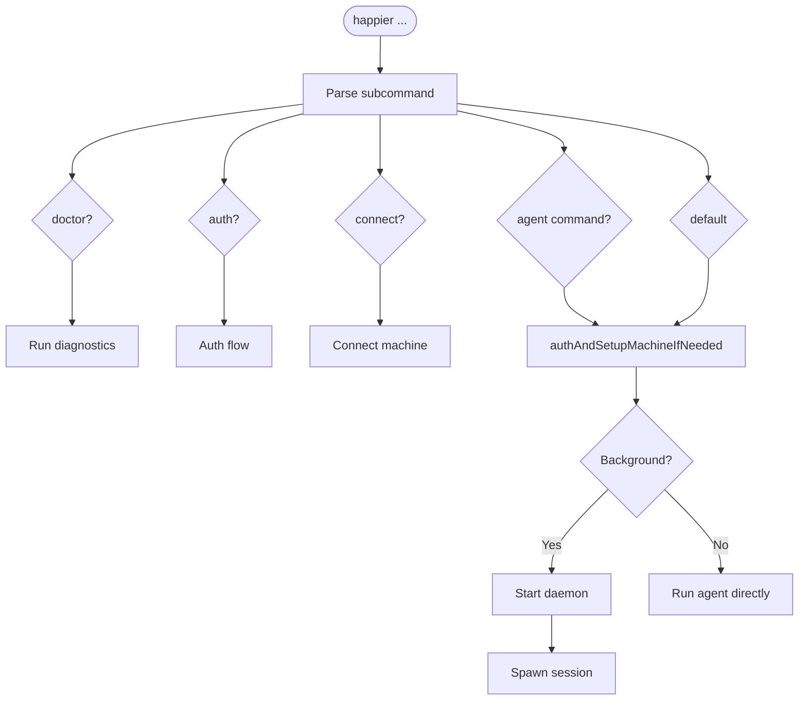
```mermaid
flowchart TD
    Start([happier ...]) --> Parse[Parse subcommand]

    Parse --> Doctor{doctor?}
    Parse --> Auth{auth?}
    Parse --> Connect{connect?}
    Parse --> Agent{agent command?}
    Parse --> Default{default}

    Doctor --> RunDoctor[Run diagnostics]
    Auth --> RunAuth[Auth flow]
    Connect --> RunConnect[Connect machine]

    Agent --> Setup[authAndSetupMachineIfNeeded]
    Default --> Setup

    Setup --> Context{Background?}
    Context --> |Yes| StartDaemon[Start daemon]
    Context --> |No| RunAgent[Run agent directly]

    StartDaemon --> SpawnSession[Spawn session]
```

`src/index.ts` is the CLI router. It:
- Parses subcommands (`doctor`, `auth`, `connect`, plugin-projected agent commands, and default run flows).
- Ensures auth and machine setup when needed (`authAndSetupMachineIfNeeded`).
- Starts the daemon or runs an agent directly based on subcommand/context.

### Action-derived command arguments

In 0.3 development source, `happier notify` is generated from
`notifications.notify_me`, including its `-p`/`-t` aliases and channel selection.
It no longer bypasses Activity policy with a direct push call. Delivery and
channel discovery share the Activity dispatcher and the executing host's current
plugin notifications owner. The standalone CLI does not initialize that daemon
runtime; reaching its plugin channels, and credentialless Agent/MCP delivery,
still depend on the shared Account-placement relay. Missing Account credentials
fail closed rather than borrowing ambient authority.

An Action-backed command must not own a second description of the input the
Action already defines. The ownership boundary is:

| Fact | Owner |
| --- | --- |
| Meaning and validation of Action input | `packages/protocol/src/actions/actionSpecs.ts` schema |
| Field title, widget, choices, dynamic option source | `ActionInputHints` |
| Friendly command path, positionals, flag aliases, caller-shape binder | non-serialized `ActionSpec.cli` (`actionCliProjection.ts`) |
| Argv mechanics, global flags, TTY layout, JSON envelope | CLI |

`ActionSpec.cli` is deliberately excluded from `serializeActionSpec` and
`ActionDefinitionV1`: friendly paths and binder functions describe one packaged
binary, not a cross-version wire contract. Remote discovery publishes the canonical
JSON schema and hints needed to compile an equivalent field grammar without
shipping executable binders.

`apps/cli/src/cli/actions/` compiles those declarations into one descriptor per
friendly path. Parsing (`parseCommandInput.ts`), help (`commandHelp.ts`) and
completion (`commandCompletion.ts`) all read that same object, so a flag cannot
exist in help or completion without existing in the parser. `compileActionCliFields`
supplies the same field derivation to `happier actions invoke <action-id>`, which
therefore accepts ordinary `--field value` flags while retaining
`--<field>-json` and `--input-json` for nested or scripted input. A contributed
Action is first discovered through `action.spec.get`, then compiled from that
strict definition through the same field owner; only a Home that explicitly does
not support definition discovery receives the legacy JSON-only fallback. A denied,
malformed, or mismatched definition never falls back to looser parsing.

Input precedence has one rule: `--input-json` supplies the base object, distinct
field flags and positionals overlay it, and a second source for the same field is
rejected in either order rather than silently winning.

The same compiler owns the one-shot execution-run lifecycle commands (`list`,
`get`, `start`, `stop`, `wait`, and bounded stream `start`/`read`/`cancel`).
Their friendly `--agent`, `--intent`, permission, retention, class, and I/O
flags bind into the canonical `execution.run.*` Action schemas; there is no
separate CLI-only `--backend` interpretation or hand-written lifecycle parser.
The multi-step `session run action` workflow remains dedicated because it
selects and invokes another Action dynamically.

The development Workflow command family follows the same rule. Its catalogued
`workflow.*` paths are `ActionSpec.cli` projections compiled by
`apps/cli/src/cli/actions/`; there is no Workflow-specific parser or transport.
Nested definitions and sources use the ordinary JSON-field grammar, opaque
cursors remain strings, and decimal-string wire values are never coerced to
JavaScript numbers. `--machine-id` routes `workflow.run.start`; it is not added
to that Action's strict input.

The Agent/MCP catalog derives the direct `workflow_run_start`,
`workflow_run_get`, `workflow_run_wait`, and `workflow_run_cancel` tools from
those same Action bindings. All other Workflow operations remain discoverable
through generic Action discovery/execution, with the same policy and errors.

Development Plan review recovery compares the child Run's authenticated
`authoredDefinition` from `workflow.run.get` with the held proposal through
`matchesWorkflowAcceptedDefinitionV1`, the same normalized source comparison
used by start rejoin. A different earlier proposal is disclosed instead of
attached to Use; running the new proposal uses its own derived admission id
through the existing seeded editor. The Account review owner also refuses a
`run_started` follow-up whose child's authored definition differs from the
accepted review value. The materialized execution definition remains a separate
read projection, and no second proposal store or admission transaction is added.

In development, Session MCP Account Actions use the existing authenticated
`/agent-runtime/session/services/v1` channel to their own daemon. Account
credentials remain with the daemon's credentialed Action executor. The daemon
admits a Session caller, never a host caller, and applies Agent policy and
approval rules. Approval replay preserves that caller and its original admitted
depth facts while rechecking current Session authority and Account policy.
The host-owned turn witness supplies admission facts; missing depth refuses
depth-dependent Actions rather than assuming zero. Missing daemon authority,
including a daemonless restricted runner, returns typed `target_unavailable`.
An uncertain dispatched outcome is not automatically retried.

The development definition family delegates to Protocol's
`createWorkflowDefinitionActions`; CLI Artifact transport is a host adapter,
not a second definition owner. Same-id create rejoins only matching normalized
definition and metadata, including after a lost response; different content
conflicts. Stored definitions are semantically validated before disclosure.
Create/update/edit may stamp the optional private `savedBy` field from the
host's Account and caller context; a matching create rejoin preserves the
original provenance. These source contracts do not certify the still-in-progress
UI Account adapter or all-daemons-offline controls.
Run admission always freezes the observed authorship in `source.savedBy` for a
saved source, using explicit null when its header has no author; accepted Runs
do not repair that fact by rereading the mutable definition.
Agent definition writes resolve selection and policy facts through the same
Protocol materializer without constructing a runnable snapshot or binding future
origin context and input-dependent loop limits. Run admission still binds and
validates them against the actual Run context before execution; saving an unbound
definition does not bypass Agent start policy.

Friendly Session commands resolve an ID, unambiguous prefix, or tag once at the
CLI transport boundary and pass the resulting exact Session ID to both Action
execution and presentation. A missing or ambiguous selector returns its typed
failure (including candidates where applicable); it is never retried against a
different Home, Session, Machine, or Run. A global `--server <saved-home>` (or
the documented explicit URL compatibility flags) selects the Home before
credentials and command dependencies are constructed. Action-derived commands
that support local selection also accept `--server-id <saved-home>`; both paths
resolve the same qualified Home identity, credentials, and endpoint as one tuple
for the invocation.

`createAccountServerActionDeps` makes that tuple structural: `serverId` and
`serverHttpBaseUrl` form one `AccountServerActionFixedHome` value that is either
wholly absent (follow the process default) or wholly present, and an incomplete
pair fails construction with `fixed_action_server_target_incomplete` rather than
combining one Home's identity with another Home's URL. Once an executor or
long-lived dependency (MCP servers, the daemon, a `--server-id` invocation) has
captured that pair, it keeps both halves for its whole lifetime: a later change
to the focused or active Home cannot retarget it, and a fixed URL never borrows
`configuration.activeServerId` after construction. A locally saved profile id is
routing identity only — external invocation authority still compares the explicit
`serverIdentityId`.

`--json` is CLI-owned and produces the standard single success/failure envelope
with a stable `kind` and `error.code`. `--` ends option parsing: later tokens
such as `--help` and `--json` are Action positional bytes, not CLI controls.
Shell completion is generated from the same admitted descriptors. Static paths,
flags, aliases, and enum choices therefore cannot drift from parsing; dynamic
choices use the canonical `action.options.resolve` Action and degrade to static
completion when authentication, connectivity, or the option source is absent.

Interactive CLI execution always supplies `present_user` authority explicitly;
it never inherits the executor's automation default. Discussion reads and Agent
posting remain usable by Account automation, while create, rename, archive,
restore, and personal read-state mutation are interactive UI/CLI operations.
Those interactive-only operations remain real user features but are omitted from
PAT/public-SDK and host-stamped plugin catalogs whose principals cannot satisfy
`present_user`.

The Action-owned command roots — `teams`, `identity`, `credentials`, `secrets`,
and `workflow` — are registered in `commandRegistry.ts` alongside the static,
Agent, and trusted-plugin roots, and `ACTION_CLI_ROOT_HELP` supplies their
`happier --help` lines. Root help, nested `--help`, completion, and dispatch all
read that one registration plus the compiled descriptors, so none of them can
disagree about whether a family exists: no valid command sits behind a root the
user has to guess. Trusted externally installed and bundled plugin commands use
the same Action-derived field compiler and host authority; neither receives a
private parser or capability path.

An ordinary `hap_v1` API Token may cross the existing one-shot child/tmux
continuation. A compound `hapc_v1` credential contains process-local wrapping
material and is rejected before any child is spawned rather than reduced to its
bearer. Whole-Action protected transport remains an in-process SDK capability.

Genuinely local, interactive, streaming and multi-step commands — authentication,
installation, daemon lifecycle, transcript follow, provider configuration — stay
dedicated. They are not turned into synthetic Actions.

Session input addressed to a Session-owned execution run is not a separate
command family: `happier send <session> <message> --run <run>` is the ordinary
send command with one optional destination, and `happier session run send` is a
deprecated compatibility argv alias over the same `session.message.send`
invocation and its result. Omitting `--run` constructs no recipient. The CLI runs
no capability preflight for a targeted send and never strips the recipient to
retry into the parent Session; the canonical Session-input owner returns the typed
refusal. `execution.run.send` remains the detached-run Action, and it requires
explicit `sessionId: null` rather than accepting either scope.

The refusals the CLI presents for a targeted send are the canonical admission
codes, not CLI inventions: `session_input_target_update_required` when this
server, this exact target Machine's `sessionInputAdmission` revision, or the
nested execution-run pending resource cannot carry the target (no row is
created), and `session_input_target_unavailable` when the daemon's Execution Run
registry positively proves the target cannot accept input. Both are members of
`SESSION_INPUT_ADMISSION_REJECTION_CODES_V1` and reach `--json` unchanged in
`error.code`. `--wait` on a targeted send observes only that admitted turn, so a
lost correlation surfaces the canonical `outcomeUnknown` result with its
`localId` retained instead of a codeless failure. See
[Pending delivery architecture](pending-delivery.md#execution-run-targets) for
the queued/blocked lifecycle behind those codes.

## Local state and configuration

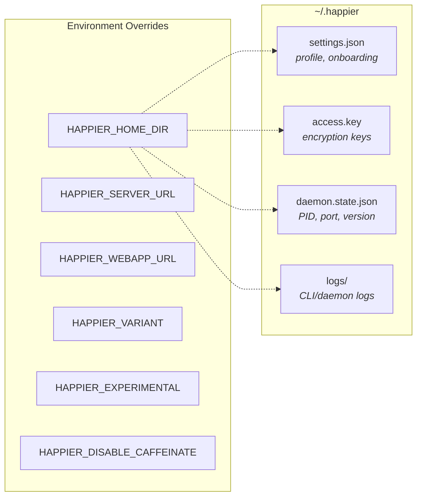
```mermaid
graph LR
    subgraph "~/.happier"
        direction TB
        settings["settings.json<br/><i>profile, onboarding</i>"]
        access["access.key<br/><i>encryption keys</i>"]
        daemon["daemon.state.json<br/><i>PID, port, version</i>"]
        logs["logs/<br/><i>CLI/daemon logs</i>"]
    end

    subgraph "Environment Overrides"
        direction TB
        E1[HAPPIER_HOME_DIR]
        E2[HAPPIER_SERVER_URL]
        E3[HAPPIER_WEBAPP_URL]
        E4[HAPPIER_VARIANT]
        E5[HAPPIER_EXPERIMENTAL]
        E6[HAPPIER_DISABLE_CAFFEINATE]
    end

    E1 -.-> settings & access & daemon & logs
```

Local state lives under `~/.happier` (or `HAPPIER_HOME_DIR`):
- `settings.json`: onboarding and profile settings (validated/migrated).
- `access.key`: local key material for encryption/auth.
- `daemon.state.json`: daemon PID + control port + version.
- `logs/`: CLI/daemon logs.

Configuration lives in `src/configuration.ts`:
- `HAPPIER_SERVER_URL` and `HAPPIER_WEBAPP_URL` override defaults.
- `HAPPIER_VARIANT`, `HAPPIER_EXPERIMENTAL`, `HAPPIER_DISABLE_CAFFEINATE` control behavior.

### One default channel per Happier home

A Happier home has one default `happier` command and one default-following background service, and
both belong to the **default release channel** (`default-cli-release-channel.json`; the service runs
that channel's `~/.happier/bin/happier` shim). Installing another channel never takes the default:
`installVersionedPayload` keeps the recorded default channel (marker and `happier` shim) whenever that
channel's managed CLI is installed, and the installed channel only gets its own shim (`hprev`,
`hdev`). It becomes the default on a first install into an empty home, or when the user chose it
explicitly — the official installers' `self __install-payload --channel` passes
`selectAsDefaultReleaseChannel`, and `self release-channel use` switches it. So a desktop app's CLI
acquisition, a `self update` of another channel or any other second-channel install never changes
which CLI the user's terminal and the service run.

### One CLI update transaction (plan R13 f)

`runManagedCliUpdate` (`packages/cli-common/src/firstPartyRuntime/runManagedCliUpdate.ts`) is the
only way a managed first-party CLI is updated in place. `happier self update`, the desktop's
bootstrap `cli.update.v1` (`updateManagedLocalFirstPartyComponent`) and the daemon-hosted remote
`cli.update.v1` all run it, always from the version being replaced:

1. **One target version.** The ring's newest release (or `--to <exact version>`, tag
   `cli-v<version>`) is resolved once by the acquisition owner
   (`prepareFirstPartyComponentPayloadFromGitHubRelease`, every OS including Windows) and downloaded
   with its minisign-verified checksums; a version that does not belong to the ring is refused.
   Every later step is bound to that version. The transaction takes the two locks of step 3 before
   this download (admission, `onAdmitted`), so a concurrent update is refused before it downloads.
2. **Smoke.** The staged executable's `--version` must equal the target, or nothing is activated
   (`cli_update_smoke_failed`).
3. **Capture, then activate without pruning,** under two locks of the one lock owner
   (`withFirstPartyPayloadMutationLock.ts`, `proper-lockfile`): the install root's
   (`<installRoot>.mutation.lock`) and the home-wide activation lock
   (`<home>/first-party-activation.lock`), always in that order, because launchers (`<home>/bin`) and
   the default-channel record are shared by every channel. `installVersionedPayload` takes both for
   any component with launchers or the default-channel record. A busy lock is waited for within the
   owner's retry budget; an update still refused after it fails `cli_update_in_progress` and records
   nothing. A release that fails after the outcome is settled never changes it (reported through
   `onWarning`); a lock compromised during the transaction is still an error. The capture (`captureActivationStateForUpdate`, `restoreInstalledPayloadState.ts`)
   records the `current`/`previous` markers and the default-channel record, and moves every launcher
   the activation will rewrite into this transaction's own `<home>/bin/.update-rollback/<id>/`
   (renaming works on a running Windows `.exe` where deleting it does not). If moving one fails, the
   ones already moved are put back first. Nothing removes another transaction's set-aside entries.
4. **Restart and prove,** only when the service's own daemon was running before the update, through
   the CLI service owner (`service restart` run by the activated binary — its ownership wait is the
   budget); the owner must then report the target version. `last-update.json` says
   `pendingReconnect` meanwhile.
5. **Commit** (drop this transaction's set-aside launchers, prune to current + previous) **or
   recover:** restore everything captured, restart the previous binary and prove it, and only then
   report. Rollback happens only when activation or that local proof failed — never because the relay
   is unreachable. `rolledBack` means the previous daemon is back and proven (or none was running); a
   restore that failed, or a restored version whose service did not come back, is `failed` and says
   which. The desktop kind maps them to `cli_update_rolled_back` and `cli_update_failed`.
6. **Record every end** in `<installRoot>/last-update.json` (`CliUpdateLastResultSchema`) through its
   one non-throwing writer — failures before activation included (`targetVersion` is `null` only when
   no release could be resolved). A record that cannot be written never blocks recovery; it is
   reported on stderr.

**What recovery covers — and what it does not.** Recovery covers activation and restart failures this
process catches. It does not cover the updater itself being killed or the machine losing power
mid-transaction (a set-aside directory may then be the only copy of a launcher), and it does not
supervise the service manager beyond the one restart it performs.

The service restart policy is shared by the CLI and desktop update consumers through
`planServiceDaemonsRestartAfterCliUpdate`. The CLI observes the daemon owner before the update
(`planServiceDaemonRestartAfterUpdate`: the service serving this CLI's current server selection on
this channel, never a manual daemon or another channel's service), and observes other servers'
services of this home and ring through `planServiceDaemonsRestartAfterUpdate`: when
the update stops them (the Windows quiesce, in `self update` and the installer's `__install-payload`),
each one observed running under its own service comes back and is proven. Only the services the
update owns judge it — the default-following service and pinned services the desktop manages
(`managedBy: desktop`); a pinned service the user installed that does not come back is named on
stderr with the exact `--server` and `--instance` restart command and never rolls the update back.
Where nothing stops them, they move onto the installed CLI at their next start.

**Desktop-managed services (R15, 0.3 development).** Desktop setup and repair ask the CLI to mark the pinned service
they create for a Home (`HAPPIER_DAEMON_SERVICE_MANAGED_BY=desktop`, set only by the scoped setup
executor, honored only by `service install`, baked into the definition on every platform, kept by
every rewrite, stripped from session environments, and reported as `managedBy` by `service list
--json` and the service inventory). A Home's own pinned service that the user installed is never
marked. Removing a Home in Settings first runs `daemon.service.relay.disconnect.v1`
(`disconnectHappierHomeService`): it uninstalls that Home's desktop-managed pinned service through
`--server <id> service uninstall`, proves it is gone, never acquires a CLI, and leaves a user-owned
service in place. An unreadable inventory before uninstall asks before removing anyway;
once uninstall is attempted, a command or verification failure stops the removal with
`service_uninstall_failed`. Every path that forgets a Home takes this one decision (`disconnectThisComputerBeforeForgettingHome`):
removing a Home (including the Personal Home's row) in Settings, and erasing the Personal Home —
there the erase owner (`useLocalRelayRuntimeControl.erasePersonalHomeData`) runs it after the person
confirmed the erase preview and before the task destroys any data, answering the erase "not
confirmed" when the uninstall failed or the person declined to go ahead without an inventory. The desktop kind reads
the addressed Home's `daemon status --json` (scoped by `relayUrl`) once the CLI is known to be managed,
and proves `daemon.startedWithCliVersion` after `service restart`.

**Service login triggers and desktop attribution (0.3 development).** `service install
--autostart at-login|on-demand` changes the existing platform service's login trigger; it does not
create a second service or change the separate manual start/stop commands. Omitting the flag keeps
an installed preference, or uses the existing at-login default for a new terminal installation.
`--keep-disabled` still preserves a disabled service during repair rather than activating it.
`daemon status --json` reports `service.autostart` from platform enablement and triggers, or `null`
when the service is absent or the manager cannot be queried.
Windows user tasks use the invoking user's SID in both the principal and the logon trigger, with
`InteractiveToken` and `LeastPrivilege`; registration needs no password or all-users logon trigger.
On-demand tasks register no trigger and omit missed-start catch-up. The existing task namespace,
hidden PowerShell wrapper, service policy, and explicit Run lifecycle remain the same.

The desktop status task publishes `serviceAutostart` from one common-mode fact:
every desktop-managed service in this Happier home and ring, independent of the requested Home.
An unreadable inventory fails with `service_inventory_unavailable`, and an unknown/mixed mode yields `null`.
The shared `discoverHappierServices` owner supplies both the CLI's installed-service projection and
Home lifecycle discovery. It reports named Happier definition read failures, and on Windows it
enumerates Scheduler tasks even without a wrapper directory. A registered task with a missing
wrapper remains an installed candidate; failed task inspection requires a successful fresh listing
before disappearance can be inferred. A readable definition remains an installed repair target when
its Scheduler registration is absent.
Home disconnect refuses an unverified matching pin before uninstall; an installed candidate found
after uninstall also prevents the Home from being forgotten.
The requested Home does not redefine the global preference. Individual service modes remain in
the existing inventory entries. Successful service controls refresh the same row/status projection.
The status owner calls the shared `readDaemonServiceInventory`; there is no separate
`daemon.service.servers.v1` task. Pinned rows use the service definition's public URL (falling back
to its transport URL), so a Personal Home's local transport does not replace its saved identity.
Row actions share the executor's installation/authentication eligibility. A lifecycle command error
is settled only when its status reread proves the requested postcondition; otherwise it is reported.
CLI server-selection follow-up uses the same installed pin/default selector. The default daemon's
separate standby check still asks whether a pin is active before yielding its lifecycle lock.
`runningManagedServiceCount` counts running managed targets before relay-row dedupe, or is `null`
when a managed target cannot be read. A default and a pin on the same relay can both be stopped;
one visible row alone cannot prove that the app can see every affected machine/account's sessions.
The same full inventory supplies `managedServiceInstalled`: `true` when a managed target is
present, `false` only when complete inventory proves none, and `null` otherwise. Desktop Settings
consumes this fact rather than inferring global absence from serving rows, which can hide a managed
default behind a user-owned pin. Missing or malformed presence is unknown to the UI.
The existing `daemon.service.start.v1` task accepts
`onDemandOnly: true` for an unscoped app-open request. Its aggregate owner starts each stopped
managed on-demand service through the shared lifecycle kind, skips other targets, and succeeds
when none is eligible. Manual Start keeps its existing behavior.

Native tray rows accept an optional known `activeSessionCount`; missing facts make no session
claim. Incomplete rows cannot prove that no managed service runs. Electron's host holds Quit and
window close for the same `desktop_app_exit_requested` / `desktop_finish_shutdown` handoff,
with `menuBarSupported: false`; the shared web owner decides consent and aggregate stopping.
Electron retains its normal window for a keep-open answer and uses its existing process/Iroh
shutdown for final exit. Its evaluation target adds no tray or menu-bar lifecycle.

The native updater records `updater-relaunch.json` beside `tray-state.json` before installation,
including `fromVersion`. Startup consumes and deletes it before choosing window mode; only a
different running version overrides a login-started menu-bar launch. Failed installation clears
the marker and retains the downloaded update for retry. Native tray pointer activity shares the
existing 15-second admission throttle: with a window it emits `desktop_tray_refresh_requested`
with `trigger: 'tray-pointer'`; without one it refreshes native status. Service-action notices
remain separate from login/status notices and settle after a successful action on the same relay.

An install-only `HAPPIER_DAEMON_SERVICE_BUNDLE_ID` request must be a reverse-DNS identifier. The CLI
records it in the service definition for later preview, repair and lifecycle rewrites; launchd also
receives `AssociatedBundleIdentifiers`. Attribution applies to default-following and pinned services
independently of the `managedBy` ownership marker. Bundle, ownership and login-preference metadata
are stripped before launching daemon and session children. Desktop setup forwarding and the composed
live platform checks are separate integration gates; this CLI contract does not assert they ran.

**Windows.** `happier self update` stops the payload's processes before activation
(`quiesceInstalledCliWindowsPayloadOwners` — running sessions are ended), as the installer does. The
desktop's `cli.update.v1` relies on the launcher move-aside and does not end sessions; it is
unverified on a real Windows host. Remote update is disabled on Windows (below).

**K5 — per-machine update facts.** `readCliUpdateFacts` (`apps/cli/src/cli/runtime/update/cliUpdateFacts.ts`,
schema `CliUpdateFactsSchema` in `@happier-dev/protocol`, the same wire shape the 0.2 line publishes)
reports `currentVersion`, the ring-filtered cached `latestVersion`, `channel`, `installSource`
(`managed` only when the running executable is inside its ring's recorded install), `updateCommand`,
`canUpdateRemotely` and `lastUpdate`. Every daemon publishes it in its encrypted machine metadata as
`cliUpdate` on its first connect after start and again whenever `last-update.json` changes (the
daemon watches its install root; `watchLastCliUpdateResult`). The desktop's own status fact
(`readLocalCliUpdateFact`, the flat `cliUpdate` of `daemon.service.status.v1`) and every other
reader use the update-check cache's one ring-filtered reader (`readCachedCliUpdateState`,
`packages/cli-common/src/update`); `self check` is its only writer (`recordCliUpdateCheck`) and
doctor repair never writes it or calls npm itself.

In current development UI, an explicit failed update remains failed even when the answering CLI
already reports the target version; equality settles only a reconnecting outcome. Retry still
follows the existing remote-capability decision. CLI actions show the existing session-reconnect
note by the item's machine identity, including this computer, on both the full Updates page and
the grouped popover. A grouped note describes only the CLI included in that row's action, not
unrelated updates on the machine.

In the current development UI, an explicit Update all or group press gives the already-discovered
plan to the shared in-memory update-action owner (`machineUpdateRuns`), scoped to its initiating
server and account. The Updates page and popover adopt its progress and Stop intent after navigation;
detail discovery remains lazy. Disjoint machine groups may run concurrently, but overlapping plans
cannot start a second batch. Stop prevents subsequent items without cancelling work already started.
The existing helper → agent → CLI order remains per machine, and all started branches settle before
the batch is released, including failures. This state is not persisted across app restarts.

Queued "this computer" CLI actions retain their planned task spec, server/account scope and machine
identity. Switching Home or account does not redirect the update, its original-Home status reread or
its completion attribution; the reread replaces shared status only while that initiating scope is
still active. Newly planned actions rebuild their context when the canonical Home snapshot changes,
including an endpoint refresh, while callbacks already queued retain their original context.

**Remote.** The daemon's `tool.systemTasks` capability lists `cli.update.v1` only when
`canUpdateRemotely` (presence = capability; older daemons never list it). The kind starts
`self update` detached from the daemon's own binary (output to `logs/cli-update-<ms>.log`) and answers
`{ started: true, currentVersion, channel, logPath }` only once the updater reported its admission on
its admission pipe (`updaterAdmission.ts`: fd 3, one JSON line); a refused updater
(`cli_update_in_progress`) or one ending before it reports (`cli_update_start_failed`) fails the task
instead. The updater outlives the service
restart because systemd uses `KillMode=process` and launchd `AbandonProcessGroup` (derived from the
unit templates, not executed). npm/Homebrew installs are refused with their exact update command
(`cli_not_managed`); Windows reports `canUpdateRemotely: false` (`cli_remote_update_unsupported`).

### Explicit-Home scope (desktop setup and "this computer")

Desktop setup, repair, `daemon.service.*` and `cli.update.v1` address one explicit Home, never the
terminal's active server (R10 D3). `packages/cli-common/src/systemTasks/executors/serverScope.ts` owns
the scope: `readLocalServerProfileScope` resolves the Home's saved profile read-only
(`server list --json`, which lists each profile's recorded `homeServerIdentityId`) — by identity
when the task names one, else the single profile on that URL; an ambiguous match fails
`server_profile_ambiguous` — and `resolveServerScopeTargetMode` picks the service from the OS service
inventory: the Home's own pinned service if it exists, else the default-following service when it
already serves that Home, else a new pinned one. Commands then run as `--server <id>` with
`HAPPIER_DAEMON_SERVICE_TARGET_MODE`. Setup saves the profile with `server set --no-use` only after
proving the flag read-only from the CLI's own `server help` usage line; released 0.2 CLIs ignore
unknown flags, so without that proof setup fails `cli_capability_missing` before any write. A Home
whose profile was resolved is used as saved and never rewritten: the CLI's URL upsert only adopts
identity-free profiles (a URL-only write would save a second profile beside an identity-bearing
one), and an endpoint write would replace the Home's recorded canonical URL with the loopback URL
the app reaches it on. `server set --no-use` runs only for a Home with no profile yet. In the
UI, `buildLocalDaemonServiceSystemTaskSpec` scopes every daemon task to the app's active server
(URL and identity) unless the caller names a Home (the Personal Home bootstrap names its own).
The scope is also the one context rule for inherited selectors (0.2 R13 a): `scopeHappierJsonExecutor`
drops `HAPPIER_ACTIVE_SERVER_ID`, `HAPPIER_DAEMON_LIFECYCLE_SCOPE_ID`, `HAPPIER_SERVER_URL`,
`HAPPIER_LOCAL_SERVER_URL`, `HAPPIER_PUBLIC_SERVER_URL` and `HAPPIER_WEBAPP_URL` from every scoped
command, so a stack-launched app pinned to another relay cannot put the Home's daemon state and lock
in that relay's lifecycle directory (`--server` alone replaces the URL/profile selectors but not the
lifecycle scope). The SSH enrollment approval (`auth approve --home-target-from-request-json`) already
binds its credentials to the Home target the request names.

In current 0.3 development, `home pair-device` also accepts an authenticated
URL-only profile retained from 0.2 or created by Stack auth seeding. The shared
terminal enrollment carrier verifies its selected HTTPS or loopback origin;
the authenticated features projection supplies the complete Home descriptor.
`serverProfiles.adoptServerProfileHomeConnectionDescriptor` persists it on that
same immutable profile before pairing starts. Public fallback observations,
inconsistent Home identities and existing advisory profiles cannot authorize
pairing. Stack seeding does not manufacture a descriptor or copy routing trust
from another Home.

In the current 0.3 development UI, the system-task runner retains setup prompt answering after
navigation. Reopening adopts that run only for its initiating Home and account; an initially
identity-free Home uses the canonical saved-profile URL resolution, with ambiguous matches refused.
The same runner admits pending and running setup across Home, checklist and Settings, so a second
same-scope start adopts rather than launches another task. Enrollment owns cancellation on leave
and requests a non-adopting start; an existing setup is refused, never borrowed and cancelled.
Settings adopts the runner's activity; the local daemon owner retains only outcomes and post-success
inspection. Its status readback keeps the setup spec's original URL and backend identity (including an
originally absent identity), while publication checks the current Home's canonical profile
equivalence and account. Before pairing is sealed or posted, the explicit Home credential's token
subject must match the initiating account. A failed retained prompt continuation emits a default-on
diagnostic without prompt contents or credentials and remains retryable by its owner.

In the 0.3 development implementation, finite-output subprocess deadlines use
`packages/cli-common/src/process/execFileWithDeadline.ts`, including Bash argv RPC
and Herdr execution. An event-loop stall does not turn an already completed command
into a timeout; a deadline that actually interrupts the child remains a failure,
even if its SIGTERM handler exits successfully. Caller-owned cancellation and tree
termination hooks remain in effect. Bash argv stays literal and keeps its existing
uncapped output behavior.

The shared CLI process-tree owner gives Windows `taskkill` the containing
teardown phase's budget and spends only the remainder on liveness checks. A
hung tool is force-stopped at the same subprocess boundary. Cleanup that cannot
prove containment retains `plugin_exec_termination_incomplete` rather than
reporting success.

Local service install/start/stop/restart commands delegate their execution deadline
to the CLI's service lifecycle owner, rather than imposing the generic 60-second
subprocess cutoff over its OS-command, ownership-wait and recovery budgets.
`resolveLocalHappierCommandTimeoutMs` supplies this policy to both local command
adapters, including scoped Home commands. Task cancellation still terminates the
immediate command child; it does not promise OS-service rollback. Read-only checks,
install dry-runs, authentication claims and SSH execution retain their existing
deadlines. The local adapters keep their distinct release-environment behavior.

### One CLI per computer (desktop setup, plan R12)

A Happier home runs one CLI: the managed one, or a `happier` the person installed (npm, Homebrew, a
manual copy). The answer lives in `<happier home>/cli-choice.json`
(`packages/cli-common/src/firstPartyRuntime/happierCliChoice.ts`) and is read by the one resolver,
`resolveExplicitOrInstalledLocalFirstPartyCommand` (`systemTasks/executors/happierJsonExecutor.ts`):
env override → repo checkout → **own** (the kept CLI; a kept CLI that disappeared fails
`cli_choice_required`, never a leftover or fresh managed copy) → the installed managed CLI → while
nobody answered, the `happier` a new terminal runs first when it is not the managed one → acquire.
So no read acquires a second CLI before the question.

- **The question** (`setup.cliChoice`, step `setup.thisComputer.cliChoice`) is the setup executor's
  first step, before acquisition or any write (`apps/bootstrap/src/systemTasks/happierCli.ts`
  `inspectLocalHappierCliChoice`). It is asked when the terminal's first `happier` is foreign and
  nobody answered, when the kept CLI disappeared (`missing`), when the kept CLI cannot serve setup
  (`belowSetupFloor`), or from Settings (`reconsiderCli`). 0.3 has no version floor: "can serve
  setup" is the same `server help` proof of `server set --no-use` the executor requires
  (`serverHelpSupportsExplicitHomeSetup`). `keepBlockedBy` names a managed CLI that answers first
  through a route Desktop did not create (the installer's link); the executor then refuses **Keep**
  (`cli_choice_unanswered`) as the UI does. A dismissal fails `cli_choice_unanswered` with nothing
  written; **Keep** on a missing CLI fails `cli_own_missing` with nothing written.
- **Manage** records `managed`; PATH exposure (`ensureHappierCliPathExposure`) then writes the
  managed line even though another `happier` resolves (on Windows the managed dir is moved ahead of
  it and the move recorded in `HAPPIER_DESKTOP_PATH_MOVES`). Without an answer, a foreign first
  `happier` means PATH exposure writes nothing and reports it as `existingCommand` (INV5).
- **Keep my own** records `own`, removes only the PATH lines Desktop wrote (Windows moves are put
  back while they still hold), runs every command with that CLI (an `override` pairing, so the
  attended approval applies), and `resolveManagedDaemonServiceShimPath` proposes no managed shim, so
  the service runs that CLI. A kept CLI that cannot serve setup keeps the answer and fails
  `cli_own_below_setup_floor` naming its own update command; it is never replaced.
- Either answer given in a run is the consent to switch the service's CLI: the service disposition
  owner (`resolveBackgroundServiceSetupReconciliationDisposition`, `runtimeChanged`) runs the strict
  `service install` (which rewrites a definition whose launcher differs; its failure fails setup)
  and a restart.
- `daemon.service.status.v1` reports `cliChoice: { mode, otherCli }` (the kept CLI or an old copy,
  with its shown-never-run removal and update commands from `happierCliOrigin.ts`), and a status read
  that fails on the CLI the question is about fails `cli_choice_required`, so the app routes into
  setup instead of a Retry.

Limits: nvm/fnm/volta shims are not detected; machine-level Windows `Path` entries still precede the
user `Path`; desktop setup never rewrites the terminal's own default-following service (D3), so after
**Manage** a user service installed by the old CLI keeps its launcher until it is reinstalled.

### Default-following and pinned services on one server

For a terminal install of a pinned service, use
`happier --server <profile-id> service install --instance <service-id> --autostart on-demand --json`.
`--server` is a root prefix flag and selects the saved Home profile; `--instance` names the service
and does not select a profile. The service id may differ from the profile id. Address later service
status/start/stop/restart commands with the same prefix and instance. If the caller inherits a
`HAPPIER_DAEMON_LIFECYCLE_SCOPE_ID` for another Home, clear it before invoking this command: the
root profile selector updates endpoint/profile selectors, but not the inherited lifecycle scope.

In current development source, status attributes an installed service to this Happier home only
when its definition declares the same home. A default label, systemd unit or scheduled-task name
is global to the OS user and ring; finding that name alone does not establish ownership. On Windows,
the registered task's wrapper decides before a candidate wrapper in the invoking home. Foreign or
unknown homes report no installed service or autostart mode here. Targeted start, stop, restart and
uninstall fail with `foreign_home_service` before changing definitions or OS jobs. Raw inventory
retains foreign services for diagnostics and install-conflict reporting. The desktop's aggregate
controls consume only this home's installed managed identities, so a running manual daemon cannot
authorize stopping a foreign default service.

A daemon's lock is per Happier home and server, so one server has one owner. When the server the
default-following service follows has this home's pinned service (for example after a terminal
`server use <Personal Home>`), the pinned service owns it and the default-following service stands
by. Only a pinned service its manager is running or starting counts (launchd has it bootstrapped,
systemd reports it active/activating/reloading, Task Scheduler reports it running — the state
`service stop` changes; an unreadable state still counts); a stopped one serves nobody, so the
default service serves that server as before. `apps/cli/src/daemon/ownership/daemonServiceInventory.ts`
owns the rule (`selectPinnedServicesServingServer`, `resolveDefaultFollowingStandBy`,
`evaluateDefaultFollowingServiceStartup`; `readBackgroundServiceActivity` reads the manager state):
- at startup (`daemon start-sync` from the service definition, or its self-restart) the
  default-following daemon logs which pinned service serves the server and exits 0, which launchd
  (`SuccessfulExit=false`), systemd (`Restart=on-failure`) and Task Scheduler (restart on failure)
  all treat as "stay stopped" until the service is restarted for another selection or at the next
  login;
- the `server use`/`server set` follow-up (`backgroundServiceFollowUp.ts`) names the pinned service,
  asks no authentication for the new server, and offers the restart only so the default service
  stops serving the server the terminal left; `--json` reports the same follow-up as
  `data.backgroundService` (`servedByPinnedService`, `commands`) instead of skipping it;
- `service install|start|restart` of the default-following service still applies the service plan
  but does not wait for its daemon to own the server: it reports the stand-by (`--json`:
  `standingBy: { serverId, servedByPinnedService }`) and treats the pinned owner of that server's
  lock as no conflict.

## API client architecture

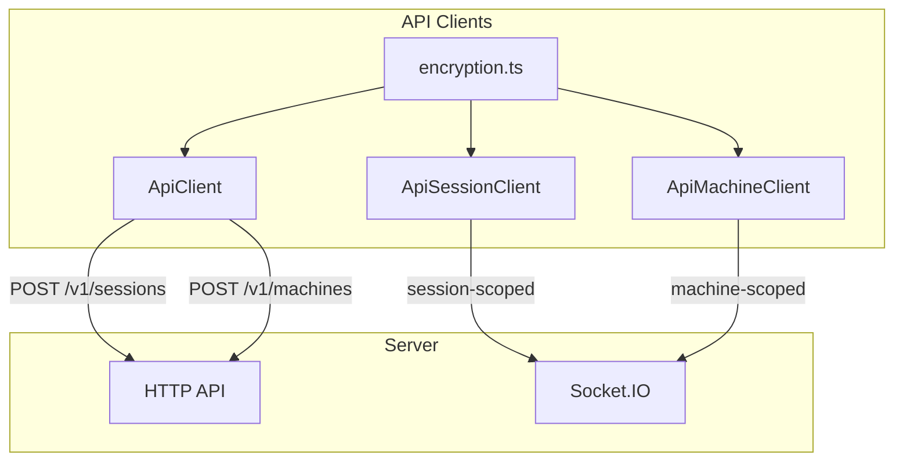
```mermaid
graph TB
    subgraph "API Clients"
        Base[ApiClient]
        Session[ApiSessionClient]
        Machine[ApiMachineClient]
        Encrypt[encryption.ts]
    end

    subgraph "Server"
        HTTP[HTTP API]
        Socket[Socket.IO]
    end

    Base --> |POST /v1/sessions| HTTP
    Base --> |POST /v1/machines| HTTP

    Session --> |session-scoped| Socket
    Machine --> |machine-scoped| Socket

    Encrypt --> Base & Session & Machine
```

### HTTP
`ApiClient` (`src/api/api.ts`) handles:
- Session creation (`POST /v1/sessions`) with mode-compatible metadata/state.
- Machine registration (`POST /v1/machines`) with mode-compatible metadata/daemon
  state.
- Other CRUD actions through `ApiSessionClient` and `ApiMachineClient`.

### WebSocket

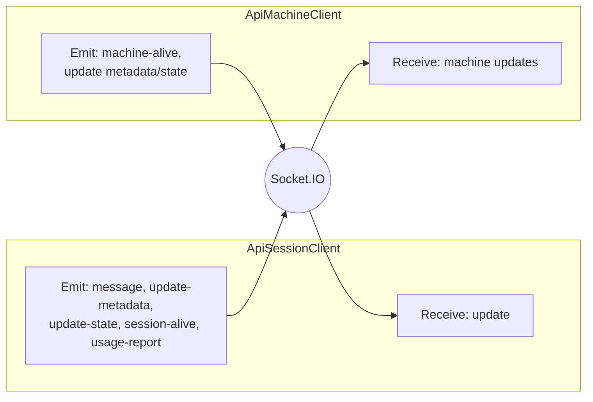
```mermaid
graph LR
    subgraph "ApiSessionClient"
        S_In[Receive: update]
        S_Out[Emit: message, update-metadata,<br/>update-state, session-alive, usage-report]
    end

    subgraph "ApiMachineClient"
        M_In[Receive: machine updates]
        M_Out[Emit: machine-alive,<br/>update metadata/state]
    end

    Server((Socket.IO)) --> S_In & M_In
    S_Out & M_Out --> Server
```

`ApiSessionClient` (`src/api/session/sessionClient.ts`) connects to Socket.IO as a **session-scoped** client:
- Receives `update` events and parses the Session's explicit plain/encrypted message
  representation, decrypting only the E2EE branch.
- Emits `message`, `update-metadata`, `update-state`, `session-alive`, and `usage-report`.

#### Session metadata authority

`ApiSessionClient` takes explicit metadata authority and transport dependencies.
The transport supplies the Home URL, Session socket factory, and optional Account
updates socket and token refresh. `ApiClient.sessionSyncClient` composes the
ordinary Account transport, preserving AccessKey provisioning. Restricted runtime
composition supplies its exact Session transport without that provisioning path.
Session HTTP operations retain the injected Home even if the process changes its
active Home. These dependencies are development architecture. The restricted
Runner now has a pre-Session, content-free credential-selection/readiness producer,
but the feature is default-on with
`HAPPIER_FEATURE_SESSIONS_EPHEMERAL_RUNNER__ENABLED` as the operator opt-out —
the ordinary shipped-bit shape in [feature-gating.md](./feature-gating.md). It is
unreleased, not off: the composed Runner, broker and native-host journeys are
release checks, so this is not an availability claim.

The metadata authorities are:

- `{ kind: 'owner', credentials }` — the ordinary CLI/daemon composition. It
  opens and reseals the layout-1 owner envelope, writes owner Agent state,
  converges Account settings, and joins the Account-wide user-scoped socket.
- `{ kind: 'shared_editor' }` — a restricted Session-runtime composition that
  holds only the Session data key and a Session-scoped runtime token. It writes
  the shared projection through the server's `shared_editor` tuple mode, never
  reads stored Account credentials, never refreshes its token from Account
  storage, and does not open the Account-wide user-scoped socket. Owner-only
  operations (owner Agent state, current-publisher metadata,
  Session user-input admission, Account settings) fail with
  `session_owner_authority_required` before any effect.

A shared editor may only write the fields the canonical
`SessionSharedMetadataV1` schema admits (`summary`, `agentPresentation`,
`externalSessionOperationPresentationV1`, `publicAgentState`); owner-only fields
are refused by that schema instead of being dropped. Scoped reconnects recover
through the exact Session transcript and snapshot owners without reading an
Account profile or Account changes cursor.

`ApiMachineClient` (`src/api/apiMachine.ts`) connects as a **machine-scoped** client:
- Sends `machine-alive` heartbeats.
- Updates machine metadata/daemon state with optimistic concurrency.
- Receives machine updates and merges them locally.

### Encryption

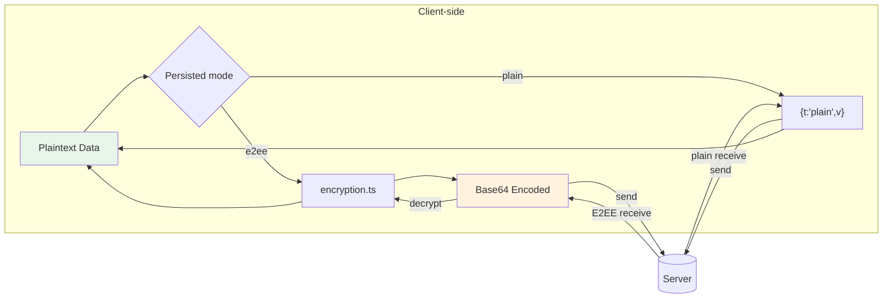
```mermaid
flowchart LR
    subgraph "Client-side"
        Plain[Plaintext Data]
        Mode{Persisted mode}
        Encrypt[encryption.ts]
        Envelope["{t:'plain',v}"]
        B64[Base64 Encoded]
    end

    Plain --> Mode
    Mode --> |e2ee| Encrypt --> B64 --> |send| Server[(Server)]
    Mode --> |plain| Envelope --> |send| Server
    Server --> |E2EE receive| B64 --> |decrypt| Encrypt --> Plain
    Server --> |plain receive| Envelope --> Plain

    style Plain fill:#e8f5e9
    style B64 fill:#fff3e0
```

The CLI enters `src/api/encryption.ts` only for persisted E2EE content with real
matching material.
- Plain Session, Machine, Artifact, and domain-owned KV values use their strict plain
  representations and are intentionally server-readable.
- A token-only credential has zero Account E2EE material. Device-local keys may seal
  local secrets but are never uploaded or substituted for Account material.
- Some plain and encrypted values use base64 on byte-oriented routes; base64 is an
  encoding, not an encryption claim. See `encryption.md`.

## Terminal hosting (development)

### Session terminal workspace (0.3 development)

The client's existing AppPane scope owns device-local terminal tabs, horizontal
SplitCanvas layout, focus and list visibility. These are views, not another
process registry. The daemon's terminal manager remains the PTY authority;
`daemon.terminal.list` projects its current entries without creating or reaping
processes. Older daemons without that method cannot supply the cross-session
Jump group. Borrowed terminal views are read-only at the client's transport
owner, and closing them or an Agent attachment never stops that process.
Closing an owned shell stops its PTY before removing the view; hiding retains it.

Package-script launch intent is resolved after directory admission by the existing
Local services run-target owner. The daemon injects the selected package manager's
`run` command into the ordinary shell PTY; it neither executes display previews
nor spawns a host package manager directly. Local services Start still refuses
package scripts. Terminal URL discovery reuses the existing output detector and
`terminal_url` inventory. These are development-source contracts; the redesigned
strip, list, Jump and phone controls require the terminal UI integration.

The development permission-mode controller verifies the current composer footer
before cycling modes. A clipped footer is unknown, rather than evidence of default
mode; historical mode text above the composer is not authoritative. Legacy mode
labels and compact HUD labels share that parser. If the footer is hidden by a short
terminal, control waits without cycling blindly; enlarging the terminal restores
verification through the existing retry path. Pending prompts still wait for their
required runtime configuration to be verified.

The development parser distinguishes Claude's automatic usage-limit wait footer
from the interactive usage-limit chooser. An empty composer still accepts a new
prompt, as Claude permits during the wait. Clearing an owned leftover draft with
Escape waits for the provider wait to end; it must not cancel automatic continuation.
The Rewind message selector owns keyboard input even when its only focused row is
`(current)`, so that row is never treated as a prompt draft. These keyboard semantics
follow [Claude's interactive-mode contract](https://code.claude.com/docs/en/interactive-mode).

Terminal hosting selects where an interactive session runs; it does not create
another Happier session registry. Happier owns session identity, Agent
configuration, transcript ingestion, permissions, and recovery. The terminal host
provides the process and screen; `terminal/attachment` persists their association
and owns attach, stop, and host disposition.

Terminal-host setup failures retain `SPAWN_FAILED` with optional, Protocol-owned
`terminal_host_unavailable` detail. The session spawn action consumes that detail into
its existing non-retryable `incompatible_target` settlement and preserves the optional
`terminalHostError` field. Missing supported Herdr/Zellij installations and an unsupported
running Herdr server are host setup failures, not provider errors. Creation UI offers
installation/update or host selection recovery and retains the draft; other startup
failures keep their existing classification.

Development daemon admission captures the selected runtime's terminal-presentation
result before Session commit. Only `runner` presentation hosts the Happier controller;
`managed_terminal` and `provider_attach` keep it headless and present the selected
runtime's prepared native process. The private runtime request carries the admitted
host context separately from metadata describing a terminal that actually exists.
Herdr's exact socket is admitted before provider-specific authentication changes the
child environment; an explicit socket never falls back to another ambient server.

Optional server-backed presenters use the adapter's single private launch handoff.
Local attachment becomes available only after the native OS spawn receipt, within the
existing Session startup deadline. Failed preparation leaves the admitted controller
remotely usable; an unknown handoff retains its exact custody rather than replaying
creation. The existing daemon heartbeat retires positively dead optional owned
attachments without ending their live controller or automatically reopening a client.
Controller recovery distinguishes these optional clients from session-bearing hosts:
the former can be disposed before continuation, while the latter retain their existing
control and recovery fences. Borrowed shells are never destroyed by this owned-host
supervision. Existing-session continuation leaves the optional client remote until an
explicit Attach request. After that client has retired, Stop still requires positive
daemon ownership and current OS process-identity proof before terminating its headless
runner; a missing session-bearing host remains fenced.

For an optional presenter, normal runner exit retains marker evidence only while an
owned or legacy terminal descriptor is current, or custody cannot be read reliably.
Verified absence and borrowed-shell custody release the marker after terminal-finality
and exit staging complete. The initial attachment's historical publication is not
current custody; unexpected daemon recovery retains its separate existing policy.

The daemon's `spawn/routeSpawnModeAndWaitForWebhook.ts` keeps headless ACP runtimes
headless and routes supported interactive runners into the selected host.
`spawnAdapterHostedSessionAndWaitForWebhook.ts` reuses normal daemon registration
and webhook completion for zellij and Herdr. Agent runtime factories supply the
runtime and its local-control capabilities; `engineRegistry/nativeAgentSession.ts`
binds their terminal or provider-attach surface into the existing mode loop.
Initial native configuration options combine persisted metadata and launch preferences
through the canonical configuration-intent writer and snapshot reader, preserving
per-option timestamp precedence. Initial model selection already uses the canonical
public model-selection resolver; it is not a separate terminal-host selector.
Permission startup uses one shared seed-admission owner for the prompt loop and
runtime override synchronization. A saved mode is applied before eager native
startup even when its timestamp was already captured while building the queue.
Subsequent metadata changes still require a strictly newer timestamp; explicit
launch permission intent keeps its existing precedence.
Codex App Server and OpenCode server prepare their native TUI attachment against
the existing Agent session, rather than starting another conversation.

Managed provider-attach declarations retain their target and credential-environment
facts even when the host's access resolver is unavailable; attach fails closed
instead of becoming an unmanaged ambient-credential launch. For an in-runner native
TUI, the private host attach request reuses the same managed-services owner's exact
current Session/plugin/contribution/instance projection. Its client environment stays
runner-local, and currentness is checked again after executable/version resolution
before spawning. Original runtime-occurrence callers retain their existing lookup;
projection consumers use the underlying instance identity, not the projection token.
Independent Plain-account standalone attach still lacks a private daemon-to-runner
credential transport; this runner-local path does not disclose credentials over the relay.
OpenCode native fork/resume retains a canonical explicitly configured external server
origin through its existing runtime descriptor and external managed-service admission.
An observed managed-server URL is not that authority: ordinary managed-local servers
share the native data-root corpus, so the child may supervise a new endpoint without
copying the parent's private credential.

Herdr transport remains in `integrations/herdr`: direct argv launch, styled screen
capture, input, process inspection, and terminal attachment. In development
builds, both the installed executable and the exact running server require a stable
Herdr release at or after `0.9.2`. Opening Herdr, attaching or focusing a terminal,
and admitting a recovered host use the existing client's version check before
control; recovered-host admission never creates or replaces that server. Claude's unified
runtime lives in `packages/plugins/claude/src/agent/runtime/terminal/unified` and
uses the host's terminal service, composer parsing, and prompt-submission
verification. Successful terminal writes are not Agent acceptance acknowledgements.
The Herdr client stages large text in sequential Unicode-safe requests within
Herdr's 1 MiB serialized JSON-line limit, including escape expansion and envelope
bytes. Submission still belongs to the existing verifier: it sends Enter only
after staging completes, and a partial failed write retains the existing
ambiguous-write result rather than replaying the prompt.
Herdr uses a shared default server namespace rather than the generated Agent pane
label. When creating a pane, a saved host supplies the default namespace on resume, while an explicit
named server wins; the label remains independent of either placement choice.

`terminal/runtime/inheritedHerdrRuntime.ts` verifies the foreground wrapper's live
Herdr endpoint and pane. `terminal/runtime/terminalMetadata.ts` reconstructs the
existing handle and distinguishes daemon-owned from borrowed shell hosts.
`plugins/runtime/context/terminalHost.ts` launches a managed child in that current
host and applies its existing attachment disposition: borrowed panes remain
intact when the runner stops, while an explicit stop can destroy a daemon-owned
host. The Herdr terminal identity resolves to its current pane without a separate
persistent index. Child termination and attachment release stay with the existing
host service and runtime lifecycle; normal runtime disposal surfaces cleanup
failures rather than reporting successful retirement. After positive exact-runner
exit proof, Stop may continue the same disposal and retirement pipeline with the
captured attachment identity if normal runner cleanup already removed its descriptor.
Unreadable or replacement evidence is not absence. After old-host physical
retirement is proven, a newer remote serviceability projection is left untouched
while only the old captured local evidence is retired. Borrowed-host release never
disposes the user's pane, and exact metadata retirement and hook-artifact cleanup
remain in the existing disposition owner.
If required descriptor removal fails, Stop reports incomplete retirement and retains
the exact local evidence for retry without disposing a borrowed pane.

The development Session-scoped terminal service can adopt an existing owned host
without launching another Agent. Admission requires the current runner's Session
lock, matching metadata and exact local attachment, and positive host liveness;
unknown or replaced evidence remains fenced. Inherited foreground borrowing takes
precedence, and a changed terminal preference does not replace a surviving owned
host. Claude's retained-host path reuses the Session's existing authenticated hook
endpoint and artifacts. The host receipt alone does not establish native identity:
an authenticated primary hook or statusline observation must match the requested
native session, followed by the existing transcript admission. This is distinct
from a fresh resume launch and does not synthesize a SessionStart hook.
The selected runtime's existing presentation result also declares whether it can
adopt a retained terminal. The daemon delegates an absent controller to that
recovery path only with its attachment-bound control descriptor and an affirmative
runtime declaration. Claude unified declares adoption; SDK and optional native
clients do not. Missing descriptors, uncertain liveness and changed attachments
remain fenced. This declaration permits endpoint admission, not a fresh provider
launch or a claim that authenticated recovery has already completed.
For this admitted headless continuation, startup preserves the exact active owned
association instead of publishing the controller's plain placement over it. It
leaves both current and supported predecessor attachment records untouched and
does not bind or report the old host as live before final adoption. Missing,
unreadable or mismatched active custody fails before the startup metadata update.
An owned attachment without a matching Session terminal association is likewise
refused rather than overwritten by the controller's plain placement.
Fresh placement, borrowed hosts and canonically retired associations retain their
ordinary startup behavior.

Cold Herdr attachment verifies the recorded standard saved namespace through the
native session inventory before starting that same server. It uses the existing
terminal-host startup budget, not the shorter API action budget, and never
substitutes an ambient same-name server. Foreground attachment supplies the exact
socket and named-session environment without `--session`, which would override
that socket under Herdr's released CLI contract. A restored public pane remains
only a candidate until normal Happier resume admission reconnects the Session;
opening it establishes neither authenticated identity nor owned custody.
Unsupported custom cold-start roots require reopening the original server;
already-running custom sockets remain attachable through exact-server admission.

The UI's canonical local-control projection distinguishes retained AgentState from
live controls. Inactive sessions, permanently absent terminal hosts, and preserved
but unservable hosts expose no live local controls, even if historical AgentState
still records an attached terminal or `controlledByUser`. The footer derives both
its local-control capabilities and exclusive-control flag from that projection,
using the session's canonical owner metadata view. Resuming a live runner restores
the current shared or exclusive controls without changing the retained history.

An accepted session identity prevents duplicate nonce launches but is not readiness
proof. Recovered nonce admission consumes the existing accepted runner marker and
process generation, completed startup custody, and current exact-session RPC
serviceability. Terminal-host sessions also require a readable committed attachment
whose handle matches the tracked terminal metadata; a known attachment ID must match
too. Windows window/console launches consume their required regular attachment:
the launch window and unique tab title must match, or the console PID must identify
the accepted runner. An in-runner Windows PTY instead uses its exact host descriptor
and requires the already known committed attachment ID; mode-only metadata is not
an exact binding. Recovery captures the original accepted runner/host facts and
rechecks the marker, local attachment, and current tracked custody after RPC awaits.
Actual plain launches need no host attachment but still require marker and RPC proof.
Unproven recovery stays pending. Normal completed spawn/report correlation remains
authoritative if it settles while recovered proof awaits filesystem or transport I/O.

In the current development source, all child-owned same-pane launches use
`terminal/host/launchSpec.ts` to pass the
final native argv and environment in a private one-shot file to the managed
terminal launcher. A private controller-lifetime IPC channel closes on controller
exit or death; the surviving launcher invokes the same owned-process-tree cleanup
used by normal shutdown. Native attach readiness uses that channel's actual child-spawn
receipt, not the launcher's spawn. Managed-service currentness is checked again after
private handoff preparation, immediately before launch. Normal attach cancellation
forwards SIGINT to the native child over the same channel; the existing three-second
escalation requests owned-subtree cleanup, leaving independent services untouched.
Borrowed shell panes remain intact. OS discovery or
signalling failures can leave descendants running. The cleanup owner still attempts
known-process termination and rejects with `plugin_exec_termination_incomplete`
when completion cannot be verified through its census, direct-child fallback, or
owned process-group/Windows tree proof. The CLI owner records that outcome in its
default file log; the surviving launcher reports a fixed, sanitized stderr diagnostic.
Cleanup cannot run if the launcher is also killed or cannot execute. Independent recoverable hosts
keep their adapter-owned topology and receive no lifetime channel.
An incomplete termination keeps its exact process custody: concurrent callers share
the current attempt, while a rejected attempt can be retried rather than permanently
replaying its rejection. Successful termination remains idempotent.

Terminal-host creation failures retain the existing `not_created`,
`created_and_absent`, or `created_or_uncertain` evidence independently from
cleanup completion. Only a definitely unsubmitted tmux creation with complete
cleanup permits ordinary-process fallback. An unconfirmed hosted child retains
its private launch and session-attach inputs through the outer daemon spawn
owner; an exact, successfully disposed host permits cleanup. Private artifact
owners remove only their known files and empty directories, treating only
`ENOENT` as idempotent. Other failures emit sanitized default-on diagnostics.
Already ready native launches and completed Claude query outcomes remain
successful despite artifact cleanup failure; failed startup preserves its
original cause alongside cleanup failures. These are current development-source
contracts, not additional retry or recovery guarantees.
An explicit retirement retry continues from proven physical disposition, without
destroying the host twice, and finishes outstanding artifact cleanup and exact
metadata/report retirement. A replacement attachment is not retired by that retry.

Herdr lifecycle reporting projects Happier state. Managed Agent children suppress
Herdr's native Agent hooks, and the resume action uses the current Happier
release-channel executable. The generic `--runtime-context` command prefix carries
the existing resolved CLI context (home, relay profile and endpoints, and daemon
lifecycle scope), because Herdr does not restore the original pane environment
when restarting a saved command. Configuration applies this prefix before
resolving credentials, only at initial startup; later explicit profile selection
is not overwritten. The prefix accepts only the canonical runtime-context keys,
does not copy credential files, and rejects URLs with embedded user information.
Encoding is transport, not redaction. Generic `resume` delegates to normal attachment for
running attachable sessions; stopped sessions retain strict Agent resume. A
recorded local Herdr pane may be opened as a restoration candidate when its
controller is positively absent. A restored command already inside that exact
pane, socket and namespace continues through ordinary same-Session resume even
when relay activity is stale; a present or unreadable controller retains normal
attachment admission. The pane record is placement intent, not Session identity
or owned-host custody. A surviving shared headless controller can admit a native
client in that recorded restored pane through the existing strict Session attach
operation. The selected-session owner checks the current native identity, exact
socket/pane, prepared native invocation and launcher fingerprint/foreground
ancestry before binding the actual borrowed v3 record through the existing
terminal publisher. An absent descriptor requires the authenticated retired
placement's exact attachment ID; absence alone is not admission. Local Switch
and Detach join that same custody proof. Managed Detach retires only the exact
native launcher tree, preserving the borrowed shell, and a subsequent explicit
Attach can reuse the same pane. Ordinary independent clients without this
admitted association still do not claim managed status or Detach. These source
contracts do not establish automatic installed-channel replay or the composed
0.3 authenticated cold-restart live result. When a
preserved host cannot be verified, Resume remains fenced. Reconnect to
the original terminal host and retry Resume, or Stop the session if that action
is available before resuming on a fresh host. There is no parallel Herdr session
synchronization service. These are development-source
contracts, not a claim of release availability.

## Daemon architecture

### Plugin UI artifacts

The daemon is the single Plugin UI build owner. Manifest artifact references
and exact package exports feed one esbuild compiler, which emits a minified
platform-neutral CommonJS bundle and a V2 digest manifest. Hosted web files are
staged separately as static artifacts. Clients fetch admitted bytes by digest;
there is no platform-specific build selector or parallel Vite/Re.Pack loader.

The same daemon owner also holds one process-local slot per plugin. Managed
third-party packages load from immutable installation generations, bundled
first-party packages load from the exact CLI version root or a pinned runner
snapshot, and trusted development/drop-in plugins load from their selected
source in place. Only a fully prepared candidate replaces its plugin's current
occurrence; a failed in-process edit preserves the incumbent without rotating
unrelated slots. A daemon restart rebuilds current development source and never
claims to restore a historical copied source.

Artifact digests identify bytes, not trust, release selection, or slot
currentness. Portable installed UI follows Account release/digest adoption;
bundled and development UI follows the selected daemon projection. Collection
migration callbacks are prepared before slot publication and promoted through
the server's atomic Collection owner. Slot replacement never infers Collection
absence; the server-owned `absenceEpoch` continues to fence deletion and
re-creation.
### Confirmed daemon stop outcomes (development)

Current 0.3 development source distinguishes `not_running` from confirmed `stopped`.
`controlClient.stopDaemon` retains its existing incarnation-aware single-daemon stop owner.
Publication presence shares authenticated control probing for PIDs hidden from the caller.
Transient control failures remain unverified. After observing a hidden owner through
authenticated ping or accepted authenticated stop, stop confirmation requires release of its previously captured lifecycle-lock snapshot, because control closes
before shutdown cleanup completes. Ordinary exited publications remain absent when no hidden
owner was observed. Persistence owns lock parsing and inspection; control transport retains
its canonical token headers. Initial startup-only locks with no observable PID or endpoint
remain outside this namespace proof. Status output preserves unverified publication presence.
`persistence.inspectDaemonLockOwner` classifies startup locks through the same lifecycle
incarnation classifier, including lock paths supplied by stop-all; it does not acquire or
remove another owner's lock.

`multiDaemon.stopAllDaemonsBestEffort` uses its durable servers-directory publication inventory,
including removed profiles and every release-ring filename. Stop-all opts into startup-only
lock discovery, while direct Action ingress retains its published-state-only inventory.
Stop-all attempts siblings after failures, counts only confirmed stopped owners, and repeats
that inventory after shutdown to reject live successors or startup locks before
`auth logout --all` deletes the home. Publication cleanup remains owned by the lifecycle
holder. Hidden successor uncertainty is scoped to the exact observed publication and lock
path; unrelated stale release-ring siblings retain ordinary absence. An empty inventory reports `not_running`, and incomplete stop preserves the home.

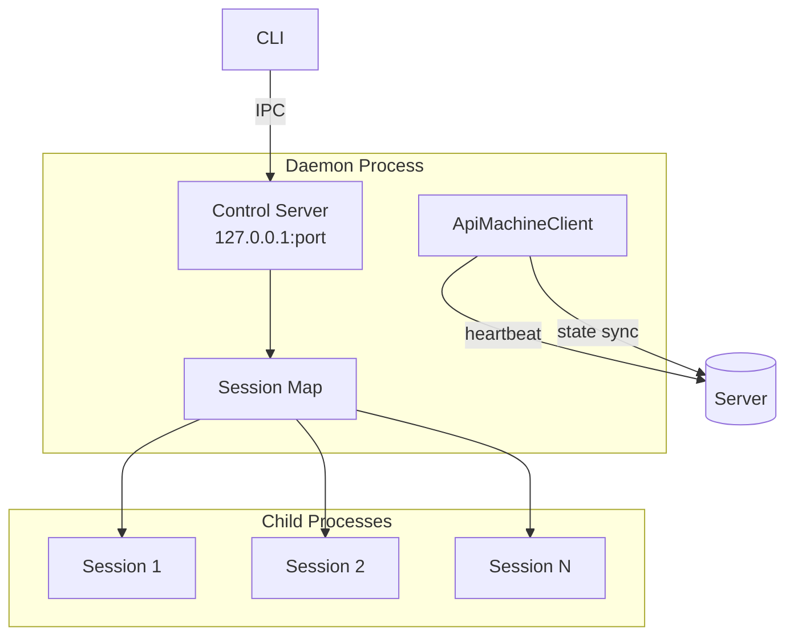
```mermaid
graph TB
    subgraph "Daemon Process"
        Control[Control Server<br/>127.0.0.1:port]
        Sessions[Session Map]
        MachineClient[ApiMachineClient]
    end

    subgraph "Child Processes"
        S1[Session 1]
        S2[Session 2]
        S3[Session N]
    end

    CLI[CLI] --> |IPC| Control
    Control --> Sessions
    Sessions --> S1 & S2 & S3

    MachineClient --> |heartbeat| Server[(Server)]
    MachineClient --> |state sync| Server
```

The daemon is a long-lived process responsible for running sessions in the background and maintaining machine presence.

### Lifecycle

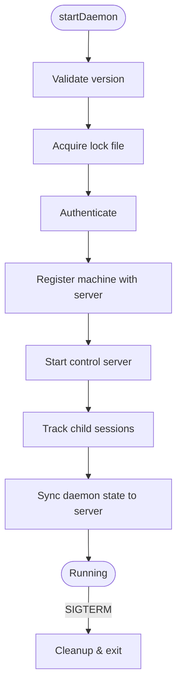
```mermaid
flowchart TD
    Start([startDaemon]) --> Validate[Validate version]
    Validate --> Lock[Acquire lock file]
    Lock --> Auth[Authenticate]
    Auth --> Register[Register machine with server]
    Register --> Control[Start control server]
    Control --> Track[Track child sessions]
    Track --> Sync[Sync daemon state to server]
    Sync --> Running([Running])

    Running --> |SIGTERM| Shutdown[Cleanup & exit]
```

1. `startDaemon()` validates the running version and acquires a lock file.
2. It authenticates and registers the machine with the server.
3. It starts a local **control server** for IPC.
4. It keeps a map of tracked child sessions and updates daemon state on the server.

In current development source, primary CLI runners own Session locks through a lexical scope in
`sessionRunnerLock.ts`. Fresh startup claims the resolved Session id before
constructing its realtime client or committing pending first input; existing
startup claims before attaching. Daemon presence and resume preflight already
read that same lock, so a runner waiting to publish its first webhook prevents
another activation from allocating a terminal host. Startup failure and normal
runner exit release the scope's locks; process-exit cleanup uses the same owner.

In current 0.3 development, descriptor-backed Home transport preparation verifies
the selected Home identity before sending an Account credential or publishing a
runtime origin. Startup readiness uses the existing managed endpoint supervisor:
timeouts, connection failures and 5xx responses remain pending and retry under its
shared backoff policy; identity mismatch and rejected authentication fail closed.
TLS verification remains enabled, and a failed TLS identity request cannot admit
credentials or an origin. Identity requests inherit the fresh feature-request
owner's attempt deadline; authenticated readiness uses that same attempt budget
rather than a shorter phase cutoff. Shutdown cancels startup readiness; transport release
also cancels pending authenticated verification. Live reconnect consumes single
attempts under its existing connection supervisor.

A self-restart successor waits for verified bootstrap before publishing its local
control state. The incumbent confirms that state through authenticated local ping
and resumes after an expired confirmation wait if it can reacquire the lifecycle
lock; it never continues serving without that lock. Cold plugin initialization gets
its existing readiness budget after Home verification, so waiting for Home
reachability does not consume that budget before plugin startup begins.

In current development, `createOnChildExited` releases session-marker evidence only
through the tracked exit lifecycle. An exit notification for an untracked PID does
not authorize marker deletion. Failed terminal-exit staging retains tracking and
marker evidence; visible-console startup awaits that cleanup and reports an
incomplete retirement rather than allowing its rejection to escape.

Development startup recovery uses `daemonProcessScopeIdentity.ts` to keep runners
within their owning Happier home and daemon lifecycle. Markerless recovery,
including PID-placeholder adoption, requires recorded home and lifecycle identity;
older runners without an explicit lifecycle identity require the recorded
active-server identity and a matching server URL. Explicit lifecycle identity
survives endpoint changes. Existing local markers can supply ownership evidence
when process inventory is incomplete, but cannot override recorded foreign-home
or foreign-scope facts. `prepareDaemonSpawnLifecycle` publishes the resolved home
in the protected child environment even without an inherited home override.
Force-stop retains its additional recorded endpoint agreement requirement.

### Model-capacity recovery (development)

`ConnectedServiceTemporaryThrottleRetryScheduler` owns scheduling after a terminal capacity failure.
The Codex adapter reports that terminal failure to host recovery without an extra
immediate retry; native Codex retry-in-progress notifications remain nonterminal.
Consecutive capacity failures wait 5, 10, 20, 40, 80, 160, then 300 seconds before
jitter of ±20%. Provider retry/reset timing is a minimum, not a replacement for
the backoff. The delay is capped, not the number of attempts.

The capacity streak survives continuation handoff. Pending acceptance, a new turn
id, or reconnection is not evidence of model recovery. Only an accepted completed
turn resets the streak. A handed-off continuation has no second retry timer while
its outcome is pending; user cancellation remains authoritative. Authentication,
quota, and non-capacity transport recovery retain their own classifications and
policies.

### Control server (local IPC)

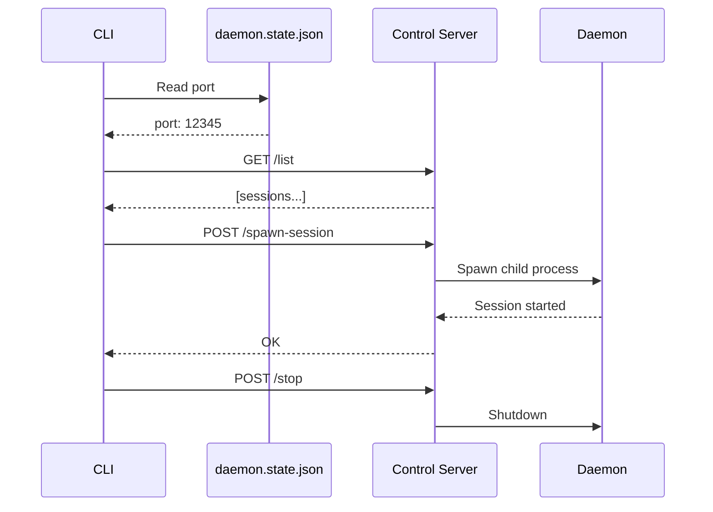
```mermaid
sequenceDiagram
    participant CLI
    participant State as daemon.state.json
    participant Control as Control Server
    participant Daemon

    CLI->>State: Read port
    State-->>CLI: port: 12345

    CLI->>Control: GET /list
    Control-->>CLI: [sessions...]

    CLI->>Control: POST /spawn-session
    Control->>Daemon: Spawn child process
    Daemon-->>Control: Session started
    Control-->>CLI: OK

    CLI->>Control: POST /stop
    Control->>Daemon: Shutdown
```

`startDaemonControlServer()` (`src/daemon/controlServer.ts`) runs an HTTP server on `127.0.0.1` and exposes:
- `/list` (list active sessions)
- `/stop-session`
- `/spawn-session`
- `/stop` (shutdown daemon)
- `/session-started` (session self-report)

The CLI talks to this server via `controlClient.ts`, using a port stored in `daemon.state.json`.

CLI Stop delegates acknowledgement expiry to the relay's existing finite
forwarding deadline rather than imposing the generic machine-RPC timer. Fork
cleanup uses the same Stop contract. Local `/stop-session` requests follow the
daemon operation by default; explicit caller deadlines and cancellation remain
available. A guarded refusal to signal does not authorize an unsafe kill: Stop
rechecks positive runner exit before reporting incomplete termination. Transport
timeout or disconnect never proves physical termination.

### Session spawning

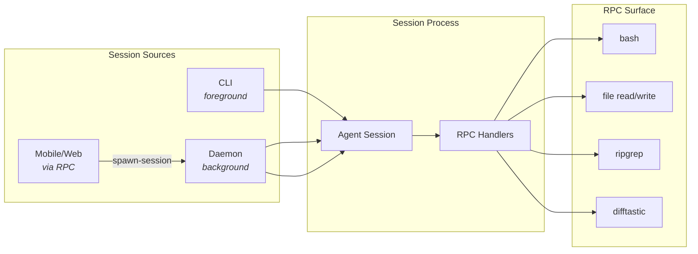
```mermaid
flowchart LR
    subgraph "Session Sources"
        CLI[CLI<br/><i>foreground</i>]
        Daemon[Daemon<br/><i>background</i>]
        Remote[Mobile/Web<br/><i>via RPC</i>]
    end

    subgraph "Session Process"
        Session[Agent Session]
        Handlers[RPC Handlers]
    end

    CLI --> Session
    Daemon --> Session
    Remote --> |spawn-session| Daemon --> Session

    Session --> Handlers

    subgraph "RPC Surface"
        Handlers --> Bash[bash]
        Handlers --> Files[file read/write]
        Handlers --> Search[ripgrep]
        Handlers --> Diff[difftastic]
    end
```

Sessions can be started by:
- The CLI directly (foreground).
- The daemon (background).
- Remote requests over RPC (from mobile/web via machine connection).

Daemon session spawning uses `registerCommonHandlers` to expose a controlled RPC surface (shell commands, file operations, search/diff helpers).

#### Managed session directories (planned 0.3 development behavior)

The approved folderless-session contract is under implementation and awaits
integrated verification. This section describes the intended owner and lifecycle,
not released availability. The public directory intent is documented in
[Protocol](./protocol.md#session-creation-directory-intent-planned-03-development-behavior).

The target daemon will own each managed working directory through
`src/session/creation/managedSessionDirectories.ts`. Its root is
`<activeServerDir>/session-directories/`, where `configuration.activeServerDir`
is `<HAPPIER_HOME_DIR>/servers/<activeServerId>` after normal home/server
resolution. Clients choose `{kind:'managed'}`; they never construct a private path.
POSIX root/allocation permissions are 0700. Windows protection uses the existing
owner + LOCAL SYSTEM ACL boundary in `protectedLocalState`; protection failure
refuses startup.

A new allocation is keyed by the canonical namespaced `sessionCreationTag`, not
the raw creation key. Target preparation only derives its path. Materialization
belongs to the fresh-spawn branch after creation rejoin has found no existing
session. Per-allocation records under `.owners/`, written through
`protectedLocalState`, establish filesystem ownership. The metadata marker and
path are presentation/routing inputs and cannot authorize copy, recreation or
removal. One allocation belongs to one session; a session may retain several
allocations after handoff.

Resume, respawn, queued activation and reattach must prove ownership and retain
the existing directory. A missing or unproven managed folder returns
`SESSION_DIRECTORY_MISSING`, leaves queued input queued and creates nothing.
Only explicit **Continue in a fresh folder** consent, carried by the existing
`approvedNewDirectoryCreation` bit, permits an empty protected replacement while
preserving the session history. This contract does not change missing-folder
behavior for ordinary path sessions.

Same-machine forks receive a fresh allocation seeded from the proven source using
the existing workspace seed materializer. Cross-machine forks receive an empty
allocation and report that files were not copied. Managed handoff allocates on the
live target-prepare path using the handoff operation id, ignores a client-selected
target path, and copies files through the workspace seed export/materialization
step below WorkspaceRef enrollment. It creates no Project or workspace-sync
relationship for those private folders. Source copies are retained; a return
handoff creates a new allocation. Abort removes only that operation's uncommitted
target allocation.

Managed folders survive daemon restart and archive/unarchive. Durable session
deletion stops the tracked process tree before removing every allocation bound to
the session on that machine, after physical containment and symlink checks.
Offline cleanup is pending until the daemon returns. Persistent removal failure
records `pendingRemoval` and returns normally so later Account changes can advance;
startup retries it. Existing deletion replay and complete active/archived inventory
reconciliation cover reconnect and access reset. A partial inventory never proves
absence. Startup resolves unbound creation records through the existing creation-tag
lookup before binding or removal.

These private folders are separate working directories, not OS or tenant
isolation. Agents retain the daemon user's filesystem access, including access to
other managed folders. Claude's existing trust policy and user-scope skill/config
materialization remain unchanged. Project-scoped template seeding is deferred.

#### Initial access travels with fresh creation

The development collaboration transport carries the strict Protocol
`initialAccess` draft from Session authoring through `session.spawn_new` and
`createSpawnedSession`. `primaryTeamId` travels separately as fresh Team context;
neither field belongs to immutable creation correspondence or Session metadata.

The daemon places the access draft in a protected, one-shot local file using the
shared platform protection owner. Only its path travels in the private
`--session-initial-access-file-v1` runner flag. The CLI removes that flag from
Agent arguments and consumes and unlinks the file before Agent startup. The
daemon's launch-resource lifecycle retains failure and child-exit cleanup.
Tracked respawn options and persisted respawn descriptors do not retain access.

The host bootstrap and Replay-seeded HTTP creator send access and Team context as
top-level `POST /v1/sessions` fields. Replay attachment to the resulting Session
omits both fields. The HTTP creators use the shared collaboration feature
decision and preserve an explicit server update-required refusal; generic HTTP
errors are not treated as proof that creation had no effect. Recipient-envelope
construction and atomic grant application remain encryption/server concerns,
not transport-side or post-create sharing operations. This describes the
development transport, not release availability or completed live certification.

An exact initial-access `update_required` refusal uses the existing terminal
startup-failure webhook and spawn-nonce waiter. Protocol validates its operation,
reason, and component as a closed detail; both the immediate spawn response and
nonce recovery preserve it. The Action returns `update_required` with
`retryable: false`, rather than turning this no-effect refusal into a generic
failure or an unknown-outcome timeout. The outer daemon error remains
`SPAWN_VALIDATION_FAILED` for consumers that do not understand the added detail.

#### Direct Team launch material commits the Session first

Normally the runner creates a fresh Session from its creation tag. A fresh daemon
launch is different when its connected services select a Team resource with
direct delivery. The Home gives direct material only to an existing Session
that carries its own accepted Team binding, and the daemon opens launch material
before the runner starts. So the daemon first commits the Session through the
runner's own create-or-load call (`ApiClient.getOrCreateSession`, same creation
tag). That call sends the initial access, primary Team and Team slot bindings, so
the Home writes the accepted binding in the create transaction. From then on the
launch is an attach to that exact Session:

- the pre-spawn materialization subject names the Session as its direct-material
  consumer;
- the runner receives `--existing-session` and the attach file, with
  `replace_with_runtime_identity`;
- the daemon-held create-or-rejoin outcome is carried on the tracked Session.

The creator seeds only the launch intents an attaching runner never takes from
its own process: session mode, configuration overrides and MCP selection. A
launch refused before its runner starts archives a Session this call created.
Creation refusals keep their exact terminal spawn detail, through the same
classification the runner uses.

CLI-originated and workflow spawns that default to a durable Team target send
that target's Session Team slot binding with the create request. The binding is
resolved against the same Home catalog read as the default, and an explicit slot
choice wins.

In the 0.3 development implementation, direct Connected Account snapshots use
the contribution's existing configuration target. Account configuration remains
revision-bound to the credential; supported service configuration is read from
the source Account's Settings and resolves its Saved Secret references through
the canonical materializer. Ordinary configuration admission supplies declared
defaults and rejects missing required configuration before projection. Account
and attempt configuration still reject
Saved Secret references. The recipient receives resolved values, never source
Secret IDs or a recipient-owned credential/configuration copy.

The existing direct `sourceVersion` combines a Home-verifiable source basis with
the source owner's service-configuration revision and canonical materializer
fingerprints. Pool-member versions preserve that private part. Home admission
checks the source basis, while stored material and recipient opening require the
complete published version exactly. If source resolution or replacement
preparation fails, the source reconciler withdraws the captured publication with
`DELETE` on the existing resource `direct-material` route, fenced by source member,
resource revision and published version. It cannot withdraw a newer publication
or another member's material. Audience edits retain prepared material while the
recipient has another direct grant. These are development-source contracts, not
a claim of release availability or completed live certification.

#### Pool resolution stays outside the daemon target

In the 0.3 development Machine Pools flow, the Home resolves
`machines.pools.resolve({ poolId, requestKey })` before session creation. The client
adds the captured Home `serverId` to the returned `machineId`, producing the existing
`SessionExecutionTargetV1 { serverId, machineId }`. From that boundary onward, CLI
and daemon spawning use the same exact-target checks and RPC route as a directly
selected Machine.

The daemon never receives a candidate list, priority policy, or retry instruction.
When the existing Machine-operation compatibility projection positively supports it,
current components may attach `{ kind: 'machine_pool', poolId }` as informational
`placementOrigin`; without that positive support, the caller omits origin before
the first exact spawn. This does not establish support for mixed 0.2/0.3 components:
0.3 is a one-way upgrade of every component. The origin does not participate in
dispatch, so there is no automatic reselection if exact dispatch fails. Reopening a
draft that already has an exact target, or using a source
Session shortcut, preserves that exact target and does not perform a fresh Pool
resolution unless the user explicitly selects a Pool again.

Pool administration and selection use the six generated Account Actions
`machines.pools.list/get/create/update/delete/resolve` against one explicitly
captured Home. Their canonical CLI spelling is compiled from the shared Action CLI
declarations as `happier machines pools <verb>`, so there is no hand-written
`happier pools` command family, no Pool-specific flag parser, and no second
repository or selection policy in the CLI host. The same
`machinePoolAction` family dependency serves the CLI, the daemon, and the MCP
servers through `createAccountServerActionDeps`. A Home that does not positively
advertise `machines.pools` retains ordinary exact-Machine commands and spawn
behavior; missing Pool support is not interpreted as an empty Pool or as
permission to try another Home.

Resolve failures remain before daemon dispatch. `empty`, `no_available_machine`,
and `presence_unavailable` leave the draft and its prior exact target intact so the
caller can refresh, pick a specific Machine, or deliberately select the Pool again.
Once daemon dispatch starts, its result is authoritative: transport ambiguity or an
offline selected Machine does not cause another resolve or another spawn.

Connected Service Pools are credential-source bindings and do not enter this flow.
Current 0.3 source can use a personal Machine Pool as a Team credential resource's
broker location. The source-owning daemons report content-free eligibility for the
currently available candidates, the Home applies the canonical selector once, and
the broker and restricted Runner paths continue with the selected exact Machine.
This remains development-only with loaded-Provider validation open. Capacity-aware
admission, Machine sharing, and Team-owned Pools remain deferred rather than removed.

### Machine state

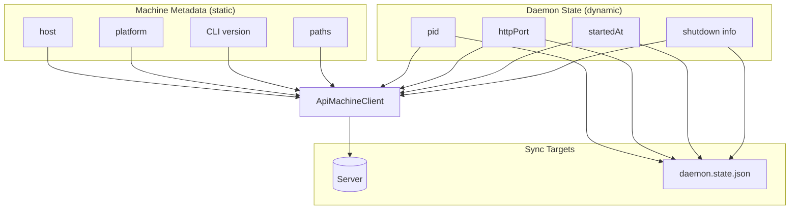
```mermaid
graph TB
    subgraph "Machine Metadata (static)"
        M1[host]
        M2[platform]
        M3[CLI version]
        M4[paths]
    end

    subgraph "Daemon State (dynamic)"
        D1[pid]
        D2[httpPort]
        D3[startedAt]
        D4[shutdown info]
    end

    subgraph "Sync Targets"
        Server[(Server)]
        Local[daemon.state.json]
    end

    ApiMachine[ApiMachineClient]

    M1 & M2 & M3 & M4 --> ApiMachine
    D1 & D2 & D3 & D4 --> ApiMachine
    D1 & D2 & D3 & D4 --> Local

    ApiMachine --> Server
```

- **Machine metadata** is static info (host, platform, CLI version, paths).
- **Daemon state** is dynamic (pid, httpPort, startedAt, shutdown info).

The daemon updates these via `ApiMachineClient` and mirrors local state into `daemon.state.json` for control/diagnostics.

In the 0.3 development implementation, `doctor` reports the CLI entrypoint actually executing through
the canonical runtime identity resolver: source, `dist`, `package-dist`, or a Runner snapshot. It does
not assume that a source process came from `dist`. Its daemon status preserves the control inspector's
`running`, `starting`, and `not-running` results. A starting process or unknown control status is not
reported as stale or dead; Machine RPC readiness remains separately true, false, or unknown.
The former diagnostic environment flags no longer bypass Machine sync or Automation worker startup.

Doctor repair's auth context uses the process's selected Home unless an explicit
`--server` target is supplied; reading a scoped report does not change the terminal's
saved selection. It probes only that Home's API endpoint and renders other stored
credentials as unverified. Successful `auth status --json` includes `serverId`.
The identity-free env-derived-profile adoption path carries the credential's machine,
account and reconnect-cursor maps into an empty named profile. It leaves existing
destination state alone and remains disabled after a Home identity is observed;
it does not repair an already-split installation.

## RPC and tool bridge

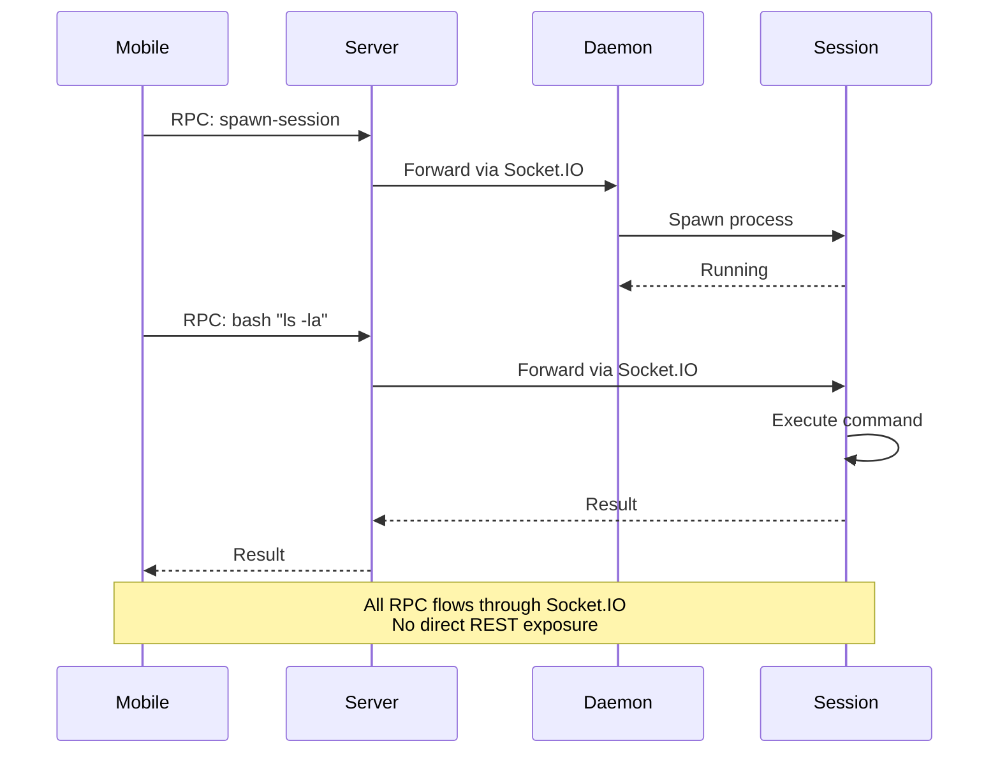
```mermaid
sequenceDiagram
    participant Mobile
    participant Server
    participant Daemon
    participant Session

    Mobile->>Server: RPC: spawn-session
    Server->>Daemon: Forward via Socket.IO
    Daemon->>Session: Spawn process
    Session-->>Daemon: Running

    Mobile->>Server: RPC: bash "ls -la"
    Server->>Session: Forward via Socket.IO
    Session->>Session: Execute command
    Session-->>Server: Result
    Server-->>Mobile: Result

    Note over Mobile,Session: All RPC flows through Socket.IO<br/>No direct REST exposure
```

RPC is used to send commands over the Socket.IO connection:
- Sessions register RPC handlers (e.g., `bash`, file read/write, `ripgrep`, `difftastic`).
- The daemon registers a spawn-session handler so the server/mobile client can ask it to start a local session.

This mechanism allows the server and mobile clients to drive local actions without exposing a broad REST surface.

### Session-log RPC scopes (0.3 development)

Protocol's `rpc/methods.ts` declares method names and `rpc/index.ts` owns Session
authorization and routing. The server consumes that classification for registration
and dispatch; Machine diagnostics do not register Session-only methods.
The canonical peer-route policy keeps `daemon.session.log.tail` server-required
with Account and Machine scope, like the existing ambiguous diagnostic reads.

| Method | Scope | Owner and input |
| --- | --- | --- |
| `session.log.tail` | Session | The bound Session's transcript Action handler; retains its Action input and `readTranscript` authority. |
| `daemon.session.log.tail` | Machine | Daemon diagnostics; `{ path, maxBytes? }` selects an explicit Session log file on that Machine. |

The Machine method retains the existing `.log` requirement and canonical-path
validation under the Happier home's `logs` or `stacks` directory. It returns
`{ success: true, path, tail, truncated }` or `{ success: false, error }`.
`bugreport.getLogTail` remains a separate bug-report operation: it only reads paths
selected by the diagnostics snapshot and uses its existing `{ ok }` response.
The [one-way upgrade basis](compatibility.md#machine-session-log-diagnostics-v03-development)
requires UI, daemon and server to move together; no Machine alias for
`session.log.tail` is registered or routed.

## Runtime-backed Stack and daemon artifacts

The CLI daemon is one component of the named-stack runtime format; it is not a second runtime owner. Source validation and source development use the checkout's workspace outputs; those workspace package outputs are distinct from managed runtime artifacts. A managed runtime build publishes daemon code and, when its inputs require it, an immutable daemon-support artifact for the CLI runtime dependencies, tools, and sidecars. The daemon manifest owns that optional support reference.

In current development source, explicit artifact builds record requested components' preparation and terminal
outcomes through the producer's existing `runtimePublication` state writer. The launcher delegates artifact
admission to that build owner instead of publishing its own workspace closure first. A preparation failure
therefore appears in producer `stack info --json` even before daemon staging. Queued and lock-wait progress
goes to stderr; building an artifact alone does not certify a new selected or loaded runtime snapshot.

Managed server code follows the same boundary. Its generated Prisma/native runtime support is owned by the server component-artifact builder, while static web UI remains a separate selected runtime component. Stack launch supplies the selected UI path through `HAPPIER_SERVER_UI_DIR`; the server artifact does not decide which UI provider to use. Managed support references and snapshots are development/QA inputs only. Release/self-host packaging remains the existing per-target direct boundary that discovers and embeds each target's complete self-contained code/web/support payload; it does not consume or flatten a host-target managed snapshot.

Runtime snapshots are manifests plus managed references to canonical producer artifact payloads. A consumer selects the producer's current valid snapshot and retains only its own mutable state, process lifecycle, and selection pointer; it does not build or copy a payload. Snapshot validation checks component support references, and retention protects support artifacts transitively while a retained snapshot or external consumer selection needs them. Selecting a newer snapshot is non-disruptive: `selectedSnapshotId` can differ from `loadedSnapshotId` until an explicit restart, which is the proof boundary for newly loaded server or daemon bytes.

Generated bundled-plugin projections remain a source-tree publication concern. The projection publisher reads final serialized plugin artifacts and facts, prevalidates the complete small UI/Protocol projection set, stages changed leaves, and commits them through the existing mounted-tree transaction. Known-invalid input is rejected before replacement; a caught commit failure restores the touched tree to last green, and the next canonical preflight repairs an interrupted partial replacement. This is an observable-failure/next-preflight contract, not a generation pointer, journal, or power-loss atomicity guarantee across package-owned source trees.

The finite-task graph uses Turbo only as the outer dependency scheduler and read-only validation cache beneath `hstack-exec`. It is pinned through the current repository package manager; the later pnpm migration translates that ordinary development dependency rather than owning or delaying the task graph. Concurrency is set to 50% of the selected machine's logical processors, so a large development machine can use its capacity without imposing the same fixed process count on smaller CI or remote executors. Compiler-heavy inner schedulers remain separately bounded by their own memory profile.

Canonical build tasks do not pass through or restore from Turbo's cache. The root package-build command delegates its complete package set once to the existing workspace build owner, which already performs dependency-DAG scheduling, bounded concurrency, incremental/currentness checks, per-package locking, and atomic artifact publication. Package scripts remain directly runnable for focused diagnosis. Turbo is reserved for read-only source typechecks, API checks, tests, and projection checks whose exact-input results can be reused safely; CI restores job-scoped Turbo caches and Turbo revalidates the task hash before accepting them.

The repository typecheck reuses those canonical builds as the source-compilation evidence for buildable workspace packages. It then runs the six remaining source-only graphs (Terminal Native, Plugin UI, App, CLI, Server, and the cross-package Tests workspace) with `--noEmit`. Their Turbo hashes include the exact emitted declaration roots they consume, rather than every workspace source tree. This avoids immediately compiling the same package a second time, avoids pulling all first-party Plugin builds into a typecheck, and still invalidates a cached source check when a consumed declaration changes. Plugin SDK and the external SDK retain separate test-project typechecks after their public declaration checks.

The shared TypeScript dist builder excludes test-only roots, including `.test-d.ts` and `.test-d.tsx`, through a build-only configuration extending the package project. It preserves package exclusions and leaves no-emit project selection unchanged. Root typecheck also runs the Protocol and Triage projects with `--noEmit`, in both ordinary and compiler-only modes, because their type tests previously relied on production compilation. Plugin UI's source check and Plugin SDK's test-project check continue to enforce their type tests.

Generated-contract validation and mutable compiler-input preparation are separate finite facts. For example, the Plugin SDK Action-map and external SDK Action-wrapper checks are cacheable exact-input tasks, while synchronizing the physical declaration graph consumed by the Plugin SDK remains non-cacheable. This prevents an expensive semantic generator check from being repeated merely because declaration bytes must be refreshed through their canonical owner.

Incrementality is deliberately owned at the layer that can validate it. Canonical package builds retain compiler worktrees, build-info state, currentness fingerprints, and last-green `dist` outputs behind the workspace build owner. UI and Plugin UI source checks use their TypeScript build-info files; the remaining cold source/API programs use Turbo's exact-result cache rather than a long-lived compiler daemon. Plugin projection persists canonical serialized per-Plugin artifacts and reruns only affected Plugin checks before the aggregate comparison. A cache miss may therefore still construct a large TypeScript graph, but an unchanged candidate does not need to repeat it in the next local or CI invocation.

First-party plugin packages are discovered through the workspace glob and canonical bundled-plugin membership owner rather than an enumerated Turbo list. The canonical first-party template supplies the finite build/projection scripts, so a newly scaffolded package joins the same graph after the normal membership projection. First-party plugin build and projection remain separate tasks: the build always passes through the package owner, the read-only targeted projection check may be cached, and one non-cacheable aggregate check consumes the serialized artifacts. The workspace-derived Plugin test/typecheck runner uses a bounded two-package queue and still attempts every discovered package before reporting failures. The public `happier plugins dev` command does not depend on Turbo: it registers the trusted source with the daemon and renders daemon-owned status. The daemon owns author-source watching, candidate preparation, reload, and diagnostics in standalone plugin repositories.

Live CLI dependency preparation also isolates Plugin build failures without serializing every healthy Plugin behind them: shared non-Plugin prerequisites build first, then up to two independent Plugin packages build concurrently through the same canonical workspace owner. Artifact publication keeps its fail-closed all-included-Plugins contract and delegates the complete Plugin set to that owner's own dependency-aware scheduler.

Broad unit, integration, database, and runtime suites are not automatically parallelized by the finite graph. Many launch their own Vitest workers or share databases, ports, Stack processes, simulators, or Docker resources. They stay with their existing owner until a focused pilot proves isolation and measures end-to-end benefit; adding another outer fan-out on top of their internal concurrency would otherwise trade a visible serial command for less predictable process and memory contention.

The source stack may start from a valid last-green runtime while changed source outputs refresh in the background. For the checkout-derived repository producer, `dev.mjs` schedules successful server/daemon reloads through the canonical runtime publisher, with one publication in flight plus one trailing identity recomputation; a full restart reconciles web, server, and daemon identities. Publication failure keeps the current snapshot selected and source services unchanged, and status is written through existing runtime state without restarting consumers. The detached Stack owner in `apps/stack/scripts/stack/run_script_with_stack_env.mjs` owns services and logs; the TUI attaches, displays the same state, and sends explicit controls. An unexpected TUI exit detaches from a healthy owner, while explicit quit/restart/stop retains the command's lifecycle semantics.

## Implementation references
- CLI entry: `apps/cli/src/index.ts`
- Daemon: `apps/cli/src/daemon`
- Control server/client: `apps/cli/src/daemon/controlServer.ts`, `apps/cli/src/daemon/controlClient.ts`
- API clients: `apps/cli/src/api`
- Persistence: `apps/cli/src/persistence.ts`
- Config: `apps/cli/src/configuration.ts`
