# CLI Architecture

This document describes the Happier CLI (`apps/cli`) and its daemon. The CLI is both an interactive tool and a background session manager that keeps machine state in sync with the server.

## System overview

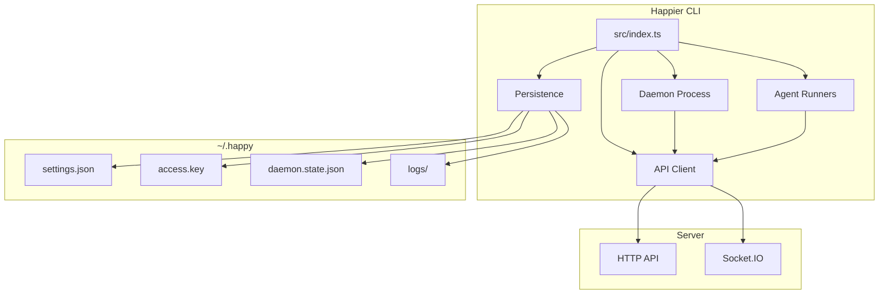
```mermaid
graph TB
    subgraph "Happier CLI"
        Entry[src/index.ts]
        API[API Client]
        Daemon[Daemon Process]
        Agents[Agent Runners]
        Persist[Persistence]
    end

    subgraph "~/.happy"
        Settings[settings.json]
        AccessKey[access.key]
        DaemonState[daemon.state.json]
        Logs[logs/]
    end

    subgraph Server
        HTTP[HTTP API]
        Socket[Socket.IO]
    end

    Entry --> API
    Entry --> Daemon
    Entry --> Agents
    Entry --> Persist

    Persist --> Settings & AccessKey & DaemonState & Logs

    API --> HTTP & Socket
    Daemon --> API
    Agents --> API
```

## High-level layout
- **Entry point:** `src/index.ts` parses subcommands and routes execution.
- **API client:** `src/api` handles HTTP + Socket.IO, encryption, and RPC.
- **Daemon:** `src/daemon` runs in the background, spawns sessions, and maintains machine state.
- **Persistence/config:** `src/persistence.ts` + `src/configuration.ts` manage local state in `~/.happy`.
- **Agents:** `src/claude`, `src/codex`, `src/gemini` provide provider-specific runners.

## Streamed transcript recovery (development)

`api/session/streamedTranscriptWriter` owns segment text, identity, and durable
settlement. Closing a segment freezes its completion or interruption intent and
separates it from subsequent output. A rejected terminal write retains the full
snapshot for the next flush with the same local id; unresolved delivery is recorded
in the default file log. This retention is process-local, and does not promise
automatic reconnect replay or recovery after process exit.

`createKeyedStreamedTranscriptBridge` keeps writers with active, in-flight, or failed
segments and releases only drained writers. Codex tool boundaries wait for admission
into the existing session commit queue, while acknowledgement settles in the writer;
turn-end flushes await settlement and return the durable delivery summaries.

## CLI entry flow

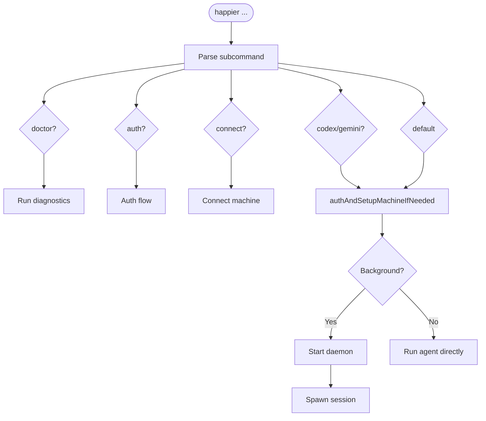
```mermaid
flowchart TD
    Start([happier ...]) --> Parse[Parse subcommand]

    Parse --> Doctor{doctor?}
    Parse --> Auth{auth?}
    Parse --> Connect{connect?}
    Parse --> Agent{codex/gemini?}
    Parse --> Default{default}

    Doctor --> RunDoctor[Run diagnostics]
    Auth --> RunAuth[Auth flow]
    Connect --> RunConnect[Connect machine]

    Agent --> Setup[authAndSetupMachineIfNeeded]
    Default --> Setup

    Setup --> Context{Background?}
    Context --> |Yes| StartDaemon[Start daemon]
    Context --> |No| RunAgent[Run agent directly]

    StartDaemon --> SpawnSession[Spawn session]
```

`src/index.ts` is the CLI router. It:
- Parses subcommands (`doctor`, `auth`, `connect`, `codex`, `gemini`, and default run flows).
- Ensures auth and machine setup when needed (`authAndSetupMachineIfNeeded`).
- Starts the daemon or runs an agent directly based on subcommand/context.

## Desktop-driven setup

The desktop app never asks the user to open a terminal to connect the computer it is running on.

In current development source, the desktop shell registers each release channel's custom URL
scheme (`happier`, `happier-preview`, or `happier-dev`) through Tauri's deep-link plugin.
The existing single-instance plugin forwards running-app links on Windows and Linux; macOS
receives Opened events. The main-window presentation owner handles revealing or recreating the
window. `installDesktopDeepLinks` subscribes before reading the plugin's startup URL snapshot
and delegates URL interpretation to the existing system-path and terminal-connect owners.
Terminal links reach `/terminal/connect` with pairing material in the fragment, where the
terminal URL reader accepts the bundled webview's `tauri://localhost` route carrier while
server addresses remain HTTP(S)-only. Router-provided fragments are resolved against the canonical
terminal route even when browser history still shows the previous page. Existing confirmation,
sign-in recovery, and URL clearing apply. This adds no automatic pairing approval. Channel-specific schemes allow installed channels
to coexist; the CLI's default
`happier://` link targets stable. Registration and cold/running/tray-only launches require live
OS validation; macOS registration must be checked in the installed application bundle.

It drives the same CLI subcommands the human flow uses, through the bundled `hsetup` sidecar
(`apps/bootstrap`), which the Tauri shell launches (`apps/ui/src-tauri/src/system_tasks/`). `hsetup`
is bundled inside the desktop app, not a separately released component.

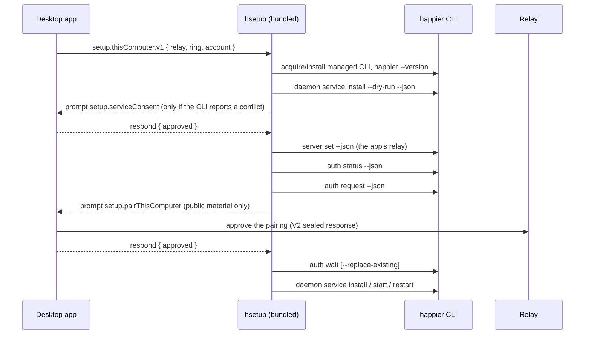
```mermaid
sequenceDiagram
    participant App as Desktop app
    participant Hsetup as hsetup (bundled)
    participant CLI as happier CLI
    participant Relay

    App->>Hsetup: setup.thisComputer.v1 { relay, ring, account }
    Hsetup->>CLI: acquire/install managed CLI, happier --version
    Hsetup->>CLI: daemon service install --dry-run --json
    Hsetup-->>App: prompt setup.serviceConsent (only if the CLI reports a conflict)
    App-->>Hsetup: respond { approved }
    Hsetup->>CLI: server set --json (the app's relay)
    Hsetup->>CLI: auth status --json
    Hsetup->>CLI: auth request --json
    Hsetup-->>App: prompt setup.pairThisComputer (public material only)
    App->>Relay: approve the pairing (V2 sealed response)
    App-->>Hsetup: respond { approved }
    Hsetup->>CLI: auth wait [--replace-existing]
    Hsetup->>CLI: daemon service install / start / restart
```

### The interactive-kind seam

`hsetup` has two dispatch paths and a kind belongs to exactly one of them:

- **Interactive kinds** (`createDefaultInteractiveKinds()`, `apps/bootstrap/src/bin/hsetup.ts`) run
  under `createSystemTasksRunner` and can call `ctx.prompt()`, streaming a `prompt` event and
  suspending until the app answers over stdin. `setup.thisComputer.v1` is one.
- **Registry kinds** (`createHsetupSystemTaskRegistry()`, `systemTasks/registry.ts`) run to
  completion without reading stdin; a kind that prompts from there fails `prompt_required`.

`remote.ssh.bootstrapMachine.v1` is deliberately reachable from both maps — the same kind with the
same dependency defaults, exposed interactively for streamed prompts and through the registry for
callers that supply prompt resolutions up front. No other kind appears in both.

In current development source, CLI and desktop SSH bootstrap share the command builder and
JSON-result normalization in `packages/cli-common/src/systemTasks`. Only `auth.status` may
admit exit 1 with a version-1 `auth_status` envelope whose error is `not_authenticated`;
that result continues through server selection and pairing. Transport failures, malformed
auth envelopes, and other auth errors fail closed. Released daemon/service commands may
still return raw JSON objects rather than CLI envelopes.

Registry handlers can emit live callback progress through their execution context while awaiting
work; these callbacks use the same event validation, redaction, task identity, and timestamps as
yielded events. In current development source, desktop status inspection and explicit setup share
the acquisition producers and the `cli.acquisition.progress` payload owned by
`packages/protocol/src/systemTasks/acquisitionProgress.ts`. See
[Desktop-initiated CLI acquisition](binary-runtime.md#desktop-initiated-cli-acquisition) for its
progress, retry, and cancellation boundaries.

The prompt payloads are one wire contract, not a per-side transcription:
`packages/protocol/src/systemTasks/setupThisComputerTaskContract.ts` owns the shapes, the builders
the executor constructs with, and the parsers the app reads with. Prompt event data is redacted by
the runner (`SENSITIVE_PROMPT_DATA_KEY_PATTERNS`), so the pairing prompt carries public material
only: the terminal public key, the relay URL, the comparable key the CLI is actually configured
for, the account the run is pairing this computer to, the CLI's pairing requirement, and how
`hsetup` resolved that CLI. The runner redacts by *key name*, and `relayUrl` is not one of those
names, so the builder strips any `user:pass@` userinfo before the prompt becomes an event —
identity is unaffected because the comparable key ignores userinfo on both sides.

In current development source, explicit Connect, Repair and command-line changes share the
shell's `desktopSetupCoordinator` operation. It retains the exact task, target and prompt responder
in memory while Home, Settings and popovers subscribe or reopen; navigation releases presentation,
not the responder. The Home lifecycle adopts that same run and proves readiness through a fresh
runtime inspection and machine capability RPC after success. Nothing resumes across app restarts.

In current 0.2 development source, Update all retains its supplied plan, progress and Stop intent
beside the existing `machineUpdateRuns` action owner, scoped to the initiating server/account.
Closing Updates releases its detail subscriptions, not the batch; reopening adopts the same work.
The queued local CLI action captures its initiating task and completion scope before other items
run. Detail discovery remains lazy, and no batch resumes across app restarts.

### Managed-CLI install ownership: silent vs attended approval

Approving a pairing hands the requesting CLI the account content key, so the app decides **how** to
approve from install ownership. `apps/bootstrap/src/systemTasks/localFirstPartyCommand.ts` reports
provenance `managed` when this machine's managed install layout claims the binary: the
`current.version` marker that `installVersionedPayload` writes under `~/.happier`, plus the payload
it names under `versions/<versionId>`. Everything else is `override` — an explicit env override
(`HAPPIER_BOOTSTRAP_CLI_PATH`, `HAPPIER_BOOTSTRAP_HAPPIER_PATH`), a repo-local checkout, or a binary
that merely exists at `<installRoot>/current` with no install behind it.

**`managed` is an ownership record, not verified publisher provenance.** The marker is a plain text
file in the user's own home; any process running as the user can write it and the binary beside it.
Release verification (minisign-checked checksums in
`prepareFirstPartyComponentPayloadFromGitHubRelease`) happens at download time and is not re-proved
on resolve. So the fact `managed` establishes is "this app's install path put it there", not "this
binary is official Happier".

That fact is still the right one to act on, because it selects the approval mode rather than
asserting authenticity:

- **`managed`** — `approveSetupPairingForTarget.ts` approves silently, so ordinary first-run
  onboarding is zero-interaction.
- **`override`** — the app asks the person at the keyboard once, naming the resolved binary
  (`apps/ui/sources/setup/presentUnmanagedCliConsent.ts`). Accepting approves; declining refuses
  with `cli_not_approved` and setup is deferred rather than retried. A surface with nobody to ask
  refuses with `cli_not_managed`.

The invariant this preserves is deliberately narrow: **the app must not release the account content
key UNATTENDED to a CLI its own install path did not place.** The identical key is already released,
attended, to any CLI the user pairs by QR code (`useConnectTerminal`), so a hard refusal for
developers and forks running a CLI they built themselves would buy no security — only a dead end.

Approval is also bound to the account: the executor states the `expectedAccountId` it was started
with on the prompt, and the app refuses (`account_mismatch`) when that is absent or is not the
account the app started this run for — the sealed response carries that account's content key. The
credentials read for the target must also name that original account in their token: a later
sign-in on the same profile cannot approve a retained run with another account's key. A mismatch
is refused before sealing or any relay request; an unreadable token is `credentials_unusable`. The
prompt's account, relay, CLI identity and pairing-requirement checks are **hard** refusals and are all
settled before install ownership is considered, so none of them can be talked past by a dialog.

Later same-user filesystem tampering with an already-installed managed CLI is **explicitly outside
the threat model**: there is no runtime attestation, per-launch hashing, or signed receipt, because
a process running as the user could defeat any of them. `happierCli.ts` additionally enforces one version floor
(`SETUP_CLI_VERSION_FLOOR`) so setup drives a CLI whose command contract it knows; below the floor
an installed managed CLI uses the recoverable update transaction in current development source,
and an override CLI fails immediately. The prepared target must satisfy the floor before activation.

### One default channel per Happier home

A Happier home has one default `happier` command and one default-following background service, and
both belong to the **default release channel** (`default-cli-release-channel.json`; the service runs
that channel's `~/.happier/bin/happier` shim). Two rules keep a second channel from fighting it:

- **Installing another channel never takes the default.** `installVersionedPayload` keeps the
  recorded default channel (marker and `happier` shim) whenever that channel's managed CLI is
  installed; the installed channel only gets its own shim (`hprev`, `hdev`). It becomes the default
  on a first install into an empty home, or when the user chose it explicitly — the official
  installers' `self __install-payload --channel` passes `selectAsDefaultReleaseChannel`. So a desktop
  app, a `self update` or any other acquisition of a second channel never changes which CLI the
  user's terminal and the service run.
- **An app of another channel adopts the default channel's CLI.** hsetup resolves the CLI through
  `resolveLocalHappierCliReleaseRing` (`apps/bootstrap/src/systemTasks/happierCli.ts`): while the
  default channel's managed CLI is installed, a preview app on a stable home drives status, relay,
  pairing and service commands through the stable CLI. Every ownership and version check therefore
  compares the running daemon with the CLI its service actually runs, and the install dry-run never
  proposes replacing the default channel's service. With no managed CLI of the default channel, the
  app's own channel is acquired (and, being the first install, becomes the default). An env override
  (`HAPPIER_BOOTSTRAP_CLI_PATH`) still wins over both.

`daemon.service.status.v1` reports the answering CLI's update state as `cli.update`
(`{ currentVersion, latestVersion, updateAvailable, managed }` plus the K5 facts below, from
`happier daemon status --json` → `cliUpdate` — never a network read on that path; a stale cache is
refreshed by the existing detached `self check`). A `start` issued while the service's own daemon
still runs another CLI version is promoted to `restart` on every platform (`systemctl start` on an
active unit is a no-op).

### One daemon per relay on one machine

A Happier home can run one daemon per relay profile at the same time (`happier daemon status --all`
lists them), so this computer can serve sessions from several relays at once. A daemon's lifecycle
scope is its lifecycle directory — `servers/<HAPPIER_DAEMON_LIFECYCLE_SCOPE_ID or active server id>/`,
holding its `daemon.state.json` and `daemon.state.json.lock` — and only that scope is its to manage:

- **Start-up orphan reap** (`reapCurrentLifecycleDaemonOrphansBeforeStart`, `src/daemon/multiDaemon.ts`)
  stops only live daemons that published state in the starting daemon's own lifecycle directory and
  are not its preserved owner. In practice that is a pre-canonical CLI whose ring-scoped
  `daemon.<ring>.state.json` and lock sit beside the canonical ones, which the canonical lock cannot
  exclude. A daemon without a control token is reported, never stopped. Other relays' daemons live in
  other lifecycle directories and are never touched.
- **Service install conflicts** (`src/daemon/service/daemonInstallConflict.ts`): a pinned target
  competes with a service of the same instance id, and on its own ring with a service serving the
  same relay (same profile id or same `createServerUrlComparableKey`) or whose relay is unknown. The
  default-following service serves the persisted active profile, so a pinned service for another
  relay coexists with it; one for that same relay still competes. Pinned services for different
  relays coexist.
- **A service per relay is pinned.** `daemon service install` without `--instance`/`--ring` installs
  the single default-following service (an explicit `--server` only scopes that invocation); a relay
  gets its own service with `--server <id> … --instance <id>`, or through desktop setup's `pinned`
  placement (`HAPPIER_DAEMON_SERVICE_TARGET_MODE=pinned`). For a terminal install, use
  `happier --server <profile-id> service install --instance <service-id> --autostart on-demand --json`.
  `--server` is a root prefix flag and selects the relay; `--instance` names the service and does
  not select a profile. The service id may differ from the profile id. Address later service
  status/start/stop/restart commands with the same prefix and instance. If the caller inherits a
  `HAPPIER_DAEMON_LIFECYCLE_SCOPE_ID` for another relay, clear it first: the root profile selector
  updates endpoint/profile selectors but not the inherited lifecycle scope. `daemon status --all`
  (`listDaemonStatusesForAllKnownServers`) reports for each relay the service that serves it: its
  pinned service, else — for the persisted selection only — the default-following one.
- **Background-service repair** (`buildBackgroundServiceRepairPlan`, used by `service repair`,
  `doctor repair`, the guided repair `self update` offers and the 0.2.3 migration) removes a pinned
  service only when it serves the current relay (the legacy per-server unit, or a duplicate under
  another profile id), through the same `daemonServiceRelaysMayMatch` rule. A pinned service for
  another relay is never repaired away. Every service a repair removes is listed before consent and
  before `--yes` applies (`renderPlannedServiceRemovals`). Before removing a definition, the repair
  executor captures its autostart mode, desktop-management marker and bundle attribution through
  the installer's `readDaemonServicePreservedInstallOptions`. The plan identifies the replaced
  default (or the migrated current-relay pin when no default exists); its captured settings flow
  into reinstall. Rollback restores each removed service with its own settings. In-place rewrites
  use the same installer-owned preservation logic.
- **Selecting a relay that has its own pinned service** (`server use` / `server set`, through
  `runServerSelectionBackgroundServiceFollowUp`): that relay is already served, so the
  default-following service is not restarted (it would only leave the previous relay) and says
  so; it goes idle for that relay at its next restart. `--json` reports the same outcome as
  `data.backgroundService` (`resolveServerSelectionBackgroundServiceOutcome`).
- `daemon stop` stops the current scope only; `daemon stop --all` and `auth logout --all` deliberately
  stop every relay's daemon.

### Confirmed daemon stop outcomes (development)

Current 0.2 development source reports `not_running` separately from a confirmed `stopped`
result. `controlClient.stopDaemon` owns single-daemon stop confirmation: startup-only lock
holders remain alive and return `daemon_stop_incomplete`; stale live owners whose process
identity cannot be read also remain incomplete, while startup/health diagnostics retain their
stale-ignore policy. Graceful stop waits for process exit, and forced stop requires daemon process classification and confirmed death after the
existing TERM/KILL waits. The shared process signal probe treats access denial and unknown
probe failures as inconclusive, preserving live ownership. For a PID hidden by a namespace,
the existing authenticated control probe establishes publication presence. Its transport failures
remain unverified. After observing a hidden owner through authenticated ping or an accepted
authenticated stop, confirmed stop requires the matching lifecycle lock to release after control ceases, because control closes before final cleanup; without an
observed lock confirmation remains incomplete. Ordinary dead publications remain absent. Status
projections and service-update readers share the same presence owner; full daemon health inspection
also validates process identity. An unverified publication remains explicit in status output and
blocks service-update planning until authenticated presence can be observed. Initial startup-only
locks outside an observable PID namespace,
with no authenticated publication, cannot establish that namespace relationship.

`multiDaemon.stopAllDaemonsBestEffort` attempts every durable publication under the home's
servers directory, including removed profiles, all release-ring filenames, and startup-only
locks. It attempts siblings after a failed target and returns a confirmed stopped count or
`not_running`. It re-enumerates the same inventory after shutdown to detect a live successor
publication or startup-only lock before `auth logout --all` can delete the home.
After an observed hidden owner stops, namespace uncertainty remains scoped to its exact
publication and lock path; unrelated stale release-ring siblings retain ordinary absence. State and lock
cleanup remain owned by the daemon lifecycle holder; these observers do not delete publications.
Stop commands and authentication report the returned outcome, and logout-all preserves the
home on incomplete stop. Restart remains best effort for its stop phase, logs incomplete stop
through the default file logger, and requires its existing distinct running identity proof.

### One CLI update transaction (plan R13 f)

`runManagedCliUpdate` (`packages/cli-common/src/firstPartyRuntime/runManagedCliUpdate.ts`) is the
only way a managed first-party CLI is updated in place. `happier self update`, the desktop's
bootstrap `cli.update.v1` and the daemon-hosted remote `cli.update.v1` all run it, always from the
version being replaced. Current development source also uses it for desktop setup's replacement
of an installed managed CLI below the setup floor; the bootstrap adapter rejects a below-floor
target before activation and shares the explicit update's service observation/restart planner:

1. **Admission.** The transaction first takes both locks described in step 4 — before it downloads
   anything — so a concurrent update is refused at once and never downloads, and a caller learns
   the attempt was admitted (`onAdmitted`) before it waits for the download. One update per Happier
   home runs at a time; its download is the only one.
2. **One target version.** The ring's newest release (or `--to <exact version>`, tag
   `cli-v<version>`) is resolved once by the acquisition owner
   (`prepareFirstPartyComponentPayloadFromGitHubRelease`, every OS including Windows) and downloaded
   with its minisign-verified checksums; every later step is bound to that version.
3. **Smoke.** The staged executable's `--version` must equal the target, or nothing is activated
   (`cli_update_smoke_failed`).
4. **Capture, then activate without pruning,** under two locks
   (`withFirstPartyPayloadMutationLock.ts`): the install root's (`<installRoot>.mutation.lock`) and
   the home-wide activation lock (`<home>/first-party-activation.lock`), because launchers
   (`<home>/bin`) and the default-channel record are shared by every channel.
   `installVersionedPayload` takes both for any component with launchers or the default-channel
   record. A busy lock fails at once (`FIRST_PARTY_PAYLOAD_MUTATION_IN_PROGRESS`); a lock whose
   holder process died is reclaimed under `<lock>.reclaim`, so two reclaimers can never both remove
   it, and a holder only ever removes its own lock (token). A lock release that fails after the
   outcome is settled never changes it: it is reported as a diagnostic (`onWarning`, stderr by
   default), and the lock left behind names a pid that the next holder reclaims once it has exited.
   The capture
   (`restoreInstalledPayloadState.ts`) records the `current`/`previous` markers (which name the
   pointer targets) and the default-channel record, and moves every launcher the activation will
   rewrite into this transaction's own `<home>/bin/.update-rollback/<id>/` (renaming works on a
   running Windows `.exe` where deleting it does not). If moving one fails, the ones already moved
   are put back first. Nothing removes another transaction's set-aside entries.
5. **Restart and prove** every service daemon that ran before the update — this home's and ring's
   default-following service and each pinned service (one daemon per relay) — through the CLI
   service owner (`daemon service restart` run by the activated binary, addressed to that service —
   its ownership wait is the budget); then each must report the target version. Every daemon is
   attempted before a failure is reported by service label. Only the services the update owns —
   the default-following one and pinned services the desktop manages (`managedBy: desktop`) —
   decide success: their failure rolls back. A user-owned pinned service is restarted too, but a
   failure there is named (stderr for the CLI, a `cli.update.restartServices` progress event for
   the desktop) and the update is kept. `last-update.json` says `pendingReconnect` meanwhile.
6. **Commit** (drop this transaction's set-aside launchers, prune to current + previous) **or
   recover:** restore everything captured, restart the previous binary and prove it, and only then
   report. Rollback happens only when activation or that local proof failed — never because the
   relay is unreachable: a machine that is offline after a good local restart has updated.
   `rolledBack` means the previous daemon is back and proven (or none was running); a restore that
   failed, or a restored version whose service did not come back, is `failed` and says which.
7. **Record every end** in `<installRoot>/last-update.json` (`CliUpdateLastResultSchema`) through
   its one writer — failures before activation included (release, download, verification, unpack,
   smoke; `targetVersion` is `null` only when no release could be resolved). A refusal because
   another update holds the lock records nothing: the record belongs to the attempt in progress. A
   record that cannot be written never blocks recovery; it is reported on stderr (the updater's log
   for a remote update).

**What recovery covers — and what it does not.** Recovery covers activation and restart failures
this process catches. It does **not** cover the updater itself being killed or the machine losing
power mid-transaction (a set-aside directory may then be the only copy of a launcher, which is why
nothing deletes other transactions' entries), it proves the previous binary's compatibility with
state a failing new daemon wrote only for the supported predecessor transition below, and it does
not supervise the service manager beyond the one restart it performs (systemd/launchd/Task
Scheduler restart policy is theirs).

Which daemons come back is one rule, `planServiceDaemonsRestartAfterCliUpdate`
(`packages/cli-common/src/firstPartyRuntime/serviceDaemonsToRestartAfterCliUpdate.ts`): the
default-following service and every pinned service of this home and ring whose own service ran its
daemon before the update — never a manual daemon or another ring's service. Only the observation
differs per caller: the CLI (`planServiceDaemonsRestartAfterUpdate`, used by `self update` and, on
Windows, `self __install-payload`) reads the installed definitions and each service's lifecycle
directory in-process; bootstrap reads `daemon status --json` through `createSelectedCliInvocation`
(inherited relay selectors cleared) plus each pinned service's status from `daemon service list
--json`.

**Windows.** The two local paths differ. `happier self update` stops the payload's processes before
activation (`quiesceInstalledCliWindowsPayloadOwners`: `service stop`, `daemon stop --all
--kill-sessions`, `taskkill /T` — **running sessions are ended**, on every relay), as the installer
does; each service daemon observed before that stop is restarted afterwards (above), a manual
daemon is not. The
desktop's `cli.update.v1` does not pass that step: it relies on the launcher move-aside and does
not end sessions, but it is unverified on a real Windows host. Remote update is disabled on Windows
(below).

**Rolling back across a migration.** The previous version must read whatever the new one wrote
before it failed. CLI self-update callers are ≥ 0.2.13; current desktop hsetup can also replace
an installed 0.2.12 CLI to satisfy its 0.2.13 setup floor. The persisted
formats a new daemon may migrate at start are forward-tolerant within 0.2 (settings
`SUPPORTED_SCHEMA_VERSION` 6 is unchanged since 0.2.12 and a newer schema only logs a warning). No
0.2 release forbids rollback; the first release whose migration an older reader cannot read must add
a rollback floor to this transaction before it ships.

**K5 — per-machine update facts.** `readCliUpdateFacts` (`apps/cli/src/cli/runtime/update/cliUpdateFacts.ts`,
schema `CliUpdateFactsSchema` in `@happier-dev/protocol`) reports `currentVersion`, the ring-filtered
cached `latestVersion`, `channel`, `installSource` (`managed` only when the running executable is
inside its ring's recorded install; npm/brew name their own update command), `updateCommand`,
`canUpdateRemotely` and `lastUpdate`. Every daemon publishes it in its encrypted machine metadata
as `cliUpdate` on its first connect after start and again whenever `last-update.json` changes
(the daemon watches its install root — no poller; `watchLastCliUpdateResult`), and
`daemon status --json` extends `cliUpdate` with it. The update-check cache has one writer (`self check`, `recordCliUpdateCheck`) and one
ring-filtered reader (`readCachedCliUpdateState`, `packages/cli-common/src/update`) used by the
notice, the status, doctor repair and K5; doctor never writes it or calls npm itself.

**Remote.** The daemon's `tool.systemTasks` capability lists `cli.update.v1` only when
`canUpdateRemotely` (presence = capability; older daemons never list it). The kind starts
`self update` detached from the daemon's own binary (output to `logs/cli-update-<ms>.log`) and
answers `{ started: true, currentVersion, channel, logPath }` only once the updater reported on
its admission pipe (`updaterAdmission.ts`: fd 3, one JSON line, then closed — stdout/stderr stay on
the log) that it holds the locks; an updater refused admission (`cli_update_in_progress`, whose
outcome another attempt owns) or ending before it reports (`cli_update_start_failed`, naming the log)
fails the task instead, so a refused attempt is never shown as started. The updater outlives the
service restart because systemd uses `KillMode=process` and launchd `AbandonProcessGroup`. The
outcome is observed when the machine reconnects: its metadata carries the new (or restored)
version and `lastUpdate`; an attempt that ended without a restart (e.g. the download failed) is
republished by the still-running daemon when the updater records it. npm/Homebrew installs are refused with their exact update command
(`cli_not_managed`). Windows reports `canUpdateRemotely: false`: its update stops the payload's
processes with `taskkill /T`, which would end the updater (a descendant of the daemon), and Task
Scheduler's treatment of a detached descendant across `/End` is unverified.

Current development UI preserves an explicit failed outcome even when its target version is the
version answering now; version equality can settle a pending reconnect, but does not prove service
recovery. The Updates row's session-restart note follows the item's machine identity, including
this computer.

### App → CLI, with no ambient fallback

The relay direction is one-way at setup: the **app** tells the CLI which relay to use. The
executor requires an explicit `activeRelayUrl`, `activeWebappUrl`, `expectedAccountId` and
release ring, and fails `invalid_params` before running anything when one is missing. The app's
own server profile id is deliberately *not* part of the spec: the CLI keeps its own profile store,
and the pairing prompt carries the comparable key of the relay the CLI actually configured rather
than an echo of an app-side id. It never reads the CLI's currently configured relay as a fallback — that fallback is
what let setup silently configure the wrong relay. The two stores stay separate on purpose: the
app persists its own server profiles and the CLI persists its own; pairing is the bridge, and
`server set` is the only direction that crosses.

Every command a setup run issues goes through one relay context built once from the target
(`createSetupCliScope`, `apps/bootstrap/src/systemTasks/localDaemonCli.ts`, plan R13 a). Both of its
invocations clear every server selector the app process inherited (`HAPPIER_SERVER_URL`,
`HAPPIER_WEBAPP_URL`, `HAPPIER_LOCAL_SERVER_URL`, `HAPPIER_PUBLIC_SERVER_URL`,
`HAPPIER_ACTIVE_SERVER_ID`, `HAPPIER_DAEMON_LIFECYCLE_SCOPE_ID` — a stack/dev launch exports them,
and the CLI prefers an env-selected profile over a URL it does not match), so a launch pinned to one
relay can never preview another and then write to its own. `target` adds the selected relay through
the CLI's env server selection for the reads made before the run may select it; `selected` answers
for this home's persisted selection — before `server set` the relay the default-following service
serves (the lifecycle observation), from `server set` on the target (pairing, service
install/start). One context rule covers reads and writes: every other command bootstrap issues
about this computer — the app's status read `daemon.service.status.v1`, service
start/stop/autostart, `cli.update.v1`'s restart and verification — runs with the same cleared
selectors (`createSelectedCliInvocation`, the default for any invocation without an explicit
environment), so the app proves ready exactly the relay setup wrote even under a stack pin. PATH
exposure keeps the process environment (it is not relay-scoped).

The install dry-run that decides consent runs **before** `server set` (no mutation before consent),
so hsetup scopes it to the relay the app selected through the CLI's env server selection
(`HAPPIER_SERVER_URL`/`HAPPIER_WEBAPP_URL`/`HAPPIER_LOCAL_SERVER_URL`, nothing persisted): ownership,
takeover and conflicts are per-relay facts, and judging them against the CLI's previous relay would
block on a pinned service that does not conflict or offer to take over a manual daemon the apply can
never reach. The same dry-run reports an installed service whose definition would switch between a
user-installed CLI (npm, Homebrew) and the managed CLI — in either direction — as an
`installConflict` with `runtimeReplacement: { current, replacement }`, so the existing service-consent prompt names both
before anything is rewritten; the consented apply rewrites it even where the definition comparator
treats launchers as equivalent (macOS). `service start` / `restart` refresh a drifted definition
(new template arguments, a moved node path) but never make that switch: the same
`describeDaemonServiceRuntimeReplacement` predicate — the launcher crossing the managed install
layout boundary (`isManagedCliDaemonServiceLauncher`: a managed shim or a payload under a channel's
install root) either way — leaves the definition as it is and starts what is installed, so the
desktop's quiet start of a stopped service (D6) runs the CLI the service already runs and any switch
goes through the install dry-run's consent and the strict install.

**One CLI per computer (plan R12).** That consent is asked at most once per decision: when the
executor has asked "Let Happier manage it / Keep my own" (prompt `setup.cliChoice`, before any write;
see [One CLI per computer](binary-runtime.md#one-cli-per-computer-plan-r12)), a recorded **manage**
answer — **manage** or **own** — is the consent for a dry-run whose only change is
`runtimeReplacement` (no competing services, nothing to remove, no takeover), and the apply runs
`--replace-existing` without a second prompt; its failure fails setup rather than being logged and
skipped (plan R13 b). Account and relay consent stay separate. After **Keep my own**,
`resolveManagedDaemonServiceShimPath` returns no managed shim for this Happier home, so the kept
CLI's `service install` targets that CLI itself, and a service that ran the managed shim is reported
as the `runtimeReplacement` toward it and switched by that install — never by a start/restart
refresh. Settings ›
This computer › Command line names the answer ("Managed by Happier" / "Your own — path"), shows the
old copy's removal command after **manage**, and its change action reruns the same setup run with
`reconsiderCli: true`.

In current development source, when the active relay is served by a user-owned pin, that action
adds `cliOnly: true` to the same bundled executor. It asks and records the home-wide CLI choice,
resolves the selected CLI and uses the existing PATH owner, then skips relay, authentication and
service convergence. The result reports `machineId: null` and `serviceAction: none`; it supplies
no readiness proof. `cliOnly` requires `reconsiderCli: true`. Managed acquisition and any required
below-floor upgrade retain their existing owners and update/restart contract.

`auth status` and the daemon status block of `happier daemon status` name the relay by host and the
signed-in account by its readable label (profile username, else display name) and a short id, and
their JSON carries `accountLabel`/`relayHost` (`auth status`) and `auth.accountLabel` (`daemon
status`), so a person can compare this computer's identity with the app's.

Readiness is never claimed from the executor's success. It is re-read afterwards from
`happier daemon status --json`, whose `runtimeConvergence` block describes the *running* daemon —
authenticated control reachable, the installed service owning that process, machine id and CLI
version matching. Host-visible PID equality is never required, so a daemon in a container whose
PID is hidden still reports ready when its authenticated control answers.

The same response's `service` block carries `targetMode` — `default-following` or `pinned`, read
from the installed service definition's own declaration (its file name is only the fallback for
definitions installed before that declaration existed). It is `null` when no readable definition
proved a mode, and absent from CLIs that predate the field; neither may be read as
`default-following`. "A service is installed" and "a service this app may repoint on its own" are
different facts, and only `targetMode` separates them.

In current development source, status attributes an installed service to this Happier home only
when its definition declares the same home. A default label, systemd unit or scheduled-task name
is global to the OS user and ring; finding that name alone does not establish ownership. Foreign
or unknown homes report no installed service or autostart mode here, and targeted lifecycle
commands fail with `foreign_home_service` before changing their definitions or OS jobs.
The desktop's aggregate controls skip an uninstalled service even when a manual daemon is running.

The same block carries `autostart` — `at-login` or `on-demand`, the CLI's own
`DaemonServiceAutostartMode` vocabulary. One reader recovers it
(`readInstalledDaemonServiceAutostartMode`), and on macOS it reads the **platform's own trigger**:
the LaunchAgent's `RunAtLoad`, which is what launchd will actually do, so a hand-edited plist
reports honestly instead of echoing a stale declaration. Linux and Windows keep the declaration the
installer recorded in the definition (`HAPPIER_DAEMON_SERVICE_AUTOSTART`), because their real
trigger is a `systemd` enable symlink / a scheduled-task trigger and reading either needs a
subprocess this synchronous reader runs on the healthy status fast path. It is `null` when nothing
proved a mode, and absent from CLIs that predate the field; as with `targetMode`, neither may be
read as a mode. The whole seam — the status field, the hsetup task param, the desktop hook and the
`--autostart` flag — uses those two words, so nothing between the switch and the service definition
translates a boolean.

Applying a mode is `install`, the CLI's idempotent convergence command. On Linux, when the mode is
the only difference from the installed unit, the plan applies the login trigger
(`systemctl --user enable|disable`) and **skips the restart**: a preference switch must not drop the
daemon the user is working through. macOS and Windows have no equivalent — their trigger lives in
the definition (`RunAtLoad`) or in the registered task, so applying it re-bootstraps
(`launchctl bootout` → `bootstrap` → `kickstart -k`) or re-creates and re-runs the task, which
restarts the daemon. In current development source, Windows user tasks are registered through
the shared service planner with the invoking user's SID, `InteractiveToken` and `LeastPrivilege`.
At-login uses a `LogonTrigger` scoped to that SID, so registration does not request an all-users
logon trigger or a password. On-demand registers no trigger and omits
`-StartWhenAvailable`, so Task Scheduler can neither schedule a start nor catch it up as a missed
start; `schtasks /Run` — the CLI's `service start` — remains the only thing that starts it. On macOS
an `on-demand` LaunchAgent also carries **no** `KeepAlive`:
launchd.plist(5) documents `SuccessfulExit` as implying `RunAtLoad`, so keeping it would re-arm the
login start the mode exists to remove — at the deliberate cost of no crash relaunch while
on-demand.

### Desktop control of the background service

Desktop settings carries **one** login-start switch (R16 b). **Stay reachable in the background** is the
*installed service* (`useDesktopBackgroundServiceAutostart.ts`), and it changes what this computer does
when nobody is signed in at it. Its subtitle says so plainly, because turning it off trades away the
capability Happier exists for: with it off, phone and browser cannot reach this computer once the app
quits. The desktop app's own login item is no longer a separate setting: it **follows** this one
(`src-tauri/src/autostart.rs`, the only writer) — on `at-login` the app starts at login in menu-bar mode
(`--menu-bar`: tray only, no window, no web UI), on `on-demand` it has no login item, and while the mode
is unknown the login item is left as it is. A login item written by an earlier version (no arguments)
is rewritten with `--menu-bar` the first time the setting is seen on. Debug builds never write it.

An app update still opens the main window after a login start. The native updater writes
`updater-relaunch.json` beside `tray-state.json` before calling the platform installer, because
the Windows updater exits inside that call. The file records `{ "fromVersion": "<app version>" }`;
startup consumes and deletes it before window registration, overriding `--menu-bar` only when
the running version differs. Failed installs clear the file and retain the downloaded package
for Retry; malformed or same-version intent never turns a normal login start into a window.

Both directions go through the CLI that owns the service definition, sequenced by two hsetup kinds
that extend the existing `daemon.service.*` family (`apps/bootstrap/src/systemTasks/kinds/daemonService.ts`):

| Kind | CLI command | Proof |
| --- | --- | --- |
| `daemon.service.autostart.set.v1` | `happier daemon service install --autostart=<at-login\|on-demand> --json` | Re-reads `service.autostart`; a CLI that cannot report it fails as `daemon_service_autostart_unsupported`. |
| `daemon.service.stop.v1` | `happier daemon service stop --json` | Re-reads status; a still-running daemon fails as `daemon_service_still_running`. |
| `daemon.service.start.v1` / `daemon.service.stop.v1` with `relayUrl` | the same command, scoped to the one service serving that relay | The tray's per-relay rows (R16 c): only that service is touched; a pinned service the user set up fails as `service_user_owned`, a relay nothing here serves as `daemon_service_not_found`. |

Neither kind restates a platform rule — the CLI owns every one of them (INV9) — and neither trusts
a command's own success.

With the service installed `on-demand`, the app stops it as it quits. The main window never closes (it hides
to the tray), so "the app closed" is the app *exiting*, which happens once and never per window.
`src-tauri/src/shutdown.rs` holds that exit exactly once and hands the decision to the webview,
which is the only place that knows what is running here.
`apps/ui/sources/setup/resolveDesktopCloseDaemonDecision.ts` decides: a service that starts at login
keeps running **and so does the tray** — the webview answers `desktop_finish_shutdown({ outcome:
'menuBar' })` and the app drops every window and the web UI (and, on macOS, its Dock icon) but keeps a
tray-only process (menu-bar mode, `src-tauri/src/menu_bar.rs`); an unknown mode quits outright and
touches nothing; otherwise active agent sessions **on this computer** turn the stop into a question,
and without them every desktop-managed service stops silently. The app sees only the sessions of the
daemon serving its own relay, so the stop is put as a question without claiming sessions whenever
that is not every service it would end: the status producer's `runningManagedServiceCount` is
unknown or counts a running managed service beyond that one (a relay's own "Connect … too" service).
The setting quit follows — like Settings' toggle and the tray's check item — is the producer's
`managedServiceAutostart` (the common mode of every managed service; unknown when they disagree),
never the default-following service's own. The tray's second Quit, **Stop
background services and quit**, carries `{ stopServices: true }` with the same one handoff and stops
them whatever the setting says (still asking when sessions run or cannot be seen). "Leave it running" on
that question keeps the tray when the services start at login. A stop that fails is never swallowed:
the webview shows the window, says so with bootstrap's reason, and answers `menuBar`, so the process
stays in the tray with the services visible and the quit can be retried. A quit before this app open
has read the setting uses the native side's last known login-start setting, which the handoff
carries as `startAtLogin` (kept in `tray-state.json` across launches; `null` only when no setting was
ever observed): on keeps the tray and touches nothing; off owes the stop, which — nothing read yet,
so no session visible — is asked about before anything stops. The asymmetry is deliberate — leaving the
daemon running costs nothing the user did not already have, while stopping it can end in-flight
agent work — so the service is only ever stopped by an answer that was actually reached. A force
quit, an OS shutdown or a logout that kills the app part-way through leaves it running, and an
update relaunch never asks at all. Nothing waits on a timer: a quit the webview cannot finish is
finished by pressing Quit again.

**Which quit gestures reach the handoff.** Only `app.exit` produces `RunEvent::ExitRequested`, so a
quit reaches the handoff exactly when it goes through a menu item this app owns. Two menus do, and
both route through one global menu-event router (`src-tauri/src/menu.rs`), registered once at the app
level because muda delivers every menu's events on a single channel — registering it per menu would
call `app.exit` twice for one Quit and the second exit would find the handoff already used:

| Gesture | Platforms | Reaches the handoff |
| --- | --- | --- |
| Tray → **Quit Happier** | macOS, Windows, Linux | Yes |
| App menu → **Quit Happier** / Cmd+Q | macOS | Yes |
| Window close / Alt+F4 / titlebar X | all | No quit at all — the main window hides; the tray brings it back |
| Dock → Quit, OS logout, OS shutdown, force quit | macOS | **No** |
| Taskbar → Close window, session end | Windows | **No** |

On macOS the app builds its own menu rather than using tauri's default, because that default ends in
muda's *predefined* Quit whose action is the native `terminate:` — it emits no menu event and offers
no `prevent_exit`, so it would skip the handoff entirely. The app menu mirrors tauri's default item
for item (About, Services, Hide, Edit, View, Window, Help, keeping tauri's own Window/Help submenu ids
so macOS still gets the window list and Help search) and replaces only Quit. Windows and Linux get no
app menu from tauri at all, which is why the tray is not optional there: it is both their only Quit
and their only way to reopen a window that close merely hid. The tray itself is only the Happier
mark, with no title and no status colour: a template image on macOS, and on Windows and Linux the
full-colour mark on a light tray or a white silhouette on a dark one (Windows reads the taskbar's
system mode, Linux the settings portal's `color-scheme`, unknown meaning dark); clicking it on any
platform opens its menu, built by one native builder (`src-tauri/src/tray/model.rs`
`build_menu_entries`) from one model whatever fed it:

- the title and, while the web UI runs, its status line (`label · detail` from `buildDesktopTrayState`);
- one row per background service on this computer (every relay, `listThisComputerRelayRows` — the same
  rows, in the same words, as the connection popover and Settings › This computer: Connected /
  Offline / Needs attention, a status dot — a text mark on Linux, whose AppIndicator menus draw no item
  images — and long names shortened in the middle). A desktop-managed service's submenu offers Open in
  Happier, Start or Restart, and Stop (confirmed natively: complete session visibility is not proven); a
  service the user set up is shown read-only. Restart is the existing stop then the existing start;
  a pushed app-relay row's optional `activeSessionCount` adds the localized `labels.sessions`
  template (`Sessions: {count}`), including zero; absent/null makes no session-count claim;
- Open Happier (⌘O), the Updates item when there is one, Settings… (⌘,), the **Start at login** check
  item (the same login-start setting, through `daemon.service.autostart.set.v1`), then **Quit Happier**
  (⌘Q) and **Stop background services and quit**.
  Tray Quit, service mutations and the login toggle are disabled while a native service action runs.

The web UI pushes its localized labels (U14), its rows, the setting and the status task's params
(`desktop_set_tray_state`); the native side persists labels, params, the Updates item and relay names
in `tray-state.json` under the app data dir, so menu-bar mode — including a login start that never ran a
web UI this session — speaks the app's language (English where a label is missing) and can read
`daemon.service.status.v1` through hsetup itself. It reads only while tray-only: on the pointer
reaching or pressing the icon (macOS, Windows; throttled to one read per 15 s) and on a 60 s timer on
Linux, which reports neither; an action's own re-read is never throttled. With the main webview
present, the same pointer callback emits `desktop_tray_refresh_requested` with
`{ "trigger": "tray-pointer" }` to that window, gated by the same native-owned 15 s interval and
last-refresh timestamp as pointer-triggered native reads. Native owns that admission; the matching
embedded UI must not duplicate it. The web UI answers through its existing inspection owner
(`desktopSetupCoordinator.refreshOnTrayPointer`), where an already-running inspection provides
the result. A row's
**Open in Happier** picks that relay through `selectRelayDirectly`, registering it through the
profile owner (`upsertServerProfile`) first when the app has not saved it. The rows themselves have one owner: bootstrap's
`listThisComputerServiceRows` puts them in the `daemon.service.status.v1` result (`serviceRows`: relay,
state against that relay's own account, desktop-managed or user-owned, allowed actions); the web UI
re-judges only its own relay against the app's account, and the tray renders rows as received. A failed
service-inventory list leaves readable rows visible with no actions, because an unknown pin may
own that relay. CLI `daemon status --all` uses the shared serving selector and reports named
unreadable-definition failures rather than treating read errors as absent installations. A failed
read or action is said in the menu itself (a `⚠` row, retried on the next pointer event), never only
in a log. A second launch (`tauri-plugin-single-instance`, first plugin) opens the running app's window
through the same path as macOS reopen; the login item firing again (`--menu-bar`) is ignored. A
service the desktop installs (default-following or pinned) names the app in its launchd plist
(`AssociatedBundleIdentifiers`, from `HAPPIER_DAEMON_SERVICE_BUNDLE_ID`, which bootstrap passes on
every desktop `service install`, the CLI reads only on install and keeps on every rewrite, and a
terminal install never sets) so macOS Login Items shows Happier; it does not change `managedBy`.
**Open Happier** rebuilds the main window
from its `tauri.conf.json` entry (`"create": false`: the app creates it at start unless launched with
`--menu-bar`) and restores the regular activation policy. Destroying the last window raises an
implicit exit request, which menu-bar mode holds; only an explicit Quit ends the tray process, and it
follows the one login-start setting (D11-1): **on**, it leaves every service running — they and the
tray come back at the next login; **off**, it stops every desktop-managed service first, through the
same confirmed path as **Stop background services and quit**, and a stop that fails keeps the tray
alive with the failure shown so it can be retried; **unknown**, it leaves every service as it is. Once
the setting is known the item says which it will do (*Quit Happier (keep background services
running)* / *Quit Happier and stop background services*); unknown, it is the plain *Quit Happier*.

The gestures marked **No** terminate the process without an `ExitRequested`, so the background service
is left exactly where it was — the same safe direction as a crash, and the reason the handoff never
stops the service on a path it cannot confirm. An `on-demand` service left running that way is stopped
by the next in-app quit, `happier daemon service stop`, or the settings control.

### What may repoint this computer's daemon

Moving an already-configured background service to a different relay originates from the **direct
Relay/Home action** and nowhere else. The user's durable selection target cannot carry that
meaning — it names their *default* relay, so any navigation-, notification-, deep-link-, voice- or
focus-driven server change that lands back on it is indistinguishable from the user choosing it.
So every direct choice goes through one operation, `selectRelayDirectly`
(`apps/ui/sources/setup/directRelaySelectionIntent.ts`), which records a one-shot in-memory intent
and then switches the connection. Its callers are the connection status control's relay pick, the onboarding `/setup`
saved-relay pick and custom-relay add, and Settings › Server's profile pick, Add (including a notification-prefilled form the person submits)
and confirmed Reset. The desktop setup lifecycle spends that intent exactly once — after the sign-in
detour when the chosen relay is signed out. Nothing is persisted: an unconsumed intent is simply
forgotten when the app run ends. Deep-link auto-add, notification routing, voice and session
navigation keep the raw switch and record nothing, and so does group selection — a group names
several relays and cannot name one daemon target.

A relay change is not the only move: a daemon validated for a **different account** than the one
the app is on now loses this computer when the executor claims it with `--replace-existing`, whoever
set it up — the app's own service, a manual daemon, or a CLI signed in from a terminal with no
service at all. So an account move always asks, names both accounts, and says the other account will
no longer reach this computer; it is measured against the app's **current** account (signing out of
A and into C in one run still asks), and it is asked on an explicit "Connect this computer here" too
(`desktopSetupCoordinator.startSetup`). The executor is the enforcement point: **before any write** (before `server set` and
PATH exposure) it reads `auth status` for the target relay's saved credentials — the ones
`--replace-existing` would replace — through the same `target` invocation as the dry-run (the CLI resolves
the persisted profile matching `HAPPIER_SERVER_URL` and its credential directory), and when they are
validated for another account (`setupReplacesValidatedAccount`,
`@happier-dev/protocol`, the one rule the app's early question also uses) it asks through the
`setup.accountConsent` prompt, answered by the app's one account question, and stops with
`account_consent_declined` when kept — the terminal's relay, credentials and service are untouched.
If the credentials read after `server set` belong to yet another account (signed in meanwhile), it
stops with `account_changed_during_setup` before pairing. That covers every fact the app could not see before the run:
an ambient read the relay did not answer (the coordinator also re-reads such facts before deciding),
a terminal signed in again since, or saved credentials of another relay. When the app already asked,
the run carries `replaceAccountId` for exactly that account, so only a different account is asked
again. The relay decision (`relayReconciliationConsent.ts`) is silent
only when the current facts prove the service is the app's own **default-following** installation,
sitting where the app last put it; its question names both relay hosts. A `pinned` service, or one
whose `targetMode` is UNKNOWN, is asked about — and the device-local "always move my
default-following service" preference cannot reach past either, nor past any account move.

**One daemon per relay ("Connect to {relay} too").** A computer may serve several relays, one
background service per relay (`happier daemon service list --json` / `daemon status --all`).

- **Inspection.** The ambient `daemon.service.status.v1` read reports, beside the default-following
  service's facts, `pinnedServices: { complete, coexistence, services[], unreadable[] }`: each pinned service of
  this Happier home and ring, with `managedBy`. Each service is read through the same
  `daemon status --json` owner, scoped to that service by `HAPPIER_ACTIVE_SERVER_ID`,
  `HAPPIER_SERVER_URL`, `HAPPIER_DAEMON_SERVICE_TARGET_MODE=pinned` and
  `HAPPIER_DAEMON_SERVICE_INSTANCE_ID`.
  - Readable services are reported even without `pinnedServiceCoexistence`. `coexistence` exposes
    that capability only for offering/executing Connect too. `complete` is the single inventory
    completeness signal; a failed list returns an incomplete report, never "none".
  - One unreadable service is kept by name and marks the list incomplete; it is never erased and
    never read as "none".
  - The status owner also reports `runningManagedServiceCount` and `managedServiceAutostart`
    across the installed default-following service and every desktop-managed pin, before relay-row
    deduplication. The count includes each running target even when a pin hides the default's row;
    a known empty managed inventory is zero. The mode is known only for a nonempty inventory whose
    managed targets all declare the same mode, including stopped targets. Failed listing or an
    unreadable managed target makes both aggregates null; mixed/unknown modes make only the mode
    null. User-owned pins affect neither aggregate, even when unreadable. Per-service facts remain
    unchanged. UI consumers must use these aggregates for the global setting and quit visibility,
    treating missing fields as unknown; they must not reconstruct them from relay rows.
  - The CLI discovery owner classifies enumeration failures as `service_inventory_unavailable`,
    with a named diagnostic and the underlying OS error as its cause. Startup preflight, service
    install and self-update restart planning consume this same failure; only a missing directory
    (`ENOENT`) proves an empty inventory.
- **One selector.** `packages/cli-common/src/service/serving.ts#resolveServingThisComputerService`
  selects the eligible installed pin first, otherwise the available default-following service
  on that relay. Bootstrap's status rows and relay-targeted actions, and CLI relay-selection
  follow-up, consume it. Bootstrap supplies status/URL eligibility; CLI supplies its already
  relay-scoped installed inventory and retains its distinct multi-service conflict checks.
  `serviceRows[].serving` is the sole selected-target field.
  Row actions share the executor's installed/authentication prerequisites: a selected pin whose
  status reports no installation remains the serving pin but offers no action, and an
  unauthenticated installed service offers no Start/Restart (Stop remains possible when online).
  Rows deduplicate through the canonical comparable key using `comparableKeyOrNull`; a malformed
  relay URL is omitted rather than failing valid rows. The UI's `resolveThisComputerService`
  consumes that designation for readiness, the readiness proof, the move question, drift and
  Updates, row-first and with no filter of its own (a listed pin whose status says it is not
  installed is still that relay's service); a relay whose pin is listed as unreadable resolves to
  unknown, and the UI's list of this computer's services (quiet start, relay removal) is the rows.
  An unreadable or user-owned pinned winner never falls through to a default service.
- **One relay-state projection.** `resolveThisComputerRelayState` puts each relay row in one of
  three states: connected, set up but offline, or needs attention.
- **The question (N1).** A move that would take this computer's service off a relay it serves is
  always asked (Move / Connect … too / Keep), unless "Always move" was chosen. This holds for a
  direct pick, for a sign-in after adding a relay, and for an explicit "Connect this computer here".
  A move is silent only when nothing is taken off a served relay (a first setup, the same relay).
  An incomplete pinned list is never moved on silently, even under "Always move" (N5).
- **The offer.** **Connect to {relay} too** appears only when the capability is present, the list
  is complete, and the default-following service is installed on another relay.
- **Executor guards (N4/N5).** The executor reads its own CLI's list before the service preview.
  - A run that changes relay or installs pinned and cannot list services fails with
    `service_inventory_unavailable`; a same-relay default-following converge proceeds.
  - A pinned run on a CLI without `pinnedServiceCoexistence` fails with `cli_capability_missing`.
  - A default-following run whose target relay already has a listed pinned service here (readable
    or not) fails with `relay_has_own_service` before `server set`.
  - The status read reports any failed list as an incomplete, empty inventory, never `null`.
- **The executor.** The answer runs `setup.thisComputer.v1` with `serviceTargetMode: pinned`, which
  performs every step except `server set`.
  - After consent, the relay gets one saved CLI profile, reused or added with
    `server add … --no-use`, never selected. Every later command is pinned to that profile id, so
    `--all` paths and a later `server use` of the URL see the same identity.
  - The install stamps the definition `HAPPIER_DAEMON_SERVICE_MANAGED_BY=desktop`.
  - The persisted selection and the default-following service are untouched.
- **Only desktop-managed services are driven.** Only `managedBy: desktop` pinned services are
  started, stopped or given a login-start mode by the app. A pinned service the user set up is shown
  in "this computer" status but never driven: the move policy returns `leave_user_service` and
  no relay convergence is launched for it. An explicit Settings CLI-choice action can still change
  this home's command line through the bounded `cliOnly` intent described above.
- **One login-start setting governs every app-managed service.**
  - A pinned service is installed with the default-following service's autostart mode.
  - `daemon.service.autostart.set.v1` and `daemon.service.stop.v1` act on each managed service and
    prove the result. One bootstrap helper enumerates targets before mutation, attempts and
    re-reads each even after a failed command, then reports all unconfirmed named failures. A
    re-read proving the requested state confirms success despite a command error. Unreadable managed
    services are named with `pinned_services_unknown`; a missing default service does not block
    a pinned service's login-start setting.
  - `daemon.service.start.v1` starts each target independently and returns per-target outcomes. A
    broken default service does not block the relay's own service.
  - The task fails when the default-following service failed and this run started nothing; an
    already-running service does not count as started (N3).
  - Settings › Start shows every failed target's reason.
  - The on-demand quit stops them all with no extra question; only the pre-existing sessions
    question remains.
  - The quiet start also runs for any stopped managed service. It never runs beside a setup run the
    coordinator is launching or running (`isSetupActive`).
- **Removing a relay in Settings.**
  - If a desktop-managed service serves the relay, the confirmation says this computer disconnects,
    and names running sessions when the app can see them.
  - On desktop, `daemon.service.relay.disconnect.v1` always runs, deciding from this computer's
    own inventory (N2); when nothing serves the relay it does nothing. It uninstalls the service
    (`daemon service uninstall --instance <id>`, proven by listing again) before any credential or
    profile is removed, and the removal stops if the uninstall fails.
  - When the app could not see every service here, the confirmation says this computer *may*
    disconnect.
  - R10-1: the disconnect resolves only an already-installed CLI and never acquires one. With no
    installed CLI, or one below the setup floor, there is nothing the app set up, so the relay is
    removed. When a CLI at the floor cannot list its services, the removal asks one explicit
    "Remove anyway" question, saying this computer's service for that relay may keep running. If
    the app knows its own service serves the relay, it keeps the relay.
  - A service the user set up is left in place and the confirmation says so.
- **CLI update.** `cli.update.v1` restarts and proves every running service daemon of this home and
  ring through the shared `planServiceDaemonsRestartAfterCliUpdate`. It names any relay service it
  could not read.

"Keep it as is" is remembered on this device for the daemon it was said about — its relay and
validated account — through the same device-local settings owner as "always move". While the daemon
still has that identity, relaunches and later reconciliations neither ask again nor show the setup
panel; the drift card ("Connect this computer here") is the way back. A daemon that moves or signs
in as someone else is a new question.

Every blocked setup state also offers **Continue without this computer**: the panel steps aside
through the same decline path a "keep" answer takes, nothing claims ready, and the next launch tries
again. A stopped service that is otherwise the app's own — on-demand after the last quit, or at-login
and stopped by something else — gets the same quiet start with nothing on screen; only a service
that still does not converge afterwards reaches the executor.

### Desktop setup never blocks the app

After sign-in, and on every relaunch, the desktop app opens straight away. Setting up this computer
runs beside it and never holds accounts, other machines, sessions or settings behind it.

- **One lifecycle, at the shell.** `DesktopLocalSetupRuntime` (`apps/ui/sources/setup/`) is mounted
  once by the root layout for an authenticated desktop window (never in the pet overlay, never
  before sign-in). It drives `useDesktopLocalSetupGate` — inspection, the quiet start,
  reconciliation, the executor and the readiness proof — whichever route the app opened on, so a
  cold deep link into a session or Settings gets the same app-open work as the Home. Sign-out
  unmounts it.
- **Presentation on the Home.** `DesktopLocalSetupPanel` presents the setup surface (the setup
  mark, one status sentence, Retry or Update, Continue without this computer, Details) as a blurred
  veil over the Home content area only. The sidebar, header chrome, navigation and every other
  route stay usable, and "Continue without this computer" takes the veil away for this run. It owns
  no state: leaving the Home never pauses setup, and returning shows the same run. It never takes
  keyboard focus; its sentence is announced through a polite live region.
- **Consent** is asked by the operation that needs it, as the existing focused alerts; declining
  leaves the daemon untouched and the app usable.
- **Fails closed.** Readiness still needs converged facts and one successful read-only machine RPC.
  Until then this computer is not declared ready, and the panel says why. A failed first setup is
  never silently optional: the panel stays, and setup runs again on the next launch.
- Starting a session on this computer before it is ready uses the existing entry: with no machine,
  `/new` shows the getting-started guidance whose "Set up this computer" opens
  Settings › This computer.

## Local state and configuration

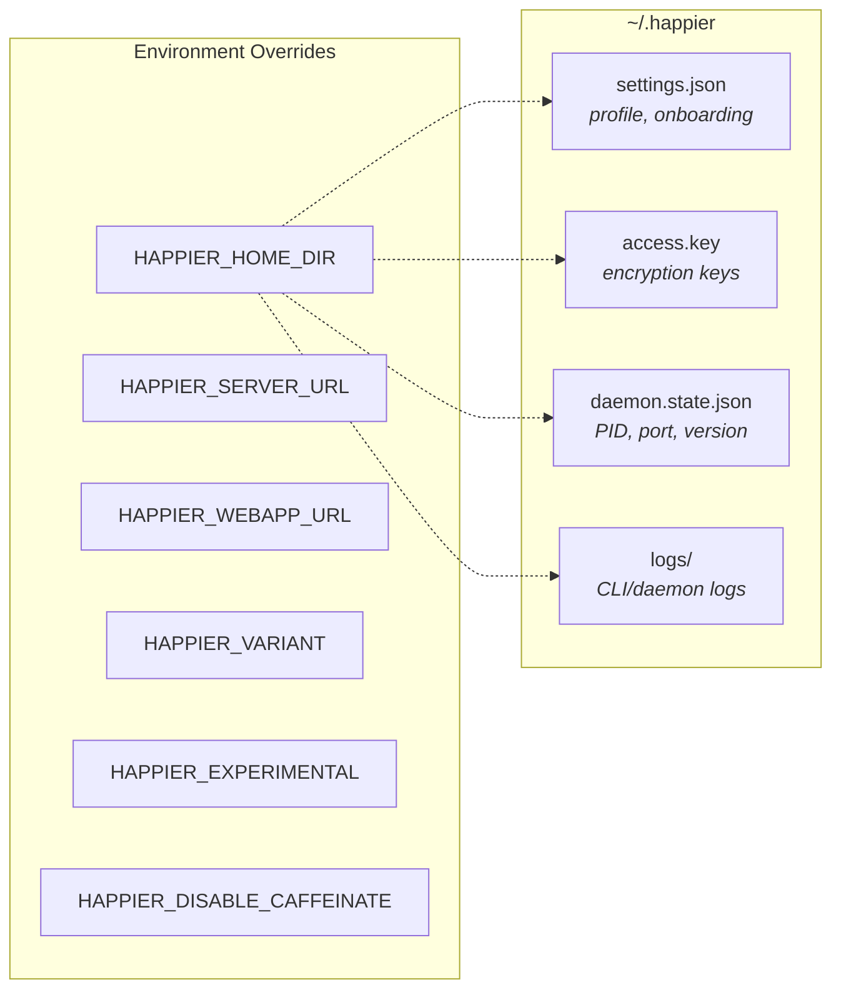
```mermaid
graph LR
    subgraph "~/.happier"
        direction TB
        settings["settings.json<br/><i>profile, onboarding</i>"]
        access["access.key<br/><i>encryption keys</i>"]
        daemon["daemon.state.json<br/><i>PID, port, version</i>"]
        logs["logs/<br/><i>CLI/daemon logs</i>"]
    end

    subgraph "Environment Overrides"
        direction TB
        E1[HAPPIER_HOME_DIR]
        E2[HAPPIER_SERVER_URL]
        E3[HAPPIER_WEBAPP_URL]
        E4[HAPPIER_VARIANT]
        E5[HAPPIER_EXPERIMENTAL]
        E6[HAPPIER_DISABLE_CAFFEINATE]
    end

    E1 -.-> settings & access & daemon & logs
```

Local state lives under `~/.happier` (or `HAPPIER_HOME_DIR`):
- `settings.json`: onboarding and profile settings (validated/migrated).
- `access.key`: local key material for encryption/auth.
- `daemon.state.json`: daemon PID + control port + version.
- `logs/`: CLI/daemon logs.

Configuration lives in `src/configuration.ts`:
- `HAPPIER_SERVER_URL` and `HAPPIER_WEBAPP_URL` override defaults.
- `HAPPIER_VARIANT`, `HAPPIER_EXPERIMENTAL`, `HAPPIER_DISABLE_CAFFEINATE` control behavior.

## API client architecture

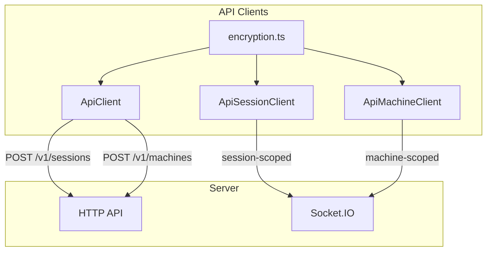
```mermaid
graph TB
    subgraph "API Clients"
        Base[ApiClient]
        Session[ApiSessionClient]
        Machine[ApiMachineClient]
        Encrypt[encryption.ts]
    end

    subgraph "Server"
        HTTP[HTTP API]
        Socket[Socket.IO]
    end

    Base --> |POST /v1/sessions| HTTP
    Base --> |POST /v1/machines| HTTP

    Session --> |session-scoped| Socket
    Machine --> |machine-scoped| Socket

    Encrypt --> Base & Session & Machine
```

### HTTP
`ApiClient` (`src/api/api.ts`) handles:
- Session creation (`POST /v1/sessions`) with encrypted metadata/state.
- Machine registration (`POST /v1/machines`) with encrypted metadata/daemon state.
- Other CRUD actions through `ApiSessionClient` and `ApiMachineClient`.

### WebSocket

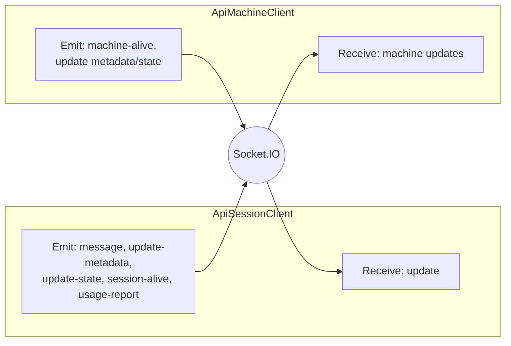
```mermaid
graph LR
    subgraph "ApiSessionClient"
        S_In[Receive: update]
        S_Out[Emit: message, update-metadata,<br/>update-state, session-alive, usage-report]
    end

    subgraph "ApiMachineClient"
        M_In[Receive: machine updates]
        M_Out[Emit: machine-alive,<br/>update metadata/state]
    end

    Server((Socket.IO)) --> S_In & M_In
    S_Out & M_Out --> Server
```

`ApiSessionClient` (`src/api/apiSession.ts`) connects to Socket.IO as a **session-scoped** client:
- Receives `update` events and decrypts message content.
- Emits `message`, `update-metadata`, `update-state`, `session-alive`, and `usage-report`.

`ApiMachineClient` (`src/api/apiMachine.ts`) connects as a **machine-scoped** client:
- Sends `machine-alive` heartbeats.
- Updates machine metadata/daemon state with optimistic concurrency.
- Receives machine updates and merges them locally.

### Encryption

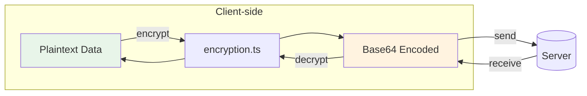
```mermaid
flowchart LR
    subgraph "Client-side"
        Plain[Plaintext Data]
        Encrypt[encryption.ts]
        B64[Base64 Encoded]
    end

    Plain --> |encrypt| Encrypt --> B64 --> |send| Server[(Server)]
    Server --> |receive| B64 --> |decrypt| Encrypt --> Plain

    style Plain fill:#e8f5e9
    style B64 fill:#fff3e0
```

The CLI encrypts client content before it leaves the machine using `src/api/encryption.ts`.
- Session metadata, agent state, messages, machine state, artifacts, and KV values are encrypted client-side.
- On-wire encoding is base64; see `encryption.md`.

## Terminal hosting (development)

Terminal hosting selects where an existing interactive session runs; it does not
create another Happier session registry. Happier continues to own session identity,
provider configuration, transcript ingestion, permissions, and recovery. The host
owns the terminal process and screen. `terminal/attachment` persists their association
and dispatches attach, stop, and host disposition.

Zellij command panes inherit the native server's environment. The Zellij adapter
therefore passes the same launch environment when creating the server and submitting
the command, including foreground creation where supported. Launch-only passthrough
values remain in the process environment rather than the one-shot launch-spec file.
Claude's existing spawn owner disables prompt suggestions through that environment;
the readiness parser continues to protect genuine user drafts.

Terminal-host setup failures keep the released `SPAWN_FAILED` result and attach optional,
protocol-owned `terminal_host_unavailable` detail. Missing supported Herdr/Zellij
installations and an unsupported running Herdr server are setup failures, not provider
errors or automatic retry instructions. The creation UI explains installation/update or
host selection and retains the draft. Other startup failures keep their existing classification.

The daemon resolves presentation through provider-owned launch hooks before choosing
a terminal host. Runtimes with a real terminal surface can open in tmux, zellij, or
Herdr; headless ACP runtimes do not acquire a synthetic TUI. Codex App Server and
OpenCode server open their native TUI against the existing provider session rather
than starting another provider conversation. Hosted and ordinary runners share
daemon registration and webhook completion. The common owner binds the reported
session before waking its existing pending queue and clears stale Stop state when
an explicit resume is accepted. Automatic recovery is a new launch attempt, so it
does not reuse the original caller's already accepted request nonce.
For these shared provider-attach runtimes, the hosted native TUI is optional:
`spawnHooks.resolveDaemonTerminalPresentation` keeps the controller headless,
and `createSharedProviderLocalControl.onTerminalExit` releases the local-control
projection. Closing the presenter leaves that controller remotely usable and
does not automatically recreate a pane. Terminal supervision retires the exact
optional attachment without treating its loss as controller death. An explicit
switch or attach can request a local client again; this is not a claim that every
cold host-restoration path has completed live validation.
Detached tmux creation uses the configured session `default-size` when no client
is attached to that session. The shared tmux command owner reconciles the exact
created window instead of inheriting dimensions from clients of unrelated sessions
under tmux's `latest` sizing policy. It preserves inherited or explicit window
sizing policy so attaching a client still controls its geometry. An unsuccessful
geometry reconciliation is logged and does not retry a successful creation.
Terminal creation submission is distinct from confirmed readiness. A tmux creation
reply that cannot identify the accepted window does not authorize an ordinary-runner
fallback: only proven non-creation with complete cleanup permits that fallback.
Unconfirmed terminal creation retains its private launch inputs for the potentially
live runner. Positive non-creation or confirmed stop permits exact artifact cleanup;
missing files are idempotent, while other cleanup failures are recorded in the
default file log and remain distinguishable from successful cleanup.
The standalone launch asset emits a fixed stderr diagnostic if its file-log
destination is unavailable. Its reader may leave the exact native-startup receipt
for the controller; that verified companion is not a directory-cleanup failure.
Artifact cleanup failure does not change a completed native exit or replace the
original startup failure.
The webhook waiter is armed before asynchronous accepted-marker persistence;
host binding completes only after that persistence succeeds. An accepted runner
can already have a known session ID without being ready: nonce readiness remains
pending until the common finalization owner settles success or failure. Recovered
requests with no active startup finalizer recheck the accepted runner marker,
any required exact terminal attachment, and session RPC serviceability through
their existing owners. Those checks revalidate current custody after asynchronous reads; a known
session ID alone cannot admit a recovered launch. A pending lookup can reprove
readiness immediately after publication without extending its original retention
deadline. Completed success or failure remains authoritative.
All exit sources use the canonical child-exit owner: it preserves live-runner
promotion, reports an actual early exit to the existing waiter immediately, and
waits for the existing startup finalization promise before retiring its artifacts.
The report-marker producer also joins pending writes to the correlated tracked
session. Actual exit closes and drains that work before marker retirement;
wrapper promotion keeps the live runner's custody and transfers the existing
waiter's PID key. These associations are transient tracking state, not a persisted
lifecycle or another registry. They prevent delayed writes from recreating
artifacts after exit cleanup. Nonce HTTP resolution consumes the same
readiness owner; a seeded session ID alone is never readiness evidence.

Machine CLI authentication probes describe ambient credentials, not a session's
selected connected-service credentials. The shared UI local-control eligibility
owner treats ambient logout as inconclusive when the session has a valid connected
binding for its catalog provider. It does not infer that those credentials are
valid; the existing switch RPC and provider remain responsible for authentication.
Native-auth sessions retain the ambient logout restriction.

The UI projects live local control through `sessionLocalControl.ts`: persisted
agent state is not evidence of a current attachment after the runner becomes
inactive or terminal serviceability reports retirement/unavailability. Footer
state and control-switch eligibility consume that same projection, including
the legacy `controlledByUser` shape. Preserved-host Stop and recovery continue
to use the terminal-serviceability policy; they are not removed when live
control is unavailable.

OpenCode V2 applies session-scoped model, reasoning, and agent controls before
opening its native TUI, including before the first prompt. Controller-local and
standalone attachment use the same control synchronizer. Standalone attachment
asks the running session to prepare through the encrypted session RPC; preparation
checks the native session identity before and after synchronization. The controller
does not need its own TTY for this operation. Failed preparation does not launch
the native terminal. V1 keeps its existing attachment path; ACP does not register
native-attachment preparation. The runner alone publishes managed `localControl`
attachment and detach custody: an independent `happier attach` client neither
claims `canDetach` nor clears a runner-owned terminal when it exits. Shared native
clients and Happier remain simultaneously writable; this projection is not an
inventory of every external native client.

Cold Herdr restoration is a development-source exception to independent attachment.
When the shared controller survives a server restart, attach from the restored
recorded pane can submit its current terminal and native launcher identity to the
same strict preparation owner. The controller validates its own prior placement,
positive old-host absence, current pane, exact native conversation and endpoint,
and OS process custody before binding a borrowed attachment and publishing managed
status. A retired local descriptor is not required to survive: the absent path
uses the controller's authenticated retired placement snapshot. Detach retires the
exact native launcher tree and attachment, leaving the restored shell, pane, and
shared controller alive. Unsupported or refused admission cleans up the transient
native client without changing managed association. This does not make a recorded
public pane ID an identity authority or promote the restored shell to owned custody.

For a shared native session with a recorded terminal host, the public attach
command asks the existing session switch owner to restore its managed TUI before
opening or focusing that host. The switch is idempotent when already attached;
a rejected, malformed, or failed response does not count as successful attachment.
This orchestration is shared by all host dispatches, rather than implemented in
Herdr or the native launcher. Exclusive sessions and independent native attach
clients retain their separate existing paths.

Managed OpenCode affinity records the selected ready client's existing launch fingerprint
in the provider-owned runtime handle, without publishing its local URL or credential.
Owned terminal attachment takes its URL and fingerprint together from the ready runtime,
before background metadata publication. Standalone attachment and native forks carry
recorded affinity through both target and credential resolution; a newer retained record
at the same URL cannot substitute its credential. Missing, mismatched, or invalid recorded
affinity fails rather than selecting the caller's ambient server. A native fork rejected
before dispatch uses the existing failed-attempt outcome, not unsupported-strategy fallback.
Explicit server URLs retain their separate authority. Predecessor sessions without
recorded affinity retain their local-context fallback; this does not make every historical
unbound managed session attachable from a different launch context.
Native forks resolve the parent target through the same owner and retain its recognized
affinity in the child descriptor. Child launches keep the existing connected-service
inheritance; their actual runtime selection replaces the requested tuple. This does not
pin an old server across credential/configuration changes or transfer a machine-local
pool identity through cross-machine handoff.

The shared input consumer carries the prompt loop's metadata callback through each
idle wait, including when the runner supplies an existing consumer. This lets the
existing override synchronizers apply idle model, mode, and reasoning changes
without another prompt or a separate metadata watcher. An omitted callback preserves
the consumer's construction callback; an explicit null disables it for that wait.
Metadata notifications reconcile controls without granting Pending eligibility or
starting another message-materialization pass.

OpenCode's existing options publisher also refreshes model and mode inventories on
same-directory catalog update events and connection catch-up. A successful empty
inventory withdraws its choices; a failed discovery retains the last published
choices. This accommodates V2's initially empty plugin inventory without polling
or weakening validation against the server's current model inventory.

Herdr-specific transport lives in `integrations/herdr`. The adapter uses direct argv
launch, styled screen capture, input, process inspection, and terminal attachment.
Runtime detection requires a stable Herdr release at or after `0.9.2`, and attach
and startup also verify the running server's version before using it.
In the development source, standalone Claude unified uses the default Herdr server,
matching `happier herdr`; recovery of a retained attachment keeps its recorded server namespace. Daemon
requests retain their explicitly selected namespace. Generated agent names label
the panes rather than creating separate Herdr servers.
Claude unified reuses the existing composer parser and prompt-submission verifier;
successful terminal writes are not provider acceptance acknowledgements.
In development source, Claude prompt staging and consumption wait under the existing
session cancellation signal, rather than the terminal transport's write deadline.
An overloaded TUI can display a successful paste late. The shared terminal verifier
waits for that exact prompt before sending Enter once, and re-observes its consumption
without resubmitting. Individual transport commands retain their own timeouts.
The arbiter's existing accepted/retired delivery state also ends verification, so a
manual submission or cancelled Pending row cannot leave the injection waiting forever.
The Herdr client stages large text in sequential Unicode-safe requests within
Herdr's 1 MiB serialized JSON-line limit, including escape expansion and envelope
bytes. Submission still belongs to the existing verifier: it sends Enter only
after staging completes, and a partial failed write retains the existing
ambiguous-write result rather than replaying the prompt.

The development permission-mode controller verifies the current composer footer
before cycling modes. A clipped footer is unknown, rather than evidence of default
mode; historical mode text above the composer is not authoritative. Legacy mode
labels and compact HUD labels share that parser. If the footer is hidden by a short
terminal, control waits without cycling blindly; enlarging the terminal restores
verification through the existing retry path. Pending prompts still wait for their
required runtime configuration to be verified.

The development parser distinguishes Claude's automatic usage-limit wait footer
from the interactive usage-limit chooser. An empty composer still accepts a new
prompt, as Claude permits during the wait. Clearing an owned leftover draft with
Escape waits for the provider wait to end; it must not cancel automatic continuation.
The Rewind message selector owns keyboard input even when its only focused row is
`(current)`, so that row is never treated as a prompt draft. These keyboard semantics
follow [Claude's interactive-mode contract](https://code.claude.com/docs/en/interactive-mode).

`terminal/runtime/inheritedHerdrRuntime.ts` verifies a foreground wrapper's current
Herdr endpoint and pane, then supplies the existing attachment identity. Shared
startup persistence records user-owned shell panes as borrowed: stopping Happier
must stop the runner without closing the user's pane. Daemon-created panes remain
owned. The attachment's stable terminal identity is resolved to the current pane
when needed, so pane movement needs no separate persistent index.

After a Herdr restart, the recorded public pane ID is only a restoration hint:
the new terminal runtime ID is discovered in that exact local server namespace.
Explicit attach can start an unreachable recorded server and open that candidate
to activate its saved resume command, but opening it does not authenticate or
rebind the Happier Session. Generic resume keeps live or unproven runner admission;
positive local runner absence permits cold restoration even when relay activity
is stale. A restored foreground launch retains borrowed-shell disposition unless
the existing attachment owner independently proves owned custody.
The saved release-channel executable must be available in the restored shell.
Its automatic invocation is distinct from manually invoking the current-source
attach command inside that pane; the latter's managed cold-restoration admission
and Detach were exercised with a surviving OpenCode controller on Herdr `0.9.3`.

In the development source, daemon startup reattachment uses the same terminal
serviceability publication owner as live session reports. This retains the exact
attachment identity and borrowed lifecycle before runner exit, even if the runner
releases its local descriptor first; exit retirement cannot clear a replacement
attachment's serviceability.
Owned runner exit also invokes the existing disconnected-host supervisor: a
positively dead pane retires its exact attachment, while an alive independent
provider host remains recoverable rather than being closed on controller loss.
For optional native clients, normal runner exit consults current attachment custody
before retaining its recovery marker. A retired presentation's historical webhook
does not retain the marker; unreadable custody retains evidence and emits a diagnostic.
Borrowed shells keep their existing release policy, and intentional restart custody
keeps its existing marker policy.
Explicit Claude continuation looks up its exact owned attachment's retained
endpoint descriptor only after Session runner-lock admission. The existing
endpoint validator and hook/MCP binding owners establish controller readiness
before terminal adoption; a public pane ID alone cannot lift the recovery fence.
Permission startup uses one shared seed-admission owner for the prompt loop and
runtime override synchronization. A saved mode is applied before eager native
startup even when its timestamp was already captured while building the queue.
Subsequent metadata changes still require a strictly newer timestamp; explicit
launch permission intent keeps its existing precedence.
Explicit Stop and normal exit share the same exact attachment-disposition owner.
CLI Stop delegates acknowledgement expiry to the relay's existing finite
forwarding deadline instead of imposing a shorter generic machine-RPC timer.
Local Stop requests follow the daemon operation by default; explicit caller
deadlines and cancellation remain available. A guarded refusal to signal never
authorizes an unsafe kill: Stop rechecks positive runner exit before deciding
that termination is incomplete. Transport timeout or disconnect still does not
prove physical termination.
After proving runner exit, Stop supplies its captured attachment to that owner:
if normal exit already removed the descriptor, the same owned-host disposal and
metadata-retirement pipeline still completes. Borrowed attachments release control
without closing the user's pane. The canonical descriptor reader distinguishes
absence from unreadable evidence; a replacement or unreadable descriptor never
counts as successful completion. No separate supervisor-deferral mechanism is
needed for this overlap.
After the old host is positively dead or its captured runner has exited, a newer
remote serviceability projection does not block retirement of the old local
evidence. That projection remains untouched. Remote-only recovery without captured
local custody still refuses a changed target; transport failures remain retryable.

On Linux, startup migration always considers explicitly tracked daemon-owned
session processes. Sweeping untracked processes from the daemon's cgroup additionally
requires a service-managed startup in an actual service cgroup; a manually started
daemon must not transfer unrelated processes from a shared SSH or editor scope.

For child-owned same-pane launches, the shared terminal runtime owns the native
process. Claude unified, runner-managed Codex/OpenCode TUIs, and standalone native
attach commands use this owner rather than spawning an unguarded child. Native
startup is acknowledged only after the actual executable spawns. Native TUIs keep
all three inherited terminal streams; Claude retains its existing stderr diagnostic
capture. The terminal launcher holds a private controller-lifetime IPC channel: controller
exit or death closes that channel, and the surviving launcher invokes the same
owned-process-tree cleanup used by forced native Detach. Detach keeps its existing
three-second graceful interrupt window before forced cleanup. This does not kill
the borrowed shell pane or an independent provider server. Borrowed attachment
release waits for positive owned-child termination; failed cleanup retains the
exact descriptor and is observable rather than reported as success.
OS process-discovery or signalling failures can leave descendants
running: the shared cleanup owner attempts known-process termination, then rejects
with an incomplete-cleanup code when those failures prevent verification. The CLI
owner records that outcome in its default file log before rethrowing; the surviving
launcher reports a fixed, sanitized stderr diagnostic. It cannot clean up if the
launcher is also killed or cannot execute.
Independent recoverable terminal hosts have no lifetime channel and retain their
existing process topology.

Herdr lifecycle reporting is a projection of Happier state. The existing session
activity summary supplies pending permission and user-action requests; they take
precedence over working/idle, including when an SDK runtime has no visible native
approval dialog. Reporting uses the existing local-presence events, not another
polling loop. Managed provider children suppress Herdr's native agent hooks, and the reported resume command uses
the current Happier release-channel executable. The generic `--runtime-context`
command prefix carries the existing resolved CLI context (home, relay profile and
endpoints, and daemon lifecycle scope), because Herdr does not restore the original
pane environment when restarting a saved command. Configuration applies this
prefix before resolving credentials, only at initial startup; later explicit
profile selection is not overwritten. The prefix accepts only the canonical
runtime-context keys rather than a general subprocess environment, does not copy
credential files, and rejects URLs with embedded user information. Encoding is
transport, not redaction.
Generic `resume` delegates to the
normal attach operation for a running attachable session; stopped sessions retain
strict provider resume. Recorded cold restoration verifies Herdr's released
standard socket and named-state layout against its native Session inventory,
then starts that exact namespace through the existing startup deadline owner.
It does not substitute an ambient same-name server. Native foreground attachment
uses the exact socket override without an explicit `--session` argument that
would supersede it. An unreachable custom socket whose saved-state root cannot
be verified requires reopening the original server; live custom sockets remain
attachable. There is no parallel Herdr session synchronization service.

## Daemon architecture

With no tracked runners remaining, daemon shutdown cleans each idle OpenCode
server in its existing managed pool, not just the ambient launch profile. The
same locked termination owner verifies daemon, relay-directory and process
custody. Active session claims and borrowed servers retain their state;
unreadable custody and unsuccessful termination retain evidence and produce
diagnostics. The tracked-runner guard
also covers accepted runners whose durable session marker is not written yet.

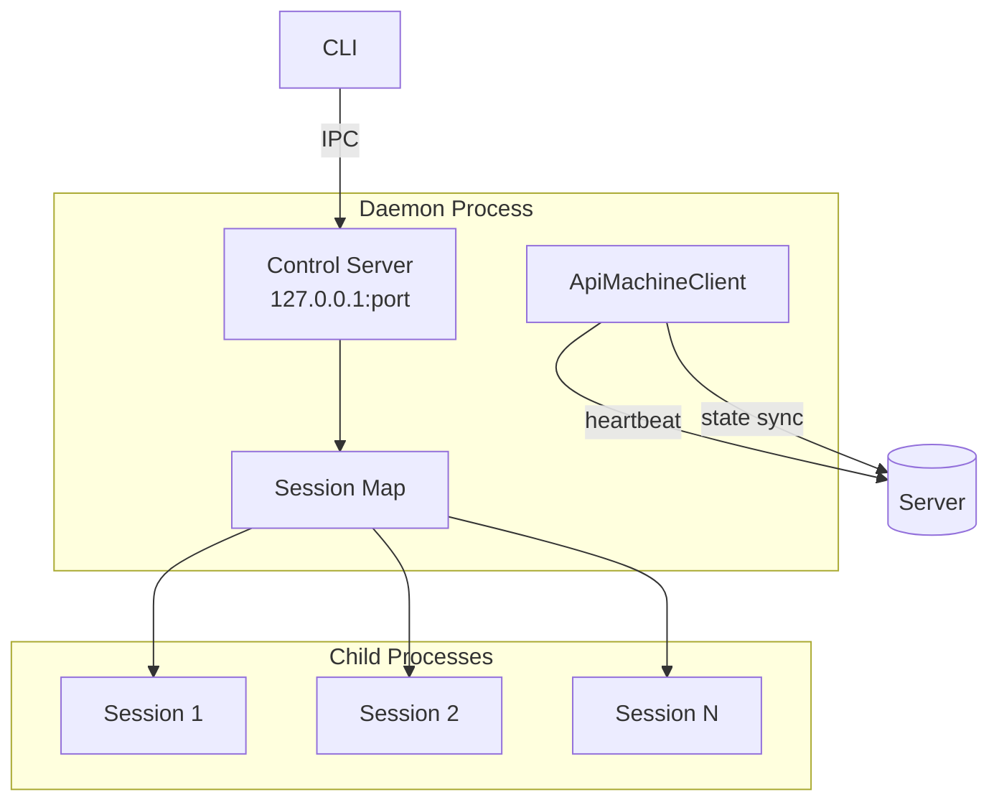
```mermaid
graph TB
    subgraph "Daemon Process"
        Control[Control Server<br/>127.0.0.1:port]
        Sessions[Session Map]
        MachineClient[ApiMachineClient]
    end

    subgraph "Child Processes"
        S1[Session 1]
        S2[Session 2]
        S3[Session N]
    end

    CLI[CLI] --> |IPC| Control
    Control --> Sessions
    Sessions --> S1 & S2 & S3

    MachineClient --> |heartbeat| Server[(Server)]
    MachineClient --> |state sync| Server
```

The daemon is a long-lived process responsible for running sessions in the background and maintaining machine presence.

### Lifecycle

```mermaid
flowchart TD
    Start([startDaemon]) --> Validate[Validate version]
    Validate --> Lock[Acquire lock file]
    Lock --> Auth[Authenticate]
    Auth --> Register[Register machine with server]
    Register --> Control[Start control server]
    Control --> Track[Track child sessions]
    Track --> Sync[Sync daemon state to server]
    Sync --> Running([Running])

    Running --> |SIGTERM| Shutdown[Cleanup & exit]
```

1. `startDaemon()` validates the running version and acquires a lock file.
2. It authenticates and registers the machine with the server.
3. It starts a local **control server** for IPC.
4. It keeps a map of tracked child sessions and updates daemon state on the server.

In current development source, primary CLI runners own Session locks through a lexical scope in
`sessionRunnerLock.ts`. Fresh startup claims the resolved Session id before
constructing its realtime client or committing pending first input; existing
startup claims before attaching. Daemon presence and resume preflight already
read that same lock, so a runner waiting to publish its first webhook prevents
another activation from allocating a terminal host. Startup failure and normal
runner exit release the scope's locks; process-exit cleanup uses the same owner.

Before the child receives the created Session id, its server row can already trigger
Pending activation. Development source closes that remaining pre-lock window in
`resolveAcceptedExistingSessionStartup`: it reads the existing attach metadata only
when fresh daemon children await a webhook, and uses the webhook owner's shared
PID, wrapper and Windows-tab correlation. `createSessionMetadata` publishes the
optional `hostProcessInstanceFingerprint` beside `hostPid`; the daemon verifies
that runner generation, machine and home before learning the tracked Session id.
It then rejoins accepted startup rather than launching another child. Learning
identity does not complete the webhook waiter, promote markers or claim readiness.
Process uncertainty and Stop still use the normal presence/resume fencing owner.
A correlated pending child with legacy or unreadable generation evidence is
explicitly fenced until startup completes; a positively different generation is
not associated. This adds no new lock, timer or cross-process registry.

In current development, `createOnChildExited` releases session-marker evidence only
through the tracked exit lifecycle. An exit notification for an untracked PID does
not authorize marker deletion. Failed terminal-exit staging retains tracking and
marker evidence. Visible-console startup reports the early exit immediately;
the tracked exit owner completes retirement separately and logs cleanup failure
without discarding the remaining custody evidence.

Development startup recovery uses `daemonProcessScopeIdentity.ts` to keep runners
within their owning Happier home and daemon lifecycle. Markerless recovery requires
recorded home and lifecycle identity; older runners without an explicit lifecycle
identity require the recorded active-server identity and a matching server URL.
An explicit lifecycle identity survives endpoint changes. Existing local markers
can supply ownership evidence when process inventory is incomplete, but cannot
override recorded foreign-home or foreign-scope facts. The child-environment
builder publishes the resolved home even when the daemon inherited no home override.

### Model-capacity recovery (development)

`TemporaryThrottleRecoveryScheduler` owns scheduling after a terminal capacity failure.
The Codex adapter reports that terminal failure to host recovery without an extra
immediate retry; native Codex retry-in-progress notifications remain nonterminal.
Consecutive capacity failures wait 5, 10, 20, 40, 80, 160, then 300 seconds before
jitter of ±20%. Provider retry/reset timing is a minimum, not a replacement for
the backoff. The delay is capped, not the number of attempts.

The capacity streak survives continuation handoff. Pending acceptance, a new turn
id, or reconnection is not evidence of model recovery. Only an accepted completed
turn resets the streak. A handed-off continuation has no second retry timer while
its outcome is pending; user cancellation remains authoritative. Authentication,
quota, and non-capacity transport recovery retain their own classifications and
policies.

In current development source, reconnect readiness uses a fresh authenticated
feature observation and inherits that request owner's attempt deadline. A separate
health endpoint is not an admission prerequisite. Authentication rejection fails
closed; server failures remain retryable under the existing connection supervisor.

### Control server (local IPC)

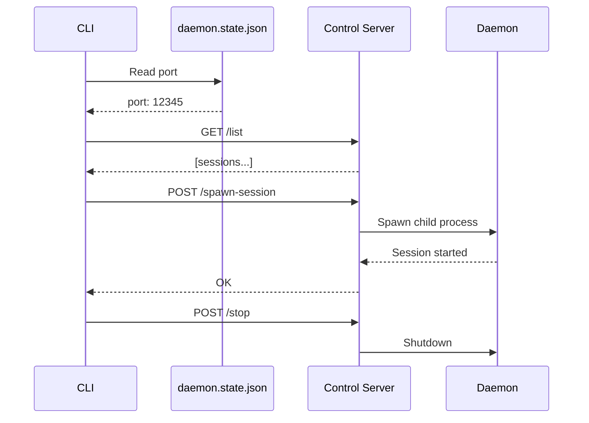
```mermaid
sequenceDiagram
    participant CLI
    participant State as daemon.state.json
    participant Control as Control Server
    participant Daemon

    CLI->>State: Read port
    State-->>CLI: port: 12345

    CLI->>Control: GET /list
    Control-->>CLI: [sessions...]

    CLI->>Control: POST /spawn-session
    Control->>Daemon: Spawn child process
    Daemon-->>Control: Session started
    Control-->>CLI: OK

    CLI->>Control: POST /stop
    Control->>Daemon: Shutdown
```

`startDaemonControlServer()` (`src/daemon/controlServer.ts`) runs an HTTP server on `127.0.0.1` and exposes:
- `/list` (list active sessions)
- `/stop-session`
- `/spawn-session`
- `/stop` (shutdown daemon)
- `/session-started` (session self-report)

The CLI talks to this server via `controlClient.ts`, using a port stored in `daemon.state.json`.

### Session spawning

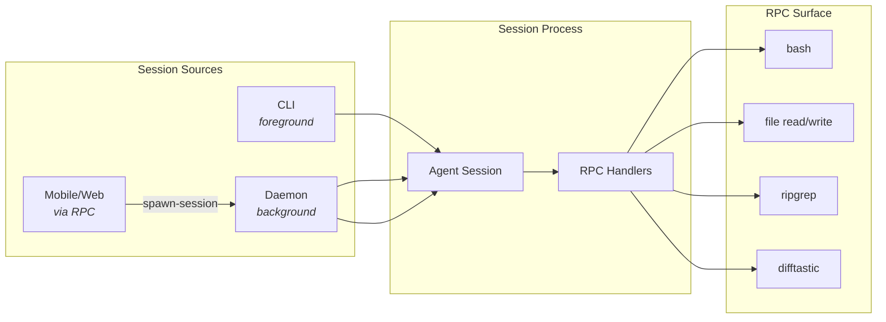
```mermaid
flowchart LR
    subgraph "Session Sources"
        CLI[CLI<br/><i>foreground</i>]
        Daemon[Daemon<br/><i>background</i>]
        Remote[Mobile/Web<br/><i>via RPC</i>]
    end

    subgraph "Session Process"
        Session[Agent Session]
        Handlers[RPC Handlers]
    end

    CLI --> Session
    Daemon --> Session
    Remote --> |spawn-session| Daemon --> Session

    Session --> Handlers

    subgraph "RPC Surface"
        Handlers --> Bash[bash]
        Handlers --> Files[file read/write]
        Handlers --> Search[ripgrep]
        Handlers --> Diff[difftastic]
    end
```

Sessions can be started by:
- The CLI directly (foreground).
- The daemon (background).
- Remote requests over RPC (from mobile/web via machine connection).

Daemon session spawning uses `registerCommonHandlers` to expose a controlled RPC surface (shell commands, file operations, search/diff helpers).

### Machine state

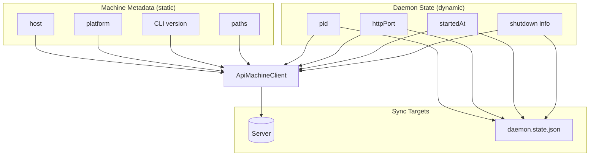
```mermaid
graph TB
    subgraph "Machine Metadata (static)"
        M1[host]
        M2[platform]
        M3[CLI version]
        M4[paths]
    end

    subgraph "Daemon State (dynamic)"
        D1[pid]
        D2[httpPort]
        D3[startedAt]
        D4[shutdown info]
    end

    subgraph "Sync Targets"
        Server[(Server)]
        Local[daemon.state.json]
    end

    ApiMachine[ApiMachineClient]

    M1 & M2 & M3 & M4 --> ApiMachine
    D1 & D2 & D3 & D4 --> ApiMachine
    D1 & D2 & D3 & D4 --> Local

    ApiMachine --> Server
```

- **Machine metadata** is static info (host, platform, CLI version, paths).
- **Daemon state** is dynamic (pid, httpPort, startedAt, shutdown info).

The daemon updates these via `ApiMachineClient` and mirrors local state into `daemon.state.json` for control/diagnostics.

## RPC and tool bridge

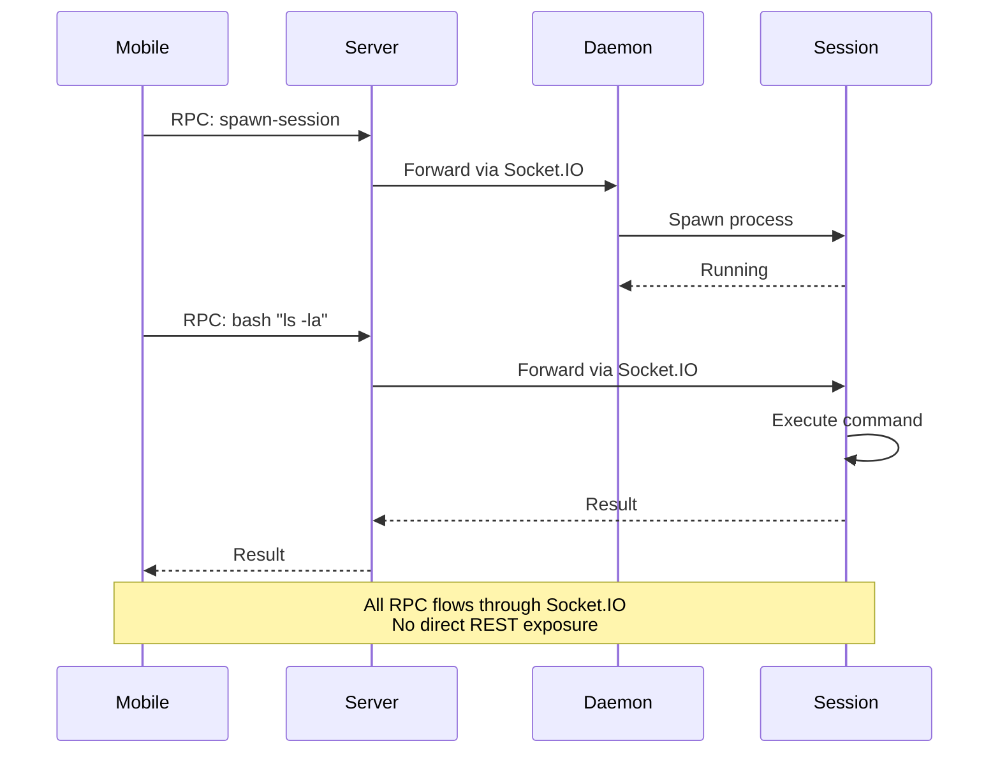
```mermaid
sequenceDiagram
    participant Mobile
    participant Server
    participant Daemon
    participant Session

    Mobile->>Server: RPC: spawn-session
    Server->>Daemon: Forward via Socket.IO
    Daemon->>Session: Spawn process
    Session-->>Daemon: Running

    Mobile->>Server: RPC: bash "ls -la"
    Server->>Session: Forward via Socket.IO
    Session->>Session: Execute command
    Session-->>Server: Result
    Server-->>Mobile: Result

    Note over Mobile,Session: All RPC flows through Socket.IO<br/>No direct REST exposure
```

RPC is used to send commands over the Socket.IO connection:
- Sessions register RPC handlers (e.g., `bash`, file read/write, `ripgrep`, `difftastic`).
- The daemon registers a spawn-session handler so the server/mobile client can ask it to start a local session.

This mechanism allows the server and mobile clients to drive local actions without exposing a broad REST surface.

## Implementation references
- CLI entry: `apps/cli/src/index.ts`
- Daemon: `apps/cli/src/daemon`
- Control server/client: `apps/cli/src/daemon/controlServer.ts`, `apps/cli/src/daemon/controlClient.ts`
- Desktop setup executor: `apps/bootstrap/src/systemTasks/kinds/setupThisComputer.ts`
- Desktop setup prompt contract: `packages/protocol/src/systemTasks/setupThisComputerTaskContract.ts`
- Managed-CLI provenance: `apps/bootstrap/src/systemTasks/localFirstPartyCommand.ts`, `apps/bootstrap/src/systemTasks/happierCli.ts`
- Automatic pairing approval: `apps/ui/sources/auth/terminal/approveSetupPairingForTarget.ts`
- Runtime convergence: `apps/cli/src/daemon/statusSnapshot.ts`
- API clients: `apps/cli/src/api`
- Persistence: `apps/cli/src/persistence.ts`
- Config: `apps/cli/src/configuration.ts`
