# Encryption and Data Encoding

This document details how plaintext and E2EE account/session data is represented, how
encrypted blobs are structured, and how those values map onto protocol fields. It is
based on the canonical mode-aware domain owners, `apps/cli/src/api/encryption.ts`, and
the server routes that accept/emit these values.

For transport and event shapes, see `protocol.md`. For HTTP endpoints, see `api.md`.

## Account-mode invariant

A plaintext Account is intentionally and genuinely keyless:

- its client credential contains a bearer token but no private recovery secret,
  Account machine key, Account content key, or other Account data-encryption
  material;
- clients must not fabricate, derive, or require replacement Account material for a
  plain path;
- server-readable account data, settings, and secrets use explicit
  `{ t: 'plain', v }` content envelopes and remain protected by authentication,
  authorization, recipient projection, and TLS;
- optional server at-rest sealing uses separate server-owned infrastructure. It does
  not create or require client Account material and is not client E2EE;
- device-only secrets use a device-local key and are never uploaded or reused as an
  Account key.

Persisted `Account.encryptionMode` is the sole Account-mode authority. Neither
`Account.publicKey === null` nor a non-null public key determines whether the Account
is plain or E2EE. Public verification anchors may be retained without granting
decryption capability or changing the persisted mode.

An Account persisted as E2EE must have the required signing and content public-key
bindings, and an E2EE value still requires real client E2EE material. Missing or
inconsistent bindings and unavailable material fail closed as a typed
locked/inconsistent/migration-required state while preserving the stored evidence.
They must never cause an E2EE Account or row to be reinterpreted as plain, create or
attach replacement keys, try plaintext after decryption fails, or return
empty/default content.

After the Account-mode decision, each persisted row or domain envelope remains
authoritative for its representation until the canonical transition owner rewrites
it. Callers must not infer mode from a token, credential shape, key presence,
decryptability, or a local fallback.

At every Account-scoped read and write boundary, the persisted Account mode and the
domain envelope kind must agree: plain uses `{ t: 'plain', v }`, and E2EE uses
`{ t: 'encrypted', c }`. A mismatch fails with the domain's typed
locked/inconsistent/migration-required result before content disclosure or mutation,
while preserving the stored value; it must not become absence, defaults, or a
fallback to the other branch.

### Terminology and rollout status

Older descriptions used **keyed** and **keyless** as shorthand for whether
`Account.publicKey` was present. That shorthand is superseded because authentication
credentials, Account mode, and the representation of an existing row are separate
facts:

- **token-only credential** means a bearer token with zero Account E2EE material;
- **E2EE credential** means a credential carrying real legacy or data-key material;
- `Account.encryptionMode` authorizes the representation of new account-scoped writes;
- an existing row's persisted representation remains authoritative until an explicit
  migration rewrites it.

Bearer-token, OAuth/OIDC, GitHub, or mTLS authentication is sufficient to authorize a
plain account. It does not create encryption material and must not be used to derive
any.

The repository is currently in an expand/migrate phase. Current source contains the
token-only credential shape, mode-aware domain readers, the stored-content caller
declaration, and the compatibility-fenced Session layout-1 path. Feature configuration
or schema/source presence alone is not proof that the complete token-only onboarding
flow has passed its mixed-version, persistence, composed, and platform checks.

The server's current advertised stored-content implementation is protocol `3`,
while protocol `2` remains the minimum compatibility floor for incumbent
stored-content operations. Current callers independently advertise optional
response-field support at protocol `4`, with
`x-happier-account-stored-content-protocol: 4` on HTTP and
`accountStoredContentCompatibility:{v:1,protocolVersion:4}` in Socket.IO auth.
A V3 server remains usable and omits the additive V4 Session-access witness.
Clients first discover this capability through a header-free `/v1/features` request
and only use the HTTP declaration transport after the server advertises it. Missing or
malformed declarations identify legacy callers; they do not reject the connection.
Operations that must read or write the current stored-content representation return a
typed `client-upgrade-required` result to a legacy caller, while operations that remain
safe without interpreting that representation continue to work. There is no operator
`observe`/`required` activation mode for account stored content.

The settled source boundary is green for genuine token-only OAuth/mTLS, the E2EE-only
Account cipher, corrupt local-key handling, the single UI Settings normalizer, Memory
Settings typed errors, Machine/Todo/Artifact fences and current producers, the global
declaration, Session layout 1 across Protocol/server/CLI/UI/runtime, the
Provider/MCP/Memory/resume/attach/prompt-Artifact consumers, and the final Connected
Services handoff, which reports 226 tests green. Current Protocol, Server, CLI, and UI
TypeScript 7 are green. These results do not by themselves close
mixed-version, live, database, two-client, daemon, or platform proof.
Account-transition amendment
`PLAINTEXT-ACCOUNTS-2026-07-30.7` is source-green at its Protocol, server, CLI, and
UI first-key owner/Settings/callback/storage boundaries. The UI retains one bounded,
server-scoped OAuth or mTLS continuation, expires it explicitly, stores the callback
pending handle before migration, and performs one exact retry from authoritative E2EE
Settings hydration without starting a new challenge. Credentials persist before
custody clears. The root-independent pre-provenance rerun is green at 40/40, and
direct UI TypeScript 7 is green. The final implementation now persists the strict
literal `migrationSubmissionAttempted?: true` marker with the pending handle before
the first migration POST; a failed custody write produces zero POSTs. Only a
definitive first-submission 4xx except 408/429 may clear custody. Ambiguous transport,
5xx, 408/429, commit-observed/post-persist failures, and every later failure retain
custody. The root-independent final rerun is green at 45/45, direct UI TypeScript 7 is
green, and the scoped diff check is green pre-gap evidence. The two source corrections
have since landed: first-key resume owns one exact POST per resume with hidden API
backoff disabled only for this path, and marked active-server mismatch retains custody
before rejection with zero POST/persist/clear while unmarked mismatch keeps prior
cleanup. Module-local mutation serialization and bounded primary→legacy→global lookup
close the stale-state race and legacy-reader omission; root-independent evidence is
67/67 including exact concurrency, direct UI TypeScript 7, and scoped diff green.
Cross-tab/worker serialization remains a platform residual. Approved amendment
`PLAINTEXT-ACCOUNTS-2026-07-31.8` closes the logout/account-replacement decision:
ordinary logout and different-token replacement must fail before credential or app
state mutation and route to **Finish encryption setup** while marked custody exists.
Successful same-token recovery keeps the user signed in for recovery-key backup/copy.
Only a separately confirmed destructive abandonment may exact-clear that marked
record before credentials are removed or replaced; its warning must state that E2EE
may already have committed and discarding the pending key may permanently lose
Account access. Token invalidation is not safe abandonment. Amendment `.9` is the
current approved contract and extends these `.8` outcomes. The
[canonical plaintext-accounts plan](../.project/plans/happier-plaintext-accounts-keyless-external-auth-and-account-data-envelopes-2026-02-23.md)
owns mutable execution status, exact source evidence, and open database/live/platform
gates. Source evidence described here does not by itself activate the feature.

### Key ownership

| Material | Plain account | E2EE account | Owner and purpose |
|---|---:|---:|---|
| Account E2EE material | absent | present | Client-side confidentiality for account-scoped E2EE content |
| Session data key | only for a retained E2EE Session | per E2EE Session | Session transcript/metadata confidentiality |
| Server at-rest key | optional | optional | Server-owned database/backup exposure reduction |
| Device-local key | present per device | present per device | Local secret/cache/daemon restart persistence |
| TLS/auth material | present | present | Transport and account authorization, never content-at-rest encryption |

### Device-local secret sealing

Device-local sealing is deliberately separate from account encryption:

- the CLI/daemon owns one private key file at
  `~/.happier/device-local-secret-key.json`;
- the file is created once with publish-if-absent semantics so concurrent daemon
  startup cannot replace another process's key;
- protection is applied by one owner,
  `apps/cli/src/utils/fs/protectedLocalState.ts`, for every private local file the
  CLI/daemon writes — device-local key, bearer credentials, capability file,
  machine-local records alike. POSIX installations enforce a private parent
  (owner-owned, no `0077` bits) and a `0600` file mode; Windows cannot express a
  POSIX mode, so it applies and then verifies a protected DACL (inheritance
  disabled, owner plus `LOCAL SYSTEM`, full control, no reparse point) through
  `packages/cli-common/src/fs/windowsProtectedAcl.ts`. A Windows install where that
  DACL cannot be proven fails closed rather than publishing an unprotected file;
- the key is 32 random bytes and is never derived from a bearer token, account key,
  installation signing identity, Machine identity, or server response;
- local secret payloads use AES-256-GCM with a random 12-byte nonce and
  `session_respawn_environment` purpose-bound AAD;
- opaque local identities use HMAC-SHA-256 with the same device-local key and the
  distinct `external_session_transcript_refresh_cursor` purpose; this hides the raw
  Agent cursor without turning it into an Account identity or uploading the key;
- local Memory settings secrets use a 32-byte key derived from the same device-local
  root with HMAC-SHA-256 and the distinct `memory_settings_secrets` derived-key
  purpose. Current CLI writes seal with that derived device key; reads also accept
  supported legacy credential-derived keys for compatibility. The derived key is
  neither Account material nor portable cross-device custody;
- corrupt or missing ciphertext fails closed. A corrupt existing key file is never
  silently replaced, because doing so would make all prior local ciphertext
  permanently unreadable without explaining the loss.

New daemon respawn descriptors use `device_local_v1`. The existing
`account_scoped_v1` descriptor remains a read-only compatibility shape for markers
written by the supported predecessor. Canonical writers do not dual-write both
representations, and the compatibility reader can be removed once those markers are
no longer reachable.

Device-local sealing protects files on that device. It does not turn plaintext
account data into E2EE data, does not make local data portable to another device, and
must never be uploaded as an account recovery mechanism.

The secure External Session transcript-refresh path reads the existing
`StoredCredentials` union and requires the daemon to inject this device-local custody
explicitly. It has no Account-key/HMAC fallback and no second local secret store.

### Machine-local Agent native-resume records

Same-Session Agent transition can return to an Agent used earlier in the same Session by resuming
that Agent's own native session. The record holds the Agent's own conversation id and the transcript
seq it last saw (`{ v, vendorResumeId }` plus `departureSeqInclusive`) — **not a continuity proof**;
the proof mechanism was removed, so there is no pre-check, no `stat()` and no liveness probe. It is
machine-local because a vendor session on one machine cannot be resumed on another, and it is
deliberately kept off the wire. It is machine-local state, not Account data.

`apps/cli/src/session/handoff/metadata/localSessionHandoffMetadataStore.ts` owns the record:

- path `<activeServerDir>/session-handoff/agent-native-resume/<hash>.json`, where `<hash>` is
  SHA-256 over a domain-separated tuple (`happier.local-agent-native-resume.v1`, Session id, Agent
  id). Filenames therefore disclose neither the Session nor the Agent, and the plaintext keys inside
  the record are re-verified against the request before it is used;
- written and read through `writeProtectedLocalStateFileAtomic` /
  `readProtectedLocalStateFile` (`apps/cli/src/utils/fs/protectedLocalState.ts`): directories `0700`,
  files `0600`, forbidden bits `0077`, and an atomic tmp+rename replace whose verification is of the
  path's permissions, not a content read-back. `writeAgentNativeResumeRecord` returns `void`: every
  read `safeParse`s, so a partial file already reads as absent and a read-back could only restate
  that;
- a corrupt or unreadable record resolves to `null` and the target Agent starts fresh. It is never
  silently rewritten;
- the record is **not** discarded when the target Agent starts. A discard was not observable and was
  not garbage collection either, since nothing sweeps the directory; a later departure overwrites the
  record instead. Orphaned records after Session deletion are a disclosed residual — no Session-delete
  signal reaches this store.

This is file protection on one machine, in the same sense as device-local sealing above: it is not
Account material, it is not portable to another device, it is never uploaded, and it confers no
account-scoped confidentiality. It is distinct from device-local *sealing* — the record's contents
are not encrypted with the device-local key; its protection is filesystem permissions plus a
non-identifying filename. Do not promote it to an Account-scoped identity or reuse it as a recovery
mechanism.

`remote-dev` has the same device-local record in
`apps/cli/src/session/handoff/metadata/localAgentNativeResumeRecordStore.ts`. Its dedicated module
and dev's combined metadata store are a file-layout difference only: both use the same protected
path/strict stored shape and byte-compatible record. The record never crosses the wire, so a return
on a different machine still starts fresh with full bounded context.

## Overview

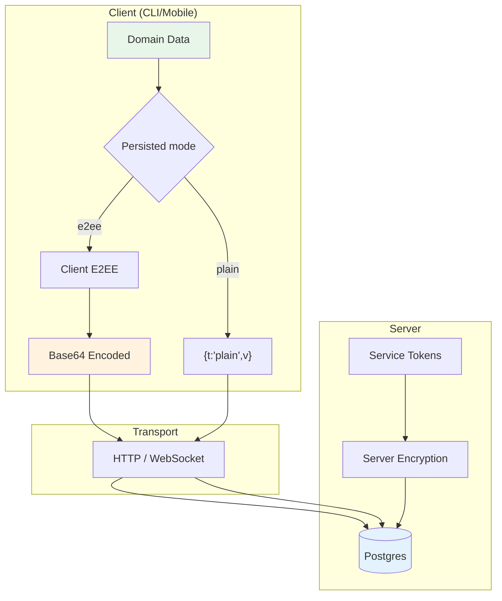

## Design goals
- Keep the server blind to E2EE content.
- Keep plaintext accounts genuinely keyless and server-readable by explicit user/server
  policy.
- Use explicit, stable binary layouts so clients can interoperate across versions.
- Prefer simple, consistent base64 encoding on the wire.
- Keep account, Session, server-at-rest, device-local, and transport key ownership
  separate.

## Encryption variants

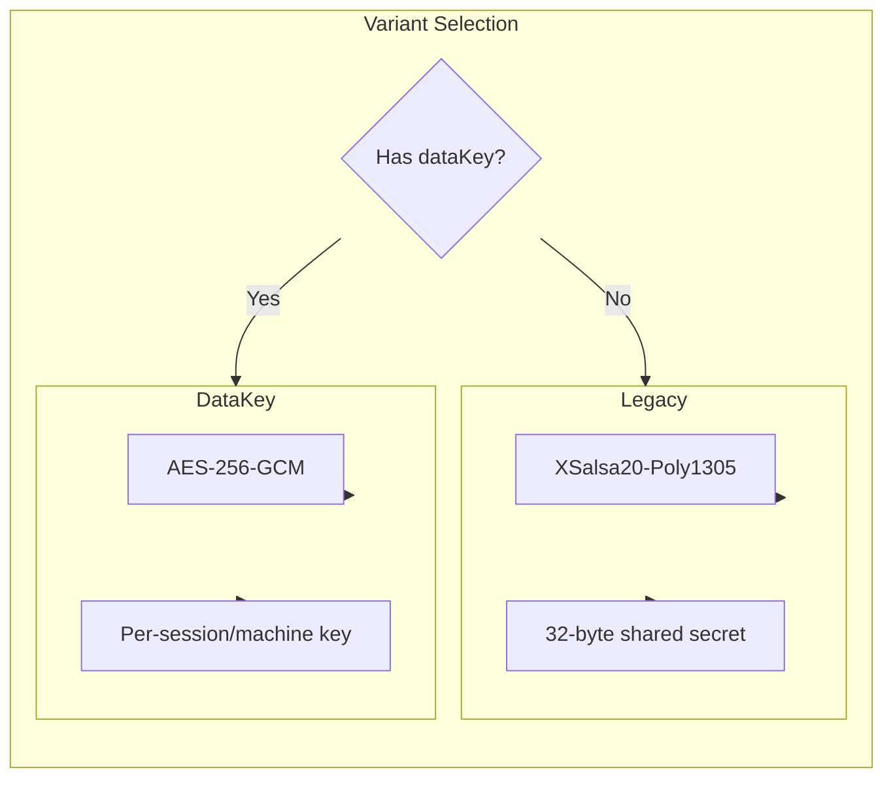

E2EE branches currently use one of two encryption variants. Plain branches do not
choose either variant and do not enter the Account cipher.

### 1) legacy (NaCl secretbox)
Used when the client only has a shared secret key.

**Algorithm**: `tweetnacl.secretbox` (XSalsa20-Poly1305)
- **Nonce length**: 24 bytes
- **Key length**: 32 bytes

**Binary layout** (plaintext JSON -> bytes):
```
[ nonce (24) | ciphertext+auth (secretbox output) ]
```

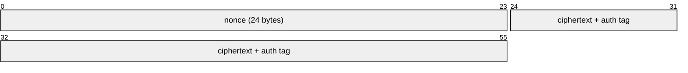

### 2) dataKey (AES-256-GCM)
Used when the client supports per-session/per-machine data keys.

**Algorithm**: AES-256-GCM
- **Nonce length**: 12 bytes
- **Auth tag**: 16 bytes
- **Key length**: 32 bytes

**Binary layout**:
```
[ version (1) | nonce (12) | ciphertext (...) | authTag (16) ]
```

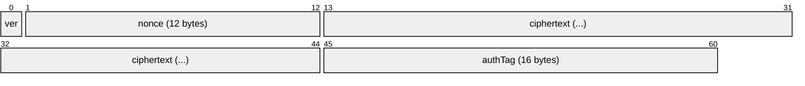

- `version` is currently `0`.

## Data encryption key (dataKey variant)

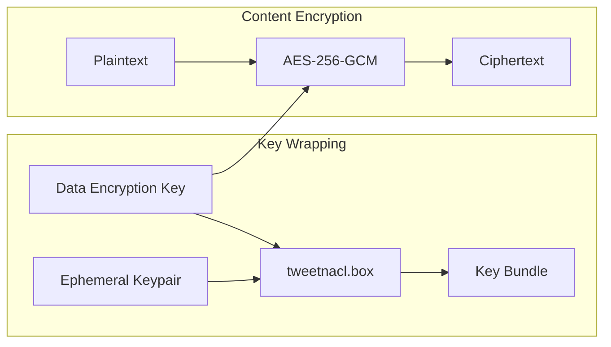

When `dataKey` is used, the actual content key is encrypted for storage/transport.

**Algorithm**: `tweetnacl.box` with an ephemeral keypair.
- **Ephemeral public key**: 32 bytes
- **Nonce**: 24 bytes

**Binary layout**:
```
[ ephPublicKey (32) | nonce (24) | ciphertext (...) ]
```

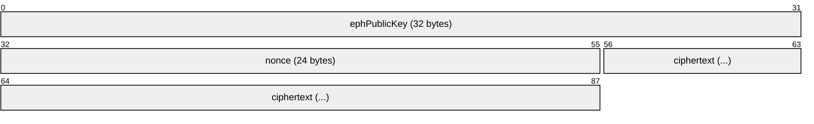

This blob is then wrapped with a version byte before being sent/stored:
```
[ version (1 = 0) | boxBundle (...) ]
```

The resulting bytes are base64-encoded and placed in fields such as `dataEncryptionKey` for sessions/machines/artifacts.

## Where storage mode is applied

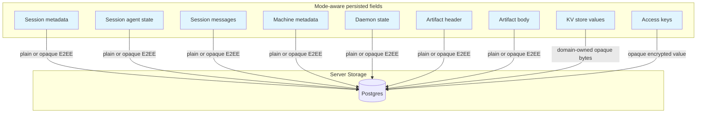

These fields are mode-aware. E2EE branches remain opaque ciphertext to the server.
Plain branches carry a strict stored-content envelope and may be sealed only inside the
server persistence layer.

### Session metadata + agent state
- E2EE Sessions are encrypted by the client.
- Layout-0 plain Sessions use explicit plain content.
- Layout-1 owner metadata uses one strict Session-specific stored-content envelope:
  `{ t:'plain', v:<strict owner metadata> }` for a genuinely keyless/plain Account or
  `{ t:'encrypted', c:<account-scoped ciphertext> }` for E2EE ownership. The plain
  branch requires no Account key; the encrypted branch requires real compatible
  material.
- Fresh layout-1 creation and owner-driven layout-0 migration activate only after the
  complete compatibility-declared Session/CPX writer, reader, tuple-CAS, and recipient
  projection vertical is green. Schema presence alone does not activate it.
- Used in:
  - `POST /v1/sessions` (create/load)
  - WebSocket `update-metadata` / `update-state`
  - `update-session` events

### Session messages

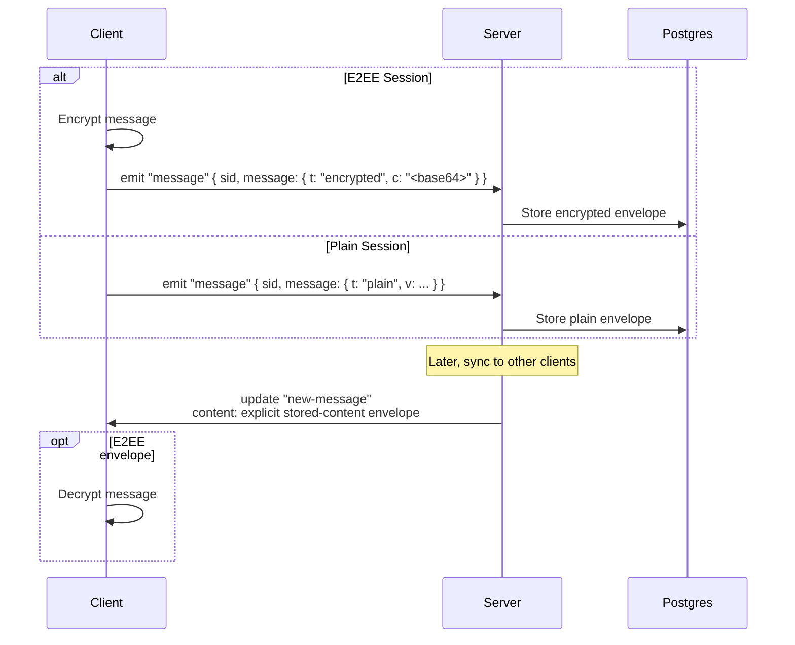

- The client emits an explicit `{ t: "encrypted", c }` or `{ t: "plain", v }`
  envelope. A legacy ciphertext string is normalized to the encrypted branch.
- The server enforces that the envelope kind matches the Session's persisted
  `encryptionMode`, stores it as `SessionMessage.content`, and emits the same
  canonical envelope in `new-message` updates.

### Machine metadata + daemon state
- E2EE Machines retain the client-encrypted per-Machine branch.
- Plain Machines carry base64-encoded `{ t:'plain', v }` metadata/state and use the
  corresponding plain marker in `dataEncryptionKey`.
- Machine RPC uses the persisted Machine row mode. Token-only callers never enter the
  account-cipher path.
- Used in:
  - `POST /v1/machines`
  - WebSocket `machine-update-metadata` / `machine-update-state`
  - `update-machine` events

### Artifacts
- E2EE Artifact `header` and `body` are encrypted bytes encoded as base64.
- Plain Artifact values are base64-encoded `{ t:'plain', v }` envelopes with the
  canonical plain data-key marker.
- Stored as `Bytes` in the DB.
- Emitted in `new-artifact` / `update-artifact` events as base64 strings.

### Access keys
- `AccessKey.data` is treated as an **opaque encrypted string**.
- The server does not decode it or inspect its contents.

### Key-value store
- `UserKVStore.value` is intentionally opaque bytes encoded as base64 on the wire.
- `kvMutate` expects base64 strings; `kvGet/list/bulk` return base64 strings.
- Each domain using KV owns its content contract. For example, Todo owns its explicit
  plain/encrypted envelope; KV must not guess by attempting decryption.

## On-wire formats (mode-aware fields)

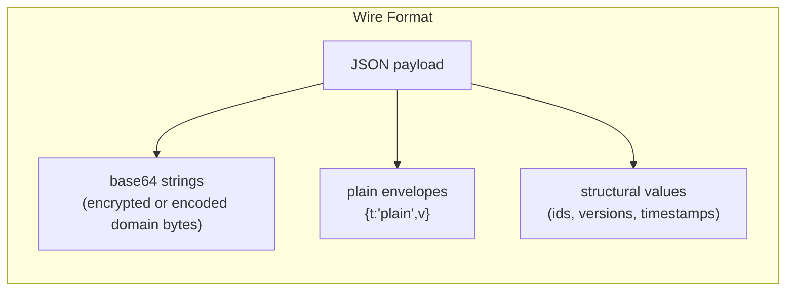

Below are representative shapes. Exact domain routes may encode a plain envelope as
JSON or as base64-wrapped canonical JSON. A base64 string is an encoding, not proof
that the value is encrypted.

### Session creation
```http
POST /v1/sessions
```
```json
{
  "tag": "<string>",
  "encryptionMode": "e2ee | plain",
  "metadata": "<mode-compatible encoded value>",
  "agentState": "<mode-compatible encoded value or null>",
  "dataEncryptionKey": "<base64 data key bundle for e2ee; null for plain>"
}
```

### Session message (client -> server)
```
Socket emit: "message"
```
```json
{
  "sid": "<session id>",
  "message": { "t": "encrypted", "c": "<base64 encrypted>" }
}
```

For a plain Session, `message` is `{ "t": "plain", "v": <json> }`.

### Session message (server -> client)
```
update.body.t = "new-message"
```
```json
{
  "t": "encrypted",
  "c": "<base64 encrypted>"
}
```

or:

```json
{
  "t": "plain",
  "v": "<json>"
}
```

### Session metadata update (WebSocket)
```
Socket emit: "update-metadata"
```
```json
{
  "sid": "<session id>",
  "metadata": "<mode-compatible encoded value>",
  "expectedVersion": 3
}
```

### Machine update (WebSocket)
```
Socket emit: "machine-update-state"
```
```json
{
  "machineId": "<machine id>",
  "daemonState": "<base64 encrypted or base64 plain envelope>",
  "expectedVersion": 2
}
```

### Artifact create/update (HTTP)
```http
POST /v1/artifacts
```
```json
{
  "id": "<uuid>",
  "header": "<base64 encrypted or base64 plain envelope>",
  "body": "<base64 encrypted or base64 plain envelope>",
  "dataEncryptionKey": "<base64 data key bundle or canonical plain marker>"
}
```

### KV mutate (HTTP)
```http
POST /v1/kv
```
```json
{
  "mutations": [
    { "key": "todo.index", "value": "<base64 domain-owned envelope bytes>", "version": 2 },
    { "key": "prefs.legacy", "value": null, "version": 5 }
  ]
}
```

## Client-side content types

These are representative structures before mode-specific encoding. E2EE branches
encrypt them; plain branches place them in the domain's strict plain envelope. They
are defined in `apps/cli/src/api/types.ts` and the corresponding Protocol domain
schemas.

### Session message content

The payload stored in `SessionMessage.content` is always explicitly wrapped. For an
E2EE Session:
```json
{ "t": "encrypted", "c": "<base64 encrypted>" }
```

For a plain Session:
```json
{ "t": "plain", "v": { "role": "user", "content": { "type": "text", "text": "..." } } }
```

### Message payload before mode-specific encoding

**User message**
```json
{
  "role": "user",
  "content": { "type": "text", "text": "..." },
  "localKey": "...",
  "meta": { }
}
```

**Agent message**
```json
{
  "role": "agent",
  "content": { "type": "output | codex | acp | event", "data": "..." },
  "meta": { }
}
```

### Metadata
```json
{
  "path": "...",
  "host": "...",
  "homeDir": "...",
  "happyHomeDir": "...",
  "happyLibDir": "...",
  "happyToolsDir": "...",
  "version": "...",
  "name": "...",
  "os": "...",
  "summary": { "text": "...", "updatedAt": 123 },
  "machineId": "...",
  "claudeSessionId": "...",
  "tools": ["..."],
  "slashCommands": ["..."],
  "startedFromDaemon": true,
  "hostPid": 12345,
  "startedBy": "daemon | terminal",
  "lifecycleState": "running | archiveRequested | archived",
  "lifecycleStateSince": 123,
  "archivedBy": "...",
  "archiveReason": "...",
  "flavor": "..."
}
```

### Agent state
```json
{
  "controlledByUser": true,
  "requests": {
    "<id>": { "tool": "...", "arguments": {}, "createdAt": 123 }
  },
  "completedRequests": {
    "<id>": {
      "tool": "...",
      "arguments": {},
      "createdAt": 123,
      "completedAt": 123,
      "status": "canceled | denied | approved",
      "reason": "...",
      "mode": "default | acceptEdits | bypassPermissions | plan | read-only | safe-yolo | yolo",
      "decision": "approved | approved_for_session | denied | abort",
      "allowTools": ["..."]
    }
  }
}
```

### Machine metadata
```json
{
  "host": "...",
  "platform": "...",
  "happyCliVersion": "...",
  "homeDir": "...",
  "happyHomeDir": "...",
  "happyLibDir": "..."
}
```

### Daemon state
```json
{
  "status": "running | shutting-down",
  "pid": 123,
  "httpPort": 123,
  "startedAt": 123,
  "shutdownRequestedAt": 123,
  "shutdownSource": "mobile-app | cli | os-signal | unknown"
}
```

## Content-open flow (client side)

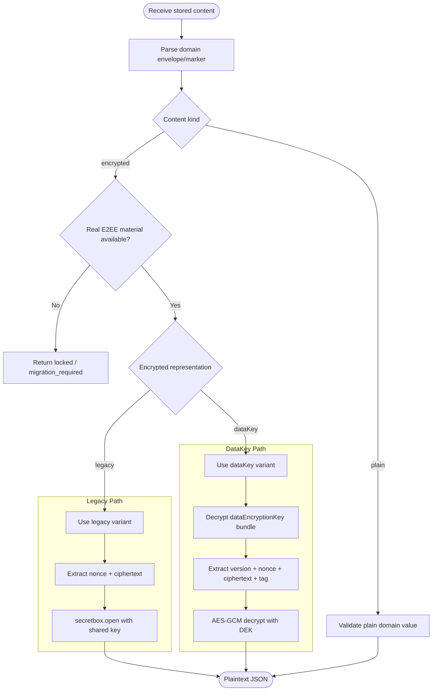

- Parse the domain's strict representation before choosing a crypto path.
- Return a validated plain value directly for `{ t: "plain", v }`.
- Enter the Account or Session cipher only for the encrypted branch and only with real
  matching material.
- If material is absent or ciphertext cannot be opened, preserve the stored value and
  return a typed locked/migration-required result. Do not try the plain branch after a
  decryption failure.

For `dataKey`, clients must first decrypt or derive the per-session/per-machine data key from the stored `dataEncryptionKey` bundle.

## Server-side at-rest sealing

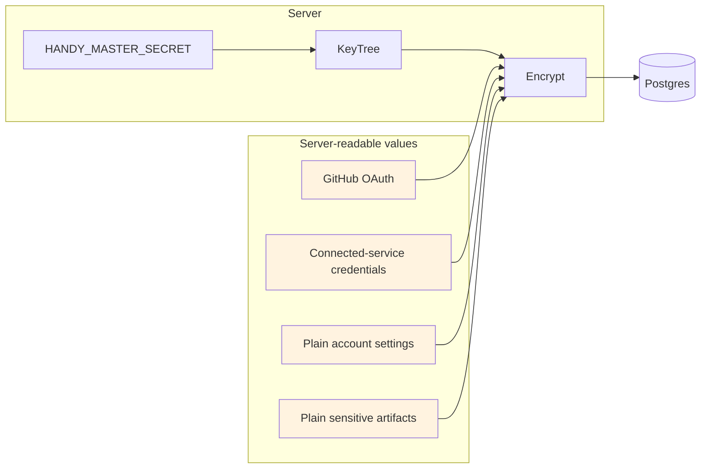

The server encrypts certain OAuth/service tokens and may seal selected plain-account
settings, connected-service credentials, and Artifact content at rest. These values
use a server-only KeyTree derived from `HANDY_MASTER_SECRET`; they are not end-to-end
encrypted. The server opens them for authorized application use and returns canonical
plain envelopes, never the internal `sealed_v1`/`server_sealed` wrapper.

`none` stores the canonical plain representation directly in the database.
`server_sealed` reduces exposure of database files and backups that do not also include
the master secret. It does not protect against a compromised live server or an
operator/process that can access both the database and `HANDY_MASTER_SECRET`.

Backups that may contain server-sealed values are recoverable only with the exact
matching `HANDY_MASTER_SECRET`; light-flavor backups must also preserve the generated
`handy-master-secret.txt`. The current server initializes one active KeyTree and has no
multi-key read or automatic re-seal rotation path. Do not rotate the master secret in
place: retain it through restore, or first implement and verify a domain-complete
old-key-to-new-key re-seal procedure. Changing it directly can make sealed values
unreadable and also affects other auth/token material derived from the same secret.

## Encoding conventions

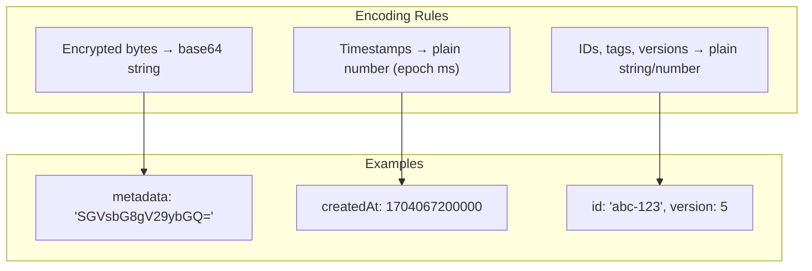

- Encrypted bytes are base64 strings on the wire unless explicitly noted.
- Some domain-owned plain envelopes are also base64 encoded for byte-oriented routes;
  base64 does not imply confidentiality.
- Timestamps remain plain numbers (epoch ms) and are not encrypted by the server.
- Non-encrypted identifiers (ids, tags, versions) are always plain strings/numbers.

## Session storage modes

Sessions can store transcript content in encrypted-at-rest or plaintext-at-rest mode. This is a storage mode, not a transport-security or authentication mode.

Canonical concepts:

- **Server storage policy:** `required_e2ee | optional | plaintext_only`, surfaced through `/v1/features`.
- **Account encryption mode:** `e2ee | plain`, used as the default for new sessions.
- **Session encryption mode:** `e2ee | plain`, fixed at session creation so a transcript does not mix modes.
- **Content envelope:**
  - encrypted content: `{ t: 'encrypted', c: string }`
  - plaintext content: `{ t: 'plain', v: unknown }`

Write paths must enforce mode/content-kind compatibility:

- `e2ee` sessions accept encrypted content only.
- `plain` sessions accept plain content only.

Clients must parse the envelope and branch explicitly. Do not guess that content is encrypted.

Layout-1 Session owner metadata is a separate privacy contract approved by
`PLAINTEXT-ACCOUNTS-2026-07-30.6`. Current source carries one strict plain/encrypted
owner envelope through the canonical tuple and recipient projector. The server may
read the strict plain owner branch for a plaintext Account, but only the Session owner
may receive that branch. View, edit, admin, friend, and public recipients receive the
  strict shared projection and an authoritative Agent-state tombstone. Edit/admin is an
action authorization level, not owner-private data access. Current-format operations
require a current caller declaration. Release readiness remains gated by mixed-version
proof and the remaining integration/live checks, not by an operator activation mode or
legacy socket drainage.

Sharing rules:

- Plain sessions can share without `encryptedDataKey` because access is server-managed.
- E2EE sessions and public shares require a valid encrypted data-key envelope.

Feature gates:

- `encryption.plaintextStorage`
- `encryption.accountOptOut`

Do not gate plaintext behavior on raw env vars or `capabilities` fields.

### Account-mode transition status

Account mode and Session transcript mode are separate: an Account transition does not
re-encrypt Session messages or change a Session's persisted `encryptionMode`.
Layout-1 owner metadata is different because its owner envelope is Account-scoped and
must match the Account mode.

Approved amendment `PLAINTEXT-ACCOUNTS-2026-07-30.7` adds one bounded
`sessions: assert_empty | migrate` directive to the existing Account transition.
Each migration item covers exactly one active or archived layout-1 Session and
carries `sessionId`, expected layout `1`, exact metadata and Agent-state versions,
the exact expected owner envelope, and the exact target owner envelope. The server
uses Account-first lock order and the existing Session tuple CAS/projector, changes
only the owner envelope plus canonical versions/cursors, completes every Session
rewrite before the final Account mutation, and rolls the whole transition back on
conflict. It does not re-encrypt Session transcripts or change Session mode, keys,
sharing, lifecycle, or archive state.

For a truly keyless Account, `.7` requires fresh GitHub/OIDC/OAuth/mTLS
reauthentication through the existing external-auth challenge and identity-proof
owner before the first E2EE key may be attached. A stored Happier bearer, a proposed
key signature, or a client/server nonce alone is insufficient. The proof is
short-lived, single-use, and bound to the Account, external identity, and canonical
migration request.

Exact lost-response replay canonicalizes the request once for signatures and fresh
reauthentication. The raw digest is not placed in the client-visible change stream;
the server stores only a domain-separated master-secret binding in the existing final
account/self `AccountChange` hint. Only the identical request at the exact committed
post-state returns read-only success; missing, pruned, overwritten, stale, or
mismatched evidence fails closed. There is no receipt table, worker, second replay
owner, raw-request storage, or offline equality oracle for prior plaintext.

Current source implements the `.7` bounded active-plus-archived Session directive,
fresh GitHub/OIDC/OAuth/mTLS first-key authority, canonical request digest, and exact
read-only server replay. The UI owner/callback/storage boundary retains one bounded,
expiring, server-scoped continuation and retries the exact stored request before
starting fresh authentication. Authoritative E2EE Settings hydration performs one
bounded retry without a new challenge; credentials persist before custody clears.
The strict literal `migrationSubmissionAttempted?: true` marker is persisted with the
pending handle before the first POST, and a failed custody write produces zero POSTs.
Only a definitive first-submission 4xx except 408/429 may clear custody; ambiguous
transport/5xx/408/429, commit-observed/post-persist, and every later failure retain it.
The root-independent final rerun is green at 45/45, direct UI TypeScript 7 is green,
and the scoped diff check is green pre-gap evidence. First-key resume now owns one
exact POST per resume with hidden API backoff disabled only for this path; marked
active-server mismatch retains custody before rejection with zero POST/persist/clear,
while unmarked mismatch keeps prior cleanup. Module-local mutation serialization and
bounded primary→legacy→global lookup close the stale-state race and legacy-reader
omission; root-independent evidence is 67/67 including exact concurrency, direct UI
TypeScript 7, and scoped diff green. Cross-tab/worker serialization remains a platform
residual. Approved amendment `.8` guards ordinary logout and different-token
replacement before mutation, keeps successful same-token recovery signed in for
recovery-key backup/copy, and permits credential destruction only after
warning-backed exact abandonment removes the observed marked record. A clear failure
preserves credentials; 401/token invalidation is not abandonment. Amendment `.9` is
the current approved contract and extends these `.8` outcomes. The
[canonical plaintext-accounts plan](../.project/plans/happier-plaintext-accounts-keyless-external-auth-and-account-data-envelopes-2026-02-23.md)
owns mutable execution status and exact QA evidence. No source result alone activates
the transition.

## Terminal pairing authentication rollout

Terminal pairing v3 adds a 32-byte secret to the QR/deep link and authenticates the sealed
content-key response with HMAC-SHA-256. The terminal keeps that secret local and does not include it
in the relay auth request.

The current rollout is an **expansion phase**: new native clients produce v3 responses, while the
terminal still accepts legacy v1/v2 responses for compatibility. Until a later release activates
v3 enforcement, a malicious relay can still downgrade the exchange to a forged legacy response.

Users who want to opt into enforcement during the expansion phase can require the current
authenticated protocol locally:

```bash
HAPPIER_TERMINAL_PAIRING_REQUIRE=v3 happier auth
```

`v3` is a minimum accepted pairing-protocol requirement: legacy v1/v2 responses are rejected, and
future supported versions may satisfy the same or a stronger requirement. Unknown values fail
closed with a configuration error. For `auth request --json` plus `auth wait`, the requirement is
persisted in the private pending-auth state so the wait process cannot accidentally lose it.

Native-app QR pairing can provide relay-independent authentication once enforcement is active
because the secret travels camera-to-app. Web pairing cannot make the same guarantee against a
hostile self-hosted relay: that relay also serves the JavaScript which receives the secret, so the
web flow necessarily trusts its web origin.

Plain-account terminal pairing uses a strict authenticated token-only discriminator (`0x01`) inside
the sealed v3 response and carries zero Account E2EE material. The claim endpoint independently
mints and returns the terminal bearer under claim-secret authorization; the approving client never
exports or reuses its own bearer. The terminal composes those two authenticated facts and persists
`{ token, encryption: null }`.

The requesting terminal advertises token-only reader support as `supportsTokenOnly=1` only alongside
complete v3 pairing context. The approver requires that capability plus confirmed plain Account mode
and enabled `encryption.plaintextStorage` and `e2ee.keylessAccounts` decisions. Missing capability,
legacy links, malformed context, older readers, and CLI-to-remote approval from token-only
credentials fail closed; keyed v1/v2/v3 behavior remains unchanged.

## External Sessions secure refresh and publication

External Sessions keeps live Agent-source content opaque to the server. Its canonical live-refresh path is:

1. the daemon emits `external-session-transcript-invalidated`, a content-free event bound to the current machine, session, link, qualified Agent/source identity, contribution generation, and a non-reversible cursor identity;
2. the client requests one bounded authoritative `readAfterTranscript` through the existing machine-encrypted RPC path; and
3. only an exact-current `advanced` result may release items to the canonical transcript convergence owner.

The invalidation contains no transcript content, title, preview, `linkData`, raw Agent cursor, or source path. The encrypted RPC response protects the complete read-after payload; External Sessions does not define per-item encryption envelopes. `already_current` applies nothing. Stale or mismatched bindings, gaps or expired cursors, source replacement, source unavailability, and read failure all apply zero items. A gap requests one bounded authoritative resync; replacement, unavailability, and failure retain the last accepted authority and surface recovery instead of accepting a truncated transcript.

The default invalidation-to-`readAfterTranscript` path has a release-like p95 budget of less than one second and must preserve dedupe, gaps, anchors, and scroll continuity with at most one bounded read per coalesced invalidation. A ciphertext fast path is not an unconditional second protocol. It may be added only after a recorded failure of that latency budget or a mandatory continuity property, and then only inside an existing encrypted socket/RPC owner with the same canonical payload and cursor semantics, server opacity, and authoritative read-after fallback on gaps.

External transcript authority is separate from the session's `e2ee | plain` content-storage mode:

| `currentStorageState` | Read authority and publication ceiling | Sharing |
| --- | --- | --- |
| `machine_only` | The linked Agent source is authoritative while reachable; server transcript readers expose no rows. | Not shareable; persisted import is required. |
| `server_partial` | The linked Agent source remains authoritative while reachable. An offline incomplete initial import is fenced at `acceptedThroughServerSeq`, and the UI may select that subset only while the matching public operation projection proves the same initial-partial fence. | Not shareable. |
| `snapshot_complete` | The Agent source remains live authority while reachable. Offline server reads are capped at `publishedThroughServerSeq` and require a complete publication tuple. | Shareable as a complete published snapshot. |
| `hosted` | The hosted transcript is authoritative; no External Sessions publication ceiling applies. | Shareable under the normal hosted-session rules. |
| `legacy_external_unknown` | Fails closed at sequence zero until a supported compatibility reader establishes authority. | Not shareable. |

The server applies the publication ceiling before ordinary pagination and derived projections, including counts, list previews, latest-turn/attention state, exports, notifications, and friend/public/share readers. Operation-private staging is never public. A failed or cancelled catch-up leaves the prior complete publication visible; only canonical publication advances the public ceiling.

Server-readable publication metadata is limited to an opaque publication id, source observation time, and published server sequence. Raw Agent-source cursors and paths remain local or E2EE-owned, and content-derived watermark digests are not publication identities.

Canonical owners:

- secure refresh schema and application decision: `packages/protocol/src/sessions/external/secureRefreshV1.ts`
- storage/publication state: `packages/protocol/src/sessions/external/operationV1.ts`
- server publication and sharing fence: `apps/server/sources/app/session/sessionTranscriptPublicationPolicy.ts`
- client read-authority selection: `apps/ui/sources/sync/runtime/external/externalSessionTranscriptAuthority.ts`

## Implementation references
- Client crypto: `apps/cli/src/api/encryption.ts`
- Session message format: `apps/cli/src/api/types.ts`
- Server message ingestion: `apps/server/sources/app/api/socket/sessionUpdateHandler.ts`
- Artifact/KV routes: `apps/server/sources/app/api/routes/artifactsRoutes.ts`, `apps/server/sources/app/kv/kvMutate.ts`
