# Encryption and Data Encoding

This document details how plaintext and E2EE account/session data is represented, how
encrypted blobs are structured, and how those values map onto protocol fields. It is
based on the canonical mode-aware domain owners, `apps/cli/src/api/encryption.ts`, and
the server routes that accept/emit these values.

For transport and event shapes, see `protocol.md`. For HTTP endpoints, see `api.md`.

## Account-mode invariant

A plaintext Account is intentionally and genuinely keyless:

- its client credential contains a bearer token but no private recovery secret,
  Account machine key, Account content key, or other Account data-encryption
  material;
- clients must not fabricate, derive, or require replacement Account material for a
  plain path;
- server-readable account data, settings, and secrets use explicit
  `{ t: 'plain', v }` content envelopes and remain protected by authentication,
  authorization, recipient projection, and TLS;
- optional server at-rest sealing uses separate server-owned infrastructure. It does
  not create or require client Account material and is not client E2EE;
- device-only secrets use a device-local key and are never uploaded or reused as an
  Account key.

Persisted `Account.encryptionMode` is the sole Account-mode authority. Neither
`Account.publicKey === null` nor a non-null public key determines whether the Account
is plain or E2EE. Public verification anchors may be retained without granting
decryption capability or changing the persisted mode.

An Account persisted as E2EE must have the required signing and content public-key
bindings, and an E2EE value still requires real client E2EE material. Missing or
inconsistent bindings and unavailable material fail closed as a typed
locked/inconsistent/migration-required state while preserving the stored evidence.
They must never cause an E2EE Account or row to be reinterpreted as plain, create or
attach replacement keys, try plaintext after decryption fails, or return
empty/default content.

The development `GET /v1/account/encryption/currentness` response includes
`recipientEnvelopeReadiness`, projected by the server's
`deriveAccountRecipientEnvelopeReadinessFromRow` owner. It contains only
`{ status: 'available' }` or `{ status: 'unavailable', reason }`, never binding
material. Plain Accounts report `plain_account` even when they retain a valid
public binding. An E2EE signing anchor with both content-key binding fields absent
reports `encryption_setup_required`; partial or invalid bindings report
`encryption_inconsistent`. The latter two remain HTTP 400 `migration-required`
responses with no trusted currentness fields. Clients may consume that error's
readiness explanation for key-delivery UI, but must not treat it as successful
encryption-currentness admission. Missing or malformed readiness remains unknown,
not inferred from key presence. This endpoint is development-only; it is absent
from the inspected 0.2.11 stable/preview and current 0.2 predecessor contracts.

After the Account-mode decision, each persisted row or domain envelope remains
authoritative for its representation until the canonical transition owner rewrites
it. Callers must not infer mode from a token, credential shape, key presence,
decryptability, or a local fallback.

At every Account-scoped read and write boundary, the persisted Account mode and the
domain envelope kind must agree: plain uses `{ t: 'plain', v }`, and E2EE uses
`{ t: 'encrypted', c }`. A mismatch fails with the domain's typed
locked/inconsistent/migration-required result before content disclosure or mutation,
while preserving the stored value; it must not become absence, defaults, or a
fallback to the other branch.

### Usage accounting (0.3 development)

Usage numbers, models, Agents and times remain server-queryable for both plain
and E2EE Accounts, like Happier-session usage. This is deliberately not an E2EE
numeric payload. Native source consent discloses this before capture. Prompts,
replies, file paths and file contents are not accounting fields. Source-root,
native-session and project identifiers use scoped opaque keys; an opaque key is
not a path label. Native-only human labels use the optional `label` on the
existing Project Account organization row: encrypted for E2EE Accounts, plain
for plain Accounts, and opened by authorized clients. Exact existing Workspace
references may supply their accepted Project identity, but capture does not
create a Workspace reference merely to label native usage, because that row
would also carry a root path. The collector retains its local project witness
in sealed pending custody while Account Project admission is unavailable.

The Machine collector seals normalized unacknowledged accounting together with
source cursors and consent using the incumbent device-local secret storage and
protected atomic writes, including for a keyless plain Account. This device
cipher is not an Account key and is never uploaded. Only acknowledged numeric
events retire from pending custody. An older server that cannot admit a native
subject is unsupported; a legacy Session report is not an acknowledgement.
See [actions.md](actions.md#native-usage-sources-development) for source controls.

### Provider Account Usage history (0.3 development)

Provider quota and subscription/capacity snapshots are a separate domain from
the server-queryable accounting above. Their accepted history keeps B's existing
plain/sealed Account-mode representation; an authorized client opens sealed
content, and mode/content disagreement fails closed. Retention metadata does
not make the quota or capacity numbers SQL-queryable for E2EE Accounts.

History also follows B's existing lifecycle. The explicit Account-mode
conversion owner, `migrateConnectedServicesAccountEncryptionInTx`, clears B's
source links and current records when changing modes, including when migrating
credentials. Accepted history is deleted with those parent records through its
composite cascading foreign key; it is not rewrapped or recoverable from a
later provider refresh. New observations start new history. This describes
unreleased development behavior, not continuity across mode conversion or
completed loaded-runtime validation.

User-entered monthly subscription amounts are a separate, qualified-account
facet on the existing Provider Account Usage record. Its metadata retains an
explicit plain or encrypted content envelope; encrypted amounts use the
existing provider-usage cipher domain and an addressed, strict price payload.
The price-only mutation checks persisted Account mode before writing, and the
authorized quota opener verifies mode and qualified identity before disclosure.
Provider refreshes retain this user facet independently of their own sealed
subscription observations. Mode conversion and record deletion have B's
existing destructive lifecycle described above. These are 0.3 development
source contracts, not released availability or completed live validation.

### Private Profile rows (0.3 development)

The development Profile row contract uses the reserved Account-row owner, not
Resource grants or arbitrary user KV. `profiles/profileRecordV1.ts` owns the
strict record: Profile identity and definition, enablement, private prompt stack,
and SavedSecret bindings. Stored readers project known fields recursively and
verify the addressed identity; canonical writes reject unknown fields.

The Account envelope is explicit: `{t:'plain',v:record}` needs no Account
encryption material, while `{t:'encrypted',c}` uses the
`account_profile_record` cipher purpose. Clients open E2EE records and verify the
inner Profile identity. A Profile's private stack and bindings are not implicitly
published with its launch-profile Artifact; Artifact access remains separately
owned.

Private binding overrides distinguish absence from an explicit `null`: absence
inherits the Artifact's string reference, while `null` suppresses that slot.
`readEffectiveProfileSecretBindingsV1` is the common addressed Artifact/reference-census
owner; it validates the selected Artifact's Profile identity before applying
`resolveEffectiveProfileSecretBindingsV1`. Masked slots are not SavedSecret references. Artifact defaults and retained
predecessor Settings bindings remain string-only. An explicit private mask must
not be projected back into either of those formats.

Profile mutations carry the selected Artifact's addressed header/body revision.
An opaque E2EE row must supply that capture or explicit `null` for a non-Artifact
definition; omission is not evidence of absence. The server rechecks current
Artifact access and revisions. It derives effective Plain bindings from the real
Artifact, while E2EE bindings remain opened and admitted by the captured client.
Inherited bindings participate in the same SavedSecret resource-revision check
as private overrides; merely displaying an unattached Artifact does not retain a
credential.

Creating actual BuiltIn private membership captures its prior no-entity
enablement and retires only that BuiltIn's Settings enablement key. The same
transaction always performs a captured Settings CAS, even when the key is absent,
before committing the row and reference guard. Favorites, defaults and unrelated
Settings remain unchanged.

`loadProfileCatalogV1` consumes paged rows, the Profile reference guard and the
transfer-control read under one captured Account scope. Its `ready`, `partial`,
`loading` and `unavailable` states are distinct from legacy-transfer authority.
Usable neighbors may be displayed from a partial inventory, but it is not a
complete runtime, conversion or destructive-reference census. The reference guard
contains only a versioned null-content tombstone, never a plaintext binding index.

A genuine predecessor transfer keeps its prepared/active proof in one
Account-mode envelope using the `account_profile_transfer` cipher purpose. Only
the authorized client opens encrypted phase and inventory; the server validates
captured identities, access and revisions without decrypting that proof. The
Plain destination census uses the same effective-binding owner after opening
current addressed Artifacts, so unmasked inherited SavedSecret defaults require
their own usable, current resource inventory. A private `null` mask does not.
Preparation refusal rolls back imported rows and the guard with its control;
activation refusal leaves the prepared proof unchanged. The
Account-mode conversion owner includes records and control, preserves tombstones
and guard revision, and rejects an incomplete census. These are development-source
contracts, not released availability or loaded-runtime certification.

Callers pass the complete captured catalog, including its paired opened records,
Artifact bodies and revisions, into Profile/SavedSecret transactions. They do not
reconstruct authority from a missing control or from a loose record array.
Source cleanup retains the original transfer-control revision through history
normalization; a later control winner leaves the inventoried history versions
cleanup-pending instead of authorizing a different rewrite.
After SavedSecret source cleanup, a fresh invocation can resume retained-history
cleanup using the exact current raw Settings/version and admitted owned, usable
resources with the deterministic Account/source identity. A still-present,
uncharacterized or stale source supplies no recovered proof. Unrecognized
historical credentials remain cleanup-pending rather than being removed wholesale.

The predecessor UI's `accountLegacySettingDefinitions` admits
`inferenceOpenAIKey` as a nullable bare Account string, not a SavedSecret object
or binding. The same importer preserves its exact opened value as an `apiKey`
resource under the canonical `legacy-inference-openai-key` source identity, then
removes only that root through captured Settings CAS. Its closed history proof
and fresh-invocation recovery use the same owned-resource authority. Unknown
root shapes remain pending; no replacement inference consumer is introduced.
The retained alias reader is needed until this source and its retained history
have been transferred, not as a second credential writer.
In 0.3 development this grammar lives only at
`savedSecretMutationOwner.ts#readSavedSecretTransferSourceV1`; the key is absent
from the writable Settings catalog and effective preference projection. It is
deliberately not a globally retired raw root: preference mutation and restore
keep the latest untransferred carrier, and history normalization removes only a
characterized source with admitted destination proof. Failed authoring-memory
destination commits similarly leave their original Settings carrier intact;
source removal follows the existing destination acknowledgement, never precedes it.

### Notification endpoint catalog (0.3 development)

The endpoint-catalog cutover is in progress. Its small Account row preserves channel
identities, endpoint guards and SavedSecret Resource references; a webhook's signing
bytes do not belong in that row. Plain rows open without Account E2EE material, while
encrypted rows use the `account_notification_channels` cipher domain and reject mode
mismatches. Push-token custody, global attention/privacy preferences and remote-alert
policy remain with their existing owners.

Initial signing-resource creation and channel initialization share the incumbent
SavedSecret transaction. The captured source Settings version and complete prior row
reference inventory fence admission; destination-only initialization leaves Settings
unchanged. Existing-row edits may pair a finite preference change through the ordinary
Settings writer. That does not make row presence evidence of completed source cleanup.

Stored readers keep valid independent neighbors diagnosable, but an incomplete catalog
cannot authorize delivery or a complete credential census. Unknown actual SecretString
markers or reference carriers must not disappear through a tolerant projection. A
carrier outside an identifiable channel makes the catalog unavailable rather than
inventing a channel diagnostic.

Retained signing-source cleanup requires characterized source material and the exact
owned, usable Resource value. Historical snapshots re-admit that proof against each
snapshot's opened signing bytes; a current-source proof cannot certify rotated historical
material. Plain material is also compared at the server where openable. Opaque E2EE
material remains a keyholding-client responsibility. Unknown, unreadable or mismatched
material stays cleanup-pending. These are development contracts, not a claim that the
UI cutover, source/history erasure or composed live validation is complete.

### Preset Machine environment references (0.3 development)

Revisioned Machine presets and admitted managed-creation setup snapshots retain
SavedSecret references, not resolved credential values. The existing resource
mutation owner includes archived presets and retained allocations in its
deletion/dependency census. Promotion rewrites only the owning Account's
references, using the resulting shared resource's actual revision; it preserves
the admitted setup content and stage facts.

Canonical clients carry the genuine persisted personal-source identity in
`personalSecretPromotions`. Newly staged credentials are not persisted personal
sources and do not supply that mapping. Removing an unmapped Plain source that
would strand a known environment reference is refused before mutation. The
server cannot derive an omitted mapping from opaque E2EE Settings; opening
credential material remains with its existing Account-mode and grant owner.
Resolved overlays reach only the setup process, not native tool installation.
See [the Machine environment owner](./cli-architecture.md#preset-machine-environments-03-development)
for execution and recovery.

### Private Remote host catalog (0.3 development)

`remoteHosts/remoteHostRecordV1.ts` owns the singleton reserved Account row
`@happier/account/remote-hosts/v1/catalog`. Plain content is keyless
`{t:'plain',v:{v:1,hosts}}`; E2EE content uses `account_remote_host_catalog`
(cipher domain byte 45). Host records contain SSH addresses and SavedSecret
references, not passwords or private-key material. Identity-file and SSH-config
paths remain device-local overrides.

The normal captured Account loader performs an in-place cutover of retained
development `remoteHostsV1` data, preserving host identities exactly. There is no
released 0.2 source or transfer-control row for this domain. A present row or
versioned deletion is authoritative and never falls back to the retired Settings
root. Malformed host entries, duplicate identities, unrecognized reference
carriers and unrecognized marked private material in a host leave the inventory
incomplete; usable neighbors are display-only, not mutation, runtime or cleanup
authority. Credential-bearing extras at the catalog or envelope boundary refuse
the whole inventory instead of disappearing through a tolerant projection.

Initialization captures the source Settings version. Later host writes use the
catalog revision without unrelated Settings or Profile guards. New SSH
credential material belongs to the canonical
SavedSecret transaction owner together with its host-reference mutation, not an
independent resource POST. Resource packets capture the complete prior host
reference inventory at its catalog revision and Account mode; next references
cannot substitute for that old census. Resource creation retains SavedSecret's
present-user admission, without restricting metadata-only host writes.
Source cleanup uses the admitted destination revision;
that revision alone cannot authorize discarding historical SSH credentials.
An admitted complete destination remains usable for SSH tasks and current-row
edits while source/history cleanup is pending. Those operations recheck Account
mode, catalog revision and the referenced Resource material; they do not wait
for or authorize historical erasure.
Each historical slot needs its own characterized material and exact-value proof
against a usable, owned SavedSecret Resource at its captured revision. Unknown,
unopenable or different material stays cleanup-pending rather than authorizing
another source import. SSH consumers resolve references only within their
originating Account and host revision, borrow material through task acceptance,
and retain the native host-key trust flow.

These are development-source ownership contracts. The shared SavedSecret batch
integration and composed loaded-runtime catalog journey are still being
integrated; this section does not claim released availability or certification.

### Private Agent, Provider and Connected Account catalogs (0.3 development)

The development contracts define singleton private catalogs through the
existing reserved Account-row owner, not arbitrary user KV or Resource grants.
Their envelope domains are allocated by
`packages/protocol/src/crypto/accountScopedCipherEnvelope.ts`:

| Catalog | Reserved Account key | Cipher domain / byte |
| --- | --- | --- |
| Provider connections | `@happier/account/provider-connections/v1/catalog` | `account_provider_connections` / 40 |
| Connected configurations | `@happier/account/connected-configurations/v1/catalog` | `account_connected_configuration` / 41 |
| Connected purposes | `@happier/account/connected-purposes/v1/catalog` | `account_connected_purposes` / 42 |
| MCP definitions and bindings | `@happier/account/mcp/v1/catalog` | `account_mcp_catalog` / 43 |
| Configured ACP definitions | `@happier/account/acp/v1/catalog` | `account_acp_catalog` / 44 |
| Connected personal labels | `@happier/account/connected-presentation/v1/catalog` | `account_connected_presentation_catalog` / 47 |
| Connected acknowledgements | `@happier/account/connected-acknowledgements/v1/catalog` | `account_connected_acknowledgement_catalog` / 48 |

Plain envelopes are keyless `{t:'plain',v}`. E2EE envelopes use
`{t:'encrypted',c}` with the exact catalog domain; a different domain or
unavailable key must not be interpreted as an empty Plain catalog. Connected
records also bind their inner `key` to `configurations` or `purposes`. Purpose
records retain the distinct qualified Team resource selection arm; moving these
records does not move Connected credentials or authentication groups.

The Protocol row contracts live in `providers/connections/connectionRowsV1.ts`,
`connect/connectedAccountConfigurationRowsV1.ts`,
`connect/connectedAccountPresentationRowsV1.ts`,
`mcp/servers/serverRowsV1.ts`, and `acp/catalog/catalogRowsV1.ts`.
Current writes are strict. Stored readers must preserve recognizable reference
carriers until the domain owner can establish a complete inventory; safe partial
display does not authorize runtime, destructive reference changes, source/history
cleanup or Account-mode conversion. A retained deletion keeps its revision and
must not be reseeded from an older Settings root.

Provider, Connected, Notification, RemoteHost, MCP and ACP catalog adapters share
the Account-storage admission failure classifier.
An HTTP 401 or 403 from either Account-mode admission or currentness withdraws
previously loaded private projections, as do scope retirement and unavailable
encryption material. A genuine transport failure retains stale display
continuity without restoring mutation authority. A mode-endpoint refusal must
not be reinterpreted as offline merely because its error carries an HTTP status
rather than a catalog-specific code.

Provider conversion participates through `providerConnections` in the existing
Account migration request and receipt. Migration admission checks the original
Plain body or decrypted E2EE body, not the tolerant display projection. Complete
stored bodies and envelopes retain their harmless additive JSON metadata
losslessly; ordinary newly authored catalog writes remain strict. Unknown
reference carriers, mixed envelopes and incomplete known records refuse
conversion rather than gaining authority or losing retained state. Complete
conversion preserves all catalog fields, including SavedSecret references,
grants, connection identities and revisions, and catalog tombstones. The live
Account row revision advances
once; a captured row deletion keeps its revision. The client checks the exact
returned row before adopting the target mode.

The mode-switch caller demands the captured Account's Provider catalog before
reading its fresh Settings baseline. Conversion builders preserve the exact
retained `providerSettingsV1` source, or its absence, until canonical catalog
initialization and source cleanup retire it. This bounded source preservation is
not a live Settings fallback or another transfer-control owner.

Connected presentation identifies an exact qualified account or group; it never
rewrites credentials or a group's definition name. Acknowledgements retain exact
Account or Machine warning scopes and sparse boolean values, including false.
Stored readers project additive fields away and expose valid neighboring entries
with diagnostics when a known entry is malformed. That partial display does not
authorize rewriting the incomplete catalog.

The current Settings preference facade omits Remote-host and notification endpoint
inventories, Connected personal labels, disclosure state and acknowledgements.
Their raw retained Settings carriers remain readable only by the domain import,
conversion and history owners until destination and credential-material proofs
authorize cleanup. Removing a facade field does not globally retire its raw
history key or authorize discarding an untransferred latest baseline. Finite
notification delivery/privacy and Connected quota/default preferences remain
ordinary Settings.

The credential-free demo world publishes its personal labels as an ephemeral
display projection through the same UI catalog projection owner. Only the
explicit seeded demo lifetime can expose that projection to scope-less readers;
real Account-scoped snapshots retain priority. Seed and clear neither create an
Account row nor grant write authority, and clear removes the projection while
restoring the demo-owned qualified Account and group profile slices. Demo labels
are not written to Settings or durable device storage.

Connected row disclosure belongs to the existing device-local
`collapsedGroupKeysV1` persistence owner, qualified by Home, Account, service and
account or group-member identity. Removing its retained Account source requires
an acknowledged local persistence operation, not an Account-row import claim.

The catalog ciphertext purposes have focused source-level isolation evidence.
Consumer contraction, complete partial-inventory handling and the composed
catalog conversion/live journey are still being integrated. This describes
development-source ownership, not released availability or runtime certification.

### Private prompt catalogs and Role overrides (0.3 development)

Account coding and Voice stacks, folders, invocations, external links, registry
sources, context selections and Role overrides use the reserved Account-row
owner. Profile stacks remain in the Profile record; document, bundle and Role
bodies remain Artifacts with their independent access rules. Plain catalogs use
keyless `{t:'plain',v:record}` envelopes. E2EE uses `{t:'encrypted',c}` with
`account_prompt_catalog` (kind byte 38), and the opened record binds its catalog
key to the requested row. `account_profile_record` uses the distinct development
allocation 37; Project setup trust retains 36.

The strict row writer and tolerant stored projection share the Protocol domain
schema. First initialization compares the captured Settings version under the
existing Account transition fence before row CAS. A present row or versioned
tombstone is destination authority; absence alone permits the explicit retained
source reader. Malformed, unavailable or future-version source data cannot become
a successful empty import. Guidance retention remains with the existing
deterministic Role Artifact migration and refuses an incomplete inventory.

Role source reads preserve usable BuiltIn, plugin and Artifact entries alongside
typed diagnostics for unreadable Artifacts or pre-import guidance. The canonical
selection resolver can serve a known Role from that partial inventory, but an
unknown origin returns `role_source_incomplete`; a fresh complete child snapshot
also requires a complete inventory. An inherited full Session Role snapshot
remains independent of unavailable Account sources. Guidance source cleanup
requires readable Account-owned Role Artifacts and their actual composite
revisions, preserving already edited Role bodies rather than overwriting them.
The shared Role-domain deletion admission rejects a target still derived from
current guidance Settings with `role_source_incomplete`, preventing a retained
source from recreating a deleted Role. It does not import Artifacts or deny
unrelated documents because another guidance entry is malformed. Once the
captured Account observes source cleanup, that source no longer protects the
target; historical Settings are sanitized, never re-imported as deleted Roles.

The existing atomic Account-mode transition inventories and reseals every live
prompt catalog through `promptLibrary:{items}` / `promptLibrary:{rows}`. Missing
coverage, wrong mode or stale revisions aborts the transition; client response
admission checks exact identities, revisions and replacement content before
adopting the target mode. Account catalog publication uses the existing scope
and lifetime, independently of the Settings revision. These are development
source contracts; complete consumer contraction and loaded-runtime validation
remain separate evidence.

Prompt-source conversion uses the original Account's fresh admitted raw Settings
and version together. Parsed defaults do not recreate absent retained prompt or
guidance roots, and retained source values are preserved exactly while the
existing conversion owner reseals the destination catalogs.

The UI's Profile and prompt catalog readers publish checked destination rows
before retained Settings/history cleanup settles. The existing scoped snapshot
loader owns that cleanup under its captured Account lifetime. Wakes still withdraw
current authority and coalesce a fresh foreground read; a read that defers cleanup
to the incumbent also schedules a cleanup-resuming read after it settles. Account
retirement prevents obsolete publication or reuse of the retired cleanup. Role
override mutation reads still await their canonical source/history cleanup before
returning; rendering readiness does not relax mutation admission.

The existing `folders` catalog is the single personal folder tree for library
Artifacts, including prompts, documents and memory documents. Its
`artifactHeadersById` map stores the generic `folderId` and `tags` metadata for
the current Account. Moving a received Artifact changes this private row, never
the shared Artifact or its grants. New prompt authoring follows the same owner.
Owned 0.2 header metadata remains a read-only fallback for fields without a
personal override; recipients do not inherit it. Folder deletion reparents child
folders and clears placements through explicit private overrides, including
owned legacy placements, without reading or rewriting document bodies.
Retained folder identities and topology survive catalog transfer unchanged;
semantic folder mutations reject cycles and missing parents. Folder Actions use
the observed row revision and refuse incomplete deletion inventories. These are
0.3 development contracts; the common tree model and drag/drop bindings are
non-visual, with browser hierarchy presentation supplied by its UI owner.
Content and personal organization have independent acknowledgments. If the
private-row mutation fails after content commits, the typed failure retains the
Artifact identity and, when supplied by its update receipt, the content revision;
callers must not replay content creation or adopt an unrelated current revision.

Prompt and skill references use the existing `PromptArtifactRefV1` address:
`{kind: 'doc' | 'bundle', artifactId, serverId?}`. The optional `serverId`
qualifies the Home; omission retains the admitted owner's Home. The address
does not grant access or select another Account's credentials. CLI and UI
readers capture the addressed Home/Account and use its canonical Artifact store
for header, body and revision facts. Reads are reused within one preparation,
not across turns or Account lifetimes. Display caches do not supply authoritative
prompt content. Plain and E2EE reads retain the Account-mode rules above.

Registry downloads and installation may target an Administration Machine on
another Home; that does not select the destination library Account. UI imports
and installs require the library's original Account authority, independently of
the Machine target. The canonical install operation preserves a consumed
successful Machine commit
ACK when later Artifact creation or catalog publication fails. Public Action
failures carry that effect receipt in `details` without the fetched private
title or body. A preview is not a commit, and cancellation before the ACK is
consumed does not prove whether the Machine wrote anything. Callers must not
claim rollback or blindly repeat an acknowledged installation.

External links retain the admitted Machine's portable `serverIdentityId`, not
its device-local routing ID. Matching and replacement use that Home together
with the existing Machine, Artifact, asset type, scope and workspace fields.
Predecessor links without a Home qualifier retain their original library-Home
interpretation; selecting an independent Home never adopts them there. New
writes qualify the relationship through the existing Protocol owner. Bare
cross-Home links written by unreleased intermediate code cannot be recovered
automatically without provenance.

Source/Project associations do not widen that authority. Preparation admits shared
Source context and the personal Project stack through the current qualified
workspace association, then resolves their references with the same Home/Account
reader. Worker preparation uses the worker's own persisted Profile and excludes
the Lead's Session stack; a Profile selection is not permission to read another
Account's documents.

The current D47/D48 memory block label carries the admitted document title, layer
and reference only after the same authorized read. Its always-loaded text is the
canonical index projection (key facts plus topic titles/summaries), not topic or
archive fact detail. Index/topics share the existing `memory_doc.v1` Artifact's
encryption, revision and grant authority; the projection adds no per-topic store,
grant or read transport.

Current reference and stack-entry writes are strict. Stored reads preserve valid
predecessor entries and all four placements while dropping obsolete `editPolicy`
annotations; `skill_instructions` still renders the bundle's root `SKILL.md`.
See [prompt context preparation](actions.md#prompt-context-preparation-03-development)
for composition and unavailable-document behavior.

### Authoring memory (0.3 development)

Recent machine paths, the last-used profile, and remembered engine selections use
the shared reserved Account-row read/CAS owner. Plain content is `{t:'plain',v}`
with a strict JSON value. E2EE content is `{t:'encrypted',c}` in the
`authoring_memory` Account-scoped cipher purpose (kind byte 33). The encrypted
payload is the strict `{key,value}` record; clients verify its key against the
requested row before returning the value. Opaque engine carriers remain strict
JSON, without reinterpretation at the server boundary.

Project navigation recency uses that same owner, with the qualified opaque key
`projectLastOpened:<encodeURIComponent(serverId)>:<encodeURIComponent(projectKey)>`
and a finite nonnegative timestamp value. Strict canonical encoding keeps distinct
Homes and Project anchors separate. Plain timestamp values are validated before
mutation or disclosure; opened E2EE payloads verify both timestamp and row binding.
Recency joins the Project projection without updating a structural ref or graph
revision. Rendering and normal Open do not write it; explicit Project navigation
does. Historical ref timestamps transfer through the existing absence-only memory
import before source retirement; conflicting retained values or tombstones must
remain observable to the cutover caller rather than silently discarding recency.

Stored readers derive their known-field projections from those canonical schemas,
dropping additive envelope, payload and engine-carrier fields while preserving opaque
selection values. Mutation inputs stay strict. Authoring values do not inherit the
retired whole-Settings document's generic collection, string and nesting budgets;
the recent-path UI owner still keeps its existing ten most recent entries.

The server checks persisted Account mode and cipher purpose for reads, lists, and
mutations. It never opens E2EE content. Tombstones retain the CAS revision, and
push hints carry only the row key and revision. These are development source
contracts; loaded-runtime validation and released availability are separate
claims. The [HTTP API](api.md#authoring-memory-03-development) owns the route shapes.

### Workspace execution config (0.3 development source)

Checkout worker preferences and service placement share one private reserved Account
KV row. Its opaque identity derives from the exact Home/ref pair; the authenticated
transport supplies the Account. Plain content uses `{t:'plain',v}` and requires no
Account encryption material. E2EE uses `{t:'encrypted',c}` with the
`workspace_execution_config` Account blob purpose (kind byte 35). The opened private
payload binds `{rowId,value}` to the requested row. The server validates the
representation and persisted Account mode while leaving E2EE content opaque.

The shared reserved-row owner enforces the Account transition fence, row CAS and
versioned tombstones. Account-side semantic edits preserve the finite/service
sibling fields and do not write Account settings or settings history. Stored
readers project known fields; mutation requests remain strict. Mode mismatch,
malformed content or inconsistent Account state refuses before disclosure or write.

The atomic Account conversion accepts `workspaceExecutionConfig:{items}` and
returns `workspaceExecutionConfig:{rows}`. It requires every active row and its
exact source revision, validates the target mode, and preserves tombstones.
Missing or incomplete inventory aborts the switch. Exact acknowledged replay
compares committed rows without writing. This is a development source contract;
release availability and loaded-runtime validation are separate evidence.

### Project setup trust (0.3 development source)

Setup consent belongs to the approving Account and its Home-qualified Project,
not the execution Machine or its custodian. The reserved Account-row adapter in
`app/projects/trust/projectTrustRowService.ts` stores one current
`{project:{serverId,projectId},reviewedEffectDigest,approvedAtMs}` value. Re-approval
replaces that value; Forget tombstones it through row CAS and affects future
preparation, not already admitted work. Physical keys contain only opaque qualified
ids, never a checkout path or private effect digest. Trust does not write Account
Settings or its history.

Plain Accounts use a keyless `{t:'plain',v}` envelope. E2EE uses `{t:'encrypted',c}`
with the `project_setup_trust` Account blob purpose (kind byte 36). The server
checks persisted Account mode and envelope grammar without opening ciphertext;
the approving-Account reader opens the value and binds its Project to the requested
row. Invalid content, mode mismatch and unavailable encryption material fail closed,
never become absent trust. Stored readers drop unknown fields recursively; mutation
inputs and canonical writes stay strict.

The same reserved-row owner participates in atomic Account conversion through
`projectTrust:{items}` and returns `projectTrust:{rows}`. Every live row and its
exact revision must be supplied in the target representation; missing, stale or
inconsistent inventory aborts the switch. Tombstones are retained, and exact
acknowledged replay checks the committed state without writing again. The client
conversion adapter must inventory, open and reseal these rows before submitting
the switch; ordinary mode-aware writes alone are not migration participation.

The Account-side human-decision producer admits only the current reviewed effect.
The authenticated Trust mutation route uses the canonical present-user guard for
non-null grants; automation credentials cannot create or replace consent. Forget
remains a separate CAS tombstone operation governed by its Action policy.
Configurable Action invocation approval cannot grant setup consent. Completion is
a separate target-local fact outside the checkout and Workspace Sync, persisted
only after every applicable setup step succeeds. The storage and consent ports are
development source contracts; integrated preparation/launch and released availability
require their own evidence.

The development-source UI client, `sync/api/account/apiProjectTrust.ts`, captures
the approving Home and Account for human Remember and shared purpose36 opening.
Account-mode inventory conversion delegates to that same opener. List and Forget
use `defaultActionExecutor`'s canonical `projectAction` family after configurable
Action policy; Remember uses the present-user-only non-Action mutation route.

### Project Account rows (0.3 development)

Private accepted workspaces, the Account's Workspace Sync relationship graph,
and Home-qualified Project organization use the reserved Account-row owner in
`app/projects/projectAccountRowService.ts`. Plain Accounts remain keyless.
E2EE content uses `project_account_row` (kind byte 34), with an opened
`{key,value}` payload bound to the exact requested row. The server validates
the envelope purpose and persisted Account mode without opening ciphertext.
Stored readers drop unknown fields recursively; mutation inputs remain strict.

One Account-wide graph row serializes relationship changes and ref insertion,
root changes, and Forget. Mutations compare its revision and the reached ref
revisions in one transaction; any conflict rolls back every row and its change
publication. Ordinary labels, facts, Hide, and pins use their own row revisions.
Navigation recency uses the authoring-memory row described above, not a structural
workspace field; strict Project ref writes reject `lastOpenedAtMs`, and retained
row projections drop it after the cutover transfers the timestamp.
Physical keys contain qualified opaque ids, and change hints contain only keys
and revisions. Row mutations do not update Account Settings or its history.
Account-mode transitions include a complete active-row census in the existing
transition request; tombstones retain their revisions and no private content.
Private Project Actions use the actual captured Account's credentialed row
channel. Workspace update admits label/pin metadata only; Forget is idempotent
when absent, protects even paused relationship endpoints, and never deletes
checkout bytes. UI and CLI consume the same Protocol removal decision. A foreign
requester's signed Source-metadata authorization does not authorize opening or
mutating the custodian's private rows or reading their Artifacts. Missing
requester-owned crypto/Artifact context fails closed, without credential fallback.
Cancellation after a row mutation reaches HTTP leaves settlement indeterminate;
it is not proof that no row changed.
These are development source contracts; loaded-runtime and released availability
remain separate evidence.

### Project Source metadata (0.3 development)

The shared Source catalog is a disclosed, server-readable metadata exception for
both plain and E2EE Accounts. `ProjectSource` stores the name, credential-free SCM
repository selection, optional default revision and contained folder, current
audience references, creator, revision, and purpose-tagged Artifact references.
It does not store repository bytes, setup commands, Git credentials, Artifact
keys, or Machine encryption material. Source metadata is not converted into a
private Account-row envelope when the Account changes encryption mode.

The Source owner in `app/projects/sources/projectSourceService.ts` admits reads
from current Account, Team and group membership. Management belongs to the
creator or current Team administration; an audience grant supplies view/use,
not edits or Machine authority. Strict writes select supported credential-free
locator fields, and stored readers drop nested unknown fields. Metadata edits
and exact attachment intents use the Source revision CAS.
Creation reuses the existing actor-scoped request identity and RepeatKey retention;
an acknowledged replay reads current admitted metadata rather than creating another
Source. A changed payload or unavailable recorded row refuses instead of duplicating.

Attaching requires independent current Artifact access. Plain Artifact headers
also receive server-side kind admission; E2EE headers stay opaque and their
kind is admitted by the Account-side Action client after its real Artifact read.
Source visibility never supplies an Artifact grant, key, content access, or
checkout permission. Detach and Source deletion remove metadata only, leaving
Artifact bytes, grants, and checkout files intact. Qualified foreign references
retain their exact Home and use the canonical Account-side Artifact reader for
access and kind admission. The Source transaction never substitutes a same-id
local Artifact or grants rights at either Home.

These are development source contracts; loaded-runtime and released availability
remain separate evidence.

### Review Comment CRUD (0.3 development)

The development CLI and UI adapters consume one Protocol-owned record transport.
An E2EE mutation first sends its structural operation and a keyed content
commitment to `/v1/reviews/comments/mutations/prepare`. The server authorizes
the actor, scope and expected revision and returns server-generated structural
facts with an opaque, authenticated preparation receipt. The client opens any
previous record, checks its target/currentness, and seals the complete sensitive
record against the authorized comment id, revision and body version. It then
submits the receipt, record ciphertext and encrypted event to
`/v1/reviews/comments/mutations/commit`. The server rechecks admission, Account
mode/key binding and CAS before writing through the existing canonical storage
and migration encoder; preparation creates no reservation row or second store.

Anchors, snapshots, bodies, edit history, evidence, reasons, sensitive finding fingerprints, links,
fixes and metadata remain inside the sensitive envelope. New structural records
retain the anchor kind, not raw path or message-hash indexes. Host-signed current
intent for host-authorized creates is checked against the logical effect locally and bound to the keyed
commitment and actual HTTP bytes on both mutation phases. Existing finding identities
and reviewed fingerprints remain structural identity/currentness facts. Equivalent-create
retries preserve the existing record and event; semantic finding dedupe consumes
the shared workspace-or-project/session scope. Later review-group membership is
a separate CAS transition, not a duplicate-create rewrite.

Reads request stored records and open them locally using the persisted Account
mode. Path, severity and taxonomy filters are applied after opening, while the
shared client drains structural pages to fill the requested logical page.
Missing E2EE material returns `review_comment_encryption_material_unavailable`
before HTTP; mode mismatches and unreadable or substituted record bindings fail
closed. Ordinary E2EE reads and mutation preparation also reject legacy split
records with `review_comment_encryption_mode_mismatch` before returning their
source, because those rows can contain clear sensitive metadata. Their explicit
Account migration/recovery path remains available; ordinary plaintext legacy
reads remain supported. Retained sources are not new writers or a generic
untagged-ciphertext fallback. Plaintext mutations keep their
HTTP surface but use the same structural derivation and canonical record storage.
The separate publication transport remains unchanged. This is 0.3 development
source behavior, not a released availability or loaded-runtime certification claim.

Review snapshot capture preserves complete selected lines and their surrounding
context, without a separate file-size or line-byte cutoff. Protocol owns the
snapshot hashes and BIDI/minified diagnostic facts used by CLI capture, UI draft
promotion and plaintext server validation. Minified text is diagnostic metadata,
not a reason to discard captured evidence. Review proposal batches have no
separate count or aggregate-byte cutoff; their strict individual proposal and
containing transport contracts still apply.

Account-mode conversion reads the complete Review Comment and event inventory
and checks exact source envelopes and currentness before rewriting it in the
Account transition transaction. Comment and event counts have no separate
ceiling; the containing Account transition retains its existing
8,000,000-byte UTF-8 request boundary.

### Terminology and rollout status

Older descriptions used **keyed** and **keyless** as shorthand for whether
`Account.publicKey` was present. That shorthand is superseded because authentication
credentials, Account mode, and the representation of an existing row are separate
facts:

- **token-only credential** means a bearer token with zero Account E2EE material;
- **E2EE credential** means a credential carrying real legacy or data-key material;
- `Account.encryptionMode` authorizes the representation of new account-scoped writes;
- an existing row's persisted representation remains authoritative until an explicit
  migration rewrites it.

Bearer-token, OAuth/OIDC, GitHub, or mTLS authentication is sufficient to authorize a
plain account. It does not create encryption material and must not be used to derive
any.

Current development source contains the token-only credential shape, mode-aware
domain readers, the stored-content caller declaration, and the Session layout-1
path. Clients do not preflight stored-content server versions before Account-mode
reads, authentication, Machine operations, hosted Sessions, Todos or Voice History.
Account currentness, signed identity, storage policy and encryption material still
decide whether the operation can proceed. Source presence alone is not proof that
the complete token-only onboarding flow has passed its persistence, composed and
platform checks. Components update together; readers retain 0.2-created data.

The server's current advertised stored-content implementation is protocol `4`,
while protocol `2` remains the minimum compatibility floor for incumbent
stored-content operations. Current callers advertise the cumulative V4 contract,
which covers both the optional Session-access response witness and Account Settings
writers that preserve complete raw Profile rows, with
`x-happier-account-stored-content-protocol: 4` on HTTP and
`accountStoredContentCompatibility:{v:1,protocolVersion:4}` in Socket.IO auth.
The `/v1/features` discovery request remains header-free. Before discovery, current
clients send their implicit cumulative V4 declaration on ordinary requests so a cold
Settings restore is identified as profile-preserving; explicit operation declarations
remain unavailable until the server advertises support. Missing or malformed
declarations identify legacy callers; they do not reject the connection.
Operations that must read or write the current stored-content representation return a
typed `client-upgrade-required` result to a legacy caller, while operations that remain
safe without interpreting that representation continue to work. There is no operator
`observe`/`required` activation mode for account stored content.

Both `/v1/account/settings` and `/v2/account/settings` require the V4 writer
declaration before replacing the shared Settings document. The server does not inspect
the opaque body for Profile fields: released 0.2 writers normalize whole Profile rows
through an older closed schema and can erase V2 fields even during an otherwise
unrelated Settings write. Reads and unrelated operations remain available, and no
parallel Profile representation or dual writer is maintained.

The settled source boundary is green for genuine token-only OAuth/mTLS, the E2EE-only
Account cipher, corrupt local-key handling, the single UI Settings normalizer, Memory
Settings typed errors, Machine/Todo/Artifact fences and current producers, the global
declaration, Session layout 1 across Protocol/server/CLI/UI/runtime, the
Provider/MCP/Memory/resume/attach/prompt-Artifact consumers, and the final Connected
Services handoff, which reports 226 tests green. Current Protocol, Server, CLI, and UI
TypeScript 7 are green. These results do not by themselves close
mixed-version, live, database, two-client, daemon, or platform proof.
Account-transition amendment
`PLAINTEXT-ACCOUNTS-2026-07-30.7` is source-green at its Protocol, server, CLI, and
UI first-key owner/Settings/callback/storage boundaries. The UI retains one bounded,
server-scoped OAuth or mTLS continuation, expires it explicitly, stores the callback
pending handle before migration, and performs one exact retry from authoritative E2EE
Settings hydration without starting a new challenge. Credentials persist before
custody clears. The root-independent pre-provenance rerun is green at 40/40, and
direct UI TypeScript 7 is green. The final implementation now persists the strict
literal `migrationSubmissionAttempted?: true` marker with the pending handle before
the first migration POST; a failed custody write produces zero POSTs. Only a
definitive first-submission 4xx except 408/429 may clear custody. Ambiguous transport,
5xx, 408/429, commit-observed/post-persist failures, and every later failure retain
custody. The root-independent final rerun is green at 45/45, direct UI TypeScript 7 is
green, and the scoped diff check is green pre-gap evidence. The two source corrections
have since landed: first-key resume owns one exact POST per resume with hidden API
backoff disabled only for this path, and marked active-server mismatch retains custody
before rejection with zero POST/persist/clear while unmarked mismatch keeps prior
cleanup. Module-local mutation serialization and bounded primary→legacy→global lookup
close the stale-state race and legacy-reader omission; root-independent evidence is
67/67 including exact concurrency, direct UI TypeScript 7, and scoped diff green.
Cross-tab/worker serialization remains a platform residual. Approved amendment
`PLAINTEXT-ACCOUNTS-2026-07-31.8` closes the logout/account-replacement decision:
ordinary logout and different-token replacement must fail before credential or app
state mutation and route to **Finish encryption setup** while marked custody exists.
Successful same-token recovery keeps the user signed in for recovery-key backup/copy.
Only a separately confirmed destructive abandonment may exact-clear that marked
record before credentials are removed or replaced; its warning must state that E2EE
may already have committed and discarding the pending key may permanently lose
Account access. Token invalidation is not safe abandonment. Amendment `.9` is the
current approved contract and extends these `.8` outcomes. The
[canonical plaintext-accounts plan](../.project/plans/happier-plaintext-accounts-keyless-external-auth-and-account-data-envelopes-2026-02-23.md)
owns mutable execution status, exact source evidence, and open database/live/platform
gates. Source evidence described here does not by itself activate the feature.

### Key ownership

| Material | Plain account | E2EE account | Owner and purpose |
|---|---:|---:|---|
| Account E2EE material | absent | present | Client-side confidentiality for account-scoped E2EE content |
| Session data key | only for a retained E2EE Session | per E2EE Session | Session transcript/metadata confidentiality |
| Server at-rest key | optional | optional | Server-owned database/backup exposure reduction |
| Device-local key | present per device | present per device | Local secret/cache/daemon restart persistence |
| TLS/auth material | present | present | Transport and account authorization, never content-at-rest encryption |

In current 0.3 development source, a plain Account may retain genuine predecessor
credential material for retained encrypted history, including E2EE Sessions and
their Automation templates. This is historical custody, not active Account E2EE
material: persisted Account mode still controls every Account-scoped read and write.
A retained template opens only after its explicit predecessor Session binding is
resolved through that Session's authenticated envelope. Without the key it remains
locked and deletable. Account transition completion and template recovery preserve
historical credentials even when an inventory finds no encrypted dependencies:
another key-holding client can create an E2EE Session after that read. Returned
encrypted trigger definitions and opaque predecessor Run summaries retain their
existing locked/plain-Account reader rules.

In current 0.3 development source, a retained encrypted Automation bound to an
E2EE Session on a now-plain Account is paused and listed as **Needs your review**.
An ordinary list read may pause it, but never opens or replaces its ciphertext.
Opening the row deliberately uses that device's authenticated retained-Session
key path to prepare an in-memory Workflow draft. The draft is not published into
the shared trigger-list state. **Save** is explicit consent to write a normal
Account-plain Workflow through the canonical trigger writer; the Session's own
E2EE envelope and key custody do not change. Missing keys, failed authentication
and conflicts leave the template untouched. Automatic Account recovery still
reports `retained_e2ee`, not a plain conversion.

On a plain Account holding historical credentials, **Forget the old encryption key**
uses the client-placed `account.encryption.historicalKey.forget` Action. Settings,
Agent/MCP requests and plugin SDK callers share its scoped credential owner.
Agent/MCP requests cannot waive present-user approval; a headless executor without
the invoking client's credential custodian returns typed unavailability rather than
discarding a daemon's credentials. The device owner always requires destructive
human confirmation and returns `forgotten`, `nothing_retained`, or `cancelled`.
It lists known encrypted Sessions,
templates/trigger sets and Run history before confirmation; incomplete inventory
prevents discard. The warning covers encrypted Sessions created after the listing
as well. It adopts token-only credentials through the existing scoped credential
owner, with Account mode/currentness and expected-credential checks. Server content
is not deleted, and automatic recovery never invokes this action.

For predecessor templates with a plain target or no Session target, the existing
Account transition converter performs explicit one-time recovery to canonical plain
content using genuine historical material and the template-version CAS. Failed
decryption leaves the row locked, and a conflict never overwrites the newer row.
This recovery neither creates Account keys nor changes the retained Session's mode.
The invoking client's `account.encryption.automationTemplates.recover` Action owns
this operation, and the Account recovery control calls that same Action. It reports
each template as `recovered`, `already_plain`, `retained_e2ee`, `locked`, or
`conflict`. It requires present-user authority; Agent/MCP discovery does not waive
the human-approval floor. A client without historical key custody returns typed
unavailability. Recovery retains the historical credentials; only Forget discards
them after human confirmation.

### Device-local secret sealing

Device-local sealing is deliberately separate from account encryption:

- the CLI/daemon owns one private key file at
  `~/.happier/device-local-secret-key.json`;
- the file is created once with publish-if-absent semantics so concurrent daemon
  startup cannot replace another process's key;
- protection is applied by one owner,
  `apps/cli/src/utils/fs/protectedLocalState.ts`, for every private local file the
  CLI/daemon writes — device-local key, bearer credentials, capability file,
  machine-local records alike. POSIX installations enforce a private parent
  (owner-owned, no `0077` bits) and a `0600` file mode; Windows cannot express a
  POSIX mode, so it applies and then verifies a protected DACL (inheritance
  disabled, owner plus `LOCAL SYSTEM`, full control, no reparse point) through
  `packages/cli-common/src/fs/windowsProtectedAcl.ts`. A Windows install where that
  DACL cannot be proven fails closed rather than publishing an unprotected file;
- the key is 32 random bytes and is never derived from a bearer token, account key,
  installation signing identity, Machine identity, or server response;
- local secret payloads use AES-256-GCM with a random 12-byte nonce and
  `session_respawn_environment` purpose-bound AAD;
- opaque local identities use HMAC-SHA-256 with the same device-local key and the
  distinct `external_session_transcript_refresh_cursor` purpose; this hides the raw
  Agent cursor without turning it into an Account identity or uploading the key;
- local Memory settings secrets use a 32-byte key derived from the same device-local
  root with HMAC-SHA-256 and the distinct `memory_settings_secrets` derived-key
  purpose. Current CLI writes seal with that derived device key; reads also accept
  supported legacy credential-derived keys for compatibility. The derived key is
  neither Account material nor portable cross-device custody;
- daemon Memory indexes contain plaintext derived summaries, transcript chunks, and
  embeddings. Their root directory and SQLite main/WAL/SHM files use the same
  protected-local-state owner before sensitive rows are written; SQLite sidecars
  created later inherit from that protected root. An unsafe or symbolic-link root
  is rejected rather than used;
- corrupt or missing ciphertext fails closed. A corrupt existing key file is never
  silently replaced, because doing so would make all prior local ciphertext
  permanently unreadable without explaining the loss.

New daemon respawn descriptors use `device_local_v1`. The existing
`account_scoped_v1` descriptor remains a read-only compatibility shape for markers
written by the supported predecessor. Canonical writers do not dual-write both
representations, and the compatibility reader can be removed once those markers are
no longer reachable.

Device-local sealing protects files on that device. It does not turn plaintext
account data into E2EE data, does not make local data portable to another device, and
must never be uploaded as an account recovery mechanism.

The secure External Session transcript-refresh path reads the existing
`StoredCredentials` union and requires the daemon to inject this device-local custody
explicitly. It has no Account-key/HMAC fallback and no second local secret store.

### Machine-local Agent native-resume records

Same-Session Agent transition can return to an Agent used earlier in the same Session by resuming
that Agent's own native session. The record holds the Agent's own conversation id and the transcript
seq it last saw (`{ v, vendorResumeId }` plus `departureSeqInclusive`) — **not a continuity proof**;
the proof mechanism was removed, so there is no pre-check, no `stat()` and no liveness probe. It is
machine-local because a vendor session on one machine cannot be resumed on another, and it is
deliberately kept off the wire. It is machine-local state, not Account data.

`apps/cli/src/session/handoff/metadata/localSessionHandoffMetadataStore.ts` owns the record:

- path `<activeServerDir>/session-handoff/agent-native-resume/<hash>.json`, where `<hash>` is
  SHA-256 over a domain-separated tuple (`happier.local-agent-native-resume.v1`, Session id, Agent
  id). Filenames therefore disclose neither the Session nor the Agent, and the plaintext keys inside
  the record are re-verified against the request before it is used;
- written and read through `writeProtectedLocalStateFileAtomic` /
  `readProtectedLocalStateFile` (`apps/cli/src/utils/fs/protectedLocalState.ts`): directories `0700`,
  files `0600`, forbidden bits `0077`, and an atomic tmp+rename replace whose verification is of the
  path's permissions, not a content read-back. `writeAgentNativeResumeRecord` returns `void`: every
  read `safeParse`s, so a partial file already reads as absent and a read-back could only restate
  that;
- a corrupt or unreadable record resolves to `null` and the target Agent starts fresh. It is never
  silently rewritten;
- the record is **not** discarded when the target Agent starts. A discard was not observable and was
  not garbage collection either, since nothing sweeps the directory; a later departure overwrites the
  record instead. Orphaned records after Session deletion are a disclosed residual — no Session-delete
  signal reaches this store.

This is file protection on one machine, in the same sense as device-local sealing above: it is not
Account material, it is not portable to another device, it is never uploaded, and it confers no
account-scoped confidentiality. It is distinct from device-local *sealing* — the record's contents
are not encrypted with the device-local key; its protection is filesystem permissions plus a
non-identifying filename. Do not promote it to an Account-scoped identity or reuse it as a recovery
mechanism.

`../0.2` has the same device-local record in
`apps/cli/src/session/handoff/metadata/localAgentNativeResumeRecordStore.ts`. Its dedicated module
and dev's combined metadata store are a file-layout difference only: both use the same protected
path/strict stored shape and byte-compatible record. The record never crosses the wire, so a return
on a different machine still starts fresh with full bounded context.

## Overview

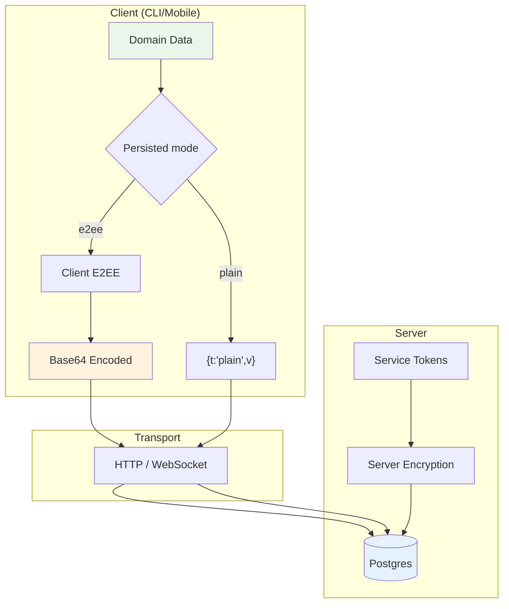
```mermaid
graph TB
    subgraph "Client (CLI/Mobile)"
        Plain[Domain Data]
        Mode{Persisted mode}
        ClientEnc[Client E2EE]
        PlainEnvelope["{t:'plain',v}"]
        B64[Base64 Encoded]
    end

    subgraph "Transport"
        Wire[HTTP / WebSocket]
    end

    subgraph "Server"
        Store[(Postgres)]
        ServerEnc[Server Encryption]
        Tokens[Service Tokens]
    end

    Plain --> Mode
    Mode -->|e2ee| ClientEnc --> B64 --> Wire --> Store
    Mode -->|plain| PlainEnvelope --> Wire --> Store
    Tokens --> ServerEnc --> Store

    style Plain fill:#e8f5e9
    style B64 fill:#fff3e0
    style Store fill:#e3f2fd
```

## Design goals
- Keep the server blind to E2EE content.
- Keep plaintext accounts genuinely keyless and server-readable by explicit user/server
  policy.
- Use explicit, stable binary layouts so clients can interoperate across versions.
- Prefer simple, consistent base64 encoding on the wire.
- Keep account, Session, server-at-rest, device-local, and transport key ownership
  separate.

## Encryption variants

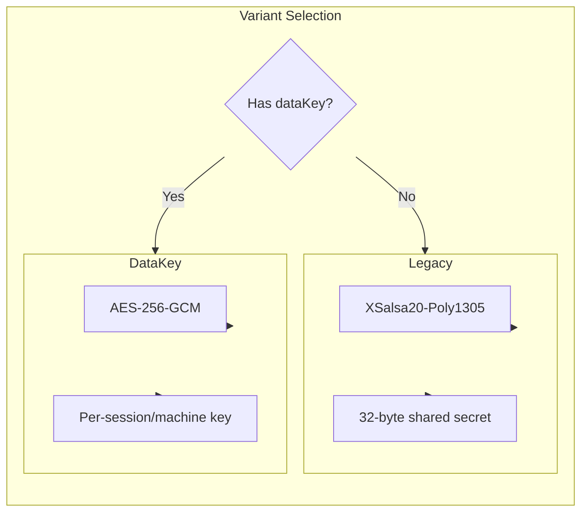
```mermaid
graph LR
    subgraph "Variant Selection"
        Check{Has dataKey?}
        Check --> |No| Legacy[Legacy NaCl]
        Check --> |Yes| DataKey[DataKey AES-GCM]
    end

    subgraph "Legacy"
        L1[XSalsa20-Poly1305]
        L2[32-byte shared secret]
    end

    subgraph "DataKey"
        D1[AES-256-GCM]
        D2[Per-session/machine key]
    end

    Legacy --> L1 & L2
    DataKey --> D1 & D2
```

E2EE branches currently use one of two encryption variants. Plain branches do not
choose either variant and do not enter the Account cipher.

### 1) legacy (NaCl secretbox)
Used when the client only has a shared secret key.

**Algorithm**: `tweetnacl.secretbox` (XSalsa20-Poly1305)
- **Nonce length**: 24 bytes
- **Key length**: 32 bytes

**Binary layout** (plaintext JSON -> bytes):
```
[ nonce (24) | ciphertext+auth (secretbox output) ]
```

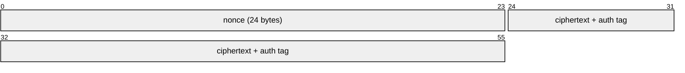
```mermaid
packet-beta
  0-23: "nonce (24 bytes)"
  24-55: "ciphertext + auth tag"
```

### 2) dataKey (AES-256-GCM)
Used when the client supports per-session/per-machine data keys.

**Algorithm**: AES-256-GCM
- **Nonce length**: 12 bytes
- **Auth tag**: 16 bytes
- **Key length**: 32 bytes

**Binary layout**:
```
[ version (1) | nonce (12) | ciphertext (...) | authTag (16) ]
```

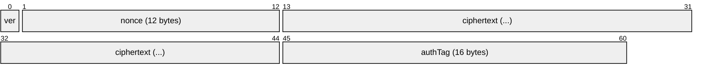
```mermaid
packet-beta
  0-0: "ver"
  1-12: "nonce (12 bytes)"
  13-44: "ciphertext (...)"
  45-60: "authTag (16 bytes)"
```

- `version` is currently `0`.

In current development source,
`packages/protocol/src/crypto/sessionDataKeyBundleV0.ts` owns this version-0
framing, its 12-byte nonce and 16-byte tag boundaries, and the existing serialized
JSON value format. `packages/protocol/src/crypto/sessionDataKeyBundleWebCrypto.ts`
owns the shared browser WebCrypto seal/open implementation. This extraction leaves
the version-0 wire bytes unchanged.

The UI's `AES256Encryption` and browser AES wrappers consume those owners while
retaining the native string-cipher adapter and native-worker batching path. The
CLI's data-key adapter retains synchronous Node AES-GCM and delegates framing and
serialization to Protocol. These are platform adapters, not separate bundle
formats; the shared open result distinguishes authenticated content, unsupported
framing, authentication failure, and authenticated invalid JSON. This describes
development implementation ownership, not released SDK availability.

## Live-stream frame and input transport (0.3 development)

Live-stream socket payloads follow Account mode explicitly. Pixels are represented as
`{ t: 'plain', v: <base64> }` or `{ t: 'encrypted', c: <base64 ciphertext> }`; input
sidebands wrap the complete typed control object instead of exposing text, coordinates,
event or lease details on E2EE paths. No key is generated, fabricated or consulted for
a plain Account.

`machines/peer/mediation/stream/payloadV1.ts` in Protocol owns seal/open and validation,
using the incumbent Machine content cipher (`MachineContentCodec` in the daemon,
`MachineEncryption` in the UI), with its existing legacy/data-key framing. The authenticated
content contains the purpose `machine_live_stream_v1` and the decoded envelope. Opening
reconstructs and compares all clear routing/frame headers, so changing the source, target,
viewer socket, stream or sequence cannot redirect authenticated content. Missing keys,
mode mismatch, wrong keys and binding mismatch return typed failures before disclosure
or input dispatch; neither encrypted failure nor an absent mode becomes plaintext.

The server admits against persisted `Account.encryptionMode`, meters actual transport bytes
(including cipher overhead), and never opens frame/input ciphertext. Capture and player
objects remain decoded only inside their processes. The former advisory `encryption`
metadata is not a security contract and has been replaced by mandatory payload envelopes.
This describes current development source, not published-release or live-certification
evidence. See [Peer mediation](peer-mediation.md#live-stream-payload-privacy-03-development).

## Data encryption key (dataKey variant)

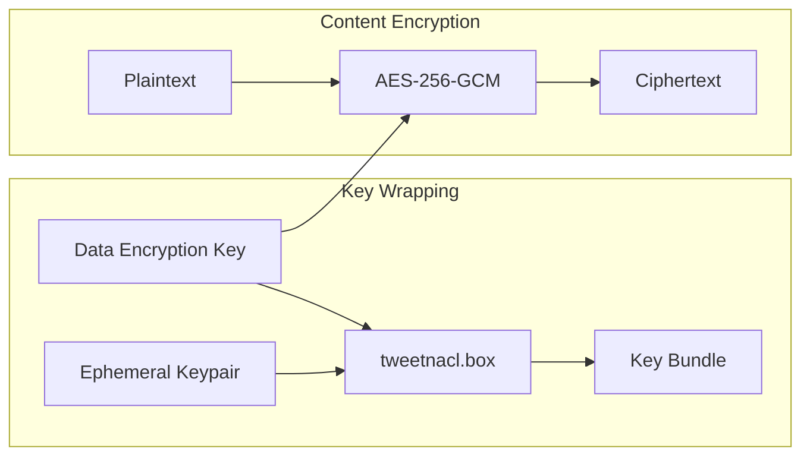
```mermaid
flowchart LR
    subgraph "Key Wrapping"
        DEK[Data Encryption Key]
        Eph[Ephemeral Keypair]
        Box[tweetnacl.box]
        Bundle[Key Bundle]
    end

    DEK --> Box
    Eph --> Box
    Box --> Bundle

    subgraph "Content Encryption"
        Plain[Plaintext]
        AES[AES-256-GCM]
        Cipher[Ciphertext]
    end

    DEK --> AES
    Plain --> AES --> Cipher
```

When `dataKey` is used, the actual content key is encrypted for storage/transport.

**Algorithm**: `tweetnacl.box` with an ephemeral keypair.
- **Ephemeral public key**: 32 bytes
- **Nonce**: 24 bytes

**Binary layout**:
```
[ ephPublicKey (32) | nonce (24) | ciphertext (...) ]
```

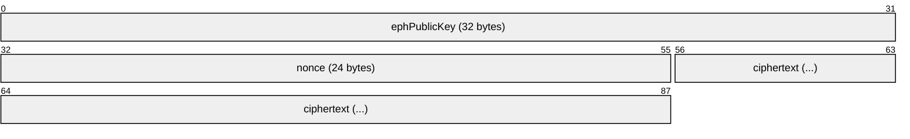
```mermaid
packet-beta
  0-31: "ephPublicKey (32 bytes)"
  32-55: "nonce (24 bytes)"
  56-87: "ciphertext (...)"
```

This blob is then wrapped with a version byte before being sent/stored:
```
[ version (1 = 0) | boxBundle (...) ]
```

The resulting bytes are base64-encoded and placed in fields such as `dataEncryptionKey` for sessions/machines/artifacts.

The fixed data-key envelope is exactly 105 bytes — version `0`, a 32-byte ephemeral
public key, a 24-byte nonce, a 16-byte tag, and the wrapped 32-byte data key — which is
140 characters of padded Base64. `crypto/encryptedDataKeyEnvelopeV1.ts` is the sole
codec for it; `crypto/boxBundle.ts` stays a generic variable-length box and never
acquires 32-byte semantics.

Those sizes are owned by pure format leaves that import no crypto implementation:
`crypto/boxBundleFormat.ts`, `crypto/encryptedDataKeyEnvelopeFormatV1.ts`, and
`crypto/accountContentKeyBindingFormatV1.ts`. Wire schemas admit an envelope or a
transported content-key binding by importing those constants, so a schema reachable
from the public SDK's browser surface does not pull the seal/open codec's
Node-reachable dependency graph in behind it. The codecs consume and re-export the same
constants, so a producer and a validator cannot disagree about a released size.

### Account recipient bindings (development)

`crypto/accountContentKeyBindingV1.ts` owns the shared Protocol signer and verifier.
It preserves the existing signed bytes: UTF-8 `Happy content key v1`, one NUL byte,
then the raw content public key. Verification rejects malformed or low-order content
keys and invalid signatures, returns copied binding bytes, and uses the existing
content-public-key fingerprint owner. Server admission still owns initialization,
immutability, persistence, and Account encryption currentness.

A verified signature binds the content key to the supplied Account signing key.
It does not independently authenticate that signing key when an unpinned Home lookup
can substitute the whole binding. This preserves the existing Account trust boundary;
it does not establish cross-user key transparency or out-of-band verification.

That distinction is why a Runner Machine envelope is never authenticated by an
unpinned Home lookup alone. Protected SDK delivery to a restricted Runner is
implemented on exactly that footing: the independently authenticated producer is
the creator-generated activation signing identity, and the SDK verifies the
published binding against the Home, creator Account and Machine taken from its
own locally pinned credential before it seals anything. The Machine-targeted
carrier is described under "Machine metadata + daemon state" below. Session-targeted
protected calls also resolve the Session's exact Machine and verify its
creator-authenticated activation binding before sealing the request; they do not
treat a Home-returned Machine envelope as an independent authenticity proof.
This describes the implemented transport contract, not certification of the
complete Runner activation and runtime journey.

The development server's `accountRecipientEnvelopeReadiness.ts` derives recipient
readiness from that Account currentness owner. Healthy Plain Accounts remain unavailable
for recipient wrapping even with a retained public binding. A valid E2EE signing anchor
with both content-binding fields absent needs encryption setup; partial or invalid
bindings need repair. Complete verified E2EE bindings are available for wrapping.
Account status and Session access must be checked separately before disclosing this
projection. These owners alone do not establish completion of the Session-envelope
persistence or sharing-flow cutover.

The authenticated exact-user response used by trusted direct-grant hosts carries this
same readiness decision alongside the already-published binding. The current UI and
CLI hosts branch on that projection before sealing: authoritative unavailable recipients
receive key-free logical grants and remain locked with their original setup or repair
reason. Only `available` recipients have their binding verified and used; a malformed
projection, invalid available binding, or failed lookup is not setup-pending readiness.
Broad friend/search projections do not acquire a
second readiness decision. The physical grant transaction still re-reads the Account
row and applies the same server owner, so the projection is preparation input rather
than authorization or a client-owned currentness claim.

Access revocation cannot recall a disclosed content key. Retained keys can open any
ciphertext subsequently obtained under those keys, including content the former member
had not previously opened. Current authorization must therefore gate future retrieval;
removing access is not cryptographic revocation.

### Optional API credential content material (development)

The development Protocol implements `wrapApiTokenEncryptionAccessV1` and
`openApiTokenEncryptionAccessV1` in `packages/protocol/src/crypto/apiTokenEncryptionAccess.ts`.
Trusted UI and CLI issuance consume those byte owners through the existing
API-token lifecycle, and the public SDK consumes the resulting compound
credential through whole-Action protected transport. This is development-source
behavior; a loaded SDK journey through direct-daemon and Home-relay origins has
not yet been certified, and release validation remains separate evidence.

The wrapper encrypts exactly the Account's 32-byte content private key, using a separate
32-byte local wrapping secret. The existing `deriveKey` owner binds the wrapping key to
`Happier API token content wrap` and the ordered path
`[v1, serverIdentityId, accountId, tokenId, contentPublicKey]`. The stored Base64url payload
contains a 24-byte nonce followed by the authenticated secretbox ciphertext: 72 bytes total.
It uses the strict record in `auth/accountApiTokens.ts`, not the Session recipient-box format.

Opening requires locally pinned Home, Account, token, and content-public-key context.
After authenticated decryption, the existing Account material validator checks the recovered
private/public pair. Invalid records, mismatched context, wrong secrets, and failed key-pair
validation return no material. Issuance owns Account mode/currentness checks; these crypto
helpers neither authorize a caller nor initialize keys for a Plain Account.

The recovered key is Account-wide content capability, even though its wrapper is token-bound.
It does not export the recovery/signing secret or make recovery-secret-only historical
ciphertext readable. Token revocation cannot recall a content key already opened by a client;
it stops authorized token use rather than cryptographically revoking retained material.
Whole-Action request/result protection is a separate transport consumer of this material;
successful wrapping alone proves neither private transit nor SDK integration.
The current SDK path retrieves only the authenticated token's wrapper, validates
the pinned Home, Account, token and content public key, and encrypts the complete
Action request and complete result/error/approval envelope without a plaintext
fallback. It clears opened material when the client closes.
These are observed source mechanics and focused-test results, not proof of the
still-unrun composed live journey.

Managed-machine development origination also consumes whole-Action protection
with a genuine ordinary Account credential, not a fabricated API Token or grant.
The existing signed Machine relay binds that credential's epoch and authentication
evidence, and the issuer derives `accountEncryptionMode` from the Account row.
The verifier rereads mode and current authority before allowing effects. Plain
Accounts use the legitimate V1 carrier without content keys; E2EE requests and
results stay in V2 and never fall back to Plain. A sealed managed acquire exposes
only its strict compute admission projection and whether a continuation exists;
the receiver checks that projection against the opened request before effects.
Agent text and guest startup instructions remain protected. An offline admission
receipt contains only the durable managed id, not a manufactured encrypted Action
result. Exact enrolled-guest continuation uses the same signed dispatcher with
current creation and guest authority checks. These are source contracts; the
composed ordinary-client/controller/guest journey remains unverified.

### Native password credential (0.3 development)

Native email/password authentication adds one server-persisted credential row per
Account (`AccountPasswordCredential`) beside the existing identity and encryption
owners. It never replaces them:

- `Account.encryptionMode` stays the sole Plain/E2EE authority, and every reader and
  writer parses the credential through one mode-qualified strict union
  (`packages/protocol/src/auth/accountPasswordCredential.ts`). A credential whose kind
  does not match the persisted mode fails closed before disclosure or mutation; it is
  never reinterpreted.
- A **Plain** Account keeps the credential `plain_password_hash`: a server-side scrypt
  record over the accepted password bytes within the OWASP-ladder parameter window.
  Plain Accounts remain genuinely keyless — the hash grants login, never encryption
  material, and no client or server may fabricate Account keys for them.
- An **E2EE** password is a local convenience wrapper around the *existing* 32-byte
  recovery secret. The client derives one password root with Argon2id13. The current
  development writer and reader admit the one implemented profile represented in
  code: three passes over a 64 MiB working set; no released or predecessor envelope
  requires a wider speculative range. The client derives domain-separated wrap and
  authentication keys from that root, seals the
  recovery secret with AES-256-GCM under canonical AAD that binds the envelope version,
  purpose, Account signing public key, and exact KDF/cipher parameters, and uploads only
  the envelope plus a one-way scrypt verifier over the derived authentication key.
  The Home never receives the password, the password root, or the wrap key.
- Login proves possession without disclosure: public prelogin returns only bounded KDF
  routing facts (a per-mailbox decoy drawn from the real writer-profile distribution, so
  absent Accounts stay indistinguishable); a rate-limited unlock boundary verifies the
  derived authentication key before releasing the real envelope and expected Account;
  authentication then reuses the existing Key Challenge V2 owner and the existing
  `{ token, secret }` credential shape.
- Native-password currentness binds the existing `AccountIdentity.id` and credential
  revision together. Removing and re-enrolling the same email creates a new identity
  lifetime, so revision reuse cannot revive an old reset, first-key proof, verified
  login snapshot, or delayed password provenance. Sign-in-email verification also
  binds that identity lifetime and its expected address. These checks reuse the
  identity lifecycle; they add no credential generation or history table.
- Password creation, change, reset, removal, and mode transitions mutate only the
  credential row (and the mode bit where applicable). They never re-encrypt Session or
  Account content, never alter signing or content keys, and never introduce a second
  recovery secret, recovery format, or disclosure surface. The recovery key remains the
  E2EE recovery authority; email alone cannot restore lost E2EE data.
- The live Account-mode transition remains the incumbent one-shot migration owner. When
  a password credential exists, its request carries the prepared target credential and
  exact source revision, never a raw password. Plain-to-E2EE consumes the current Plain
  password through the existing `email_password` external-auth proof carrier. E2EE-to-Plain
  consumes the existing password-mutation Key Challenge bound to both the target verifier
  and canonical migration digest. The finalizer replaces the credential and flips
  `Account.encryptionMode` in the same transaction; passwordless transitions keep their
  existing request. The independently gated staged V5 routes remain disabled.
- Both branches share one password-text acceptance contract: well-formed Unicode scalars
  only (unpaired surrogates rejected), a 15-scalar minimum, a 1024-UTF-8-byte ceiling,
  and no silent normalization, so every platform hashes the exact entered bytes.
- Trusted UI and CLI Account Security consumers share the Protocol-owned E2EE mutation
  builders. Each independently supplies the authenticated Account id and selected Home
  audience, verifies the prepared envelope and exact operation digest, and signs only
  after those checks. A mutation always runs inside an authenticated
  session on an already established Home, so that audience check is identity-bound: a
  challenge issued by a different `serverIdentityId` is refused, while a different issued
  origin is accepted, so one Home stays usable through every address it is reached at.
  First-contact login is stricter — see the key-challenge audience trust model in
  `docs/api.md`. The CLI owns only its platform KDF/HTTP adapter; it does not carry
  a second envelope, verifier, proof, or approval-bypass implementation.

## Where storage mode is applied

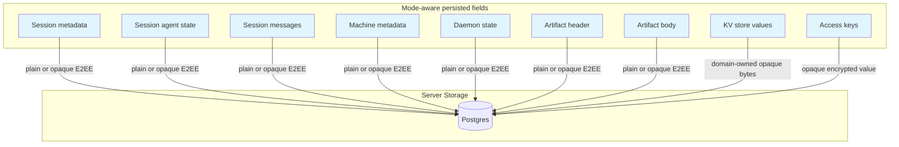
```mermaid
graph TB
    subgraph "Mode-aware persisted fields"
        direction TB
        S1[Session metadata]
        S2[Session agent state]
        S3[Session messages]
        M1[Machine metadata]
        M2[Daemon state]
        A1[Artifact header]
        A2[Artifact body]
        K1[KV store values]
        AK[Access keys]
    end

    subgraph "Server Storage"
        DB[(Postgres)]
    end

    S1 & S2 & S3 --> |plain or opaque E2EE| DB
    M1 & M2 --> |plain or opaque E2EE| DB
    A1 & A2 --> |plain or opaque E2EE| DB
    K1 --> |domain-owned opaque bytes| DB
    AK --> |opaque encrypted value| DB

    style S1 fill:#e1f5fe
    style S2 fill:#e1f5fe
    style S3 fill:#e1f5fe
    style M1 fill:#e1f5fe
    style M2 fill:#e1f5fe
    style A1 fill:#e1f5fe
    style A2 fill:#e1f5fe
    style K1 fill:#e1f5fe
    style AK fill:#e1f5fe
```

These fields are mode-aware. E2EE branches remain opaque ciphertext to the server.
Plain branches carry a strict stored-content envelope and may be sealed only inside the
server persistence layer.

### Session metadata + agent state
- E2EE Sessions are encrypted by the client.
- Layout-0 plain Sessions use explicit plain content.
- Layout-1 owner metadata uses one strict Session-specific stored-content envelope:
  `{ t:'plain', v:<strict owner metadata> }` for a genuinely keyless/plain Account or
  `{ t:'encrypted', c:<account-scoped ciphertext> }` for E2EE ownership. The plain
  branch requires no Account key; the encrypted branch requires real compatible
  material.
- Current 0.3 development stored owner/shared readers discard unknown extensions
  recursively while validating known fields; creation and mutation remain strict.
  The reversible Bot marker alone is recipient-safe. Its birth fact, memory choice
  and tool-call view override remain inside the Account-scoped owner envelope.
- Fresh layout-1 creation and owner-driven layout-0 migration activate only after the
  complete compatibility-declared Session/CPX writer, reader, tuple-CAS, and recipient
  projection vertical is green. Schema presence alone does not activate it.
- In current development source, `app/session/create` owns ordinary tag-based
  creation/rejoin and fresh creation at a reserved identity. Creation rechecks the
  active Account inside the transaction; Layout-1 also checks current encryption
  under the owner-metadata fence. The Session and its durable AccountChange commit
  together through `publishSessionCreationInTx`; socket wakes run only after commit.
  Rejoining an existing Session does not publish a second creation.
- Used in:
  - `POST /v1/sessions` (create/load)
  - WebSocket `update-metadata` / `update-state`
  - `update-session` events

### Session System Records in the UI

Current development source opens System Records according to the persisted
Session `encryptionMode`. Plain Sessions require `{t:'plain',v}`; E2EE Sessions
require `{t:'encrypted',c}` and the incumbent Session encryption context. Key
presence never selects the mode. A mismatched envelope fails closed.

The UI's `sync/encryption/sessionStoredContent.ts` owns these mechanics for both
persisted-Session drafts and System Records. The record codec under
`sync/domains/sessionSystemRecords` separately validates the exact address and
domain payload. Missing Session keys produce `locked`; an available context
that cannot open the bytes produces `corrupt_or_unopenable`. Neither means the
record is absent, and neither justifies interpreting encrypted bytes as plain.

The same domain owns the Account-scoped runtime repository used by workflow
activity and Board Actions. It retains last-known records during failed refreshes,
marks them stale on scoped Session/share AccountChanges, and retires cached data
with the owning Account lifetime. Its predecessor workflow adapter is read-only
and uses the same content codec without manufacturing record revisions.

Managed Workflow accepted snapshots, checkpoints, invocation progress, and final
results follow the Run owner's persisted Account-mode authority. Current 0.3
development source uses one random per-run data key for E2EE content, with
recipient envelopes in `WorkflowRunDataKeyEnvelope`. Caller Account material
opens only that caller's recipient envelope; the private binding retains the
owner Account, Run, purpose and, for progress, exact invocation identity.
Plain Runs need no client encryption material or recipient-key rows.

Automation-origin Runs materialize that accepted snapshot once, before root
initialization. Later claims (including Continue after a human review hold)
carry the canonical Run snapshot into the same coordinator used by direct Runs;
they open the existing recipient envelope instead of generating a new per-run
key or re-reading the live definition. Signed claim receipts retain no private
accepted-snapshot copy: replay re-reads it from the transition-owned Run row.

The server-visible Workflow structure is the same in plain and E2EE mode:

- Invocation lifecycle `waiting_for_review` discloses a human-held step. Parent
  Run state `waiting_for_review` discloses that the Run is parked with only
  human-held work remaining and no worker claim; it is distinct from manual
  `pause_requested` / `paused`.
- Public invocation `contentRevision` advances on row content or lifecycle
  changes and is the row-scoped currentness token. It exposes that a row changed,
  including draft publication while its lifecycle stays the same, not the new
  value or an integrity guarantee for the public index. Parent revision still
  governs Run state and control transitions.
- Frozen nullable `sourceArtifactId` identifies the saved definition used for
  grant lineage. A reviewed inline draft can retain this binding while admitting
  its on-screen content, without saving or substituting the saved definition.
  It exposes source attribution, not definition content or an access grant.
- Frozen nullable `visibleTeamId` identifies the Team selected to see the Run.
  Access still requires that Team's live source-Artifact grant and the caller's
  effective membership; the id alone grants nothing.

Provisional results, result-source metadata, review instructions, human
authorship and decision values remain in the existing invocation content
envelope. These structural disclosures do not introduce plaintext copies of
that private content, a manual-intent column, or mutable-index tamper protection.

Boundary Resume is a key-free control write. Its nullable
`workflowResumeRequestedRevision` is server-readable control metadata in both
plain and E2EE Accounts, written with the Run's state/revision CAS and consumed
by the successful worker claim. It discloses a Resume request revision, not
private content or new authority; the key-holding worker still checks live
controller dominance before acting.

The active development V4 Account-mode transition includes retained current Run
content, invocation content tokens and recipient envelopes in its Automation
inventory. Inventory GET and migration POST use the captured Home directly,
without a server-version admission preflight. An unsuccessful inventory read
fails the operation instead of fabricating an empty census. The existing Account
transaction owns the complete comparison,
re-sealing, key replacement and exact replay; dormant V5 remains inactive.

This is a development direct cut, not a released migration: the codec rejects
pre-cut Account-derived Workflow ciphertext and old private payloads. It does
not reseal historical rows or fall back to an Account-derived content key.
Missing run history and missing recipient material remain explicit unavailable
results, never permission to reinterpret encrypted content as plain.

The server validates each outer
stored-content envelope against the persisted Account mode and stores or projects
only opaque bytes plus public indexes; it never opens private workflow content to
infer recovery safety. An authorized daemon or client opens the envelope with the
exact Run/record binding, validates the strict domain payload, and fails closed on
a mode mismatch, unavailable key material, or invalid binding.

Restore-workspace availability therefore has two distinct layers: the server may
advertise only coarse public eligibility, while the client requires opened private
`workspace_unavailable` progress with the recorded creation intent and checkout
descriptor. Neither ciphertext presence nor a server-visible Run state authorizes
a filesystem effect by itself.

Development saved-workflow Run summaries use only the frozen public source id,
owner, timestamps, Run/custody states and indexed invocation lifecycle facts.
They neither open accepted definitions nor decrypt private progress/results.
The source id is attribution, not an access grant. Unfiltered Run lists remain
caller-owned; source-filtered history and summaries also include Runs whose
frozen Team has a live source-Artifact Team grant and whose caller is an effective
member of that Team. Exact reads, recipient census, key preparation and wake
audience use the same Run access owner. A personal grant or another Team's grant
does not preserve that Run visibility after its frozen Team grant is removed.
The source Artifact's effective grant level determines authority only after
those visibility prerequisites hold.
Lean Run cards receive the server's `attentionRequired` membership without
opening invocation content. This public boolean adds no result, prompt or
decision content and is refreshed independently of the parent control revision.

The development `workflow.run.list` Action host also projects `where` from the
accepted snapshot it already opens for private display metadata. The server
does not decrypt or persist a second workspace projection. `where: null` means
that exact snapshot could not be opened; omission means the operation did not
read Where. The shared client Run store preserves an opened Where across
control-only responses and clears it on an explicit unreadable list projection.

The development worker writes completed top-level authored-block counts into the
existing sealed root invocation progress. A loop or conditional contributes one
block; an active loop separately reports completed current items against its
frozen total. The server returns that exact root envelope beside the lean page,
without opening it or adding public count fields to the invocation index. The
authorized Action host opens it with the existing mode, recipient and binding
checks; missing or unreadable root content produces `stepProgress: null`.
`stepProgressCurrentness` carries the existing root record, attempt and content
revision because a child fact does not advance the parent control revision.
These are development projections, not a release-readiness claim. Admission
freezes `startedBy: user | agent | trigger` in the accepted snapshot, and the
same authorized list opener projects it. Host callers are users; Session agents
and Workflow callers are agents. Immutable Automation causes classify manual
starts as users and trigger or external-conversation occurrences as triggers.
An autonomous plugin start is a trigger and retains its plugin principal and
source custody. Nested plugin dispatch carries the original host-stamped caller
privately while preserving the immediate plugin's authorization; authors cannot
supply that provenance. Mounted present-user RPC admission supplies a host
caller; scoped Session MCP dispatch supplies its host-bound client's Session
caller, independently of the requested target. Generic daemon dispatch carries
only that bounded starter fact over authenticated host-control transport; it
does not claim Session authorization or change immediate plugin custody.
An explicit admitting caller or Automation cause takes precedence over a
transported starter descriptor.
Durable approval capture freezes only the bounded plugin `startedBy` fact
beside its existing caller identity and source custody;
replay carries it through the same private context, not a recursive authorization
chain. Missing or unreadable accepted content reports
`startedBy: null`, and control-only responses omit it. Attribution never derives
from the request surface, origin Session or work depth.

#### Scoped pull-request triggers (0.3 development)

PR-comment and CI-failure selectors use the existing Automation trigger-definition
envelope, bound to Automation id, trigger id, revision and kind. Plain Accounts use
the explicit plain arm without client keys; E2EE Accounts seal the private
repository/PR selector. The Session↔PR link remains private Channel binding content,
opened only by the authorized host, rather than a separate public link index.

Conversation admission carries explicit typed host evidence beside private sender
content: the binding and scoped Session/trigger identity, observation principal,
and `repositoryWriteAccess: true | false | null`. The server checks the current
trigger correspondence and admits only `true` with matching principal identity.
It does not decrypt E2EE sender or selector content; the authorized Channels host
attests that correspondence. Unknown or denied access and identity mismatches are
typed, checkpoint-safe refusals. Ordinary non-scoped conversation admission retains
its existing path. This is development source behavior, not released availability
or loaded-runtime certification.

#### Shared Board records (development)

The Board uses the existing Session System Record table and Session encryption
mode. Host-owned `surface/layout.v1/layout` and `surface/item.v1/<itemId>` records
belong to the Session owner's Account, including edits by collaborators. Record
identity uses namespace and local ID rather than kind, so the item-ID schema
reserves the exact value `layout` for the shared layout record.

`PUT /v2/sessions/:sessionId/board` composes the System Record owner's conditional
row operations in one transaction: creating an item includes its placement, and
removing an item includes its replacement layout. The transaction checks current
`editSessionRecords` capability and envelope/storage correspondence. Envelope
checks cover retained records as well as incoming writes; an inconsistent retained
envelope fails before mutation. Plain source
updates preserve their source class and installed-surface identity. The server
cannot inspect E2EE source semantics; authoring clients validate opened content
before sealing, and mounts must independently admit the current source.

Retries reuse the exact sealed request and expected revisions. Identical stored
envelopes can settle a retry; different ciphertext conflicts. A retried removal
settles only when its item is absent and its exact replacement layout remains
stored. A recreated item or a changed layout does not authorize the old removal.

The canonical `sessions.board` decision gates the mutation and exact surface
read/list paths. Generic record upsert/delete cannot mutate these typed-only
kinds; legacy host listings exclude them. Committed mutations publish only
`{v:1,sessionSurfaces:true}` through the existing Session recipient AccountChange
owner, with socket wakes after commit. This hint carries no Board content.

These are current development contracts. The composed Plain/E2EE client journeys
and provider validation remain release gates; source wiring alone does not prove
their availability in a deployed version.

Board organization is shared Session state, but presentation is not. The active
Board view and Companion selection, edge, density, and collapsed state remain
viewer/device-local; mounting or inspecting either surface does not create shared
records, Follow state, unread state, or attention. Board reads require the current
`readTranscript` capability. Every edit and editing affordance requires
`editSessionRecords`, including mutations requested through Actions; the Action
owner retains authentication, admission, confirmation, and approval policy.

Installed external and built-in plugins are equally trusted installed code. They
enter through the same public SDK and host-capability negotiation under equivalent
grants; built-in origin does not grant a second privileged Board path. A
caller-authored HTML document stored in a Board item is a different source class:
it has no plugin identity or ambient plugin authority and can request only the
bounded caller-hosted method ceiling (`context`, `watchContext`, `readResource`,
`watchResource`, `executeAction`, and `notify`). Each Resource and Action still
performs its ordinary authorization and approval checks. Current development UI
carries this caller-authored runtime through the shared frame implementation on
React Native web/Tauri, iOS, and Android. Per-realm loaded isolation and lifecycle
validation remains an activation requirement rather than a released support claim.
A client that cannot currently admit the renderer keeps the record visible with
truthful unsupported/recovery UI; unavailability never deletes or rewrites the
shared record.

#### Session discussions (development)

Discussion titles and message bodies use the same strict Session stored-content
outer envelope as System Records: Plain Sessions accept only `{t:'plain',v}` and
E2EE Sessions accept only `{t:'encrypted',c}`. The server checks the persisted
Session mode before reads or mutations and never falls back from an unavailable
E2EE key to plaintext. Inner title and message schemas remain discussion-owned.
The CLI's `sessionStoredContentCodec.ts` and the UI's Session stored-content codec
share Protocol conformance vectors for the outer envelope; Board/System Record and
Discussion callers do not choose storage mode independently.

The server can see discussion and message identifiers, sequence and archive state,
Account authorship, mention Account ids, timestamps, and Agent producer/run
provenance. It cannot read E2EE title or body content. Agent posts are admitted only
through the authenticated Session runtime carrier: public Account HTTP cannot forge
Agent provenance, and `requestedBy` is not authorship or access authority.

Per-Account read cursors are private server state. Unread and mention counts are
derived at read time from canonical rows; they are not copied into a materialized
inbox or counter. Discussion mutations publish content-free AccountChange wakes to
the Session's current readable recipients. Follow and notification policy consumes
those facts elsewhere and is not decided by the discussion domain.

The `sessions.conversations` server feature is fail-closed and depends on
`sessions` and `sharing.session`. These are current development contracts, not a statement
that discussions are available in a released build.

### Session messages

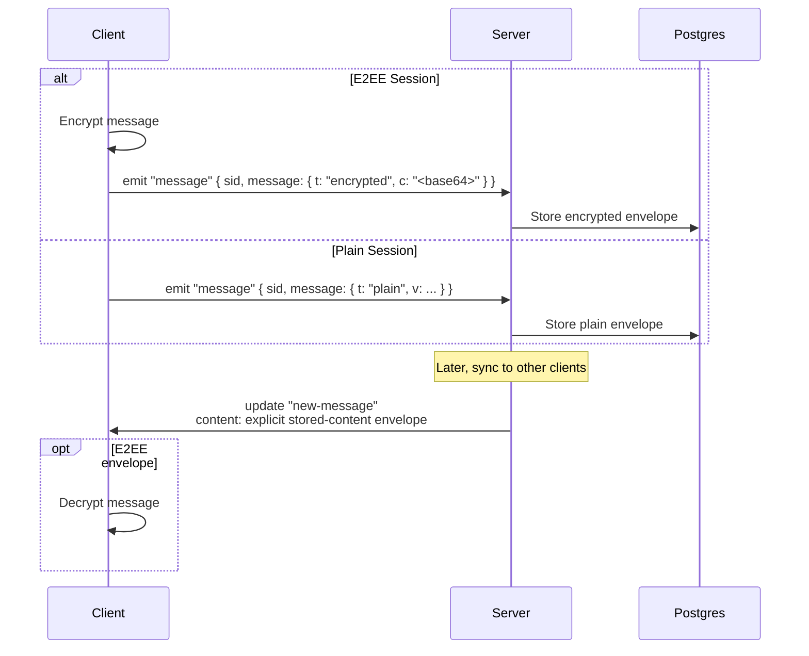
```mermaid
sequenceDiagram
    participant Client
    participant Server
    participant DB as Postgres

    alt E2EE Session
        Client->>Client: Encrypt message
        Client->>Server: emit "message" { sid, message: { t: "encrypted", c: "<base64>" } }
        Server->>DB: Store encrypted envelope
    else Plain Session
        Client->>Server: emit "message" { sid, message: { t: "plain", v: ... } }
        Server->>DB: Store plain envelope
    end

    Note over Server: Later, sync to other clients

    Server->>Client: update "new-message"<br/>content: explicit stored-content envelope
    opt E2EE envelope
        Client->>Client: Decrypt message
    end
```

- The client emits an explicit `{ t: "encrypted", c }` or `{ t: "plain", v }`
  envelope. A legacy ciphertext string is normalized to the encrypted branch.
- The server enforces that the envelope kind matches the Session's persisted
  `encryptionMode`, stores it as `SessionMessage.content`, and emits the same
  canonical envelope in `new-message` updates.

#### Private accepted-delivery and human-completion facts (0.3 development)

The existing user Message's `deliveryResolution` can retain
`{v:1,kind:'provider_accepted',content}`. Its content is an explicit Session-mode
envelope: `{t:'encrypted',c}` for E2EE or `{t:'plain',v}` for plain Sessions. The
opened value is `{v:1,acceptedAtMs,delivery:{kind,turnId}}`, with the actual witnessed
`newTurn`, `followUp`, or `steer` outcome, not the requested delivery intent.
`acceptedAtMs` comes from the host-observed acceptance event, never settlement
time or a historical inference.

The current publisher sends this optional envelope through the existing Pending
acceptance operation. Its canonical transaction commits or updates the same user
Message and removes Pending; it does not create an informational transcript row.
The writer rejects an envelope that disagrees with persisted Session mode before
mutation. The CLI uses the existing Session crypto owner and retains the first
envelope through retry/reconnect; plain Sessions require no fabricated E2EE key.
Existing mode-aware message readers expose only validated opened facts. Missing,
malformed, wrong-mode, or unopened detail remains unknown. Historical
`manual_handled` remains readable and is the only delivery resolution that denotes
terminal no-turn handling for transcript-publication policy; provider acceptance
does not replace terminal turn evidence.

A nonempty opened page containing only legacy/manual rows or unidentified
acceptance facts cannot establish zero accepted inputs. An actually empty retained
page is observed empty; a valid identified accepted subset remains partial history.

Permission and scoped Action confirmation completions retain their existing
private AgentState request/completion pairs. An authenticated request-scoped human
answer can additionally retain `answeringClientCategory` (`ios`, `android`, `web`,
or `desktop`) alongside its Account actor and exact turn identity. The category is
caller-reported context, not authorization, device identity, or presence; desktop
is reported only by an actual desktop host. Latency joins use the exact request
and turn identity plus witnessed request/completion timestamps. Older missing
identity/category stays unknown.

These are private Session detail for opened-client projections, not prompt text,
plaintext Usage accounting metadata, or server-queryable human-loop analytics.
Usage's selected-Session reader and opened-snapshot projector honor the canonical
`access.capabilities.readTranscript` descriptor: an explicit denial prevents the
message read and excludes previously opened private work/permission/input facts,
without suppressing independently authorized Account accounting.
An opened snapshot or retained message page is partial evidence, not proof of
complete Session history. The existing accounting disclosure contract above is
unchanged.

### 0.2 legacy-secret Account recovery

Some 0.2 E2EE Accounts have a signing public-key anchor but no signed Account
content-key binding. The current Home keeps these Accounts behind the E2EE
currentness fence; a bearer token alone cannot make their ciphertext readable.
An existing-Account secret-key sign-in can repair exactly this missing-binding
state. The client proves possession of the retained 0.2 recovery secret through
the key challenge and signs the content public key derived from that same secret.
The Home verifies both proofs, records the binding, and rechecks currentness
before admitting the Account. CLI recovery-key login and the shared web, desktop,
and mobile secret-key sign-in flow use this same server admission path, including
ordinary v2 sign-in when content-key sharing is off. Without
the secret or a valid signature, recovery fails closed; neither the Home nor a
client fabricates key material or reinterprets encrypted data as plain.
When a 0.3 CLI/daemon or focused UI client reads currentness with a retained 0.2
`{ token, secret }` credential, it automatically uses that secret for the same
verified existing-Account key challenge, checks that the repaired token names
the stored Account, then retries currentness with the original bearer. A bearer
without retained secret material cannot perform this repair. The CLI's explicit
`happier auth recovery-key login --key <recovery-key>` and the UI's Secret Key
restore remain available when the device has no usable retained secret; the
UI's existing recovery result links to restore even when Account encryption
opt-out is disabled.

### Native file sharing and recovery-key backups (v0.3 development)

Native file exports share through one cache owner. Downloads, artifact and diagnostics
exports, workflow and theme documents, usage exports, voice history, runner packages,
and recovery-key backups write unique files under the app's private `happier-downloads`
cache. Captured usage images are copied there before sharing, then the original capture
is released. The owner grants the chosen recipient read access and reports whether the
shared file must remain readable: Android retains it after chooser handoff because
chooser completion does not establish that the recipient finished reading; iOS removes
it after the share sheet finishes. Failed, canceled, or unavailable handoffs attempt
cleanup; sharing and cleanup failures remain visible in the app logs.

An explicit recovery-key **Share** writes a plaintext backup. Clearing an in-memory
recovery key does not erase a backup already handed to a recipient or retained in
Android's private cache. Android recipient completion and subsequent cache reclamation
remain unresolved; these sharing paths have no time-based expiry or automatic
reclamation policy.

### Encrypted socket RPC routing (v0.3 development)

The shared `packages/sync-client/src/rpc/socketRpcCodec.ts` binds every E2EE
socket RPC request to its complete target-prefixed method and a caller-generated
128-bit random call id. Its encrypted plaintext is
`{ v: 2, k: 'req', m: '<targetId>:<method>', c: '<call id>', p: params }`.
Responders verify the direction and dispatched method before invoking a handler.
Responses encrypt `{ v: 2, k: 'res', c: '<same call id>', r: result }`;
callers verify the direction and their call id before accepting the result.
The call id is independent of the relay-owned transport request id.

This protects against a relay redirecting authentic ciphertext to a different
method or target, substituting another call's response, or reflecting a request
as a response. It does not prevent replay of a request to the same method and
target. Replay protection is deferred; there are no replay caches or timestamps.
The 0.2 RPC contract trusts the relay for routing; this binding starts at v0.3.

Unbound, malformed, or mismatched encrypted envelopes fail closed with
`RPC_UPDATE_REQUIRED`. Before a responder authenticates a request and obtains its
call id, it can return only a plain typed refusal. Such a refusal conveys no
authenticated success; a relay can already deny delivery. After authentication,
handler results and errors use the bound encrypted response. Plain-mode RPC and
reserved server-origin Session start, Action API, and Automation reply-handoff
methods retain their existing plain transport and inner-envelope contracts.

### Machine metadata + daemon state

- In 0.3 development source, `machines/machinePublishedContentV1.ts` owns one
  share-wide opened-content shape for the custodian and recipients. CLI registration,
  daemon publication, and UI metadata, policy, Runner and Account-conversion
  writers consume its write admission before serialization. It
  permits declared host identity/version, OS-home and installation-root facts,
  host-maintenance diagnostics, capability/readiness, nonsecret endpoint facts, and
  Local Services count/readiness. Private Sync relationship ids, controllers, paths
  and status, foreign work ids/commands/content, and undeclared peer/transfer native
  bags are not part of that projection. This is producer-side admission, not
  recipient-specific UI redaction, and does not claim an arbitrary path-free blob.
- Machine Sync publication carries only engine/carrier readiness. Its existing
  daemon-state version advance invalidates demanded private status/conflict reads
  for the exact Home and controller. Those reads remain at the admitted relationship
  owner; the existing UI status store and conflict paging owner preserve last-known
  values and reject responses begun before invalidation. No private status is
  hydrated from the Machine channel.
- Tolerant stored readers can discard retired fields, but their output is not proof
  that retained bytes are safe to disclose. Recipient preparation must open both
  entire current blobs and consume `isMachinePublishedContentSafeV1` before sealing;
  delivery commits bind the checked metadata/state versions. Retained unsafe
  ciphertext still requires an authorized custodian publication that commits
  rewritten content. The content-key conversion preserves the opened content and
  does not establish this privacy transition. A projected cache, a valid key alone,
  or a metadata-only Manage write cannot establish that transition. These are
  development-source contracts, not certification of a loaded or released runtime.
- Development Machine access-loss effects compare the canonical effective-access
  union before the mutation and after its final state. The Team membership wrapper
  captures Machine and Session impacts together around the enclosing transaction;
  a surviving grant prevents intermediate loss from becoming final revocation.
  Final loss publishes Account invalidation and, after commit, disconnects the
  actor's exact Machine/AccessKey-bound Session sockets. Session history and
  AccessKey bytes remain intact. Reconnect recovery unions those historical subjects
  with exact requester attribution from the daemon's existing live-work inventory,
  revalidates current access and invokes the existing Session, operation, terminal
  and service cleanup owners. Unknown inventory coverage or unavailable cleanup is
  reported incomplete; socket invalidation alone never proves process cancellation.
- The development access projection preserves each audience member's compatibility
  and key recoverability. Current Manage authority permits Team/Group level edits
  independently of a member's readiness. Incompatible Plain members are explained
  without offering a futile key Retry; initial preparation and Retry consume the
  same canonical `canPrepareKeys` fact for recoverable members.
- In 0.3 development source, stored Plain Machine envelopes are opened through
  the canonical stored-read projection: extra envelope fields are dropped,
  required `{ t: 'plain', v }` content remains validated, and re-encoding emits
  only the canonical envelope. Encoded metadata/state mutation admission stays
  strict; tolerant reads never reinterpret encrypted or malformed content as Plain.
- E2EE Machines retain the client-encrypted per-Machine branch. In current development
  source, a present `dataEncryptionKey` envelope selects the exact Machine content key
  for metadata and RPC. Account content material opens that envelope, including the
  existing content-key derivation for recovery-secret credentials; it does not replace
  the selected key. Only a genuinely absent/null envelope retains the historical
  credential-specific Account-key or legacy-secret reader, and only for the
  authenticated custodian. An admitted recipient uses the Machine access projection's
  resource mode and its own envelope; pending, refused or malformed access cannot
  reach the historical fallback. The persisted custodian Account mode is the storage
  authority, not possession of keys or the viewer's Account mode.
- New persistent E2EE registrations use a random 32-byte Machine content key for
  both credential forms. Registration adopts the returned winning envelope before
  opening content. Repeated or losing proposals cannot replace existing metadata,
  daemon state or envelope through registration. Plain registration remains keyless.
- CLI `ApiClient.prepareMachineContentKey` and UI `Encryption.prepareMachineContentKey`
  consume the same Protocol `prepareMachineContentKeyV1` owner lifecycle and
  `createMachineDataEncryptionKeyV1` resource-key producer. They prepare historical owner content through
  `POST /v1/machines/:id/content-key/transition`. The transaction compares the exact
  existing owner envelope and both content revisions, then commits the matching new
  envelope and opaque metadata/state together, advancing both revisions even for
  null state. The server never opens content. A lost acknowledgement is resolved
  only by observing that exact proposed post-state; it does not replay the write.
  Conversion preserves the entire opened blobs, including display name and finite
  policy, and does not itself authorize wider disclosure.
  Machine recipient preparation captures the Home/Account transport. The shared
  preparation owner observes the authenticated Machine and runs this custodian
  conversion before requesting the strict current-key-holder recipient census,
  so a genuinely envelope-less predecessor Machine can complete its first share.
  Foreign Manage holders cannot convert custodian content; they use their current
  delivered key tuple. Preparation refetches the
  current worklist after conversion, and checks the exact owner fingerprint, caller
  wrapping and both content revisions. The entire raw metadata/state must satisfy
  the published-content safety predicate before sealing; retained private bytes
  remain pending until actual safe custodian publication. Current Manage holders
  service later recipient changes through the existing Machine invalidation and
  Account-change lifecycles, reusing the Session preparation pass rather than a
  separate queue.
- Encoded Machine metadata/state writers carry `expectedDataEncryptionKey` with
  their expected content revision. `keyBasis` projects that owner-envelope identity
  separately from the caller-openable `dataEncryptionKey` recipient wrapping.
  A retired-envelope writer fails even with current content revisions. Ordinary
  update carriers project committed basis revisions; conversion also changes the
  opening envelope. Only affected Machine caches and contexts retire. Results begun
  under a retired context cannot install it again; an already-issued RPC retains
  its captured reply codec without effect replay or a universal process drain.
- A malformed or unopenable present Machine envelope fails closed. UI hydration locks
  the Machine and retires its previous cipher and decrypted Machine cache; a later
  valid envelope can hydrate it again. The CLI's
  `callExactMachineRpc` accepts `expectedEncryptionMode: 'e2ee'` captured from verified
  context. It rejects a substituted plain marker before payload emission and never
  follows Machine replacement redirects. Ordinary
  `callMachineRpc` retains its existing replacement behavior.
- Successful opening and the expected-mode check do not authenticate the provenance
  of a published scoped key, so scoped Machine-content keys for a Temporary computer
  carry their own signed binding. In current development source the creator seals the
  Runner runtime bootstrap and the Runner opens it with
  `openVerifiedRunnerRuntimeBootstrap` (`apps/cli/src/ephemeralRunner/runtimeBootstrap.ts`):
  the bootstrap must name the exact Home identity, activation, creator Account, Session,
  Machine, installation and launch-manifest commitment, its binding must equal the one
  the creator already reviewed, and `verifyRunnerMachineContentKeyBindingV1` must verify
  the `happier.ephemeral-runner.machine-content-key` payload — including the content-key
  fingerprint — against the creator's activation signing key. That activation key is the
  proof root: it is derived locally from this Runner's own activation package and
  recorded by the Home when the creator created the activation, never taken from a
  relayed field, so a DataKey-only or token-only creator needs no Account signing
  authority. Any mismatch zeroizes the key material and fails closed with
  `runner_runtime_bootstrap_binding_invalid`. The server verifies the same binding
  before review (`activationProgress.ts`) and before materialization
  (`materializeEphemeralRunner.ts`), and persists it as the Machine's
  `runnerContentKeyBinding`; a Plain endpoint must carry no binding at all. The feature
  remains unreleased, and its composed release checks do not make this implemented path
  absent.
- Which branch a published Machine key takes is never decided by the Home's own `kind`.
  `resolvePublishedMachineDataEncryptionKeyV1` classifies a Machine as a Runner when the
  reader supplies a Home-independent `trustedMachineKind` — creator-device custody,
  resolved for *every* Machine by
  `apps/ui/sources/sync/domains/machines/runnerMachineContentKeyTrust.ts` rather than only
  for rows the Home labels a Runner — **or** when the row carries a
  `runnerContentKeyBinding` at all, the field the server writes only at Runner
  materialization. Either fact makes the released absent-envelope Account-key fallback
  unreachable, so relabelling a Runner `persistent`, or omitting `kind` entirely, fails
  closed instead of disclosing a Home-chosen key. A genuinely persistent Machine keeps
  both released behaviours. Every reader shares that one decision owner: UI Machine sync,
  the `new-machine` socket hint, the server-scoped exact-Machine RPC pool, the CLI daemon
  reader and the SDK. None of them keeps a local "is this a Runner?" rule of its own.
  The development UI awaits durable creator custody before selecting E2EE Machine
  semantics, including after a cold start. Failed or corrupt custody is unavailable,
  never cached absence; a later read can retry. The scoped RPC cache shares the
  published row and opened envelope, then verifies each caller's current trust through
  the same resolver, including callers joining an in-flight lookup. Unavailable
  resolution retires the previous Machine cipher and rejects with
  `MACHINE_ENCRYPTION_UNAVAILABLE` before socket creation or payload emission. Only
  an explicitly resolved legacy Machine uses the released absent-envelope fallback.
- **Accepted residual (ruled 2026-09-23): a device that did not create the Runner inherits
  the released persistent-Machine trust level.** Such a device holds no device-local
  creator custody, so it supplies no `trustedMachineKind`; it can open the creator-sealed
  `runner_machine_content_key_verifier` fact with Account material, but that fact
  identifies nothing until a binding names it. If a malicious Home strips **both** `kind`
  and `runnerContentKeyBinding` from the row, that device sees an ordinary persistent
  Machine and accepts an envelope the Home sealed to the Account content public key it
  already publishes. The root cause is not Runner-specific: released
  `encryptedDataKeyEnvelopeFormatV1` is one version byte plus a box bundle around exactly
  one 32-byte key, with **no AAD and no `machineId`**, so nothing inside an opened
  envelope says which Machine it was written for. Every Account-sealed per-Machine key has
  this property. Blast radius: that one device would read and write that Machine's content
  under a key the Home chose, which discloses what it sends for that Machine and lets the
  Home forge what it reads. It does not reach the Runner or the creating device — the
  Runner uses the key from its binding-verified bootstrap, the creating device classifies
  from its own custody, and the server verifies the same binding before review and
  materialization — so substituted key material cannot be laundered back into the
  Runner's own content. The SDK degrades further to Account sealing on such a row
  (denial of service, not disclosure), because its Runner path requires the row's kind.
  The settled Home-independent verifier fact does not close this: it travels only as
  `creatorVerifierFactCiphertext` on the same strippable `runnerContentKeyBinding`, so a
  Home that strips the binding strips the fact with it, and a non-creating device has no
  `trustedMachineKind` of its own. The only change that closes it is binding released
  `encryptedDataKeyEnvelopeFormatV1` to its `machineId` — a released-format change for
  every Machine, not a Runner change — and that is why the residual is accepted.
  (0.3 is a one-way upgrade, so old-writer erasure of a replicated map is not the
  reason.) This residual is only the doubly-stripped non-creating-device case; it does
  not cover Session→Runner correspondence for protected SDK requests, described next.
- A protected external Action can target that Runner. The API Token-authenticated
  `GET /v1/machines` bootstrap projection names a Runner Machine with its kind, winning
  installation, Account-sealed `dataEncryptionKey` envelope, that same
  `runnerContentKeyBinding` and the activation's persisted `runnerClaim`
  (`RunnerClaimV1`, the endpoint's activation-signed claim, which carries public keys
  and signatures only, never a credential); a persistent Machine keeps the released
  content-free projection. The SDK opens the envelope with its Account
  `{ type: 'dataKey', machineKey }` material and resolves the key through
  `resolvePublishedMachineDataEncryptionKeyV1`. The Home identity and creator Account
  come from the SDK's own locally pinned credential (`encryption.pins`). A `machine`
  target names the Machine directly. A `session` target selects the Runner only
  through its claim (`packages/sdk/src/machines.ts#resolveMachineProtectedActionMaterial`):
  the resolver opens the verifier fact, verifies the claim under that same activation
  signing key, and accepts the key only when the claim's `activationId`, `machineId`,
  `sessionId`, Home, creator Account and installation equal the verified binding, the
  selected row and the requested Session. The Machine-key binding signs no Session, so
  an authentic key for Runner B is not proof that B holds Session A; without this check
  a request for A sealed to B's key would be disclosed to B's key holder even though an
  honest B refuses the foreign Session before opening it. A Home that rewrites the claim
  breaks its signature; two rows claiming one Session fail closed; a Session no Runner
  claims keeps the released Account sealing, which a Runner cannot open (denial of
  service, not disclosure). The SDK then seals the V2 request with the resolved Runner
  content key. A substituted binding,
  verifier fact, envelope or Machine fails closed with `invalid_encrypted_envelope`;
  the SDK never downgrades a Runner target to plaintext or to Account-only sealing. The
  Runner opens the request with the same key it received in its verified bootstrap and
  executes only inside its own Session, so the Home relays bytes it cannot read in either
  direction.
  An endpoint that serves no bootstrap projection at all — a daemon-hosted Action API —
  keeps the released Account sealing, which discloses nothing and simply cannot be
  opened by a Runner.
- Plain Machines carry base64-encoded `{ t:'plain', v }` metadata/state and use the
  corresponding plain marker in `dataEncryptionKey`.
- Machine RPC uses the persisted Machine row mode. Token-only callers never enter the
  account-cipher path.
- Used in:
  - `POST /v1/machines`
  - WebSocket `machine-update-metadata` / `machine-update-state`
  - `update-machine` events

### Personal Machine Pool administration (0.3 development)

Personal Machine Pool definitions are server-readable Account administration data.
The Pool name, optional description, member Machine IDs, priority tiers, enabled
bits, revisions, timestamps, and current availability projection are not encrypted
with the Account content key, including for an E2EE Account. This is required so the
Home can validate membership, apply optimistic concurrency, observe generic Machine
presence, and resolve an exact Machine.

That boundary does not change Machine or Session content encryption. Pool membership
does not disclose encrypted Machine metadata or daemon state, grant Machine RPC or
Session access, carry credentials, or widen Account authority. After selection, the
client binds the returned Machine ID to its captured Home and the existing exact
Machine and Session encryption checks apply. Names and descriptions therefore must
not contain secrets that the user expects Happier's Account E2EE to hide from the
Home operator.

Pool change notifications preserve that boundary: `AccountChange` carries only the
Pool ID as an invalidation, and an authenticated client rereads the definition from
the same Home. The optional Session `placementOrigin` carries only the Pool ID. Pool
names, descriptions, member IDs, tiers, availability observations, request keys, and
candidate lists are never copied into shared Session content as placement metadata.

A personal Machine Pool also has no relationship to a Connected Service Pool. The
latter selects a credential source; the former selects an execution location. Pool
membership grants neither credential access nor broker authority. Current development
source can use a personal Machine Pool as a Team credential resource's broker
location, but the Pool is resolved server-side to one source-eligible exact Machine.
Only a content-free eligibility result crosses the daemon RPC boundary; source
settings, credentials, endpoint material, and the private Pool roster do not become
recipient-visible. The exact Machine then uses the existing encrypted carrier and
resource admission path.

### Artifacts
- E2EE Artifact `header` and `body` are encrypted bytes encoded as base64.
- Plain Artifact values are base64-encoded `{ t:'plain', v }` envelopes with the
  canonical plain data-key marker.
- Stored as `Bytes` in the DB.
- Emitted in `new-artifact` / `update-artifact` events as base64 strings.

The 0.3 development Home layout is an Account-owned `home-hub-layout.v1`
Artifact. Its body contains built-in order/visibility, setup dismissals and
independently configured widget instances with width/frame overrides. The
semantic owner is `packages/protocol/src/home/homeHubArtifactV1.ts`; UI and CLI
use the existing Account-mode-aware Artifact transports. Rendering defaults
does not create the record; the first real edit materializes them. After Account,
mode and Artifact-kind admission, the shared reader normalizes missing layout
arrays to empty arrays, drops unknown layout presentation fields, and uses
unpersisted defaults for invalid layout content. Transport and ownership
refusals remain errors. The retired
0.3 `homeHubLayoutV1` Settings document has no reader, writer or migration.
Qualified instance refs identify placements, not access grants. Session Board
content remains Session-owned, while direct Companion instances stay in existing
device-local preferences. Viewer connection choices use Connect's existing
purpose selection, not a per-widget selection store.

Reusable 0.3 development widget definitions are Account-owned
`widget-definition.v1` Artifacts. Their declaration bodies use the same plain/E2EE
Artifact codec; widget code does not derive mode from keys or introduce another
envelope. Captured Account ownership and currentness are checked before opening
or mutating a definition. Explicit publication copies the opened declaration
into Session Board content before approval, without exposing the private
Artifact reference or Connected Account selections. Frozen snapshots use the
existing Session Board record encryption and upsert owner; their inert preview
and as-of/provenance metadata are shared content, not credential material.

These stored readers drop unknown fields after mode and ownership admission,
without weakening required identities, private-selection checks or strict write
admission. The [stored-reader policy](compatibility.md#widget-and-organization-stored-readers-03-development)
also covers the generic Artifact body and separately bound private-revision
envelope; stripping an obsolete body field never makes it private attribution.

The in-progress 0.3 binary extension keeps the opened body inside this same
envelope: it is either text/null or a strict `{ blobId, mime, sizeBytes, sha256 }`
reference. MIME and the plaintext integrity hash stay inside the document's
encryption boundary. The private storage owner holds the referenced bytes;
E2EE payloads use the existing per-Artifact key and AES-GCM byte framing, while
plain payloads use the existing server-managed at-rest policy. Neither path
uses the public uploaded-file URL owner. Authenticated blob reads recheck the
Artifact's current authority and Account mode, and key-holding clients check
the opened bytes against the reference before preview or download.

Rejected private uploads retain their exact storage path in the existing
Account-owned `UploadedFile` custody with the `artifact-blob-rejected-v1:`
reuse-key namespace until private deletion succeeds. The next binary upload
retries cleanup; Account erasure also treats those paths as private objects,
including candidates whose Artifact was never created. The blob lifecycle
owner classifies this custody; it adds no cleanup timer or public URL.

Development writers validate candidate paths through the canonical private-key
owner before recording custody, so unsupported legacy Artifact ids cannot leave
undeletable cleanup records. Before a candidate's private write begins, they
capture a pending write in the same Account-owned custody under the Account fence and current
active-status admission. It stays pending until admission or terminal discard;
conversion stages become ready only after their private write completes.
Account erasure checks this custody under the same Account fence and refuses
retirement or physical deletion while any candidate is pending. The Account
stays active with its token epoch unchanged, so the writer can finish and the
owner can retry erasure with the same credentials. Pending state
is never cleared by an arbitrary expiry. Recovery after a process failure leaves
a write's terminal outcome unknown and remains an unresolved development
follow-up; this fail-closed phase does not claim complete crash recovery.

Development Account-mode conversion stages each distinct current/retained blob
privately before submitting the existing signed Account transition. A stage is
Account-owned `UploadedFile` custody in the `artifact-blob-conversion-v1:`
namespace, not a readable Artifact or a mode change. The signed directive binds
the source bytes' SHA-256, target stage identity, target bytes' SHA-256 and target
envelope kind; it carries no inline binary bytes and retains the owning signed
request's 8 MiB budget. The Account transaction rechecks source custody and the
complete retained set, then atomically replaces head/history, resource keys,
recipient wraps and private blob locators. Displaced files become rejected
cleanup custody in that transaction. Exact replay verifies target bytes as well
as the committed document versions; cancellation cannot delete an activated
stage. Account erasure treats both staged and rejected custody as private.
These development contracts do not certify a deployed binary-capable server.

Development ordinary Artifact body history uses `ArtifactRevision` rows keyed
by Artifact id and body version. Successful updates retain the displaced stored
body bytes in the same transaction; plain server-sealed history uses the same
Artifact/body at-rest key path, and E2EE history uses the document data key.
Revision reads and restores recheck current grants and the owner's persisted
Account mode. Restore atomically advances the current header and body versions,
using the key-holder's kind-owned header projection for the restored body,
and preserves historical rows subject to the operator's retention count
(default 10).

The development restore request may additionally carry a key-holder-sealed body
envelope for the selected revision. Omitting it retains the previous restore
contract. Plaintext replacements must preserve the selected body content; E2EE
replacements remain opaque to the Home. Both paths retain the selected blob
identity and use the existing grant, mode, quota and header/body CAS owner.
Development revision actor/restore metadata is stored separately from that
shared body: `Artifact.provenance` and retained `ArtifactRevision.provenance`
carry a versioned envelope bound to the Artifact id and body version. Writers
stamp the admitted person or Agent/session; restore records the restoring actor
and selected version. Missing metadata means unknown attribution, not the last
known actor. Header-only edits do not invent a new body save.

The owner's persisted Account mode controls this private envelope. Plain mode
uses the ordinary plain stored-content envelope and the server's existing
at-rest sealing, without client key material. E2EE uses an independently generated
data key: `Artifact.provenanceDataEncryptionKey` wraps it for the owner and
`ArtifactKeyEnvelope.encryptedProvenanceDataKey` wraps it for authorized grants.
It is never derived from or wrapped by the publicly shared content key. Public
link responses contain neither the private envelope nor its key; owner/grant
reads and history open it through their existing authorization boundary.
If a grant has its content key but no delivered private key, the server omits
private metadata for that caller; ordinary content remains usable with unknown
attribution. Supplied but inconsistent private metadata fails closed.
Authenticated header-only inventories carry the current body version and the
same recipient-private envelope independently of whether document bodies are
requested. The Artifacts browser opens this metadata on a cold list refresh;
document bodies remain lazy. Public-link inventory/content paths do not gain
this metadata or its key.

In 0.3 development UI source, an unchanged header refresh retains an already
opened body only when the header/body revisions, raw header, storage mode,
owner and caller access match. E2EE retention also requires the exact content
and private-metadata key envelopes that opened the row; missing custody or a
locked incoming row discards the opened body. This is an in-memory presentation
projection, not another persisted format or authorization source.
When a view needs a body or binary/HTML preview, one finite captured Home/Account
operation opens the head, performs the existing recipient preparation and reads
the preview content. Only that operation's opened row is reused for its blob or
isolated-shell read. Later downloads and retries obtain fresh authority; cached
presentation rows never replace those reads or their mode, access and integrity
checks. Account retirement and cancellation suppress unsettled results.

Live Artifact create/update events carry the same private envelope and the
recipient-qualified wrap projected by the existing access owner. An editing
grant's wrap is not substituted for the owner's. An incomplete update without
private metadata leaves an already-loaded attribution unchanged; a delivered
envelope for a newer body revision replaces it after authenticated opening.
Host-stamped workspace publication facts (Session, run, Machine, workspace path
and source hash) are part of the same private revision provenance. The shared
file-publication owner returns them separately from the public preview header;
UI and CLI key holders preserve them through rewrite, restore and Account-mode
conversion. The public header carries preview metadata such as title, kind,
MIME and byte size. The Artifacts browser reads source attribution from the
private envelope.
Workflow's kind-owned public-header projection removes historical `savedBy`
from new writes, restores and list results; private metadata alone owns saver
attribution. Workflow write admission rejects that undeployed header field;
stored readers discard it without making the remaining known header unreadable.
Earlier unfinished 0.3 writers placed attribution inside shared content.
The one-way 0.3 upgrade does not preserve or migrate these development
intermediates, and this change cannot recall bytes already disclosed.

The Account encryption transition carries every retained body and private
revision envelope through the same signed Artifact migration item, checking the
complete revision set and source bytes before replacing the head, independent
keys, recipient wraps and history atomically.
Older documents with no history supply an empty revision set. History is never
silently discarded or interpreted under the target mode without conversion.
The key-holding migration opens raw header metadata, not the Artifact viewer's
display-normalized header. Crypto conversion preserves arbitrary metadata except
the obsolete public Workflow saver field;
strictly admitted Workflow headers advance their embedded revision with the
physical head versions. Display defaults are not persisted by this migration.

The development Settings transition drains the Account-owned
`GET /v1/account/encryption/artifacts` inventory, rather than treating an ordinary
Artifact list page as the complete census. Its pages include raw head content and
every retained body, including archives linked to inactive retained Plugin UI and
Package Asset releases. Availability qualifies those rows against the exact
immutable release link and archive descriptor; the keyholding client verifies
opaque archive content after opening it. This transition-only reader does not
make protected archives visible through ordinary Artifact APIs or reactivate
hosting. The captured Home/Account producer rejects changed authority, mixed-mode
content and non-advancing pages. Blob preparation and the final complete-set,
version and source-byte checks remain with the existing signed Artifact migration
owner; paging is not a new inventory ceiling or a second commit authority.

Development document sharing uses `artifactAccessService.ts` as the common
HTTP, socket, write and audience authority. Direct Account, Team and Group grants
resolve against current membership; owners and admin grantees change grants,
while only the owner may assign admin. Other grantees may inspect them.
Grant mutations report the caller's resulting access. A committed self-revocation
that removes all access succeeds with `access: null` and an empty `grants` roster;
subsequent reads remain unauthorized. This mutation response is final; opening
the document and preparing recipient keys require remaining access. Grant-list
responses still require live access. This is an in-place development-only grant contract; the 0.2
predecessor has no document grant endpoint.
Shared documents retain the owner's Account encryption mode
and plain at-rest storage path. Grantee changes use content-free AccountChange
wakes and a fresh authorized read, not the owner's legacy Artifact payload event.

Plain documents require no client data key or recipient envelopes. E2EE documents
stay opaque on the server: a current key-holding client seals the same document
data key to each eligible recipient's verified content key. The recipient census
binds preparation to the caller's opened envelope; the separate envelope commit
rechecks the document key, live access and canonical
`content-public-key-sha256:<hex>` fingerprint. Reads project only that caller's
current envelope, never the owner's envelope to a grantee. Missing or rotated
recipient keys leave content unavailable, and the existing document encryption
transition invalidates old recipient envelopes. The development UI and CLI use
the same Artifact access Action owner and workflow, role and Launch Profile kind
adapters. The UI's captured Account context supplies the grant HTTP transport;
its Artifact sync opener runs recipient preparation on encrypted grant-aware
opens and after grant list/set/remove. Plain documents do no recipient-key work.
The 0.3 development startup selected-detail batch returns exact authorized
content and the recipient census under one read-only capture. Its opener shares
the exact-read key-preparation owner: a changed caller envelope still fails
before detail publication, and any prepared keys still use the canonical fenced
commit. Header-only inventory reads and unopened document bodies retain their
existing lazy behavior; Plain batch results require no recipient census or
client encryption material.
The development Account-transition builder reads the recipient census through
its captured Home/Account request and wraps the replacement Artifact key even
for recipients whose old envelopes were current. The signed migration item
carries the required source owner-key token (the explicit plain marker for a plain
source) and required prepared subset, which may be empty. Under the existing
Account transition fence, the Artifact migration owner checks that token and
content revisions, replaces ciphertext and key, deletes old recipient envelopes,
and uses the same commit owner to insert only recipients with live access and
matching verified content-key fingerprints. Unprepared or changed recipients
remain locked until a later key-holder pass. Plain targets carry an explicit empty
recipient-envelope list. This is an in-place 0.3 development contract: requests
omitting either field are rejected, and the 0.2 transition had no Artifact directive.

Plugin Account-hosted UI and Package Asset archives use this same mode-aware
Artifact envelope, not a separate encryption format. The client requires explicit
Account hosting consent before publishing bytes; install and trust are not
consent. Package Asset publication seals the verified archive through
`activePluginAccountHostedArtifactRead.ts`, and its protected reader opens it
through `activePluginAccountPackageAssetRead.ts`. Release links and integrity
descriptors remain server-visible metadata in both modes. Availability owns the
qualified release link: disable-and-remove atomically removes the link and its
Artifact, while disabling hosting alone prevents later publication.
Current plain archive publication, immutable-slot rejoin and qualified reads do
not require an older component's stored-content declaration. The same Account
mode, access, hosting-consent and archive-integrity owners still admit them;
removing a component-version guard does not bypass those checks.

The release link keeps the contribution selection and generated `artifactId`
separate from the Account storage carrier's `accountArtifactId`. Byte providers
(daemon, packaged app, or Account hosting) are interchangeable sources for the
selected digest; none can admit a release or renderer. Clients verify the selected
digest before adoption, and persistent physical bytes are partitioned by server and
Account rather than by projection generation or app/runtime compatibility metadata.

### Access keys
- `AccessKey.data` is treated as an **opaque encrypted string**.
- The server does not decode it or inspect its contents.

The 0.3 development schema binds an AccessKey to the exact requester
`(accountId, machineId, sessionId)` tuple. Its Machine foreign key references
`Machine.id`, not the Machine custodian's Account: Session ownership and Machine
custody are separate. The schema transition preserves existing key bytes and
versions. This structural preparation does not admit foreign requesters by
itself; grant admission and a verified requester runtime channel must authorize
that flow before it can create or use a tuple.

Requester bootstrap remains development work. Its ordinary owner metadata is
sealed with the requester Account's crypto material, separately from the Session
DEK. Ordinary startup/model updates can change that owner projection; retaining
an unchanged owner envelope therefore does not make a Session-only key sufficient
for the full runtime. The selected documented D3 path prepares the ordinary
requester's credential in per-Session private custody, with truthful Account-wide
sign-in and OS-visibility disclosure before launch. It is not Session-scoped auth,
a failure-triggered credential upgrade, or permission to use the custodian's
sign-in. Plain Accounts remain token-only and never acquire fabricated E2EE keys.
This selection alone establishes neither reachable shared launch nor cleanup.

Admitted requester Account effects use host-local ports on the existing
`ExternalActionExecutionAuthorizationV1` carrier: the requester's Project-row
cipher, qualified Artifact reader, captured-Home HTTP signer and fresh custody
checks. These ports are non-enumerable and are not part of its strict wire
schema, approvals or serialized outputs. They do not expose the custodian's
bearer or turn Machine access into private Session access. An original Session
Action additionally carries its installed source's Home-authenticated origin;
the receiving host retains that caller's permission ceiling and automation
authority rather than treating the ordinary Account credential as a present
user. Current source publisher, Session tuple, installation and grant checks
remain at their existing owners. This is development integration, not a claim
that every requester lifecycle or a loaded cross-account journey is verified.

The installed terminal runtime consumes these same admitted original requester
ports for an accepted Project standalone shell and an exact own local Session
workspace. Current Machine Use and requester custody remain required for each
operation and reconnect; guessed or foreign terminal ids refuse. This creates
neither an Agent nor a borrowed custodian credential. The original-caller refusal
at the signed finite Project-script ingress remains unchanged.

Cold delivery uses the nonsecret exact placement on the existing Session row,
committed by its admitted runtime publisher. This fact contains only Home,
requester Account, Session, Machine and installation identifiers; it contains no
key, bearer, prompt, title or native conversation content. Publisher close retains
it, and an admitted publisher move replaces it. Pending input and Workflow origin
delivery recheck the exact tuple and current Machine access before using it.
AccessKeys and encrypted metadata never choose cold placement, and a retired
placement cannot redirect delivery to another Machine or installation.

Development work-summary attribution also contains only the admitted Home,
Account, Machine and installation identifiers. Execution Run budget custody and
its existing markers/private lifecycle and terminal-delivery records retain that
tuple; Automation claim and Workflow coordinator custody retain their host's
admission. It is an observation fact, not a credential, Session disclosure grant,
execution authorization or replacement placement owner. Current public Run
projections and Agent launch options exclude the host-local field. Authored Run
requests cannot select it, and missing legacy attribution remains unknown.
Session-owned Run admission takes this fact from the same decoded protected
child credential object, paired with its exact Session, Home and token Account.
An ordinary daemon-launched Session can use its accepted marker only after the
current process generation and command hash match. Metadata and public Run
input never fill a missing or mismatched tuple; the private in-process Action
context can carry an already admitted Workflow tuple without serializing it.

### Key-value store
- `UserKVStore.value` is intentionally opaque bytes encoded as base64 on the wire.
- `kvMutate` expects base64 strings; `kvGet/list/bulk` return base64 strings.
- Each domain using KV owns its content contract. For example, Todo owns its explicit
  plain/encrypted envelope; KV must not guess by attempting decryption.

The development `todo.*` and `workspace:*` namespaces share one Account-json KV
mode admission and Account-transition fence. Ordinary reads and CAS writes must
match the persisted Account mode; a transition reuses the same KV mutation owner
after checking the complete active namespace inventory and exact per-key versions.
The strict `todos` directive is unchanged. The optional `workspace` directive
carries the shared open-tab record and per-device/window handoff records; omission
asserts that the Workspace namespace is empty. Versioned tombstones are untouched.
Exact lost-response replay checks the committed versions and bytes without writing.
The client pages the existing KV list with `afterKey` under the captured Home and
Account lifetime and rejects repeated keys before submitting the transition.
The existing list page boundary is not a workspace inventory ceiling.

Personal WorkBoards use the development Account JSON KV record
`workspace:work-boards:v1`; they are not the Session-owned widget Board records.
The existing Workspace namespace inventory opens and reseals this JSON record
during an Account-mode transition without interpreting its Board document.
The protocol Board record port owns semantic intent reconciliation and per-key
version CAS for both the optimistic UI queue and UI/CLI Actions.

Session drafts reserve a typed `UserKVStore` key prefix instead of exposing their rows through the
generic KV API. The draft routes carry an explicit content envelope and enforce its owner:

- a new-Session draft follows the Account encryption mode and uses Account-scoped key material;
- an existing-Session draft follows that Session's fixed encryption mode and, in E2EE mode, uses
  the Session data-encryption key;
- raw attachment bytes, local file handles and URIs, credentials, secret values, and local
  presentation state are not part of synchronized draft content.

This keeps one draft document and synchronization contract without weakening the different key
ownership of Account-scoped and Session-scoped data.

Snapshot hydration distinguishes a temporarily unavailable existing-Session key/context from an
invalid envelope or payload. It may skip only the unavailable Session record while continuing to
materialize other Account drafts; malformed or mode-incompatible content fails the snapshot so it
cannot be silently classified as a local key-loading condition.

## On-wire formats (mode-aware fields)

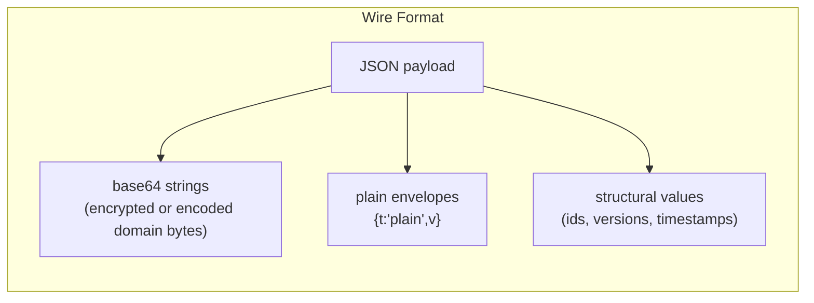
```mermaid
graph LR
    subgraph "Wire Format"
        JSON[JSON payload]
        B64["base64 strings<br/>(encrypted or encoded domain bytes)"]
        PlainEnvelope["plain envelopes<br/>{t:'plain',v}"]
        Plain["structural values<br/>(ids, versions, timestamps)"]
    end

    JSON --> B64
    JSON --> PlainEnvelope
    JSON --> Plain
```

Below are representative shapes. Exact domain routes may encode a plain envelope as
JSON or as base64-wrapped canonical JSON. A base64 string is an encoding, not proof
that the value is encrypted.

### Session creation
```http
POST /v1/sessions
```
```json
{
  "tag": "<string>",
  "encryptionMode": "e2ee | plain",
  "metadata": "<mode-compatible encoded value>",
  "agentState": "<mode-compatible encoded value or null>",
  "dataEncryptionKey": "<base64 data key bundle for e2ee; null for plain>"
}
```

### Session message (client -> server)
```
Socket emit: "message"
```
```json
{
  "sid": "<session id>",
  "message": { "t": "encrypted", "c": "<base64 encrypted>" }
}
```

For a plain Session, `message` is `{ "t": "plain", "v": <json> }`.

### Session message (server -> client)
```
update.body.t = "new-message"
```
```json
{
  "t": "encrypted",
  "c": "<base64 encrypted>"
}
```

or:

```json
{
  "t": "plain",
  "v": "<json>"
}
```

### Session metadata update (WebSocket)
```
Socket emit: "update-metadata"
```
```json
{
  "sid": "<session id>",
  "metadata": "<mode-compatible encoded value>",
  "expectedVersion": 3
}
```

### Machine update (WebSocket)
```
Socket emit: "machine-update-state"
```
```json
{
  "machineId": "<machine id>",
  "daemonState": "<base64 encrypted or base64 plain envelope>",
  "expectedVersion": 2
}
```

### Artifact create/update (HTTP)
```http
POST /v1/artifacts
```
```json
{
  "id": "<uuid>",
  "header": "<base64 encrypted or base64 plain envelope>",
  "body": "<base64 encrypted or base64 plain envelope>",
  "dataEncryptionKey": "<base64 data key bundle or canonical plain marker>"
}
```

### KV mutate (HTTP)
```http
POST /v1/kv
```
```json
{
  "mutations": [
    { "key": "todo.index", "value": "<base64 domain-owned envelope bytes>", "version": 2 },
    { "key": "prefs.legacy", "value": null, "version": 5 }
  ]
}
```

The development UI's `sync/encryption/accountStorageContext.ts` owns the shared
Account mode and content-key fingerprint admission for JSON KV readers and writers.
Todo operations delegate to that owner and preserve their Todo-specific typed
failures. `sync/ops/account/accountKvJsonTransport.ts` supplies opaque JSON reads and
per-key CAS writes through the caller's captured Home/Account request and lifetime;
workspace record parsing and reconciliation remain with the workspace owner.
It rejects mismatched envelopes before disclosure, missing or mismatched E2EE
material before KV access, and unreadable ciphertext rather than treating it as an
absent record. Plain Accounts need no Account cipher. Existing ciphertext-only
E2EE values remain accepted alongside explicit encrypted envelopes.
The mounted cipher and its `Sync.getCredentials()` binding are captured together
before the currentness read. E2EE access requires the canonical credential-scope
key to match the caller; publishing new authentication before Sync adopts its
cipher cannot reuse the previous Account's material.

KV deletion keeps a versioned tombstone. The single-key GET deliberately reports
it as not found, while a CAS conflict returns its retained version and a raw null
value. This raw tombstone is distinct from decoding an explicit plain JSON-null
envelope; the JSON transport marks only raw CAS nulls with `tombstone: true`.
Callers must preserve that distinction when reconciling records.
Socket KV changes pass through `sync/engine/socket/kvUpdateDispatcher.ts`, which
routes todo changes and notifies prefix subscribers under their captured Account
lifetime. This describes development source behavior, not release certification.

The CLI's `api/account/accountKvJsonTransport.ts` supplies the same opaque JSON
read/CAS boundary for Board Actions at their captured Home. It admits persisted
Account mode and the canonical content-key fingerprint before opening or writing
KV bytes, uses the existing legacy/dataKey codecs, and preserves tombstone versions.
Domain parsing and conflict rebase remain in the shared protocol Board port.

## Client-side content types

These are representative structures before mode-specific encoding. E2EE branches
encrypt them; plain branches place them in the domain's strict plain envelope. They
are defined in `apps/cli/src/api/types.ts` and the corresponding Protocol domain
schemas.

### Session message content

The payload stored in `SessionMessage.content` is always explicitly wrapped. For an
E2EE Session:
```json
{ "t": "encrypted", "c": "<base64 encrypted>" }
```

For a plain Session:
```json
{ "t": "plain", "v": { "role": "user", "content": { "type": "text", "text": "..." } } }
```

### Message payload before mode-specific encoding

**User message**
```json
{
  "role": "user",
  "content": { "type": "text", "text": "..." },
  "localKey": "...",
  "meta": { }
}
```

**Agent message**
```json
{
  "role": "agent",
  "content": { "type": "output | codex | acp | event", "data": "..." },
  "meta": { }
}
```

### Metadata
```json
{
  "path": "...",
  "host": "...",
  "homeDir": "...",
  "happyHomeDir": "...",
  "happyLibDir": "...",
  "happyToolsDir": "...",
  "version": "...",
  "name": "...",
  "os": "...",
  "summary": { "text": "...", "updatedAt": 123 },
  "machineId": "...",
  "claudeSessionId": "...",
  "tools": ["..."],
  "slashCommands": ["..."],
  "startedFromDaemon": true,
  "hostPid": 12345,
  "startedBy": "daemon | terminal",
  "lifecycleState": "running | archiveRequested | archived",
  "lifecycleStateSince": 123,
  "archivedBy": "...",
  "archiveReason": "...",
  "flavor": "..."
}
```

### Agent state
```json
{
  "controlledByUser": true,
  "requests": {
    "<id>": { "tool": "...", "arguments": {}, "createdAt": 123 }
  },
  "completedRequests": {
    "<id>": {
      "tool": "...",
      "arguments": {},
      "createdAt": 123,
      "completedAt": 123,
      "status": "canceled | denied | approved",
      "reason": "...",
      "mode": "default | acceptEdits | bypassPermissions | plan | read-only | safe-yolo | yolo",
      "decision": "approved | approved_for_session | denied | abort",
      "allowTools": ["..."]
    }
  }
}
```

### Machine metadata
```json
{
  "host": "...",
  "platform": "...",
  "happyCliVersion": "...",
  "homeDir": "...",
  "happyHomeDir": "...",
  "happyLibDir": "..."
}
```

### Daemon state
```json
{
  "status": "running | shutting-down",
  "pid": 123,
  "httpPort": 123,
  "startedAt": 123,
  "shutdownRequestedAt": 123,
  "shutdownSource": "mobile-app | cli | os-signal | unknown"
}
```

## Content-open flow (client side)

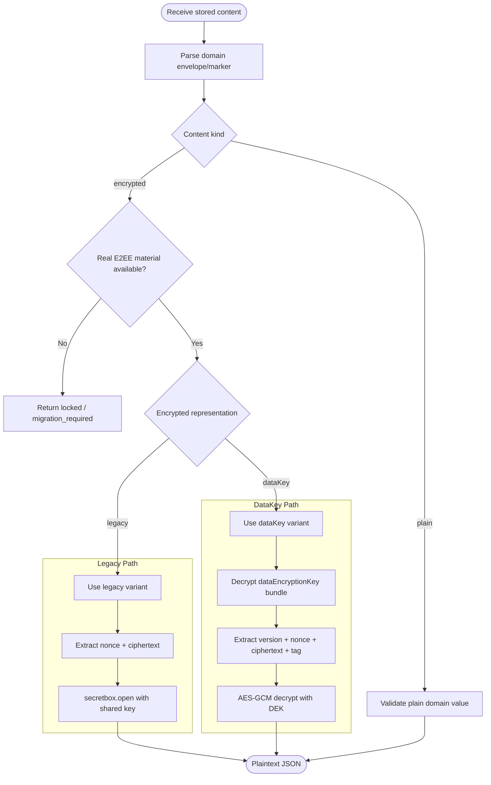
```mermaid
flowchart TD
    Start([Receive stored content]) --> Parse[Parse domain envelope/marker]
    Parse --> Kind{Content kind}
    Kind --> |plain| Validate[Validate plain domain value]
    Kind --> |encrypted| Material{Real E2EE material available?}
    Material --> |No| Locked[Return locked / migration_required]
    Material --> |Yes| Variant{Encrypted representation}
    Variant --> |legacy| Legacy[Use legacy variant]
    Variant --> |dataKey| DataKey[Use dataKey variant]

    subgraph "Legacy Path"
        Legacy --> ExtractL[Extract nonce + ciphertext]
        ExtractL --> DecryptL[secretbox.open with shared key]
    end

    subgraph "DataKey Path"
        DataKey --> GetDEK[Decrypt dataEncryptionKey bundle]
        GetDEK --> ExtractD[Extract version + nonce + ciphertext + tag]
        ExtractD --> DecryptD[AES-GCM decrypt with DEK]
    end

    DecryptL --> Plain([Plaintext JSON])
    DecryptD --> Plain
    Validate --> Plain
```

- Parse the domain's strict representation before choosing a crypto path.
- Return a validated plain value directly for `{ t: "plain", v }`.
- Enter the Account or Session cipher only for the encrypted branch and only with real
  matching material.
- If material is absent or ciphertext cannot be opened, preserve the stored value and
  return a typed locked/migration-required result. Do not try the plain branch after a
  decryption failure.
- In the UI, a captured Account authority (an exact-Home or Account-lifetime operation)
  carries a fresh Account owner with no Session readers. Anything that seals or opens one
  Session under it hydrates that Session's reader on demand from its published envelope
  (`resolveScopedSessionEncryption`). A Session with no openable reader fails with the
  typed `session_encryption_not_found` / `scoped_session_encryption_unavailable` error,
  never as a missing Session.

For a published `dataEncryptionKey` bundle, clients first open the envelope with the appropriate recipient material, then use the recovered data key for content. A failed envelope open never authorizes an Account-key fallback; the historical absent-envelope reader is owner-only and is described under [Recipient key delivery](#recipient-key-delivery-development).

## Embed key handoff (development)

Embedding is an unreleased 0.3 Developer Preview contract; source-level key checks
do not certify the composed browser flow. See [Embedded sessions](embed.md) for
the authority, browser-origin and host-backend trust boundaries.

The embed frame generates an in-memory X25519 keypair. For an E2EE Session, the
host backend's SDK opens the standalone Session DEK and seals it to the frame's
public key with the canonical 105-byte `EncryptedDataKeyEnvelopeV1`. A separate
sealed box carries only the bounded composer-options projection. The host page
transports opaque blobs without receiving the opened DEK or owner metadata during
the normal handoff.
Plain Sessions carry no key material. Missing or invalid E2EE material fails
closed and never becomes plaintext or an Account-key fallback.

Support depends on a standalone Session-key envelope being present, not on when
the Session was created. The `legacy` branch of
`apps/cli/src/api/client/encryptionKey.ts` still creates Sessions using the Account
secret with no standalone DEK envelope. Both older and newly created Sessions of
that kind are outside the embed transfer contract: `createCredential` must return
`session_key_not_transferable`. An E2EE backend without content access must return
`encryption_credential_required`.

Both the credential-serving backend and active host-page code are trusted. The
backend holding the embed's encryption-capable parent credential (`hapc`) can read
every Session the Account can read. The opaque handoff avoids ordinary pass-through
disclosure, but the host supplies the recipient public key to the credential
endpoint. An authorized hostile host script can substitute its own key and open
the returned Session key and options. The handoff does not authenticate that key
as belonging to a Happier frame. Use a dedicated Account whose content the
dashboard backend and page code are trusted to access.
Revocation stops future credential access; it cannot erase keys or plaintext
already disclosed. In-frame new-chat creation sends no message content until the Session key
handoff completes, then uses the normal encrypted Session send path.

## Server-side at-rest sealing

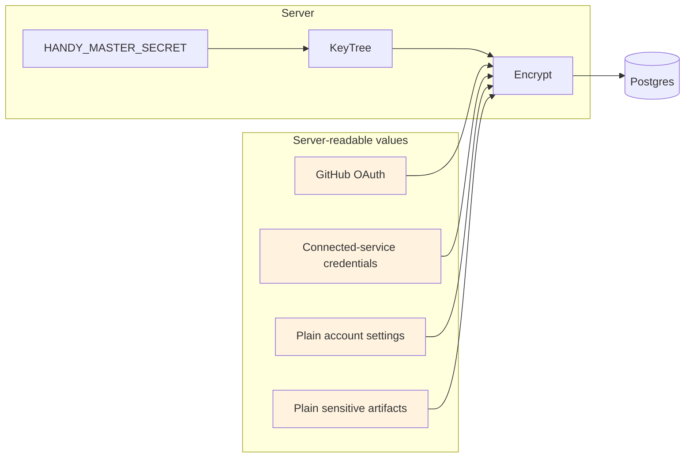
```mermaid
graph LR
    subgraph "Server-readable values"
        GH[GitHub OAuth]
        Tokens[Connected-service credentials]
        Settings[Plain account settings]
        Artifacts[Plain sensitive artifacts]
    end

    subgraph "Server"
        Secret[HANDY_MASTER_SECRET]
        KeyTree[KeyTree]
        Encrypt[Encrypt]
    end

    DB[(Postgres)]

    Secret --> KeyTree --> Encrypt
    GH & Tokens & Settings & Artifacts --> Encrypt --> DB

    style GH fill:#fff3e0
    style Tokens fill:#fff3e0
    style Settings fill:#fff3e0
    style Artifacts fill:#fff3e0
```

The server encrypts certain OAuth/service tokens and may seal selected plain-account
settings, connected-service credentials, and Artifact content at rest. These values
use a server-only KeyTree derived from `HANDY_MASTER_SECRET`; they are not end-to-end
encrypted. The server opens them for authorized application use and returns canonical
plain envelopes, never the internal `sealed_v1`/`server_sealed` wrapper.

`none` stores the canonical plain representation directly in the database.
`server_sealed` reduces exposure of database files and backups that do not also include
the master secret. It does not protect against a compromised live server or an
operator/process that can access both the database and `HANDY_MASTER_SECRET`.

Backups that may contain server-sealed values are recoverable only with the exact
matching `HANDY_MASTER_SECRET`; light-flavor backups must also preserve the generated
`handy-master-secret.txt`. The current server initializes one active KeyTree and has no
multi-key read or automatic re-seal rotation path. Do not rotate the master secret in
place: retain it through restore, or first implement and verify a domain-complete
old-key-to-new-key re-seal procedure. Changing it directly can make sealed values
unreadable and also affects other auth/token material derived from the same secret.

## Encoding conventions

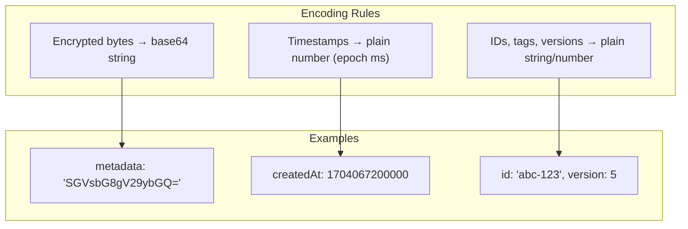
```mermaid
graph TB
    subgraph "Encoding Rules"
        E1["Encrypted bytes → base64 string"]
        E2["Timestamps → plain number (epoch ms)"]
        E3["IDs, tags, versions → plain string/number"]
    end

    subgraph "Examples"
        Ex1["metadata: 'SGVsbG8gV29ybGQ='"]
        Ex2["createdAt: 1704067200000"]
        Ex3["id: 'abc-123', version: 5"]
    end

    E1 --> Ex1
    E2 --> Ex2
    E3 --> Ex3
```

- Encrypted bytes are base64 strings on the wire unless explicitly noted.
- Some domain-owned plain envelopes are also base64 encoded for byte-oriented routes;
  base64 does not imply confidentiality.
- Timestamps remain plain numbers (epoch ms) and are not encrypted by the server.
- Non-encrypted identifiers (ids, tags, versions) are always plain strings/numbers.

## Session storage modes

Sessions can store transcript content in encrypted-at-rest or plaintext-at-rest mode. This is a storage mode, not a transport-security or authentication mode.

Canonical concepts:

- **Server storage policy:** `required_e2ee | optional | plaintext_only`, surfaced through `/v1/features`.
- **Account encryption mode:** `e2ee | plain`, used as the default for new sessions.
- **Session encryption mode:** `e2ee | plain`, fixed at session creation so a transcript does not mix modes.
- **Client encryption requirement:** `follow_account | require_e2ee`, resolved strongest-wins from the synced Account preference, a UI device-local pin, and the daemon's `HAPPIER_ENCRYPTION_REQUIREMENT` override.
- **Content envelope:**
  - encrypted content: `{ t: 'encrypted', c: string }`
  - plaintext content: `{ t: 'plain', v: unknown }`

Write paths must enforce mode/content-kind compatibility:

- `e2ee` sessions accept encrypted content only.
- `plain` sessions accept plain content only.

Clients must parse the envelope and branch explicitly. Do not guess that content is encrypted.

`require_e2ee` is enforced at the Account-settings and Session-content choke points. A client must reject a plaintext Account envelope before publishing it, reject plaintext session creation or a create-or-load response, and avoid opening or authoring plaintext Session content. The UI device-local pin remains scoped with the existing server/account settings persistence; the synced preference reaches a daemon through the existing Account-settings snapshot and pre-spawn minimum-version hint. No relay API or separate UI-to-daemon policy field owns this decision.

Missing client-requirement fields preserve the released behavior (`follow_account`). The daemon environment override can only strengthen the effective requirement; invalid non-empty values fail startup.

Layout-1 Session owner metadata is a separate privacy contract approved by
`PLAINTEXT-ACCOUNTS-2026-07-30.6`. Current source carries one strict plain/encrypted
owner envelope through the canonical tuple and recipient projector. The server may
read the strict plain owner branch for a plaintext Account, but only the Session owner
may receive that branch. View, edit, admin, friend, and public recipients receive the
  strict shared projection and an authoritative Agent-state tombstone. Edit/admin is an
action authorization level, not owner-private data access. Current-format operations
require a current caller declaration. Release readiness remains gated by mixed-version
proof and the remaining integration/live checks, not by an operator activation mode or
legacy socket drainage.

Current development role snapshots remain owner-private throughout this path.
The metadata writer accepts the canonical `work.sessionRolesV1` produced by the
role owner, seals it inside the Account-owned work category, and restores that
same nested field in the local domain view. Clearing the selected role preserves
the snapshot, notes, and admitted memory reference. Existing work-state and
headline fields keep their flat domain shape; role snapshots gain no flat alias
and never enter the recipient-safe shared projection.

Development authoring drafts retain their admitted original Scripts or Changes
destination in the existing device-local draft supplement. Explicit Send carries
that destination into `work.authoringOriginV1` through the same Session owner
metadata tuple writer. Editing the launch Machine or folder preserves the
original qualified Account, Home and workspace destination. Cold materialized
Temporary computer recovery publishes the retained origin before retiring draft
and creator custody; a failed publication keeps that recovery retryable. The field remains
owner-private in both Account encryption modes and does not establish Project
setup readiness.

Sharing rules:

- Plain sessions can share without `encryptedDataKey` because access is server-managed.
- Decrypting an E2EE Session or public share requires a valid encrypted data-key
  envelope; a direct grant may remain pending while its recipient completes
  Account encryption setup.

Direct Account sharing keeps key authority inside trusted clients. The public
`session.access.grant.set` Action and New Session access draft describe only the
desired recipient and access level. Before the physical grant or create request,
the UI or CLI/daemon host reads the exact Session DEK, verifies the recipient's
current Account content-key binding, and seals that DEK for the recipient. The
server then admits the grant and opaque envelope in one transaction. Plain
Sessions and recipients whose authoritative readiness is unavailable remain key-free;
an `encryption_inconsistent` recipient retains its repair-required locked state.
When preparing a new envelope, malformed readiness or an invalid advertised-ready
binding fails before the grant request; clients never reinterpret those failures as
unavailable readiness. A host unable to open the Session DEK can instead submit the
key-free logical grant for the server to recheck recipient readiness and any retained
tuple. Agents, plugins, and SDK callers never supply recipient-envelope fields
themselves.

Public-link creation follows the same custody boundary without reusing the
recipient-envelope format. The 0.3 development stored-content contract has one
publication owner for Session and ordinary Artifact subjects. A trusted key-holding
host generates two independent random values: an HTTP-visible lookup capability
and a fragment-only wrapping secret. The usable link is
`<isolated origin>/s/<lookupId>#k=<secret>`; the fragment secret never enters the
publication request, server response, access log, or content request. The server
stores only the lookup hash and, for E2EE content, the opaque DEK envelope wrapped
using the fragment secret. Plain Sessions and plaintext Accounts require no client
encryption key and send no wrapped key. Artifact mode comes from persisted
`Account.encryptionMode`, while Session mode comes from the Session.
Both public Session message adapters parse retained envelopes through the
canonical Protocol codec and reject a content-kind/mode mismatch before disclosure,
publication-use admission, or visit logging. A viewer's later decryption failure
is not a server-side confidentiality guard.

Artifact kinds use the single Protocol policy in `artifactSharingV1.ts` for browser
listing, public-link admission and people/Team/group sharing. Approval kinds and
the Home layout are excluded from all three; widget-area layouts are excluded
from the browser and public links while retaining people sharing. Unknown and
untyped ordinary documents retain generic document behavior. Both keyholding
Action hosts reject disallowed public-link creation with
`artifact_kind_not_shareable`, independently of UI visibility. The server also
checks this policy for Plain Accounts after opening their stored header (including
server at-rest sealing). E2EE headers remain opaque to the server; client enforcement
does not add a server-readable kind field. Existing links and people grants remain
listable and revocable through their access-authorized owners after a kind-policy change.

Protocol owns the V0 SecretBox framing and its current serialized-JSON payload.
The `fragment_v1` derivation marker distinguishes new links from
`legacy_token_v1` publications, whose wrapping key came from the released
server-visible path token. New Session publication and rotation use the same
fragment-only persistence owner as Artifacts and require the isolated origin and
its rate-limit dependency. Both Session POST routes accept the current material
without old-component negotiation; the Session-specific route rejects the former
`token` input. Retained legacy links remain readable, listable, revocable and
settings-editable without replacing their token or resetting usage. Rotating one
upgrades it to `fragment_v1` and requires isolation; replacing only a legacy E2EE
wrapped key is refused, while replaying the identical envelope remains valid.
Readers retain the released plain-JSON payload and
legacy Session route; they never substitute a lookup id for a missing or corrupt
fragment secret. This retains old link keys and routes without claiming their
confidentiality has improved. Released 0.2 Sessions also use flat layout-0 metadata;
the current recipient-privacy owner refuses that shape with
`metadata_privacy_upgrade_required`. Retaining the token/envelope is therefore not
proof that an unupgraded 0.2-created link can reopen. The owner's ordinary initial
0.3 sync discovers pending shared layout-0 Sessions, including archived/offscreen
Sessions, and delegates their exact-source upgrade to the existing metadata tuple
writer. Until that succeeds, the viewer shows that the link is being updated by
its owner. Public readers never bypass the privacy projection to restore
whole-metadata disclosure. This upgrade path is development source, not a claim
that a retained deployment or composed live journey has been validated.

Public Actions describe only the subject and publication settings. After approval,
the key-holding UI or CLI host returns the complete fragment URL in the create
Action result, without requiring a mounted share sheet or publication callback.
The existing E2EE Session transcript encrypts that result; diagnostic observations
redact the capability URL. Get/list results retain only safe publication settings
and cannot recover the wrapping secret. The server cannot assemble a usable new
fragment link. The isolated, unauthenticated viewer sends no Account credentials,
opens E2EE bytes in the browser, and renders ordinary text documents as text.
Binary Artifact references use the same authorized response, Account-mode
admission and browser decryption, then verify the opened size and SHA-256 before
creating a local object URL. Inert raster images use a native image preview and
PDFs use the browser's native PDF viewer with a download alternative. Other
formats, including SVG and HTML without an admitted HTML Artifact header, are
download-only with an octet-stream MIME type. Replacing the content or changing
the link releases its object URL; no uploaded-file URL or authenticated request
is introduced. HTML Artifacts use the isolated, opaque sandbox described below;
neither view has authenticated-app or host-bridge authority. This development contract
is not a claim of released availability or completed live validation.

The existing owner-only publication access log is also exposed through
`artifact.public_link.audit` in 0.3 development source. It remains a read Action
with the catalog's egress approval floor: the keyholding host verifies the
Artifact owner and the publication subject before requesting the existing audit
endpoint. The sharing UI consumes that Action rather than bypassing it with a
separate audit reader.

Ordinary Artifact Actions keep creation acknowledgement separate from later
reads: the keyholding UI returns the revision admitted by the existing create
response, including an existing same-id document, without a follow-up GET. The
Workflow id-returning adapter consumes that same creator. UI and CLI list Actions
use the Protocol-owned decrypted header selector for private title search, kind
filtering, ordering and logical cursors; omitted limits drain the existing
structural pages. Workflow readers retain their structural page and body contract.

The development UI file-publication and upload Action paths require an
authenticated Session caller bound to the captured Home and Account. A Session
selector alone supplies no authority. The existing Session control-target owner
derives the machine and workspace root; the authenticated transfer producer
enforces the existing realpath-based restricted-root policy, including symlink
confinement. UI and CLI reuse one Protocol-owned file classification/provenance
preparation before committing through their existing keyholding Artifact store.
The UI refuses a retired scope or a changed source target rather than publishing
under another Home. HTML preview preparation uses the acknowledged opened row;
a preview-read failure returns a preview error without replaying the committed
create or update.

#### HTML Artifacts (0.3 development)

An exact raw header `kind: 'html'` selects the HTML viewer. A document can carry
HTML text or a phase-B private blob containing HTML or a strict
`application/vnd.happier.html-bundle+json` bundle. A bundle has a version, a relative
HTML entrypoint and a path-indexed set of MIME/base64 assets. Every asset lives in
that one blob, so encryption, integrity, budgets and retained-version lifetime
stay with the existing Artifact blob owner; there are no independent asset grants.
UI and CLI writes use the same Protocol HTML-content parser before committing an
HTML Artifact. Invalid bundles are refused without a document mutation; changing
an existing binary Artifact to HTML also opens and validates its retained content
through the canonical mode and integrity reader. A later preview failure remains
distinct from this pre-write validation and does not replay a committed write.

Private viewers open the current authorized content through the existing
Account-mode and blob-integrity readers. The Home returns only a per-Artifact
isolated shell URL. Opened bytes travel in its fragment, not an HTTP request,
and previewing does not create a public share. An approved Artifact Action can
return this preview URL; diagnostic observations redact its data fragment. A
preview failure does not undo or replay an acknowledged create/update.

Public viewers retain the stored-content publication authority, consent and
fragment-key custody. They open the current document and optional blob in the
browser before constructing the same sandbox. The shell never has Account
credentials. Executable HTML lives only in a nested iframe with `allow-scripts`
and no `allow-same-origin`, storage authority, bridge or message receiver.
Inherited shell CSP blocks network-frame navigation; the guest CSP also denies
network connections, forms, nested frames and workers. Asset references declared
in HTML and CSS are rewritten locally; external assets are refused. Classic
scripts and inline JavaScript are supported; module/import-map declarations and
cyclic stylesheet imports fail visibly. Runtime-created relative URLs are not
rewritten, so scripts must embed such data rather than fetch bundle files or load
dynamic chunks. Grid previews are static and never execute the content.

Like every disclosed document, an opened preview cannot be recalled from a
recipient who already obtained its bytes. This is development-source behavior;
loaded-stack and native-device validation remain separate evidence.

Private Account-owned Saved Secret resources in current 0.3 development source do not require
Teams. Account catalog and source writes remain Account-mode fenced; a Saved Secret resource's
own stored encryption mode governs its material, including independently converted resources.
Genuine Team-qualified credential operations retain their feature and authentication checks;
their composed product activation remains unverified. Brokered Team
credential use does not publish usable credential bytes to the recipient. Direct delivery does:
an E2EE recipient receives material encrypted to its current verified Account content-key binding,
while a plaintext recipient receives an explicit plain stored-content envelope that the live Home
can read. A plaintext Account never receives fabricated Account E2EE material. Source, recipient,
credential revision, configuration revision, authentication mode, and encryption binding are
rechecked when material is written and read so a stale preparation cannot replace current material.

A shared Saved Secret has one mutable resource value and Account, Team, or Group use grants. It is
not copied into each recipient's personal Settings. Promoting a personal Saved Secret must create
the shared resource and rewrite every owner reference atomically, leaving either the old personal
record or the new shared record—not two mutable sources. E2EE resources use a resource data key
wrapped for eligible recipient Accounts; plain material uses the canonical server at-rest codec.
Mixed plain/E2EE audiences are prepared per recipient, and one recipient's missing encryption
readiness does not reinterpret encrypted material as plain.

Deleting a shared Saved Secret runs the same owner-side reference census first. The Home cannot
semantically inspect an E2EE owner's Settings, so the owner client refuses the delete while its own
profile, Provider, Voice, MCP, ACP, plugin, or Connected Account bindings still name the resource and
reports where it is used. That is client-enforced referential integrity for the owner's own
document, not a server-side guarantee, and it says nothing about recipient Settings: a recipient's
reference to a deleted resource simply resolves as deleted and offers replacement.

Possessing an envelope or a previously disclosed value is not current authorization. Every read
rechecks the current grant and Home-local Team/Group membership. Revocation stops later reads but
cannot erase material a direct recipient already obtained.

### Confidential fill consumer (0.3 development)

Confidential entry uses the existing authenticated Machine RPC and Account mode,
not a new vault. A one-time value is ephemeral and never belongs in an approval
Artifact, Action input/result, Session transcript or replay. Plain transport may
have authenticated transient relay ingress; E2EE delivery must remain encrypted.
Transport routing alone does not prove that error, telemetry or recording
boundaries suppress the value; those boundaries require their own evidence.

The Saved Secret picker sends a value-free catalog revision fingerprint. The CLI
materializer independently retains and rechecks its private material fingerprint;
the two are not interchangeable. The current consumer can resolve only its bound
Account's catalog and rejects another or absent deciding Account instead of
borrowing the Machine custodian's personal material. Foreign Saved Secret use
requires a requester-owned catalog context from the existing admission producer.

The private continuation rechecks immutable Home identity and current Account mode.
Equivalent client-local Home aliases do not change the reviewed request. Remember
is explicit and off by default, uses the existing mode-aware Saved Secret writer,
and reports persistence separately from physical entry. Save failure or uncertain
acknowledgment must never replay the fill or claim that the value was saved.
Mutable delivery buffers are wiped after settlement; managed strings do not offer
forensic erasure or isolation from an Agent with same-user shell access.

Session data-key persistence:

- Each current E2EE Session has one standalone Session data key (DEK). Session
  content is encrypted once with that DEK; sharing wraps only the DEK for each
  authorized Account rather than encrypting the transcript again.
- `SessionDataKeyEnvelope(sessionId, recipientAccountId)` is the only owner of a
  Session data-key envelope. It holds the Session owner's envelope and every other
  recipient's, so no reader branches on ownership to decide which column to read.
- Direct, Team, and Group grants all resolve through the access owner to Account
  recipients. If several grants authorize the same Account, they still require only
  the one `(sessionId, recipientAccountId)` tuple. Plain Sessions have no Session
  data-key envelope at all.
- `Session.dataEncryptionKey` and `SessionShare.encryptedDataKey` are removed. Their
  bytes were copied forward exactly by an expand/backfill migration and the columns
  dropped by a following contract migration; that contraction is irreversible for a
  predecessor binary, so a managed rollback past it is not supported.
- Malformed persisted bytes are preserved rather than discarded, so a recipient
  reaches a truthful repair state. Structural admission applies to new writes only.
- Access is always decided before projection. A retained tuple after revocation is
  inert: it is simply never projected again, and it never grants access.
- `PublicSessionShare.encryptedDataKey` is a separate owner and is unchanged.
- The released `session-shared` socket event no longer carries key bytes; clients
  targeted-hydrate the Session projection instead.

Feature gates:

- `encryption.plaintextStorage`
- `encryption.accountOptOut`

Do not gate plaintext behavior on raw env vars or `capabilities` fields.

### Recipient key delivery (development)

`GET`/`PATCH /v2/sessions/:sessionId/data-key/envelopes` is the one surface for
preparing recipient envelopes. The server's `sessionDataKeyEnvelopeService.ts` owns its
behavior and `registerSessionDataKeyEnvelopeRoutes.ts` is a thin transport that maps one
stable error code to one status. The service composes decisions it does not own:
effective access from the Session access owner, recipient readiness from the Account
encryption owner, and envelope structure from the Protocol codec. It is not feature
gated, because it is the envelope owner for every access kind including plain direct
sharing and owner repair.

The canonical record is the `(Session, recipient Account)` tuple, and three owners keep
it coherent. `sessionDataKeyEnvelopePersistence.ts` stores and projects the opaque bytes.
`sessionDataKeyRecipientProjection.ts` is the one wire projection of a recipient's
content-key binding, shared by the per-Session collection and the membership-history page
so the readiness columns, their reason vocabulary, and their encodings are never answered
twice. `classifySessionDataKeyEnvelopeItemV1`, in the Protocol module
`sessions/encryption/sessionDataKeyEnvelopes.ts`, is the one owner of summary-bucket
precedence, so the aggregate a manager sees and the rows beneath it are the same
classification applied twice, not two rules. That module also owns the strict boundary
shapes; effective access, the recipient audience, Account content-key readiness, and the
tuple read/write stay with their own owners. See
[session-collaboration.md](session-collaboration.md) for how access, key delivery, and
personal state divide the Session surface between them.

Access is answered first, and the two answers stay distinct on purpose: a Session the
caller cannot read reports `session_not_found`, so it is indistinguishable from one that
does not exist, while a readable Session the caller cannot manage gets an honest
`forbidden`. A plain Session then settles as `not_required` before any recipient key
material is read, so a keyless Account is never asked for key state it does not have.

When management depends on a restricted Team authentication policy, the envelope
collection preserves the operation-specific recovery result:
`session_access_authentication_required` or `session_access_authentication_unavailable`.
A direct View grant keeps the Session readable but does not satisfy the separate
`manageAccess` operation. After qualifying Team authentication, refresh the Session and
explicitly retry preparation; a refused mutation is never replayed. Genuine loss of
read access remains concealed as `session_not_found`.

`GET` returns one bounded exception page plus a Session-scoped summary over the whole
current authorized audience — including the Session's owner, whose envelope lives in the
same tuple. The audience is walked in bounded chunks through the same readiness and
codec owners the rows use, so the summary cannot disagree with the rows a manager
expands. `action_required` is the default working page and carries exceptions only;
`all` is the same audience as a diagnostic view. Envelope state describes stored bytes
alone — `prepared`, `missing`, or `invalid` — and unavailable recipient readiness
outranks it, because an inert tuple left behind by an earlier preparation must not
report a Plain or inconsistent Account as prepared.

`PATCH` applies a bounded set atomically: every check runs before the first write, so one
bad entry leaves the collection exactly as it was rather than half prepared. The caller
must itself hold a structurally valid envelope for the Session (`session_data_key_unavailable`
otherwise), because only the invoking client can prove it opens that Session's standalone
key. A recipient that lost read access answers `recipient_changed`; one whose Account is
not wrapping-ready answers `recipient_key_unavailable`. Replacing a structurally valid
envelope is allowed and is the repair path: randomized ciphertext for the same data key
is equivalent, so last write wins without a revision or digest.

The shared GET/PATCH page boundary is 500 recipients. It is not a total audience
limit: larger audiences continue through the same Account-keyset cursor. The bound
was validated against the canonical 100 MiB server request boundary and the real
SQLite tuple-write plus private AccountChange owner at 24, 100, and 500 entries;
the observed atomic service times were approximately 253 ms, 1,023 ms, and 3,444
ms. Those measurements establish a supported request size, not a latency SLA.
Client sealing remains cooperatively sliced by its existing crypto batch owner.

A tuple is never authorization. `sessionDataKeyEnvelopePersistence.ts` stores and projects
opaque bytes and never grants, opens, or synthesizes a data key, and a retained tuple
after revocation is inert — simply never projected again. Account mode, recipient
readiness, and successful envelope opening remain separate facts. The Home owns mode
and readiness and validates envelope structure; only the recipient can authenticate
and open the envelope.

The released 0.2 direct-share routes (`/v1/sessions/:id/shares`) were removed under the
one-way 0.3 upgrade: no 0.3 client calls them, and a 0.2 client is not a supported peer.
Direct grants, their envelopes, Team, Group, and history preparation all go through the
current Session-access owner and this tuple owner. Direct shares and envelopes a 0.2 Home
persisted stay readable through the same owners.

An absent envelope is not the same as a present unopenable one. Only the Session's own
owner may resolve genuine absence through the retained cli-v0.2.11 Account-scoped reader.
Those Account keys are historical content material, never a transferable Session data
key, so a recipient must not reach that path and a present unopenable envelope must never
be normalized into absence in order to reach it. The client resolves absence into pending,
setup, or that owner-only reader; the server does not decide it.

Implementation status. The per-Session collection, its persistence owner, and the
invoking-client preparation passes exist in development source; the passes share one
host-neutral Protocol page → seal → commit owner and differ only in worklist. The Team/Group
membership-history surface now has one server service mounted from the existing Team
and Group membership routes plus one client preparation host. It pages only Sessions
that both the caller and target may currently read and writes through the same
`SessionDataKeyEnvelope` persistence owner; it does not create Team/Group keys or a
second preparation store.

Fresh Workflow Step Sessions (development) carry the Run's frozen view Team
through the ordinary creation-time `initialAccess` writer. They omit
`primaryTeamId` except for `team_required`, which selects the existing Team
policy writer and its edit floor; the explicit grant never delegates permission
approval. Both physical CLI creators prepare collective E2EE recipients through
the shared pass and verified envelope helper before returning to runner startup.
They open the returned Session's standalone key, including on rejoin, rather
than sealing the proposed create key. Plain Sessions perform no key preparation;
unready or unverified recipients stay truthfully pending at the canonical collection.

Client surfaces (development). The mounted Collaboration/Access editor renders one
Session-scoped `Encrypted access` aggregate from the Home's own summary — it never
recomputes counts from grant rows, because a Team grant is one row and many Accounts.
Opening or refreshing the editor discovers current work, so an existing grant whose
member finished setup on another device is found without mutating that grant. The same
`createSessionDataKeyEnvelopeClient` transport serves default discovery, the explicit
`Show all recipients` diagnostic over `state=all`, and the preparation pass, so the
aggregate and the rows below it cannot disagree. Healthy audiences stay quiet, and the
diagnostic's healthy rows are requested only when a manager opens it.

Preparation is owned by its exact Home/Account/Session-or-membership scope and encryption
generation, not by the sheet that started it: closing the sheet detaches presentation
while the in-flight pass continues, and only a real scope or generation change stops the
next write. There is no durable job, progress store, or operation registry. Determinate
progress counts committed tuples against the Home's own actionable total (`pending +
invalid`), which only grows — the one final first-page recheck may reveal work committed
behind the cursor. That recheck now runs after every traversal, including an initially
empty first page with no writes, because an empty page proves only what the Home saw at
that instant.

This makes preparation process-local but resumable: an app exit or interruption loses
only in-memory progress. A later pass derives the remaining work again from canonical
access, Account readiness, and missing or invalid tuples. Missing tuples stay pending;
invalid or locally unopenable tuples reach repair UI instead of being treated as absent,
plaintext, or unauthorized.

Member detail keeps the two server exception buckets separate all the way to the copy:
repairable caller envelopes get repair guidance, while permanently non-transferable
released Account-secret Sessions get an explanation and no futile repair instruction. A
locally empty failure set never erases either. An `incomplete` pass is remaining work
with a retry, not an error; `recipient_changed` refreshes the canonical membership before
anything is retried. Choosing to include existing history at member or Group-member
addition continues at that member's detail, where the same operation starts once.

Authorized Sessions whose content is still locked stay visible. `isUserFacingSession`
keeps a row whose access projection names the viewer as a recipient even when its
encrypted metadata cannot be read, and list and detail share one owner for the locked
title: a safe cached title is kept, and only its absence falls back to the translated
`Encrypted session`. Owners remain fail-closed there, because hidden-system facts are
layout-1 owner-private keys and are genuinely unknown when the owner view is unavailable.
Every locked, readable or blocked decision (list row, detail surface, Session info, route
data) reads the content fact through one UI reader,
`encryptedContentAvailability.ts#readSessionContentAvailability`: a plain Session defaults
to readable, while an explicit settled owner-metadata-unavailable shell stays locked even
when its Session content is plain. An absent E2EE fact is *unsettled* — never readable and
never a settled block. The list and exact-Session readers apply the same shell when the
owner envelope cannot open; a later successful open replaces it with readable metadata.
The device-local warm cache keeps the row's `encryptionMode` and last settled availability
(enums only, beside the decrypted row metadata it already holds), so a cold reload shows an
own readable Session as readable; an unsettled row persists nothing, and hydration
re-derives the fact.
Plain Sessions and Plain Accounts require no recipient-key collection: it settles
`not_required` before any recipient key work and the editor renders no encryption row.
An unavailable Account-owned layout-1 envelope can still lock a plain Session's
owner view until a later successful open.

Development Usage Coach evidence uses these same Session owners. Selected
transcript reads require readable Session content and transcript access under
the captured Home/Account authority; each message is opened through
`readStoredSessionMessage`. Host request identities are scoped opaque digests,
not retained prompt text. MCP witnesses retain binding/catalog IDs, revisions,
counts and window sizes, not configuration, native names or tool arguments.
These events remain Session-protected and are not copied into plaintext
accounting. Unopened rows and incomplete pages never establish complete private
model-request coverage. Coach suppression preferences remain Account-mode-aware
Settings; a suggested digest becomes an ordinary approval-gated Automation,
whose existing owner protects its stored recipe and schedule.

The ordinary Account-backed Follow runtime now observes, hydrates, re-admits, injects,
and acknowledges exact source updates through the canonical Session runtime. In current
development source, restricted Runner Follow also has one consumed scoped source-key
carrier: the qualified producer opens only the physical standalone Session DEK, the
server rechecks the exact Follow/source/destination/Runner/Machine authority, and the
restricted runtime keeps copied source material only in process-local zeroizing custody.
That path remains unreleased and not live-verified. The creator-authenticated scoped
Runner-Machine key binding it depends on is implemented and verified on both sides
(see Machine metadata + daemon state above); the composed preparer-disconnect/
reconnect/revocation/cleanup journey is still required before activation can be
called complete. No loaded
Teams/Runner/native, cross-provider, or release validation is claimed complete here.

Session Discussions, Board/System Records, and Follow context reuse the same Session
encryption context and ordinary Session DEK; none owns another content-key hierarchy.
External API request/result encryption is different: it is Lane 05's whole-Action
transport contract, using the optional Account API-credential material described above,
and does not create, return, or replace a Session envelope. The restricted Runner path
remains subject to the explicit unreleased and unverified boundary above.

Runner Connected Services remain development-only. Endpoint-native selections carry no
Account material. Account-backed and Team-resource selections are rejected before
activation and by the strict review manifest until Lane 10 supplies a scoped
Connected-Service broker producer. The runtime bootstrap rejects direct Connected
Account credential and configuration material; the creator never opens that material
for Runner delivery. The endpoint retains the ordinary purpose-scoped plugin capability
with no Account bindings. Built-in and external plugins use the same SDK authority;
this restriction concerns Account-secret custody, not plugin trust. Ordinary Session
and SDK Connected Account behavior is unchanged. The scoped broker integration and
loaded Runner journey remain unverified and are required before claiming support.

### Plaintext Personal Home search

Plaintext Personal Homes can maintain `derived/search.sqlite`, a Home-local
FTS projection rebuilt from canonical plain Session messages. It is derived,
replaceable state: startup reconciliation, live transcript mutations, restore,
explicit repair, and recognized SQLite corruption rebuild it through the Home
search lifecycle. The projection does not become a second transcript authority
and does not copy Account ACL or sharing state.

`POST /v1/home/search` is the one source-specific Home search endpoint. It is
feature-gated by `search`, authenticates a present user, resolves that user's
currently visible Session ids through the canonical authorization owner, and
passes those ids into the Home database query. Authorization therefore remains
query-time even though the plaintext-derived index can contain rows for other
users' Sessions. The endpoint is not a Universal Search aggregation service.

Home results are message-granular. The shared memory-search `summary` field
contains a match-centered snippet rendered from pristine message text, falling
back to the whole text only when it fits; callers must not describe it as a
guaranteed full verbatim message.

E2EE Session content is never admitted to this Home index. A non-plaintext Home
does not construct the lifecycle, advertise Home-search readiness, or expose a
usable Home search route. `capabilities.homeSearch` reports readiness only; it
does not authorize search and does not weaken the Account/Session envelope
rules above.

### Account-mode transition status

Account mode and Session transcript mode are separate: an Account transition does not
re-encrypt Session messages or change a Session's persisted `encryptionMode`.
Layout-1 owner metadata is different because its owner envelope is Account-scoped and
must match the Account mode.

The development whole-Account erasure integration checks initial authority and ownership
before cancelling an active Account-mode transition through the existing transition coordinator.
Its bounded staging cleanup finishes before the
Account is retired or any external object is deleted. If cleanup remains, both the
Home-administration and self-erasure routes return HTTP 409 with
`account_erasure_transition_cleanup_pending`; this step leaves the
Account's status and credentials unchanged, and the caller retries the same authenticated
request. Once cleanup is ready, erasure uses the existing disable/revoke, idempotent object
deletion, and final row-deletion sequence.
An administrator erasing their own Account must pass initial administrative admission; only
that admitted invocation may continue through its own revocation. An independent administrator
is checked again before final row deletion. This adds no separate erasure state or cleanup owner.

Every active Account-owned new-Session or development Project Open draft participates in the incumbent atomic Account mode-transition
request. Existing-Session drafts do not participate: their envelope remains bound to the owning
Session. A missing or incomplete draft census, a revision mismatch, or a wrong target envelope
aborts the Account transition without partially changing the mode. The partially adopted staged
transition is not a second draft owner and has no draft-specific staging table.

Development Account authoring memory participates in that same atomic request through
`authoringMemory: { items }`. The client reads the complete active reserved-row inventory
at the initiating Home, opens each row under the persisted source Account mode, and reseals
it for the target mode with the existing Account blob cipher and its `authoring_memory`
purpose. The server checks source mode, complete key coverage, target envelopes and exact
row revisions before applying the existing KV CAS. Tombstones contain no private content
and are left unchanged. A mismatch aborts the entire switch; row existence alone is not a
refusal. The success response returns the committed rows, and exact lost-response replay
checks their revisions and envelopes without writing or publishing changes. Missing E2EE
material or an invalid row binding fails closed before the client submits the switch.

Development private Project rows use `projectRows: { items }` in that same atomic request.
The explicit row grammar covers Home-qualified accepted refs, the Account relationship graph,
and Home-qualified Project organization. The client reads the complete remote census, opens
each payload bound to its row key, and reseals through the `project_account_row` Account cipher
purpose. Plain Accounts require no encryption material. Source mode, complete coverage,
target mode, and row revisions are checked before commit; malformed or mixed source content
refuses the whole switch. Row CAS advances storage revisions while preserving semantic ids,
relationships, Project organization, and tombstones. Exact replay validates committed rows
without writing. The older empty-only PATCH ingress refuses populated Project rows.

The development draft V2 contract includes new-Session authoring and agent-free Project Open
documents that released strict V1 cannot generally preserve. Such Account transitions select `sessionDrafts: { v: 2, items }` and receive
`sessionDrafts: { v: 2, records }`, including on exact lost-response replay. The same draft service,
Account cipher, revision CAS, and document reconciliation owner serve both versions.

The current moving `../0.2` predecessor has one deliberately narrow new-Session bridge. A
representable exact-Machine target is projected with predecessor-visible `serverId` and `machineId`
mirrors carrying the canonical target mutation identity. A predecessor text-only edit leaves those
mirrors unchanged, so the successor restores the exact target and its informational Pool origin.
When the predecessor deliberately changes or clears the Machine target, the successor reconstructs
that exact predecessor choice and clears the old Pool origin. Missing, partially changed, malformed,
or otherwise ambiguous mirror state is unusable; it never silently revives the retained target.
Temporary-computer and every other non-representable target remain V2-only and are not downgraded.
Plain and E2EE drafts use this same reconciliation contract, with only their existing content
envelope differing. This bridge preserves the one canonical draft owner; it neither widens released
V1 nor creates a second compatibility writer. An incapable request still cannot overwrite V2
content. Session-bound Run, discussion, and new-discussion drafts remain excluded from the Account
transition.

Approved amendment `PLAINTEXT-ACCOUNTS-2026-07-30.7` adds one request-size-bounded
`sessions: assert_empty | migrate` directive to the existing Account transition.
Each migration item covers exactly one active or archived layout-1 Session and
carries `sessionId`, expected layout `1`, exact metadata and Agent-state versions,
the exact expected owner envelope, and the exact target owner envelope. The server
uses Account-first lock order and the existing Session tuple CAS/projector, changes
only the owner envelope plus canonical versions/cursors, completes every Session
rewrite before the final Account mutation, and rolls the whole transition back on
conflict. It does not re-encrypt Session transcripts or change Session mode, keys,
sharing, lifecycle, or archive state.

The Session directive has no separate item-count ceiling. The existing canonical
8 MiB Account-migration request boundary limits the real transport payload, while
the server compares the complete owner inventory and commits all Session rewrites
inside the same Account-mode transaction.

For a truly keyless Account, `.7` requires fresh GitHub/OIDC/OAuth/mTLS
reauthentication through the existing external-auth challenge and identity-proof
owner before the first E2EE key may be attached. A stored Happier bearer, a proposed
key signature, or a client/server nonce alone is insufficient. The proof is
short-lived, single-use, and bound to the Account, external identity, and canonical
migration request.

Exact lost-response replay canonicalizes the request once for signatures and fresh
reauthentication. The raw digest is not placed in the client-visible change stream;
the server stores only a domain-separated master-secret binding in the existing final
account/self `AccountChange` hint. Only the identical request at the exact committed
post-state returns read-only success; missing, pruned, overwritten, stale, or
mismatched evidence fails closed. There is no receipt table, worker, second replay
owner, raw-request storage, or offline equality oracle for prior plaintext.

Current source implements the `.7` active-plus-archived Session directive,
fresh GitHub/OIDC/OAuth/mTLS first-key authority, canonical request digest, and exact
read-only server replay. The UI owner/callback/storage boundary retains one bounded,
expiring, server-scoped continuation and retries the exact stored request before
starting fresh authentication. Authoritative E2EE Settings hydration performs one
bounded retry without a new challenge; credentials persist before custody clears.
The strict literal `migrationSubmissionAttempted?: true` marker is persisted with the
pending handle before the first POST, and a failed custody write produces zero POSTs.
Only a definitive first-submission 4xx except 408/429 may clear custody; ambiguous
transport/5xx/408/429, commit-observed/post-persist, and every later failure retain it.
The root-independent final rerun is green at 45/45, direct UI TypeScript 7 is green,
and the scoped diff check is green pre-gap evidence. First-key resume now owns one
exact POST per resume with hidden API backoff disabled only for this path; marked
active-server mismatch retains custody before rejection with zero POST/persist/clear,
while unmarked mismatch keeps prior cleanup. Module-local mutation serialization and
bounded primary→legacy→global lookup close the stale-state race and legacy-reader
omission; root-independent evidence is 67/67 including exact concurrency, direct UI
TypeScript 7, and scoped diff green. Cross-tab/worker serialization remains a platform
residual. Approved amendment `.8` guards ordinary logout and different-token
replacement before mutation, keeps successful same-token recovery signed in for
recovery-key backup/copy, and permits credential destruction only after
warning-backed exact abandonment removes the observed marked record. A clear failure
preserves credentials; 401/token invalidation is not abandonment. Amendment `.9` is
the current approved contract and extends these `.8` outcomes. The
[canonical plaintext-accounts plan](../.project/plans/happier-plaintext-accounts-keyless-external-auth-and-account-data-envelopes-2026-02-23.md)
owns mutable execution status and exact QA evidence. No source result alone activates
the transition.

## Terminal pairing authentication

Terminal pairing v3 adds a 32-byte request secret to the QR/deep link and authenticates the sealed
provisioning response with HMAC-SHA-256. The requesting terminal keeps that secret in its private,
short-lived pending state and does not include it in the relay auth request. Current approval writers
require this v3 context and never emit an unbound legacy response.

Current terminal pairing is v3-only. An absent, malformed, expired, or unauthenticated v3 response
fails closed; the reader does not reinterpret it as legacy v1/v2 material. `auth request --json`
persists the complete v3 context in private pending-auth state so `auth wait` cannot accidentally
lose the binding. Historical unbound terminal requests must be replaced with a fresh v3 request.

The development UI preserves a terminal request across sign-in before an Account scope exists,
then binds it to the matching hydrated Account without renewing its expiry. Web pre-auth custody
uses tab-local session storage; native custody uses the existing pending-terminal storage owner.
Both platform adapters delegate claim, cancellation, and migration decisions to that owner.

V4 terminal links carry a Home descriptor while retaining v3 sealed provisioning. The descriptor's
Home identity and canonical URL remain the request target; the UI must never substitute the active
Home when a different loopback target is rejected by URL-selection policy. It retains the
target-bound request and reports the unavailable path instead of opening sign-in for the wrong Home.
First-time authentication to a different Iroh-only Home is not completed by this continuation fix:
it still requires descriptor-aware authentication-entry transport integration. Post-auth descriptor
approval does not establish that pre-auth capability.

Native-app QR pairing provides relay-independent authentication
because the secret travels camera-to-app. Web pairing cannot make the same guarantee against a
hostile self-hosted relay: that relay also serves the JavaScript which receives the secret, so the
web flow necessarily trusts its web origin.

The terminal-v3 provisioning union has one semantic owner and exactly two current material results:

- `tokenOnly` carries no Account E2EE material. The claim endpoint independently returns the new
  terminal bearer under claim-secret authorization, and the terminal persists a token-only
  credential without fabricating a secret.
- `dataKey` carries the exact 32-byte Account content private key. A data-key credential is validated
  against its own public key before sealing; a legacy recovery-secret credential derives the same
  content private key through the protocol derivation owner rather than a second formula. The
  terminal persists the data-key fields without collapsing them into a legacy secret.

The approver's persisted credential shape is the material authority: a keyed credential — data-key or
legacy recovery secret — yields `dataKey`, and a token-only credential yields `tokenOnly`. A requester
capability such as `supportsTokenOnly` is admission only: it may refuse an unsupported result but can
never choose or downgrade the material. Existing Account recovery credentials remain readable at their
own storage boundary, and terminal pairing still neither reads nor writes a raw or unbound legacy
response.

## External Sessions secure refresh and publication

External Sessions keeps live Agent-source content opaque to the server. Its canonical live-refresh path is:

1. the daemon emits `external-session-transcript-invalidated`, a content-free event bound to the current machine, session, link, qualified Agent/source identity, contribution generation, and a non-reversible cursor identity;
2. the client requests one bounded authoritative `readAfterTranscript` through the existing machine-encrypted RPC path; and
3. only an exact-current `advanced` result may release items to the canonical transcript convergence owner.

The invalidation contains no transcript content, title, preview, `linkData`, raw Agent cursor, or source path. The encrypted RPC response protects the complete read-after payload; External Sessions does not define per-item encryption envelopes. `already_current` applies nothing. Stale or mismatched bindings, gaps or expired cursors, source replacement, source unavailability, and read failure all apply zero items. A gap requests one bounded authoritative resync; replacement, unavailability, and failure retain the last accepted authority and surface recovery instead of accepting a truncated transcript.

The default invalidation-to-`readAfterTranscript` path has a release-like p95 budget of less than one second and must preserve dedupe, gaps, anchors, and scroll continuity with at most one bounded read per coalesced invalidation. A ciphertext fast path is not an unconditional second protocol. It may be added only after a recorded failure of that latency budget or a mandatory continuity property, and then only inside an existing encrypted socket/RPC owner with the same canonical payload and cursor semantics, server opacity, and authoritative read-after fallback on gaps.

External transcript authority is separate from the session's `e2ee | plain` content-storage mode:

| `currentStorageState` | Read authority and publication ceiling | Sharing |
| --- | --- | --- |
| `machine_only` | The linked Agent source is authoritative while reachable; server transcript readers expose no rows. | Not shareable; persisted import is required. |
| `server_partial` | The linked Agent source remains authoritative while reachable. An offline incomplete initial import is fenced at `acceptedThroughServerSeq`, and the UI may select that subset only while the matching public operation projection proves the same initial-partial fence. | Not shareable. |
| `snapshot_complete` | The Agent source remains live authority while reachable. Offline server reads are capped at `publishedThroughServerSeq` and require a complete publication tuple. | Shareable as a complete published snapshot. |
| `hosted` | The hosted transcript is authoritative; no External Sessions publication ceiling applies. | Shareable under the normal hosted-session rules. |
| `legacy_external_unknown` | Fails closed at sequence zero until the owner machine reconciles the row. | Not shareable. |

`legacy_external_unknown` has exactly one producer: the publication-authority migration (`20260723150000_add_external_session_publication_authority`) backfills every predecessor `direct:v1:*` Session into it, because those rows were created before any server-readable publication authority existed and nothing proves their server transcript is the complete conversation. Ordinary Sessions keep the `hosted` column default. Message count is never consulted — a partial predecessor import is exactly the row that looks non-empty — so a predecessor direct row with server messages also fails closed. The one transition out is the owner machine relinking the tag, which reaches the fenced `machine_only` reconciliation only while the row still holds no server transcript sequence and no publication tuple.

The server applies the publication ceiling before ordinary pagination and derived projections, including counts, list previews, latest-turn/attention state, exports, notifications, and friend/public/share readers. Operation-private staging is never public. A failed or cancelled catch-up leaves the prior complete publication visible; only canonical publication advances the public ceiling.

Server-readable publication metadata is limited to an opaque publication id, source observation time, and published server sequence. Raw Agent-source cursors and paths remain local or E2EE-owned, and content-derived watermark digests are not publication identities.

In current 0.3 development, materialization Start and import-bearing Resume/Retry acknowledge the committed, published operation revision before capture and historical import finish. The originating daemon continues the operation; clients follow its canonical progress and status rather than holding an RPC open until completion. Cancel records durable cancellation intent and stops before the next capture or import effect once the current effect settles. Accepted historical records and the prior complete publication remain governed by the existing publication fence. Empty linked sessions keep the transcript footer visible, and the durable operation presentation keeps its progress and controls visible after linked metadata is converted. Shared Activity projects that durable owner through the [External Session activity contract](actions.md#external-session-activity-03-development); queued publication validates credential and snapshot Accounts against the pinned machine connection before encryption.

Canonical owners:

- secure refresh schema and application decision: `packages/protocol/src/sessions/external/secureRefreshV1.ts`
- storage/publication state: `packages/protocol/src/sessions/external/operationV1.ts`
- server publication and sharing fence: `apps/server/sources/app/session/sessionTranscriptPublicationPolicy.ts`
- owner-machine predecessor reconciliation: `apps/server/sources/app/session/externalLinkedSessionStorageInitialization.ts`
- client read-authority selection: `apps/ui/sources/sync/runtime/external/externalSessionTranscriptAuthority.ts`

## Implementation references
- Client crypto: `apps/cli/src/api/encryption.ts`
- Session message format: `apps/cli/src/api/types.ts`
- Server message ingestion: `apps/server/sources/app/api/socket/sessionUpdateHandler.ts`
- Artifact/KV routes: `apps/server/sources/app/api/routes/artifactsRoutes.ts`, `apps/server/sources/app/kv/kvMutate.ts`
